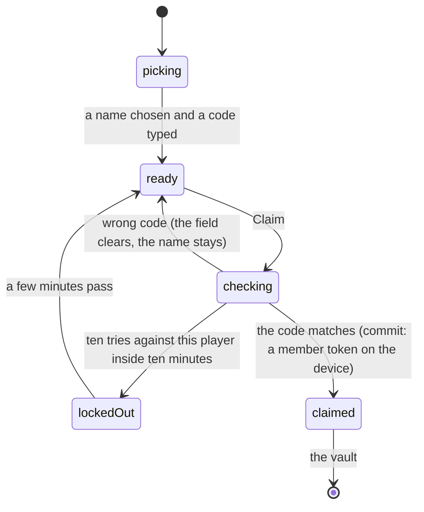

# Claiming your player

## Summary

Somewhere in the garden the commissioner is handing out slips of paper. Each one
carries a name and six characters. Typing those six characters into the claim
screen is what turns a phone from an anonymous visitor into a person on the
roster: it trades the code for a *member token*, and from that moment the device
can trade, vote on superlatives, use the marketplace and hold roster cards on a
name rather than on a handset.

The screen is `/claim`. It is the only place a paper code is ever typed, and it
is the only way onto the roster — no password, no email, and nothing to remember
afterwards. What the code proves is *which player you are*, so the league can see
who reacted and who voted. See
[identity and sessions](../foundations/identity-and-sessions.md) for what the
token it issues is and how long it lasts.

## The simple case

You open the claim screen from the vault's "Claim your player" link, or from the
account menu's Player code item. A two-column grid of names fills most of the
page — the roster, in alphabetical order. You tap yours; it lights up.

Under it there is one field, centred, wide-spaced, in the same display face as
the cards. You type the six characters off the slip. The field uppercases them as
you go.

Tap Claim. The button says "Checking…" for a moment, then a toast says "Welcome,
Doug" and you are on the vault, looking at your cards.

## The code itself

Six characters, drawn from an alphabet that deliberately omits every pair people
confuse when reading off paper and typing on a phone: no `0` against `O`, no `1`
against `I` or `L`, no `2` against `Z`, no `5` against `S`, no `8` against `B`.
Twenty-five characters survive, and a code is built only from those.

The comparison is forgiving in the two ways that matter for a slip of paper in
somebody's back pocket: case is ignored, and leading or trailing spaces are
trimmed. The field itself uppercases what you type and will hold up to twelve
characters, which is more than a code needs — the server accepts anything between
four and sixteen and simply fails to match the rest.

Nothing on this screen or in any answer it gives ever reveals a code, and the
commissioner sees one exactly once, at the moment it is issued. See
[the roster](../admin/the-roster.md).

## The interaction, event by event

### Arrive

The roster loads from the server: every active participant, in name order, with a
tick beside anybody whose code has already been redeemed. *Collectors* — people
who signed in to trade but never ran the course — are filtered out, because there
is no paper code to type for them.

Which players have been *issued* a code is not shown. The tick means redeemed,
not issued, and nothing on the screen distinguishes a player the commissioner has
never printed a slip for from one whose slip is still in a pocket.

If the device already holds a member token, none of this is drawn. The page
becomes a single card with the player's name on it, a line about what you can now
do, a link to the vault, and a button reading "Sign out on this device".

### Leave without acting

Nothing is recorded. Opening the screen, reading the roster and tapping a name
writes nothing and is attributed to nobody. The roster read needs no identity at
all, which is why it is careful about what it returns.

### The tap that starts something

Claim. Three things are decided in that instant, in this order.

**The device's cards are read first, before anything else happens.** The moment a
member token lands, the vault starts reconciling this handset against a server
record that has never heard of a guest's roster cards, and would delete them. So
they are photographed a beat early. See
[keeping your cards](keeping-your-cards.md).

**The attempt is counted before the code is looked at.** Ten tries per player per
ten minutes. Counted first on purpose: if the limiter only fired for players who
actually have a code, the limiter itself would become the way to work out who
does.

**A wrong code and a player with no code issued give exactly the same answer.**
There is one generic failure, and it is the same for both, so the screen cannot
be used to enumerate who is holding a slip.

### While it runs

The button is disabled and reads "Checking…". It is a single request with nothing
optimistic about it: the app does not behave as though you are a member until the
server has handed back a signed token.

Nothing else on the screen changes, and there is no way to cancel between the tap
and the answer.

### It settles

On a match, four things happen in one beat. The token is stored along with the
player's name, so the app can greet you without another round trip. Anything this
device pulled as a guest is moved onto the player, server-side. The roster cards
the handset holds are uploaded, because those were never on the server for a
guest. And if this browser is also signed in to an account, the player is bound
to the account so it follows you to the next phone rather than living on this
one. Then the toast, then the vault.

On a wrong code the toast says "That code doesn't match", the field empties, and
the name you picked stays selected so the only thing to redo is the typing.

A lockout says something different — "Too many tries for this player — wait a few
minutes." — and the distinction is deliberate: during a lockout the *right* code
fails too, and "doesn't match" would read as a misprinted slip and send somebody
back to the commissioner for a code that was fine.

Anything else — a server that is down, a request that never returns — falls back
to "Could not claim".

## Modifiers

| Modifier | At arrival | Changed during |
| --- | --- | --- |
| Who you are (guest · member · account · commissioner) | The load-bearing axis. A guest sees the picker and the field, and claiming carries their pulls across. A member sees no form at all, only their name and a way to sign out on this device. An account holder sees the same form, and a successful claim additionally binds the player to the account. A commissioner claims like anybody else; the console is a separate door. | Claiming is itself the change. A member token appearing mid-visit replaces the form with the claimed card. |
| The event's state (before the combine · running · finished) | No effect. The roster here is the league's list of people, not an event's entry list, so the screen works before, during and after a combine. | A player added or deactivated by the commissioner appears or disappears on the next refetch rather than immediately; the list is held for a minute. |
| Dust switched on or off | No effect. | No effect. |
| The device (phone · desktop · reduced motion · presentation mode) | Built for a thumb: a two-column grid of tap targets and one large centred field with autocorrect, autocapitalisation and spellcheck turned off so a phone keyboard cannot help the code into something else. Under presentation mode the page is inert. | No effect. |

## Cancel and interrupt

| Event | Before Claim | After the token is stored |
| --- | --- | --- |
| Back, or closing a sheet | Nothing is stored. Attempts already spent still count against the limiter. | No effect; the token is on the device and you are already on the vault. |
| Navigating away inside the app | Same: nothing stored, the attempt count stands. | The token travels with you and every screen redraws as a member. |
| Reload | The picked name and the typed code are gone; the roster is fetched again. | The token survives — it is in the browser's storage, not in memory. |
| Backgrounded | An in-flight claim may fail and need retrying. | No effect. Expiry is wall-clock, so the 90 days run while the app is closed. |
| Network lost mid-request | No token arrives. The attempt may or may not have been counted; the limiter is incremented before the code is compared. | No effect. |
| The request fails or times out | The toast names it and the form stands. A limiter that is itself down fails open rather than locking the party out. | No effect on the claim. The card upload and the account binding are both allowed to fail silently after it. |
| The token expires or is cleared | Not applicable. | After 90 days, or a sign-out, the screen offers the form again. The same code still works. |
| Changed by someone else | The commissioner rotating your code between the roster loading and your tap invalidates the slip in your hand; the answer is the generic one. | A rotated code does not revoke a token already issued from it. That session runs until it expires. |
| A second tab or device | Both tabs show the same roster. Attempts from both count against the same limit. | A token stored in one tab is picked up by the others. A second device must claim for itself, or sign in. |
| Reduced motion or presentation mode changes | No effect. | No effect. |

## Interactions with other systems

**Who you have to be.** Nobody. Claiming is how you become somebody, so the
handler demands no token — the code is the credential, and the counter in front
of it is what stops it being guessed. It does read the guest token if the device
holds one, in order to move that guest's pulls across, and it takes that identity
from the verified token rather than from anything the request says: otherwise
claiming your own player would be a way to harvest somebody else's cards.

**Realtime.** None. Nothing broadcasts that a player was claimed, and the tick
beside a name only moves when the roster is fetched again.

**Offline and reconnection.** Claiming needs the network. A device that has
already claimed behaves as a member offline, right up until it needs the server.

**Optimistic updates and rollback.** None, deliberately. There is nothing to roll
back because nothing is assumed.

**The card economy.** This is the moment a collection stops being the phone's and
starts being a person's. It is also the moment roster cards become possible at
all: a guest can never be granted one, because a roster card must belong to
somebody on the roster.

**Motion and sound.** None. A toast and a navigation.

**Notifications and badges.** The trade badge starts meaning something once you
are claimed; before that there are no offers to be told about.

**Sharing.** A code is never in a URL and the screen is marked to stay out of
search results. Shared links carry no identity.

**The second device.** A member token belongs to one browser. Claiming again on
the second phone is the intended path and works — which is exactly why codes stay
valid — and signing in to an account is the better one, because it does not need
the slip.

**Accessibility.** The picker is a grid of ordinary buttons with the player's
name as their text; the field carries a real label and is announced as such.
Failures arrive as toasts. The tick marking an already-claimed player is a bare
character rather than a labelled state, so it reads as punctuation to a screen
reader.

## Edge cases

- **A code claimed twice is not an error.** Codes stay valid after the first
  claim on purpose: people get new phones and clear browsers, and re-issuing a
  code for that is worse than the alternative in a group of thirteen. Every claim
  is counted, the first one's date is kept, and the commissioner can rotate any
  code.
- **A right code clears the counter.** Somebody re-claiming across three handsets
  in one afternoon must not stack their own correct tries into a lockout.
- **The screen's own copy overstates it.** The line under the heading reads "One
  time only — it sticks on this device", which is not what the code does.
- **A player with no code row at all** answers exactly like a wrong code, and is
  indistinguishable from one.
- **A collector never appears in the picker.** They signed in, they can trade,
  and no slip was ever printed for them.
- **The tick is about redemption, not reachability.** A player whose account is
  linked but whose paper code was never redeemed shows no tick here, even though
  an offer can reach them perfectly well.
- **Claiming while signed in to an account that already holds a different
  player.** The claim succeeds on this device and the binding is refused; nothing
  on screen says so, and the account still points at the other player.
- **Signing out from this screen is not signing out of an account.** The button
  drops the member token only. If the browser is also signed in, a reload
  re-establishes the token, so the sign-out appears to undo itself.
- **A code typed in lower case, with a space either side,** works.

## Open questions and verification

- The lockout was read from the limiter and its tests. That ten wrong codes
  inside ten minutes produces the "too many tries" toast, and that it clears
  after roughly ten minutes, has not been timed by hand.
- Whether the roster's one-minute staleness window is noticeable in practice —
  a player added by the commissioner while somebody is staring at the picker —
  has not been watched.
- The silent refusal to bind a second player to one account was read from the
  server module; nothing in the source surfaces it, but that should be confirmed
  against a real account.
- The claim screen's copy ("One time only") is flagged above as wrong rather than
  described as behaviour. It has not been confirmed which of the two the league
  intends.
- Assumption: the picker's alphabetical order comes straight from the server's
  ordering and nothing re-sorts it on the device. Nothing in the source does.

Verified against willyoubemyhero commit `b46f330`.
