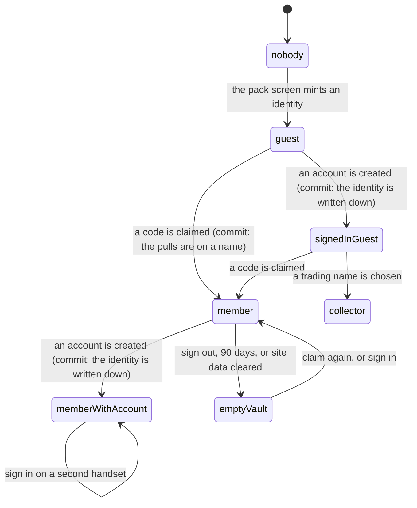

# Keeping your cards

## Summary

Your collection lives in two places at once, and for most of the time nobody
needs to know that. [The collection](../foundations/the-collection.md) owns the
split and says which half holds what. This document is the other side of it: what
the person actually experiences going from a guest with a phone, to a member with
a name, to an account that survives the phone — and what to do when a vault looks
emptier than it should.

The one sentence worth carrying: **secrets are the server's, roster cards are the
device's, and every identity transition is where the two are reconciled.** A
guest's roster cards exist nowhere but the handset, so the handset is what has to
hand them over. Everything else moves server-side and the user never sees it
happen.

## The simple case

You spend a week as a guest. Every day you tear a pack, three roster cards land
in the vault and a secret lands on your name — except your name is a random
identifier the server minted for the phone.

On combine day somebody gives you a slip of paper. You claim your player. The
vault looks exactly the same afterwards, which is the point: your secrets moved
across, your pack streak came with them, and the roster cards the phone was
holding were quietly filed against you.

A month later you sign in with an email. Nothing visible changes. Then you drop
the phone in a pond, sign in on the replacement, and the collection is there.

## What moves, and when

| Moment                               | What moves on the server                                                                 | What the device does                                                                                         | What does not move                                                             |
| ------------------------------------ | ---------------------------------------------------------------------------------------- | ------------------------------------------------------------------------------------------------------------ | ------------------------------------------------------------------------------ |
| Becoming a guest                     | An identity is minted and signed                                                         | Stores the token                                                                                             | Nothing exists yet to move                                                     |
| Claiming a player                    | Secrets, pack records and any streak milestone already paid are re-filed onto the player | Uploads the roster cards it holds, one copy of each you do not already own                                   | Starred cards and shelf order; they belong to the browser                      |
| Signing in, first time on this phone | The account writes down whichever identity this phone already is                         | Uploads its roster cards again, if there is a player to file them against; the second run adopts nothing new | The identity itself — nothing is moved, it is adopted                          |
| Signing in on a second phone         | Nothing                                                                                  | Receives the account's identity and fills the vault from the server                                          | A first-phone card that was never uploaded, because it was never on the server |
| Picking a trading name               | A roster-less identity is created and any guest pulls fold into it                       | Uploads its roster cards                                                                                     | Nothing                                                                        |
| Signing out                          | Nothing                                                                                  | Drops the member token, keeps the guest token, keeps the breadcrumb                                          | The collection; it is on the server                                            |

## The interaction, event by event

### Arrive

Every screen that shows cards asks two questions at once: what does this device
hold, and what does the server hold for whoever the token names. Until the second
one answers, the vault draws every card face-down and prints no counters at all
— not the old number, not a zero. A collection that settles upward is a reveal; a
collection that settles downward is a leak, and only one of those is acceptable.

A device holding no member token is never adjudicated at all. There is nothing on
the server to check a guest's roster cards against, so nothing disowns them.

### Leave without acting

Nothing is recorded. Browsing the vault, opening a card and leaving writes
nothing and moves nothing between the two halves.

### The tap that starts something

Three taps move a collection, and all three do the same two things in the same
order: **read this device's cards first, then let the identity change.**

- Claim, on [the claim screen](claiming-your-player.md).
- Sign in, on [the auth screen](signing-in.md) — or the sign-in that happens by
  itself when an account is already established and the app links it.
- Start trading, on the one-time name prompt a signed-in non-player sees. See
  [the trading post](../trading/the-trading-post.md).

> Technical note: the ordering is not incidental. The instant a device holds a
> member token, the vault begins adjudicating this device's card database against
> the server's record and deletes everything the server cannot vouch for. A guest's
> roster cards are exactly that. Reading them a beat early is what stops the
> delete winning the race — and it is why a claim that arrives on a slow
> connection is still safe.

### While it runs

There is no progress bar for any of this, on any screen except
[signing in](signing-in.md), which shows "Securing your cards" while the account
is being linked. A claim shows only its own "Checking…" button.

The upload is awaited rather than fired off, so the vault you land on already has
the cards in it. It is capped at the sixty-four cards a roster could plausibly
hold, and it adds one copy of each card you do not already own — never a second
copy of one you do, because a local row records "I hold this card" rather than a
ledger of copies, and trusting its count would mint duplicates on every claim.
That also makes it safe to run every single time, since a second run adopts
nothing.

### It settles

Afterwards, and without anything on screen announcing it:

- Your secrets are filed against your name, not the handset. A day you had
  already spent as a member keeps the member's own pull; the guest's is dropped.
  A secret you already held arrives as a duplicate rather than as a second
  ownership row.
- Your pack history came with them, so the streak does not restart at zero — and
  the milestones those packs already paid came too, in that order, so a rung
  cannot pay twice once the streak recomputes against the moved rows.
- Your roster cards are on the server. Where a card exists on both sides wearing
  different finishes, **best wins**: the same rule runs on the device and in
  Postgres, so the two cannot disagree about which copy you own.

A signed-in guest is the exception to the last one. There is nobody to file a
roster card against until a code is claimed or a trading name is chosen, so those
cards stay on the handset — and are left completely alone, because with no server
record to check them against there is nothing that could disown them.

If the server-side move fails, **the claim still stands.** A claim that
half-worked is worth far less than a claim that worked, and nobody can act on
"your old secrets did not come across" while standing in a garden. The cards are
reconciled later — by claiming again, by signing in, or by the commissioner
handing one back.

## Modifiers

| Modifier                                                          | At arrival                                                                                                                                                                                                                                                     | Changed during                                                                                                                                                  |
| ----------------------------------------------------------------- | -------------------------------------------------------------------------------------------------------------------------------------------------------------------------------------------------------------------------------------------------------------- | --------------------------------------------------------------------------------------------------------------------------------------------------------------- |
| Who you are (guest · member · account · commissioner)             | The load-bearing axis, and the whole subject. A guest's collection is the phone's. A member's is the server's, with the phone reconciled against it. An account holder's follows them between phones. A commissioner's own collection is an ordinary member's. | Every transition merges in place, with no confirmation and nothing to approve. The one that cannot be undone is claiming: the cards are on a name from then on. |
| The event's state (before the combine · running · finished)       | A card is held against one combine's roster. Cards belonging to another event are outside the check entirely and are never disowned.                                                                                                                           | No effect.                                                                                                                                                      |
| Dust switched on or off                                           | No effect on what you hold, only on what you can do with a spare.                                                                                                                                                                                              | No effect.                                                                                                                                                      |
| The device (phone · desktop · reduced motion · presentation mode) | A browser refusing to store reads as an empty collection rather than an error, so a private-mode session can pull cards and lose them on reload.                                                                                                               | No effect.                                                                                                                                                      |

## Cancel and interrupt

| Event                                       | Before the identity changes                                                                                    | After it has                                                                                                                                               |
| ------------------------------------------- | -------------------------------------------------------------------------------------------------------------- | ---------------------------------------------------------------------------------------------------------------------------------------------------------- |
| Back, or closing a sheet                    | Nothing has moved. The device still holds what it held.                                                        | Nothing to undo. The cards are on the name.                                                                                                                |
| Navigating away inside the app              | Same. The upload finishes wherever you are.                                                                    | Same.                                                                                                                                                      |
| Reload                                      | Nothing has moved.                                                                                             | Everything survives; both halves are stored, not remembered.                                                                                               |
| Backgrounded                                | An in-flight claim or sign-in may fail and can be retried.                                                     | No effect.                                                                                                                                                 |
| Network lost mid-request                    | Nothing moves. The device's cards are untouched.                                                               | The server-side half may have landed while the upload did not; the claim stands either way and the next sign-in re-runs the upload.                        |
| The request fails or times out              | The screen says so and nothing changes hands.                                                                  | The failure is swallowed on purpose. The collection is reconciled at the next transition.                                                                  |
| The token expires or is cleared             | No effect; nothing was in flight.                                                                              | The server half stops resolving and the vault shows only what the device holds. Nothing is deleted, and the breadcrumb below explains where the rest went. |
| Changed by someone else                     | A card traded away between the vault loading and the upload is refused server-side rather than double-counted. | The vault redraws without it. A card handed to you by the commissioner appears on the next refresh.                                                        |
| A second tab or device                      | Two tabs share the device's card database. A second device shares only the server's half.                      | A claim made in one tab reaches the others through the token; the upload runs once per tab and the second adopts nothing.                                  |
| Reduced motion or presentation mode changes | No effect.                                                                                                     | No effect.                                                                                                                                                 |

## Interactions with other systems

**Who you have to be.** A guest holds secrets on the server and roster cards on
the phone. A member holds both on the server. Nobody holds a roster card without
being somebody on the roster, which is the single constraint the whole two-halves
design falls out of.

**Realtime.** Nothing about a merge is broadcast. Grants and completed trades
arrive on the event and nudge channels and the vault refreshes; the merge itself
is silent.

**Offline and reconnection.** The device half renders offline. The server half is
whatever was last fetched — and a failed fetch leaves the device's card database
exactly as it is, because with no answer from the server there is nothing to
disown a row with.

**Optimistic updates and rollback.** Local writes are not optimistic; they are
simply local. A card revealed in a pack is held on screen as a floor — "this card
has at least this many pulls" — until the server's own number catches up to it,
so a card cannot light up as you turn it and then vanish.

**The card economy.** A collection is what the economy operates on, and a spare
is its unit. Nothing here creates or destroys value: the upload files copies you
already pulled, and it can never mint a second copy of a card you hold.

**Motion and sound.** None. Every one of these transitions is deliberately
undramatic.

**Notifications and badges.** None fire for a merge. The one piece of standing
copy this area owns is the breadcrumb line on the vault, described below.

**Sharing.** A collection is not shareable as a whole, and nothing about a merge
appears in the feed or in a shared card image.

**The second device.** The place the design is finally visible: a guest who picks
up a second phone finds their secrets and not their roster cards, because the
second phone was never told about them. An account is the only fix, and it works
by re-establishing the same identity rather than copying anything.

**Accessibility.** Everything here is silent and automatic, which means a screen
reader user gets no announcement that a collection moved. The one thing that is
spoken is the vault's breadcrumb line, which is ordinary text.

## Edge cases

- **The breadcrumb that is never cleared.** The first time a device holds a
  member token it leaves a mark that says so, and nothing ever removes it — not
  expiry, not signing out. When a phone that was once a member finds itself with
  no member token, the vault prints one line: "Your secrets are on your name, not
  on this phone. Claim again to get them back." It exists because a member's
  secrets live on their name rather than on the handset, and by the time somebody
  is staring at an empty vault the token that would have proved they had a
  collection is gone.
- **Claiming halfway through a pack.** The pack you are holding was dealt to the
  device; once you are a member the packs are dealt to _you_, so today's pack is
  re-dealt and the wrapper is sealed again. The day still counts once toward the
  streak, because the server keeps one pack record per person per day and merges
  rather than duplicating.
- **A shared phone.** Whoever claims on a handset adopts the roster cards sitting
  on it, including somebody else's. The cards were never attributable to anyone,
  so there is nothing to attribute them by.
- **Two accounts, one phone.** The second sign-in adopts whatever the phone is
  holding, which is the first account's identity. Signing out between them is the
  only separation.
- **Signing out keeps the guest token.** It points at a collection rather than
  authorising anything, and clearing it used to orphan everything an unnamed
  visitor had pulled on the handset — the next visit minted a fresh identity and
  the vault looked empty.
- **A card pulled on another phone** arrives on this one in the plainest tier
  until this device has seen the card itself. The tier is a colour rather than a
  number, and the server has no column for it.
- **A card from a previous combine** passes through untouched. It is outside both
  the check and the prune, so it is never disowned, and it returns if that
  combine becomes active again.
- **A blocked card database.** Everything renders, nothing is held, and pulls made
  in that session are lost on reload — the same call the app makes everywhere:
  degrade to "works for this page load" rather than fail.
- **More than sixty-four cards on one device.** The upload takes the first
  sixty-four. No roster in this league approaches that.

## Open questions and verification

- The merge on claim was read from the server functions, the migration and their
  tests. What a user actually sees while it happens — whether the vault visibly
  gains cards, and how long it takes on a phone in a garden — has not been
  watched.
- Whether a failed upload leaves any visible trace has not been confirmed. Every
  caller swallows it, so the expectation is silence, which is worth checking
  against a real failure.
- The re-dealt pack after a mid-pack claim was derived from how a pack is keyed
  to an identity and how the pack record merges. It has not been reproduced by
  hand, and it is the most user-visible surprise in this document.
- The breadcrumb line has a component test but has not been seen on a real phone
  after a real expiry, which takes 90 days to arrange honestly.
- Assumption: the three taps named above are the complete set of identity
  transitions that move a collection. Every caller of the upload was checked at
  this commit; a new one that forgot to read the device's cards first would fail
  silently and lose them.

Verified against willyoubemyhero commit `b46f330`.
