# Signing in

## Summary

An account is an email and a password — or a Google sign-in — attached to the
collection this phone already holds. It is not a fourth level of permission.
Every guard in the app still reads the guest or member token on the device, and
signing in changes none of them; see
[identity and sessions](../foundations/identity-and-sessions.md) for what those
tokens are and what each unlocks. What an account changes is whether the identity
this handset invented for itself can ever be found again. It is durability, and
almost nothing else.

The screen is `/auth`. It is reached from the person icon at the right of the top
bar, from the trading post when a visitor has nothing to trade with, and from a
streak milestone that is sitting there waiting to be taken.

## The simple case

You tap the person icon. The page offers Continue with Google, or an email and a
password with a button that says Sign in, and a line under the form reading "An
account is optional — you can keep playing as a guest on this phone."

You fill both fields and tap. A toast says "Welcome back". The page turns into a
single card headed "Securing your cards", with a spinner and one instruction:
keep this page open while this phone's collection is linked. A moment later the
card says your cards are saved — to your player's name if you have claimed one —
and the app moves you to the vault.

Nothing else about the app looks different. Same tabs, same cards, same buttons.
The difference only shows up on the second phone.

## What an account actually buys

Four things, and it is worth being precise because none of them is "permission".

- **Your collection survives the handset.** Sign in on a new phone and the
  server hands it back the same identity rather than letting it mint a new one.
  This is the whole reason the screen exists. See
  [keeping your cards](keeping-your-cards.md).
- **A streak milestone can be taken.** Postgres refuses to pay one to an identity
  no account points at: a milestone buys a permanent card, and a device-local
  token is one cleared browser away from losing it. The pack summary says so in
  words — "An account keeps it on every phone you play from."
- **Somebody not on the roster can trade.** Thirteen people get paper codes;
  everybody else who wants to swap cards signs in and names themselves. See
  [the trading post](../trading/the-trading-post.md).
- **A second door into the commissioner's console**, for an account granted
  admin — no PIN, and it stays open through a PIN lockout. See
  [getting in](../admin/getting-in.md).

## The interaction, event by event

```mermaid
stateDiagram-v2
    [*] --> signedOut
    signedOut --> submitting : Continue with Google, Create account, or Sign in
    submitting --> signedOut : refused (a toast; the form stands)
    submitting --> awaitingEmail : the account needs confirming by email
    awaitingEmail --> signedOut : the link is clicked, then sign in
    submitting --> linking : the session lands (commit: the account exists)
    linking --> linked : the device is handed its token (commit: this phone's cards are on the account)
    linking --> linkFailed : four attempts, none landed
    linkFailed --> linking : Try linking again
    linked --> [*] : the vault, or wherever you were headed
```

### Arrive

The page reads three things before it can decide what to draw: whether this
browser holds a signed-in session, whether it holds a member token, and how far
the collection link has got. All three arrive after the first paint, so the first
frame is always the signed-out form.

Two things can be in the URL. `mode=signup` opens the page on Create account
rather than Sign in. `next=` decides where you land afterwards, and is honoured
only when it is a path on this site — anything pointing elsewhere, including one
dressed up to look like a path, is dropped and you land on the vault. Two `next`
values also change the copy, because in both cases somebody was sent here
mid-task and deserves to know why: trading says an account is how the other
player knows who they are swapping with, and the pack says a streak reward is
waiting and an account is what keeps the card once you take it.

### Leave without acting

Nothing is recorded. Opening the page, typing an email and backing out writes
nothing and tells nobody. The fields are not remembered; coming back gives you an
empty form.

The app counts nothing here — there is no per-account attempt limiter of the kind
the [claim screen](claiming-your-player.md) and the PIN both have. Whatever
throttling exists is the authentication service's own.

### The tap that starts something

Three buttons start the same thing: Continue with Google, Create account, Sign
in.

Before any of them leaves the device, the app copies whichever token this phone
is currently holding into a separate key of its own. That copy is the reason a
guest who signs in does not lose a week of pulls.

> Technical note: a Google sign-in navigates away from the app entirely and comes
> back, and an emailed confirmation may come back in a different tab. Either way
> the page that returns is a fresh load, and the sync that runs on it needs to be
> able to say "this is the collection I was" — so the preserved token rides along
> on the linking request as a header of its own, and is thrown away once the link
> succeeds.

Creating an account is where the paths diverge. If email confirmation is on, the
sign-up returns no session: the account exists but this browser is not signed in
to it. The page says so in place, naming the address it went to, and asks you to
click the link and come back. Nothing is linked, and no token changes hands,
until you actually sign in.

### While it runs

Every button on the form is disabled while a request is out.

Once a session lands, the page becomes the "Securing your cards" card and the
work moves off this screen: the link runs at the root of the app, not on `/auth`,
so navigating away does not cancel it. It has four attempts, backing off between
them, because the failure this replaces used to be silent — somebody signing in
on a flaky connection sat in front of an empty vault while their real collection
was safe on the server.

What the link does, in the user's terms: it asks the server who this account is.
The first time the answer is "whoever this phone already was" — the account
adopts the device's identity rather than moving anything, so nothing can
half-move. Every time after that the answer is the account's own identity, and
any stray guest the phone has picked up meanwhile is folded into it. The device
is then handed the matching token, and — where there is a player to file them
against — the roster cards on the handset are uploaded.
[Keeping your cards](keeping-your-cards.md) walks that in detail.

### It settles

On success the card names where your cards went — "Your cards are saved to Doug"
if a player is attached, otherwise "saved to this account — they'll follow you to
any phone" — and the app moves you on to `next`, or to the vault.

On failure the card changes to "Link needs another try" and says plainly that the
cards are safe but this phone could not finish linking them. The only button is
Try linking again, which reloads the page and starts over.

Signing out lives in the account menu behind the person icon. It cancels
in-flight queries, empties the cached screens so Back cannot restore a shell
belonging to the previous account, signs out, drops the member token, and returns
you to `/auth`. The guest token is deliberately left alone: it points at a
collection rather than authorising anything, and clearing it used to orphan
everything an unnamed visitor had pulled on that handset.

## Modifiers

| Modifier | At arrival | Changed during |
| --- | --- | --- |
| Who you are (guest · member · account · commissioner) | The load-bearing axis. A guest signing in has their guest identity written down under the account. A member signing in has their player written down instead, and the guest token on the device is cleared, because a member token beats it anyway. An account holder is simply handed their own identity back. A commissioner is an ordinary account here; the console is a separate door. | Claiming a player while signed in upgrades the account from a guest identity to that player, and the guest's secrets ride along. A second, different player is refused rather than taken over. |
| The event's state (before the combine · running · finished) | No effect. An account is not attached to an event and survives a new combine. | No effect. |
| Dust switched on or off | No effect. | No effect. |
| The device (phone · desktop · reduced motion · presentation mode) | The page is one narrow column and reads the same on both. Google sign-in leaves the browser and returns, which on a phone means the app is backgrounded mid-flow. Under presentation mode the whole page is inert. | No effect. |

## Cancel and interrupt

| Event | Before the account exists | After it exists |
| --- | --- | --- |
| Back, or closing a sheet | The form closes and nothing is stored. | The account stands. Backing out of the "Securing your cards" card does not stop the link; it keeps running at the root. |
| Navigating away inside the app | Same: nothing stored. | Same. The link finishes wherever you are, and the token appears under you. |
| Reload | Nothing stored. Typed fields are gone. | The session survives — it is in the browser's storage. A link that had not finished starts again from the top. |
| Backgrounded | An in-flight request may fail and need retrying. A Google sign-in backgrounds the app by design and returns to it. | No effect; the link resumes or retries. |
| Network lost mid-request | No account is created and no session lands. Whether the sign-up reached the server is not knowable from the screen; trying again with the same address will say so. | The account is fine. The link retries four times, then shows "Link needs another try". |
| The request fails or times out | A toast names the failure — "Couldn't create that account" or "Couldn't sign you in" — with the reason under it, and the form stands with both fields as you left them. | The failure card, with one button. The collection is not lost; only this phone's copy of the identity is missing. |
| The token expires or is cleared | Not applicable — there is no token yet. | Signing out drops the member token and keeps the guest token. An expired member token is re-minted the next time the account links, which is what makes an account worth having. |
| Changed by someone else | No effect. Nothing about this screen is shared. | The commissioner rotating your paper code does not touch the account, which points at the player rather than at the code. |
| A second tab or device | Both tabs show the same form. | Two tabs signing in at once are safe: the first to write the account's identity wins, and the second folds into it rather than overwriting either. |
| Reduced motion or presentation mode changes | No effect. | No effect. |

## Interactions with other systems

**Who you have to be.** Nobody, to reach this screen. The account itself guards
nothing: it is checked by the authentication service, and every write in the app
still sits behind the guest or member token that the link hands back. The one
place the presence of an account is itself a condition is a streak milestone, and
Postgres enforces that rather than the screen.

**Realtime.** None. No channel carries accounts, and nobody else learns that you
signed in — except indirectly, on the trading post, where signing in is one of
the two ways a player becomes somebody an offer can reach.

**Offline and reconnection.** Signing in needs the network and says so through
the ordinary failure toast. A device that already holds a token keeps behaving as
that identity offline; the account is only consulted at the transition.

**Optimistic updates and rollback.** None. The app never acts as though you are
signed in before the session lands, and never acts as though the collection is
linked before the server has said which identity this account owns.

**The card economy.** An account does not add cards, dust or spares of its own.
It decides whether a streak milestone can be taken at all, and it is the only
thing that carries a collection to a second handset.

**Motion and sound.** A spinner, and nothing else. No chime, no ceremony.

**Notifications and badges.** None on this screen. The trade badge only starts
meaning something once you have an identity an offer can reach.

**Sharing.** Nothing here is shareable, and no token or account identifier is
ever put in a URL. The `next` parameter is the only thing this screen reads from
a link, and it is restricted to paths on this site precisely so a shared link
cannot bounce somebody off-site the moment they sign in.

**The second device.** This is the feature. The account is the only thing in the
app that follows a person between phones, and it does so by re-establishing the
same identity on the new one rather than by copying any cards.

**Accessibility.** Both fields carry real labels and the right autocomplete
hints, so a password manager fills them and a screen reader announces them.
Failures arrive as toasts: announced, but transient. The "Securing your cards"
state is a heading change with a spinner beside it and no live region, so a
screen reader user learns the page changed only by going looking.

## Edge cases

- **The account panel is hard to reach.** Once the link has settled, arriving at
  `/auth` while signed in moves you straight on to the vault. The card holding
  your email address, the "I have a player code" link and the page's own Sign out
  button is therefore only visible while the link is in flight or has failed —
  which means the Account item in the header menu lands on the vault. Sign out
  still works from that same menu.
- **Signing in on a phone that has claimed a different player.** The account
  keeps the player it already had; a second, different one is refused rather than
  silently taken over, because an overwrite would re-mint every other device onto
  the new player and strand the first identity with no way back. The refusal is
  swallowed, so nothing on screen says it happened.
- **An account with no player at all.** Signed in, not on the roster, no paper
  code coming. The vault, the pack screen and the trading post each show a
  one-time prompt asking for a trading name; naming yourself turns the account
  into somebody an offer can reach.
- **The confirmation link opened in another browser.** The account is confirmed,
  but that browser is a different device as far as this app is concerned; signing
  in on the original one is what links it. A password under six characters is
  refused by the field before anything is sent.
- **Two accounts on one phone.** The second sign-in adopts whatever identity the
  phone holds at that moment, which after the first is the first account's.
  Signing out between them is the only way to keep them apart.
- **Signing out from the claim screen is not the same button.** The one on
  [claim](claiming-your-player.md) drops the member token only and leaves the
  account signed in, which puts the device in a state where the vault says the
  collection is on your name and offers to claim again. A reload restores the
  member token, because the account link runs afresh.

## Open questions and verification

- The bounce away from `/auth` for a settled signed-in user was read from the
  redirect rule, not watched. If it behaves as read, the panel's Sign out button
  and the "I have a player code" link are effectively unreachable and the header
  menu's Account item goes to the vault; both are worth filing.
- Whether the refusal to bind a second player produces any visible sign has not
  been confirmed. Every caller swallows it, so the expectation is that it is
  entirely silent, which deserves a hand pass.
- The four-attempt retry and its backoff were read from the sync code. How long
  the "Securing your cards" card stays up on a real flaky connection has not been
  watched. Nor was it determined whether email confirmation is switched on for
  the deployed project; the screen handles both, and this document describes the
  path with it on.
- Assumption: no screen other than `/auth` reads the collection-link state, so
  the linking window is invisible everywhere else. Nothing in the source does.

Verified against willyoubemyhero commit `b46f330`.
