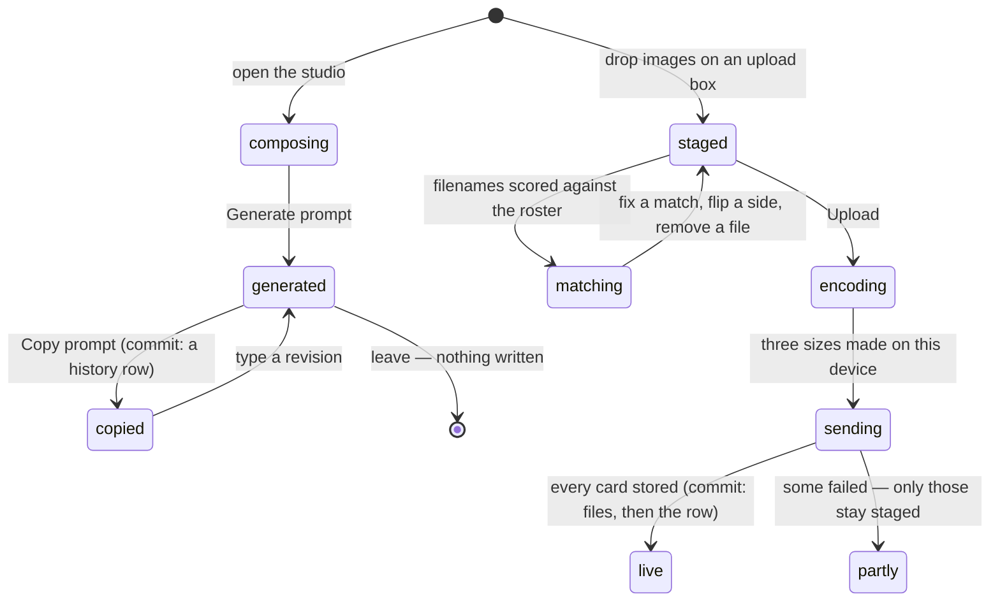

# Card artwork

## Summary

Every roster card in this app is a picture somebody made outside it and uploaded
into it. The app never draws a card and never generates one: it writes the
*prompt*, hands it to you on the clipboard, and waits for you to come back with
an image. This document covers that whole loop — the Card Prompt Studio that
composes a prompt, the three places art can be uploaded, the resizing that
happens on your own phone before anything is sent, and the backfill tool for
images that arrived before the resizing existed.

Four kinds of image live here, and they resolve in a fixed order on a card: a
player's own **front**, a player's own **back**, the event's **universal back**
that stands in when a player has none, and the **participant photo**, which is
not a card at all but a face for the avatar and a reference for the prompt.

## The simple case

You open the console, scroll to Card Prompt Studio, pick the Draft Combine Player
series and pick a player. Their name fills in, their nickname is noted, their
combine data — times, splits, penalties — is formatted into the prompt for you,
and their photo appears beside a line reminding you that you still have to attach
it by hand. You type a few sentences about the person, tap Generate prompt, and
the whole thing appears in a read-only box. Copy it, paste it into an image tool,
attach the photo, and wait.

When the image comes back you drop it — with eleven others — onto Bulk Card
Upload. Filenames are matched to players automatically, `-back` on a filename
picks the reverse face, anything ambiguous is left for you to pick from a
dropdown, and "Upload 12" sends the lot. Each image is downscaled in your browser
on the way out. A moment later the cards are live in everybody's vault.

## The interaction, event by event

### Arrive

The studio and the upload panels sit on the same admin page and read what the
console already has: the event bundle for the roster and the combine data, and
two signed-URL queries for photos and cards. There is one extra request, for the
saved series prompts, and until it answers the Generate button is disabled —
generating from a stale template would snapshot the wrong text into the history
row permanently.

The bulk uploader arrives knowing nothing but the roster; everything else it
decides when a file lands on it. Art the console shows you is served through the
same resized, signed URLs every player sees, so you are looking at what the vault
looks like.

> Technical note: originals are multi-megabyte PNGs and the storage layer will
> resize on the way out, so a signed URL is always minted with a width — 320, 800
> or 1200 — and never handed back untransformed. Those URLs live eight hours and
> are re-used for six, which is why a card you replaced can keep showing its old
> art on a screen that has not refetched.

### Leave without acting

Nothing is recorded in either half. Staged files sit in the browser; a generated
prompt sits in a textarea. Leaving the page, backing out or reloading discards
both, and nothing about "I looked at this card" is stored anywhere.

The one thing worth naming: **generating a prompt writes nothing**. Only copying
it does.

### The tap that starts something

- **"Copy prompt."** The clipboard write is the trigger, and the history row is
  saved after it succeeds. Copy a revision and the original is saved first, so a
  revision is never an orphan. If the clipboard refuses, nothing is written at
  all.
- **"Upload N."** The first real write of an image. Files that are unmatched or
  oversize are left behind rather than sent; only the ready ones go, as a single
  request of up to forty items.
- **A per-player Photo, front or back button.** One file, one write, straight
  away — no staging step.
- **The universal card back.** One image that becomes the back of every card in
  the event that has none of its own.
- **A bin next to a face.** Deletes that image and its three sizes from storage
  and clears the columns pointing at them. A browser confirm asks once.
- **"Regenerate image sizes."** Sweeps the event for images that have an original
  but no small versions, and rebuilds them.

Before any of these leaves the device, the image is decoded and re-drawn at three
sizes — 1600, 800 and 320 pixels on the long edge — as WebP where the browser can
write it and JPEG where it cannot. A file already small enough is passed through
untouched rather than taking a second generation loss, and an image the browser
cannot decode at all is sent as-is rather than failing.

### While it runs

Uploading is a blocking, unglamorous wait: the button reads "Uploading…", the
staged list stays put, and there is no per-file progress — the encode of twelve
full-size images happens before the first byte is sent, so the longest part of
the wait shows nothing at all.

The regeneration sweep is the one operation that reports progress, because it can
run to dozens of images: "Regenerating 7/23…", with a failure count when it
finishes. It processes one image at a time on purpose — canvas re-encoding is
memory-heavy, and a phone doing twelve at once is a phone that reloads the tab.

Nothing here is optimistic: a tile does not change until its upload has landed and
the signed-URL query has been re-read.

### It settles

A successful bulk upload says how many landed and clears the staging list. A
partial one says how many failed and **keeps only the failures on screen**, so
the retry is the same button with a shorter list.

A single upload says which face it was — "Card front uploaded" — and the tile's
label changes from `front` to `front ✓`. The universal back reports that it is
set for every player, and refreshes both its own preview and every player's card
URLs, so a pack already open on somebody else's phone picks up the new wrapper.

A copied prompt says "Prompt copied" and, quietly, files a row in the prompt
history. If that filing fails you get a warning rather than an error — "Prompt
copied, but history could not be saved" — because the copy is the thing you
actually wanted.

Failures are toasts carrying the server's own words. An upload that fails leaves
the previous art in place; nothing is ever half-replaced, because the new files
are written before the row is repointed at them and the old files are only
deleted once the new ones are safely referenced.

## Modifiers

| Modifier | At arrival | Changed during |
| --- | --- | --- |
| Who you are (guest · member · account · commissioner) | Commissioner only, for all of it. A member reaching `/admin` gets the PIN gate rather than a studio they cannot use. What everybody else sees is the output: card fronts and backs in the vault, faces on the leaderboard. Reading a card's URL needs nobody — the URLs are signed and handed out to any viewer — but making one needs the token. | The page reverts to the PIN gate. Staged files and an uncopied prompt go with it. |
| The event's state (before the combine · running · finished) | Art can be uploaded at any point, and usually is the night before. What changes is the prompt: before any run exists the "known performance data" block is empty, and after the combine it carries real times, splits and penalties. | A run finishing mid-session changes what the *next* generated prompt says. A prompt already generated is a snapshot and does not update. |
| Dust switched on or off | No effect. | No effect. |
| The device (phone · desktop · reduced motion · presentation mode) | Drag-and-drop is a desktop affordance; on a phone every drop box is also a button, because there is nothing to drag from. The resizing runs on whatever device you are holding, so a big batch on an old phone is slow and can run out of memory. | No effect. |

## Cancel and interrupt

| Event | Before the first write | After it |
| --- | --- | --- |
| Back, or closing a sheet | Staged files and typed prompt fields are discarded. Nothing was sent. | Nothing to undo. A replaced image can only be replaced again; a deleted one has to be re-uploaded. |
| Navigating away inside the app | Staging is lost. The prompt box is lost. | Uploads already sent stand. A regeneration sweep is abandoned where it stood, with the images it had already rebuilt rebuilt. |
| Reload | Everything staged is gone, previews released. | Every stored image is there. The signed URLs are minted fresh. |
| Backgrounded | No effect. | An in-flight upload continues. A regeneration sweep on a backgrounded phone may be throttled to a crawl, since the re-encoding runs in the page. |
| Network lost mid-request | Nothing was sent. | A bulk upload writes card by card, so some may have landed. The panel re-reads and shows exactly which. A prompt copy has already reached the clipboard; only its history row is at risk. |
| The request fails or times out | Not applicable. | A toast with the server's message, the old art still on screen. History failures are downgraded to a warning on purpose. |
| The token expires or is cleared | Everything still looks live; the 12-hour session's end is noticed on a timer rather than at the moment it happens. The first upload after it fails with "Admin PIN required". | A bulk upload that expires part-way through is the ugly case: earlier cards are stored, the rest fail, and the panel keeps the failures staged for a retry that will also fail until the PIN is re-entered. |
| Changed by someone else | Another commissioner's upload arrives on the next read of the card URLs. Until then you may be looking at art that has been replaced. | Last write wins. Two people uploading a front for the same player keep whichever finished second; the loser's files are deleted. |
| A second tab or device | Both can stage different files for the same player with no warning. | The signed-URL cache means a second device can keep showing the old art for up to six hours after a replacement. |
| Reduced motion or presentation mode changes | No effect. | No effect. |

## Interactions with other systems

**Who you have to be.** The commissioner. Every upload, delete and backfill puts
`requireAdmin` for this event on its first line; the prompt history is guarded the
same way, and the shared series prompts are guarded against the active event's
admin token because they belong to the league rather than to one combine.
Reading art needs no identity at all — the URLs are signed on the server and
handed to anyone the screen is drawn for.

**Realtime.** None. No image change is broadcast. Other phones pick up new art
when they next refetch the card URLs, which for a pack already on screen means
the next time that query is invalidated or the page is reloaded.

**Offline and reconnection.** Cards already painted stay painted from the browser
cache. Nothing can be uploaded, and — worth knowing before a long batch — the
encode happens first, so a failed upload has already spent the slow part.

**Optimistic updates and rollback.** None. A tile shows the old art until the new
art is stored and re-read, and the storage writes are ordered so a failure never
leaves a card pointing at bytes that are gone.

**The card economy.** Art has no economic weight: no tier, no edition, no dust.
It changes what a card *looks* like and nothing about what it is worth. Replacing
a player's front changes it for everybody holding a copy at once, whatever finish
their copy wears — see [the card](../foundations/the-card.md).

**Motion and sound.** Silent throughout. The only movement is a drop box changing
colour under a dragged file.

**Notifications and badges.** None. Nobody is told that their card has new art.

**Sharing.** Everything downstream of a card image — the export, the link
preview, the recap — uses the same three sizes made here, so a card exported at
hero size is drawing on the 1200px variant rather than the original.

**The second device.** Two consoles can stage different files for the same
player. The bigger surprise is the six-hour reuse window on signed URLs, which
can leave a second device confidently showing art you replaced this morning.

**Accessibility.** Every drop box is a button that responds to Enter and Space,
not just a drag target. Each staged row's player dropdown is labelled with its
filename, so twelve identical selects are distinguishable, and each remove button
names the file it removes. The generated prompt is a read-only textarea rather
than a block of unselectable text.

## Where the prompt comes from

Six series ship with the app — Draft Combine Player, Cornhole Player, Secret Pet,
Legacy Pet, WAG Secret Rare, Custom Secret — and each carries a master prompt
that a commissioner can rewrite from "Manage Series Prompts" and reset back to
the built-in one. Three of the six are for people on the roster and pull their
subject from the participant picker; the other three ask for a name and an
association instead.

A generated prompt is the master text followed by labelled blocks: subject
information, known event and performance data, card-specific visual notes,
creative direction, and reference photos. A block with nothing in it is omitted
rather than printed empty.

Two things about it are worth stating plainly:

- **The photo is not attached.** The prompt carries the photo's URL and a line
  saying the administrator will attach it manually. This studio does not upload
  images and does not talk to any image tool.
- **The performance block is real data and the rest is not.** Every master prompt
  asks for four to six invented, funny stats and explicitly forbids inventing
  official results.

Batch Production runs the same thing over a selection: tick players, add one
shared direction plus a note per player, build the queue, and walk it with "Copy
& Next". Each copy files its own history row, exactly once, even if the button is
double-tapped. Recent Prompts keeps the last thirty and can reload one back into
the form.

## Edge cases

- **Two players whose names score the same for a filename.** The match is left
  blank rather than guessed. There are two Weidensauls and two Ryans on this
  roster; keeping the first would hand the card to whoever sits earlier in the
  running order, and that changes silently when the running order does.
- **A weak single-token match.** Treated as no match. A filename has to earn a
  real score before it claims a player.
- **A filename ending `-back`, `-b` or `-rear`** picks the reverse face; `-front`
  or `-f` picks the obverse; anything else defaults to the front. The toggle on
  the row overrides it either way.
- **A file the browser reports with no MIME type**, which happens with dragged
  files, falls back to the extension rather than being dropped silently. One over
  the size cap stages in red and is excluded from the upload — though the badge
  names the wrong number. See "Open questions".
- **A player with their own back art** keeps it when a universal back is set; the
  universal back only fills in for players who have none. Removing it drops every
  card that relied on it to the generated stats back rather than to nothing.
- **An image that fails to decode** is uploaded at its original size, in all three
  slots. It works, and it is heavy.
- **Regenerating when nothing needs it** says so and stops. **A prompt copied
  twice** files one history row, not two.

## Open questions and verification

- **The oversize badge says "Over 12 MB" and the limit is 8.8 MB.** Twelve
  million is the count of base64 characters the server accepts, which is about
  8.8 MB of actual file; the badge prints the internal number. A commissioner
  staring at a 10 MB export will be told it is under a limit it is over.
- **A bulk upload is not transactional.** Cards are stored one at a time, so an
  interruption mid-batch leaves some players updated and some not, with no record
  of where it stopped beyond what the panel still has staged.
- **The regeneration sweep runs in the page.** How a thirteen-player event's
  worth of images behaves on an old phone was not measured; the code processes
  one at a time specifically because doing more was a problem.
- Whether a replaced card visibly updates on a second device inside the
  signed-URL reuse window was read from the cache settings, not observed.
- Assumption: no path other than these panels writes a card or photo path. Nothing
  in the source does at this commit.

Verified against willyoubemyhero commit `b46f330`.
