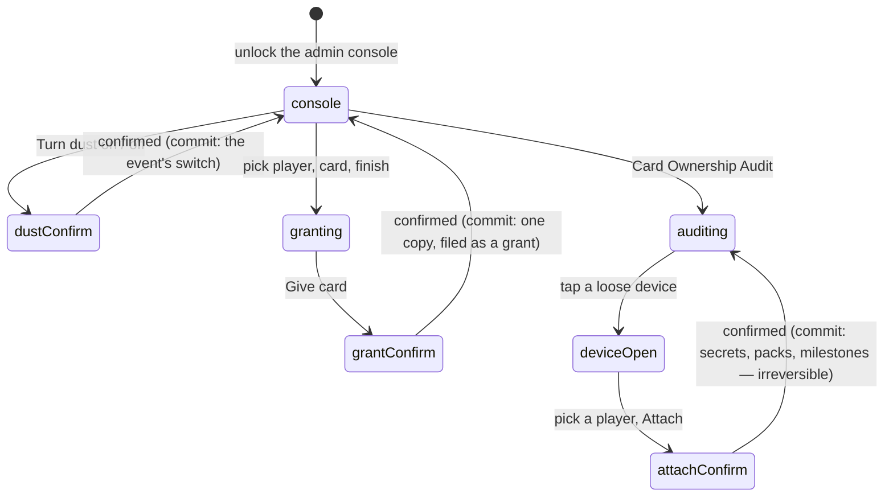

# Dust, grants and the ownership audit

## Summary

Three panels sit one after another in the admin console and share one job:
putting a collection back the way it should have been. **Give a Card** hands
somebody a copy of a roster card they lost. **Dust** is a single button that turns
the whole economy on or off for the league. **Card Ownership Audit** answers the
question that produces the most complaints — "why can't I see my card in
trades?" — and repairs the commonest cause of it in one tap.

None of the three is part of race day. All three exist because a phone-first app
with no login has two ways to lose track of who owns what: a pack opened before
the device knew who was holding it, and a player no offer can reach.

## The simple case

Somebody says their cards have gone. You open the console and scroll to Card
Ownership Audit; its header already says "3 loose". You tap the Loose tab, see
three devices with the dates they were last seen and a few card names each, and
recognise one — "Gary the Grill, Reggie, Two Pints" is exactly the set they were
bragging about last week. Tap it, pick their name from "Belongs to…", tap Attach,
confirm, and the cards move onto their name for good.

If it is a roster card rather than a secret, Give a Card is the tool: pick the
player, pick the card, pick the finish, confirm. The toast says how many copies
they hold afterwards.

And when the league is ready for the economy — usually not on day one — the Dust
panel is one button. It says "Turn dust on", tells you what will happen, and does
it.

## The interaction, event by event

### Arrive

The three panels arrive knowing different amounts.

**Dust** knows only whether the switch is on, which it reads from the active
event the whole app already has. The panel header says "Live" or "Off" and the
body text changes with it, naming the sell prices and the shop's prices when it
is on.

**Give a Card** reads the roster out of the event bundle and nothing else. It
knows no history: it cannot tell you what somebody already holds, only offer to
add to it.

**The audit** makes its own request, cached for thirty seconds, and does real
work: it counts every roster copy and every secret pull in the league, groups them
by owner, works out which players are *reachable*, and collects every device
holding cards that belong to nobody. The header says "N loose" or "all filed"
before you open it. Anyone on the list who is a *collector* rather than an athlete
is marked as one, in the Holdings rows and in the "Belongs to…" picker.

Three numbers per player come back, and the third is the interesting one:
**Cards** is every roster copy they hold, **Secret** is every secret, and
**Trade** is what they could actually stake right now — roster copies only count
where they hold two or more of that card, and today's own pull does not count
until tomorrow. A player with a full vault and nothing tradeable is a real and
confusing state, and this is the only screen that shows it.

### Leave without acting

Nothing is recorded anywhere. Opening the audit runs a read; expanding a device,
picking a name in a dropdown and walking away writes nothing.

### The tap that starts something

All three first writes are behind a browser confirm box, and each box says what
will happen rather than asking "are you sure":

- **Turning dust on** — "Secrets become sellable … and the shop appears for
  everyone." **Turning it off** — "The chip and shop disappear and nothing
  accrues while it is off. Balances already earned are kept."
- **Give card** — "Give *Alice* a *platinum* *Bob* card?", naming both people and
  the finish, because the two dropdowns above it look identical.
- **Attach** — "Move this device's cards onto *Alice*? This can't be undone."

The attach is the one genuinely irreversible action here, and the only one whose
confirm says so. It runs the same three steps a real claim runs, in the same
order: the device's secrets, then its pack history, then the *milestones* those
packs already paid — that order is what stops a rescued device from re-earning
milestones somebody already collected. If a signed-in account is sitting on that
device with no player of its own, its link is repaired at the same time, or it
would go on acting as a stranger and strand every new pull the same way.

### While it runs

Each panel disables only its own control: Dust says "Working…", the grant says
"Giving…", the attach row says "Moving…", and their neighbours stay interactive.
Nothing is optimistic — the dust panel does not flip its label until the write has
come back, and the audit does not drop a device from the list until the move has
landed.

### It settles

**Dust** re-reads the active event, which is the one thing every screen consults
to decide whether the Shop tab exists, and toasts "Dust is live" or "Dust is off".
On other phones the bottom bar reflows from five columns to six the next time they
read the event — see
[the event](../foundations/the-event.md#the-events-own-settings) and
[navigation and screens](../foundations/navigation-and-screens.md).

**A grant** answers with the total: "*Alice* now holds 3 × *Bob*". The copy is
filed as a grant rather than a *pull*, so it is distinguishable from a real one
forever and never occupies anybody's one pull a day — but the public "packed by"
count moves exactly as a real pull would, because the point is to put the
collection back the way it was.

**An attach** says how many secrets that player now holds and collapses the device
row, then invalidates *everything* on the page rather than one query, because a
move this size touches the roster, the trading surfaces and the audit at once.

Failures are toasts: Dust says "Could not change that", the other two carry the
server's own words. A failed grant leaves nothing half-applied — the copy goes in
inside one database call — but a failed attach can, because it is three calls in
sequence and only the ones before the failure have run.

## Modifiers

| Modifier | At arrival | Changed during |
| --- | --- | --- |
| Who you are (guest · member · account · commissioner) | Commissioner only, all three. A member who opens `/admin` meets the PIN gate rather than a console with three greyed-out panels, so nobody but the commissioner ever sees another person's holdings, another device's card names, or the dust switch. | The page reverts to the PIN gate, mid-dropdown if necessary. Nothing selected is kept. |
| The event's state (before the combine · running · finished) | Identical in all three. The audit counts collections, which have nothing to do with whether anybody has run. Give a Card lists the roster whether or not it has raced. | No effect. |
| Dust switched on or off | This is the axis for one of the three panels and irrelevant to the other two. While it is off the panel's own body text explains what turning it on would do; grants and attaches behave identically either way. | Flipping it mid-session changes what every player's bottom bar looks like within one read of the event. It changes nothing about a grant, which pays no dust in either state. |
| The device (phone · desktop · reduced motion · presentation mode) | On a phone all three panels start collapsed, the audit's three lists hide behind a segmented control rather than stacking into a wall of scroll, and the attach controls stay folded until a device is tapped. Confirms are the browser's own dialogs, so they look like the OS rather than the app. | No effect. |

## Cancel and interrupt

| Event | Before the first write | After it |
| --- | --- | --- |
| Back, or closing a sheet | Dismissing a confirm box cancels outright and writes nothing. Selections in the dropdowns stay where they were. | Nothing to undo. A grant can be countered only by another grant of the opposite kind, and there is no such control; an attach cannot be undone at all. |
| Navigating away inside the app | Nothing recorded. The audit re-runs its read when you come back. | The write already landed. |
| Reload | Selections are lost; nothing else. | Every change is there. The audit's counts are recomputed from scratch. |
| Backgrounded | No effect. | An in-flight write continues. The toast may be missed; the audit's next read shows the truth. |
| Network lost mid-request | Nothing was sent. | A grant either landed or did not. An **attach** is three calls, so it can have moved the secrets and not the pack history — leaving a device half-rescued with no indication of it. Re-running the attach on the same device is the repair, and is safe. |
| The request fails or times out | Not applicable. | A toast with the server's words. The dust panel keeps its old label, the grant keeps its selections, the device stays in the list. |
| The token expires or is cleared | For up to a minute after a 12-hour session ends every control still looks live — the page re-checks the token once a minute — and the first confirm you accept in that window fails with "Admin PIN required". | The worst version is an attach interrupted between its three steps by an expiry, which leaves exactly the half-moved state above. Re-entering the PIN and repeating the attach finishes it. |
| Changed by someone else | The audit is thirty seconds stale at most, so a device rescued by a second commissioner can still be listed here. Attaching it again is harmless. | A dust flip made elsewhere is not pushed; this panel keeps its old label until it re-reads the event. |
| A second tab or device | Both consoles show their own snapshot. | Granting the same card from two consoles hands out two copies — the grant is deliberately unconditional and does not check for a recent identical one. |
| Reduced motion or presentation mode changes | No effect. | No effect. |

## Interactions with other systems

**Who you have to be.** The commissioner, holding an admin token for this event.
All four writes — the dust flip, the grant, the audit read and the attach — carry
`requireAdmin` on their first line. The audit read is guarded as tightly as the
writes because it is the most revealing response in the app: it names who holds
what, and it prints the names of secret cards sitting on unclaimed devices.

**Realtime.** Almost nothing here broadcasts. A dust flip reaches other phones
when they next read the active event, and a grant reaches its recipient when they
next read their collection. The exception is a *trophy*: if the rescued device had
already finished a set, banking its cards mints the trophy, and that table is
published — so the person it belonged to finds out on their own phone.

**Offline and reconnection.** All three render from cache with the radio off and
none can write. The audit is a large read, so on a poor connection it can sit on
"Counting collections…" for a while.

**Optimistic updates and rollback.** Nothing is optimistic and nothing rolls back:
every panel waits for the server and then re-reads. The attach is the exception
worth knowing about — it is not a transaction, so a failure part-way leaves in
place whatever it had already moved.

**The card economy.** The dust switch is the economy's on/off, and while it is
off every dust operation refuses in the database itself rather than merely being
hidden — a screen working from a stale switch costs a button that answers "not
yet" and can spend nothing. Nothing accrues while it is off, and balances already
earned are kept. A granted roster copy pays no dust and costs none; a granted
secret pays none either, unlike a *pulled* duplicate, which does when dust is on.
See [dust](../dust/dust.md) and
[milling and selling](../dust/milling-and-selling.md).

**Motion and sound.** Silent. No chime, no confetti, no ceremony — the recipient
of a grant gets the card, not the theatre.

**Notifications and badges.** The one badge that moves is the Shop tab appearing
or disappearing on everybody's bottom bar when the dust switch flips. Nothing
about a grant or an attach lights anything.

**Sharing.** Nothing here is shareable. The audit's contents in particular are
not meant to leave the console: a device's card names are a list of secrets
somebody holds.

**The second device.** Two consoles can both grant, and both grants land. Two
consoles can both attach the same device, which is harmless — the second run
finds nothing left to move.

**Accessibility.** Give a Card's three dropdowns carry real labels — "Player",
"Card", "Finish" — and the audit's tabs are buttons with their counts inside them,
so a screen reader reads "Loose 3" as one control. Each stat pill names its own
number, and the confirms are the browser's own dialogs. The audit's own
"Belongs to…" dropdown is the gap: it has no label but its placeholder option, so
in a list of loose devices a screen reader cannot say which device it belongs to.

## What "loose" actually means

Everything downstream of the trading post identifies people by their place on the
roster. A pack opened before somebody claimed a player is filed against the
**device** that opened it instead, and that is the whole bug this panel exists
for: those cards still show up in that person's own vault, because the vault
reads whichever identity the handset is holding. They look owned and behave
unowned.

The Loose tab lists every such device with what it holds, when it was first and
last seen, and up to four card names so the commissioner can match it to whoever
is complaining. A device with a signed-in account on it but no player is flagged
"account", because that is the case that will keep happening until it is fixed.

The "Can't trade" tab is the other half: players who are not *reachable* — no
claimed *member code*, no account. They exist on the roster, they may hold cards,
and they never appear as a trade partner. Nothing here is repairable from this
panel; the fix is a member code, on [the roster](the-roster.md).

## Edge cases

- **The two dropdowns in Give a Card are the same list of names** and mean
  different things: the first is who receives, the second is whose card. The
  confirm box names both, and it is the only thing standing between a slip and
  giving somebody a copy of themselves.
- **A grant of a card somebody already holds** is allowed on purpose — this is
  the repair tool, and it may well be a card they had. The toast says how many
  they now hold.
- **The finish is chosen, the tier is not.** The five finishes are offered in a
  dropdown; what tier the card wears is whatever the course earned and is not
  touched here. See [the card](../foundations/the-card.md).
- **Granting to a player who is not reachable** works. The copy is filed against
  their name and waits there until they claim a code.
- **Attaching a device whose cards the player already holds** folds the duplicates
  in rather than doubling them, because it runs the same code the claim path
  runs.
- **Attaching the same device twice** is harmless; the second run finds nothing
  to move.
- **Flipping dust while no event is active** is not possible from here — the
  console needs an active event to draw at all — and the database reads the
  switch through the active event, so "no active event" is always off.
- **Turning dust off with balances outstanding** keeps every balance. Nothing is
  confiscated; it simply stops being spendable or visible.
- **A player holding one copy of everything** shows a Trade count of 0. Nothing
  is wrong; the spares-only rule means a single copy is not stakeable.
- **Secrets pulled today** do not count as tradeable until tomorrow, so a big
  number in Secret with a small one in Trade is normal on the day of a pull.

## Open questions and verification

- **The attach is three sequential calls with no transaction**, and its confirm
  correctly says it cannot be undone — but a failure between the steps leaves a
  device half-moved with nothing on screen to say so. Re-running it appears to be
  the intended repair; that was read from the RPCs, not tested.
- **A grant is not idempotent and has no undo.** Two taps, or a retry after a
  timeout, produce two copies, and there is no control anywhere in the console
  that removes a copy again.
- **No control in the console appears to write a tier override.** The six
  persisted tier strings are read as an override wherever one exists, and no
  screen read for this document sets one. Either the control lives somewhere not
  covered here or it does not exist yet; worth confirming before treating "the
  commissioner can override a tier" as something anyone can actually do.
- **The audit's device picker has no accessible name.** Every other dropdown on
  these three panels does. A one-line fix, and worth filing.
- Whether the Shop tab really appears on a player's bottom bar without a reload
  after the switch flips was read from the shared event query, not watched on a
  second phone.
- Assumption: the audit's counts and the trading post's own idea of what is
  stakeable agree. They are computed by different code from the same rules, and
  the two were not compared against a real collection.

Verified against willyoubemyhero commit `b46f330`.
