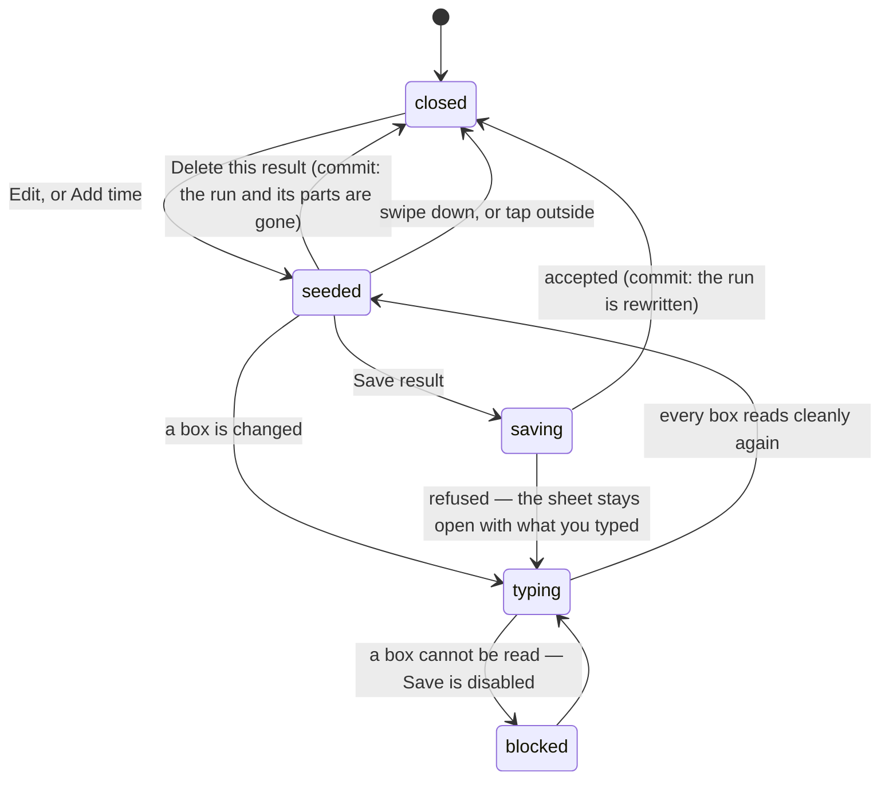

# Editing a result

## Summary

The stopwatch is tapped by a human holding a beer. Times get recorded late, a
split gets missed at the sled, a penalty gets argued down an hour after the fact,
and once a year somebody runs the whole course while the phone is on the wrong
screen. Editing a result is the way out of all of that: a sheet that slides up
from the bottom of [the console](getting-in.md), holds every number the run
consists of, and writes the corrected set back over the top.

The one thing to understand before touching it is that **the clock is
cumulative**. Each box holds how long one station took. Change one and every
station after it moves, and so does the total. That is not a quirk of the sheet;
it is what a split is. See
[splits and penalties](../foundations/time-and-the-clock.md#splits-and-penalties).

## The simple case

The Results panel lists every athlete on the roster in running order with their
official time beside them, and a button on each row: **Edit** where there is a
time, **Add time** where there is not. The panel's header counts the day —
"9/13 timed".

You tap Edit. The sheet comes up with the athlete's name, a Course time box
already filled in, one box per station, any penalties they took, and the official
time in a box of its own at the bottom. You retype the cornhole leg from `43.00`
to `38.00`. Every station below it drops five seconds, the running clock beside
each one follows, and the official time at the bottom drops five seconds too. You
tap Save result. The sheet closes, the board reorders, and their card re-tiers if
that changed anything.

The same sheet is reachable from the commissioner's bar on the Live page, under a
short list headed "Fix a result" holding everyone already timed.

## The interaction, event by event

### Arrive

The sheet re-reads the run from the league every time it is opened, so a
half-typed correction abandoned an hour ago can never overwrite a newer result.
It takes the athlete's _official_ run, falling back to their most recent one so a
run saved before official runs were marked is still editable.

Course time is seeded with the run's recorded time before penalties. Each station
box is seeded with that station's own leg — the gap from the previous station that
has a split — rather than the clock reading, because a commissioner thinks
"cornhole took 43 seconds", not "the clock read 58.57 when he left it". Penalties
come through as they were recorded, each with its station and reason.

Where the athlete has no run at all, the sheet opens empty and titled "Add
result" instead of "Edit result", and there is no delete button.

> Technical note: the boxes carry hundredths and the database carries
> milliseconds, so every seeded value is rounded onto the hundredth grid — the
> cumulative clock first, then the gaps taken from the rounded values. Rounding
> the gaps instead let each leg round up independently, and six of those added a
> hundredth to the total every time the sheet was opened.

### Leave without acting

Nothing is recorded. Opening the sheet, reading it and dismissing it writes
nothing, and re-opening it starts from the league again rather than from whatever
was left on screen.

### The tap that starts something

Save result, or Delete this result. Everything before that is arithmetic on the
phone.

Typing changes nothing on its own but does change what the sheet believes:

- **Typing in a station box** makes the sheet start deriving the course time from
  the legs. Until a station is touched, a saved run keeps its own recorded time,
  so opening a result and saving it untouched is lossless.
- **Typing in the course time box** stops that for good. Your number wins, and a
  small amber line appears reading "From splits: 1:38.20 — your typed time is
  being used instead" so the disagreement is visible rather than silent.
- **Clearing a station box** is how a split is deleted. Blank means "there is no
  split here", and it disappears on save.

A box the sheet cannot read turns red and the Save button greys out. Nothing is
guessed and nothing is silently treated as zero.

> Technical note: the boxes accept what people actually type on a phone —
> `1:23.45`, `83.45`, `83`, `1:23` — and also `1.23.45`, because the numeric
> keypad the station boxes open has no colon key. A seconds value without a
> colon may run past a minute: `138.25` is `2:18.25`.

### While it runs

One request. The button reads "Saving…" and both it and the delete control are
disabled. Nothing is optimistic — the sheet stays exactly as typed until the
league answers.

Deleting asks first, in a dialog that says the splits and penalties go with the
result.

### It settles

On success the sheet closes and the event's data is re-read, so the board, the
station rankings, the card backs and every tier that depended on this time all
follow within a moment on every device watching.

On failure the sheet stays open with everything still typed into it and a line of
red text under the official time saying what went wrong. Nothing is lost; the
same tap will try again.

The saved result replaces its splits and penalties wholesale rather than merging
them. The sheet always sends the complete intended set, so a station left blank
is gone and a penalty removed from the list is gone.

> Technical note: the official time is computed by the database as the course
> time plus the penalties, and is never written directly — fixing the parts fixes
> the total. Segment times are derived from the cumulative order rather than
> typed, so they always agree with what was entered. Every edit and every delete
> writes an audit row carrying the previous and new values.

## Modifiers

| Modifier                                                          | At arrival                                                                                                                                                                     | Changed during                                                                                                                                     |
| ----------------------------------------------------------------- | ------------------------------------------------------------------------------------------------------------------------------------------------------------------------------ | -------------------------------------------------------------------------------------------------------------------------------------------------- |
| Who you are (guest · member · account · commissioner)             | Commissioner only, with a token bound to this event. Nobody else sees the Results panel, and the write refuses a token naming a different combine even if the run id is right. | A token expiring mid-edit leaves the sheet open and typed; the save then fails and says so. Nothing typed is lost.                                 |
| The event's state (before the combine · running · finished)       | Before any run exists every row offers Add time. Stations are read live, so a station added since the run was timed appears as an empty box.                                   | A run finishing elsewhere while the sheet is open does not re-seed it — the sheet re-reads only on open. Saving then writes over the newer result. |
| Dust switched on or off                                           | No effect.                                                                                                                                                                     | No effect.                                                                                                                                         |
| The device (phone · desktop · reduced motion · presentation mode) | A bottom sheet capped at most of the screen and scrolled internally, with numeric keypads on every time box. On desktop it is the same sheet.                                  | No effect.                                                                                                                                         |

## Cancel and interrupt

| Event                                       | Before Save                                                                                                                                   | After Save                                                                                                                       |
| ------------------------------------------- | --------------------------------------------------------------------------------------------------------------------------------------------- | -------------------------------------------------------------------------------------------------------------------------------- |
| Back, or closing a sheet                    | The sheet closes and everything typed is discarded. Re-opening it seeds from the league again.                                                | Nothing to undo. The correction is a new set of numbers, and putting the old ones back means typing them.                        |
| Navigating away inside the app              | Same — the draft is discarded with the sheet.                                                                                                 | The result stands and every screen shows it.                                                                                     |
| Reload                                      | Everything typed is gone. Nothing was written.                                                                                                | The result stands.                                                                                                               |
| Backgrounded                                | The draft survives in the page as long as the page does. A phone that discards the tab loses it.                                              | No effect.                                                                                                                       |
| Network lost mid-request                    | Nothing typed is lost; the save fails and the sheet reports it.                                                                               | **The write may have landed.** The sheet reports a failure it did not hear an answer to, and re-opening it shows whether it did. |
| The request fails or times out              | The sheet stays open with a red line under the official time, and the same tap retries.                                                       | No effect.                                                                                                                       |
| The token expires or is cleared             | The save refuses. On the admin screen the whole console falls back to [the gate](getting-in.md) as soon as the token is noticed to have gone. | No effect.                                                                                                                       |
| Changed by someone else                     | The sheet does not re-seed while it is open, so an edit arriving over realtime is not reflected in the boxes. Saving overwrites it.           | An edit made elsewhere arrives live and replaces what you just wrote. Last write wins, with no warning either way.               |
| A second tab or device                      | Two sheets can hold two different drafts of the same run.                                                                                     | Whichever saves last is the result.                                                                                              |
| Reduced motion or presentation mode changes | No effect.                                                                                                                                    | No effect.                                                                                                                       |

The row worth dwelling on is **Changed by someone else**. The sheet's refusal to
re-seed while open is deliberate — retyping under a thumb mid-correction would be
worse — but it does mean two commissioners fixing the same result end up with one
of the two corrections and no sign the other happened.

## Interactions with other systems

**Who you have to be.** A commissioner, holding a token for this event. The write
runs with full database privileges and bypasses row-level security, so the guard
on the first line is the whole check — and it also refuses a run that does not
belong to the named event, because a run id alone proves nothing.

**Realtime.** A saved edit reaches every device over the event channel. The
leaderboard reorders, station rankings recompute, and any card whose tier
depended on the old time changes on everybody's phone.

**Offline and reconnection.** The arithmetic works offline; the save does not.
There is no queue — a failed save waits in the sheet for a second tap, and
closing the sheet throws the correction away.

**Optimistic updates and rollback.** None. The sheet shows what you typed, the
league shows what it holds, and they only agree after a successful save.

**The card economy.** Times decide tiers and tiers are public, so a correction
can take a champion tier off one card and put it on another, and both people see
it happen. It never touches a copy's edition, its owner, or its dust value.

**Motion and sound.** None. The sheet slides and nothing else, which is right for
a screen used to fix a mistake.

**Notifications and badges.** None. Nobody is told their time was changed.

**Sharing.** Nothing here is shareable. The corrected time flows into everything
that is — the board, a card exported as an image — through the ordinary path.

**The second device.** No coordination at all. See the interrupt table.

**Accessibility.** Every box is labelled with its station's name, the running
clock beside it is text, and an unreadable value is marked by a red border _and_
by the Save button going unavailable rather than by colour alone. The penalty
rows carry labelled controls for their station, their amount and their removal.

## Edge cases

- **The hundredths that read as "my edit did not save".** A commissioner typed
  `1:41.32`, saved, and the app printed `1:41.31` back at them. The time stored
  was right; the formatter was deriving hundredths from a fractional remainder
  that lands a hair under. It is computed with whole numbers now, and the case is
  pinned by a test. See
  [the format](../foundations/time-and-the-clock.md#the-format).
- **Displayed times never round up.** Hundredths are truncated, so a shown time
  is never faster than the recorded one. The edit sheet is the exception: its
  boxes round onto the nearest hundredth, because truncating there would shave a
  hundredth off every leg each time a result was opened and saved untouched.
- **A course time that disagrees with the legs** is allowed and kept. The amber
  line names the derived figure; your number is what is stored.
- **Blanking every station** leaves a run with a course time and no splits. It
  saves, and the athlete simply has no station rankings.
- **Deleting a result** returns the athlete to the queue only if it was their
  last run. With an earlier attempt still on file they stay finished, and the
  earlier attempt becomes what the board shows.
- **Adding a time for somebody the clock missed** back-dates the run to end
  "just now": the start is the entered time before the present moment. It sorts
  sensibly against the timed runs without pretending to know when it happened.
- **An athlete with several attempts** shows a small "(2 attempts)" beside their
  name in the Results panel, and the sheet edits the official one.
- **A scratched athlete** is not listed in the Results panel at all, so their run
  cannot be edited without putting them back in the field first — see
  [the roster](the-roster.md).
- **A penalty box left empty** turns red and blocks the save. Removing the row is
  the way to delete a penalty, not clearing its amount.

## Open questions and verification

- Whether a save that the phone never got an answer to actually landed has not
  been tested against a real dropped connection. The write is not idempotent in
  the way a run save is, but it is a whole-set replacement, so a repeat of the
  same correction should be harmless.
- The claim that two commissioners editing the same result silently overwrite
  each other was read from the write path and the sheet's seeding rule; it has
  not been staged on two devices.
- Whether a station added to the course _after_ a run was timed appears in the
  sheet as an empty box was inferred from the station list being read live rather
  than from the run.
- Assumption: nothing else writes `raw_time_ms` or `penalty_ms` for an existing
  run. Confirmed by reading every handler at this commit.

Verified against willyoubemyhero commit `b46f330`.
