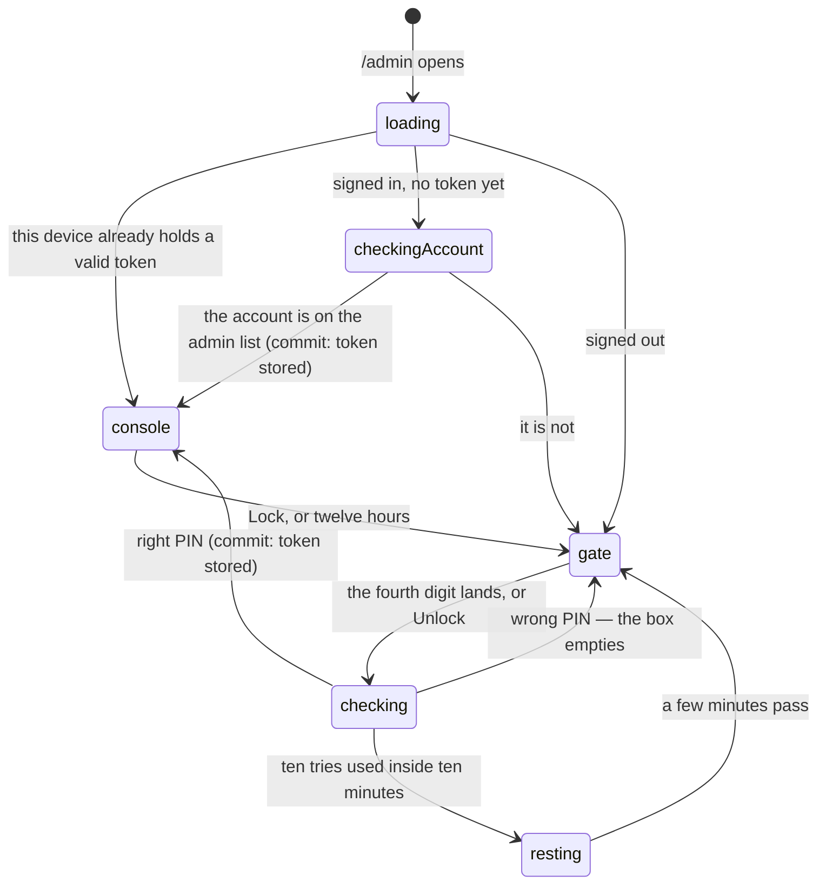

# Getting in

## Summary

The commissioner's console is one screen behind one gate, and the gate has two
doors. The first is a four-digit event PIN typed on the phone that is about to
run the clock. The second opens on its own: an account that is on the admin list
walks straight through without typing anything. Either door hands the device an
_admin token_ good for twelve hours and bound to one event, and everything the
console can do follows from holding it.

This document owns the gate. The token itself — its lifetime, its shape, and why
it is the only thing between a request and the database — belongs to
[identity and sessions](../foundations/identity-and-sessions.md).

## The simple case

You are signed in on your own phone, you open the account menu, and you tap
Admin. The screen says "Checking access…" for a moment, a toast reads "Admin
unlocked via your account", and the timing console is there. You typed nothing.

Somebody else's phone is the more common case at a party. They open the same
screen, get a card headed "Admin Access" with a single four-digit box, and you
lean over and type the PIN. The fourth digit submits it — there is no need to
find the Unlock button — and the console replaces the gate in place. Nothing
navigates; the same URL is now a different screen.

Twelve hours later that phone is a spectator again.

## The interaction, event by event

### Arrive

Three things are read before anything is drawn, and they decide which of three
screens you get.

The active event is fetched first. Until it lands the page says "Loading…" and
neither door is offered, because both are about a specific combine and there is
nothing yet to be admin _of_.

The device's stored admin token is read next, and checked on the phone for shape
and expiry. A token that is malformed or out of date is not merely ignored — it
is deleted on the spot, so a stale one cannot be retried forever. It also has to
name the event that is currently active: a token for a different combine is kept
but does nothing, and the screen reads as locked.

If there is no usable token and the browser is signed in to an account, the
account door is tried automatically, once, without being asked. The screen says
"Checking access…" while that happens. Signed out, that step is skipped and the
PIN card is drawn immediately.

> Technical note: the account attempt is latched per account id for the life of
> the page, so a re-render cannot fire a second request. The identity comes from
> the verified bearer on the request, never from anything the page sends, and
> what comes back is an ordinary admin token — the guards on every write are
> untouched by which door you came through.

### Leave without acting

Nothing is recorded. Opening the gate and backing out of it writes nothing and
tells nobody. The one thing that carries across a departure is an attempt you
already made: the limiter counts PIN guesses, and closing the screen does not
give them back.

### The tap that starts something

The PIN box takes digits only — anything else is dropped as you type — and caps
at four. The fourth digit submits the form by itself. On a phone held in one
hand while somebody else is mid-run, a submit button that has to be found is a
button that gets missed.

Ten attempts per event per ten minutes. The count is keyed to the _event_, not
to the phone doing the guessing, so a stranger hammering the gate closes the gate
for everybody rather than learning anything about it. The attempt is counted
before the PIN is compared, so a guess that never gets an answer still counts.

The account door has no such tap at all. It fires on arrival, and if it refuses
it does so silently and drops you at the PIN card with no explanation, because
"you are not an admin" is not news an ordinary member needs delivered.

### While it runs

One request, one spinner. The Unlock button reads "Checking…" and is disabled,
and the box stops accepting the next digit. Nothing is optimistic: the console is
not drawn until a signed token is actually in hand.

### It settles

A correct PIN stores the token, raises a toast reading "Admin unlocked", and
swaps the gate for the console. It also wipes the attempt counter, so a
commissioner's own fumbles across a long afternoon never accumulate into a
lockout.

A wrong PIN raises "Incorrect PIN" and empties the box for the next try. An event
the server cannot find says exactly the same thing, so the gate cannot be used to
find out which combines exist.

A locked gate says something different on purpose: "Too many tries — the gate is
resting. Give it a few minutes." During a lockout even the _right_ PIN bounces,
and a message reading "incorrect" would send the commissioner hunting for a PIN
they are already holding.

The Lock button in the console's header is the way back out. It clears the token
and throws away everything the device had cached, so the next screen is drawn
from scratch as a spectator's.

## Modifiers

| Modifier                                                          | At arrival                                                                                                                                                                                                                                                                          | Changed during                                                                                                                                                                         |
| ----------------------------------------------------------------- | ----------------------------------------------------------------------------------------------------------------------------------------------------------------------------------------------------------------------------------------------------------------------------------- | -------------------------------------------------------------------------------------------------------------------------------------------------------------------------------------- |
| Who you are (guest · member · account · commissioner)             | Guests and members get the PIN card; nothing about the gate reads their token. An account holder gets the account door tried for them first, and passes through it only if that account is on the admin list. A device already holding a valid admin token skips the gate entirely. | An account arriving while the gate is on screen — signed in here or in another tab — is noticed, and the account door is tried at that moment. Claiming a player changes nothing here. |
| The event's state (before the combine · running · finished)       | No effect on the gate. There has to _be_ an active event: with none, the screen never gets past "Loading…".                                                                                                                                                                         | An event ending does not close the console. A _different_ combine becoming active does: the token names one event, and the screen falls back to the PIN card.                          |
| Dust switched on or off                                           | No effect. The switch is something the console holds, not something that guards it.                                                                                                                                                                                                 | No effect.                                                                                                                                                                             |
| The device (phone · desktop · reduced motion · presentation mode) | The box opens the numeric keypad and masks what is typed, so a PIN read over a shoulder is four dots. On desktop the same card is centred and narrow.                                                                                                                               | No effect. Nothing about the gate animates.                                                                                                                                            |

The only modifier with real force is the first, and its shape is deliberate: the
PIN is what a phone that has never seen this app before uses, and the account is
what the person who runs the combine every year uses.

## Cancel and interrupt

| Event                                       | Before the token is stored                                                                                                                                                         | After it is stored                                                                                                                                                                                             |
| ------------------------------------------- | ---------------------------------------------------------------------------------------------------------------------------------------------------------------------------------- | -------------------------------------------------------------------------------------------------------------------------------------------------------------------------------------------------------------- |
| Back, or closing a sheet                    | The gate closes and nothing is stored. Attempts already spent stay spent.                                                                                                          | No effect. The token is on the device, not on the screen.                                                                                                                                                      |
| Navigating away inside the app              | Same: nothing stored, the count stands.                                                                                                                                            | The console is still unlocked when you come back, and every other screen already knows — the commissioner's controls appear on the Live page too.                                                              |
| Reload                                      | Nothing stored, nothing typed survives.                                                                                                                                            | The token survives; it lives in the browser's storage. The console draws straight away with no gate in between.                                                                                                |
| Backgrounded                                | An in-flight check may fail and need retyping.                                                                                                                                     | No effect while it is away. The twelve hours are wall-clock, so they pass with the phone in a pocket.                                                                                                          |
| Network lost mid-request                    | No token. The attempt may or may not have been counted — the counter is bumped before the PIN is compared.                                                                         | No effect on the token. Every write it guards fails until the connection is back.                                                                                                                              |
| The request fails or times out              | The card says "Could not verify PIN" and the box is left as it was. A limiter that is itself broken lets the attempt through rather than locking the party out of its own console. | No effect.                                                                                                                                                                                                     |
| The token expires or is cleared             | Not applicable.                                                                                                                                                                    | The console re-checks itself every minute, so a session that goes cold while nobody is touching the phone replaces itself with the PIN card without a reload. The Lock button does the same thing immediately. |
| Changed by someone else                     | Another commissioner unlocking their own phone changes nothing here; a token is per-device. Rotating the PIN takes effect on the next attempt.                                     | An admin token already issued keeps working until it expires, even if the PIN behind it has been changed.                                                                                                      |
| A second tab or device                      | Both tabs show the gate. Attempts from both count against the same ten.                                                                                                            | A token stored in one tab is picked up by the others on the same phone within moments. A second _device_ shares nothing and must unlock for itself.                                                            |
| Reduced motion or presentation mode changes | No effect.                                                                                                                                                                         | No effect.                                                                                                                                                                                                     |

Nothing here is ever half-done. The token is written whole or not at all, and
every state the gate can be in is legible from the screen: a box, a spinner, or
the console.

## Interactions with other systems

**Who you have to be.** Nobody, to reach the gate — it is a public URL, linked
from the account menu for anyone signed in and from a small row at the bottom of
[the League hub](../foundations/navigation-and-screens.md#the-league-hub) for
everyone else. It sits in the account menu rather than the bottom bar precisely
because it is PIN-gated: the worst a curious member finds is a prompt. Past the
gate, every write in the console runs with full database privileges and bypasses
row-level security, and the guard on the first line of each handler is the only
thing between a request and the database. That guard also checks the _event_: an
admin token names one combine, and a write that names a different one is refused
however valid the signature is.

**Realtime.** None. Unlocking is not broadcast, and no other device learns that a
console came online.

**Offline and reconnection.** Both doors need the network. A device already
holding a token reads as a commissioner offline — the console draws, the buttons
are there — and only discovers the problem when a write fails.

**Optimistic updates and rollback.** None. No screen behaves as though the PIN
was right until the server says it was, and there is nothing to roll back.

**The card economy.** The console is where the dust switch lives, so getting in
is upstream of every economy control; see
[dust and ownership](dust-and-ownership.md). Holding an admin token grants no
cards and no dust of its own.

**Motion and sound.** Neither door animates. A toast is the entire ceremony,
which is right for something typed twice a year.

**Notifications and badges.** Nothing on the nav marks a console as unlocked, and
nothing warns that a session is about to expire.

**Sharing.** No token is ever put in a URL, and the console is marked not to be
indexed. A link to it shared into a group chat opens the gate for whoever taps
it, which is the intended outcome.

**The second device.** A commissioner running the clock from one phone and
checking results on another unlocks both. The two consoles do not coordinate; see
[running the clock](running-the-clock.md#cancel-and-interrupt) for what that
means for a run in progress.

**Accessibility.** The gate is a labelled form with one field and one button. The
field is masked and announces itself as the event PIN, the failure arrives as a
toast rather than a silent field colour, and the console's own header carries the
Lock control rather than hiding it in a menu.

## Edge cases

- **A PIN typed with a leading space** fails. Unlike a member code, which is read
  off paper and compared case- and whitespace-insensitively, the PIN is compared
  exactly.
- **A four-digit PIN is not enforced.** The server accepts anything from one to
  thirty-two characters; the box on screen is what limits it to four digits. The
  ten-per-ten-minutes limiter is what makes a four-digit secret defensible.
- **The token names the event the server chose, not the one the phone asked
  about.** The PIN door signs whatever event the secret belongs to; the account
  door signs the currently active one. In the ordinary case these are the same
  event and the difference is invisible.
- **A lockout does not close the account door.** This is deliberate and stated in
  the code: a commissioner locked out of their own party by a limiter is a worse
  evening than ten extra guesses.
- **An account on the admin list with no active event** gets no token and falls
  through to the PIN card, which cannot help either.
- **Signing out of the account does not lock the console.** The admin token is a
  separate thing on the same device and keeps its twelve hours.
- **Thirteen people passing one phone around** all hold the same console. There
  is no per-person admin identity, and nothing recorded on a write says which
  human tapped it — the audit trail says "admin".

## Open questions and verification

- The per-minute expiry re-check was read from the session code and its unit
  test. That a console visibly reverts to the PIN card at the twelve-hour mark
  without a reload has not been watched.
- Whether the account door retries after a sign-in performed on the gate itself,
  without leaving and returning, was read as "no" from the once-per-account latch
  but not confirmed by hand.
- The lockout message has not been seen in a real browser; producing it takes ten
  wrong guesses inside ten minutes against a live event.
- Assumption: no screen other than `/admin` and the commissioner's bar on the
  Live page reads the admin token to decide what to draw. This was checked by
  reading every consumer at this commit.

Verified against willyoubemyhero commit `b46f330`.
