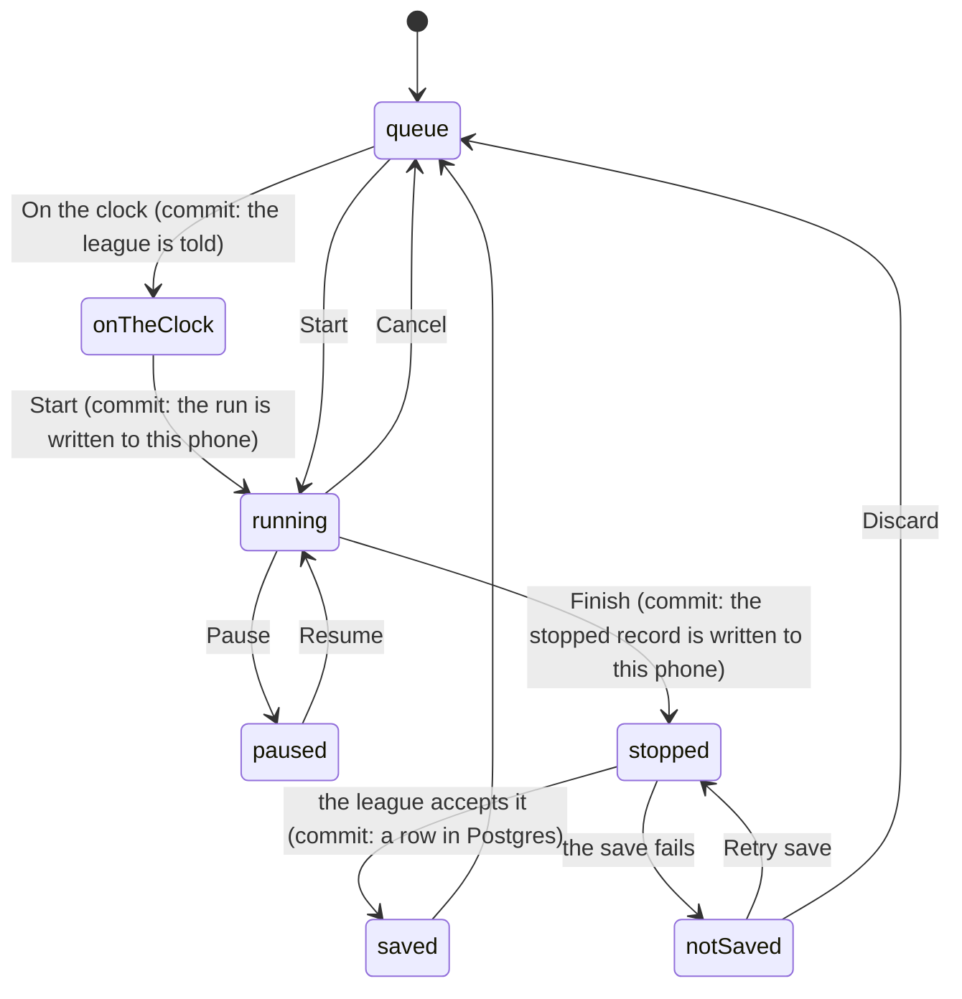

# Running the clock

## Summary

One athlete at a time steps up, the commissioner taps Start, taps once at each
station, and taps Finish. That sequence is the whole combine, and it is done on a
phone, outdoors, by somebody who is also refereeing. The console is shaped by
that: the buttons are large, the clock is enormous, and the run is written to the
phone at every step so that reloading it or losing signal mid-race cannot take
the time away.

The console lives on [the admin screen](getting-in.md), and a stripped-down copy
of it is docked under the crowd's clock on the Live page so the commissioner can
time a run from the same screen everyone else is watching. Both drive the same
single run. What the numbers _mean_ — official time, splits, penalties, the two
clocks — belongs to
[time and the clock](../foundations/time-and-the-clock.md).

## The simple case

The console opens on a card headed "Send next athlete": a strip saying who is up
next, a list of everyone still in the queue in running order, and a Start Timer
button. Whoever is next is already selected.

You tap "On the clock" as the athlete walks up, which lights them on the
spectator screens. You tap Start Timer. The card is replaced by the run: their
photo, their name, the word RUNNING, and a clock filling half the screen.

They clear the first obstacle, you tap that station's tile and it fills in with
the time on the clock. Same at the next. Somebody knocks a cone over and you tap
the `+5.00 pen` chip under that station. At the line you tap Finish: the clock
freezes, a toast says "Run saved", and the console is back to "Send next athlete"
with the next person already selected. On the crowd screens their name lands on
the board, confetti goes off, and their card upgrades itself if the time was good
enough.

## The interaction, event by event

### Arrive

The console reads the event's roster in running order and its active stations
from the league, and the one active run, if there is one, from the phone.

If a run is found the console comes up mid-race, with the clock redrawn from the
run's stored start instant and already moving. There is no "resume" prompt,
because a prompt is a thing to tap while somebody is running.

With no run stored the queue is drawn instead — everyone neither finished nor
scratched — with the first of them preselected, so the common case is one tap.

> Technical note: there is exactly one active run per device, held in the
> browser's own database with a copy in simple storage as a fallback. Both the
> full console and the Live page's bar read and write that same record, so a run
> started on one can be finished on the other.

### Leave without acting

Almost nothing. Opening the console, scrolling the queue and leaving records
nothing at all.

The exception is the strip at the top. Putting somebody **on the clock** is a
real write: it tells the league that this person is up, stamps the moment they
stepped up, and starts the crowd's unofficial clock on every spectator screen.
Clearing it is another. Neither starts the timer, and neither produces a run.

### The tap that starts something

Start. At that instant the run is stamped with a wall-clock moment, given an
identifier of its own, and written to the phone _before_ anything is sent
anywhere. Only then does the league get told the athlete is running, and if that
message fails it is dropped without comment — the run is what matters, and it is
already safe.

> Technical note: the clock is anchored on wall-clock time rather than a browser
> timer that counts from page load. An earlier version used the latter, and a
> phone that reloaded mid-run read `00.00` and then recorded that as the official
> time. The trade is explicit: a clock step during a forty-second run would skew
> it, which is rare, against a reload in a garden, which is not.

An athlete already on the clock keeps the moment they were given. Starting them
does not re-stamp it, so the crowd's clock does not jump forward to the Start tap
and lose the beat where they actually stepped up.

### While it runs

The clock counts in hundredths, redrawn every frame, and it is the largest thing
on the screen by a wide margin.

**A split** is one tap on a station tile. The tile fills with the clock reading
at that moment and then refuses further taps — a station can be split once. Undo
split removes the most recent one and only the most recent one.

**A penalty** is the chip under a station, which appears only for stations that
carry an amount, and adds that amount with the station's name as the reason. Each
tap adds another. They stack up in a list under the stations, and they are _not_
added to the clock on screen: the clock shows the course time, and the penalty is
added when the run is totalled.

**Pause** freezes the clock, turns it amber and disables every station tile;
Resume starts it again. A pause is stored as the pair of instants that bound it
rather than as a running total, so it survives the page that opened it.

**Cancel** throws the run away and puts the athlete back in the queue — a plain
button on the console, "Reset timer" behind a confirmation on the Live bar.
Nothing had reached the league, so nothing is undone.

Every one of these is written to the phone as it happens. There is no network in
the loop at all until the run ends.

### It settles

Finish stamps the finish moment, writes the stopped record to the phone, and then
sends it. Those are three steps in that order, and the order is the whole design.

If the league accepts it: a toast reads "Run saved", the local record is deleted,
the athlete is marked finished, the crowd's clock is cleared, and the console
returns to the queue. Everybody watching sees the board reorder and the finish
celebration play.

If it does not: the header reads "Finished — not saved", and the console says why
in words that can be acted on standing in a garden — an expired admin session
says so by name rather than being folded into "could not reach the server" — and
adds "The run is safe on this phone — retry once you have signal." Two buttons
follow. **Retry save** re-sends the identical record, not a fresh reading of a
clock that has moved on. **Discard** is behind a dialog that names the athlete and
their time and warns there is no undo, because nobody runs the course twice.

> Technical note: the save is keyed on the run's own identifier, so a retry after
> a save that actually landed rewrites the same row instead of creating a second
> one, and the attempt number it was first given is preserved. A double-tap on
> Finish is blocked outright rather than being allowed to stamp two different
> finish times.

## Modifiers

| Modifier                                                          | At arrival                                                                                                                                                                                                                       | Changed during                                                                                                                                                        |
| ----------------------------------------------------------------- | -------------------------------------------------------------------------------------------------------------------------------------------------------------------------------------------------------------------------------- | --------------------------------------------------------------------------------------------------------------------------------------------------------------------- |
| Who you are (guest · member · account · commissioner)             | Only a commissioner sees any of this. Without a valid admin token for the active event the admin screen shows [the gate](getting-in.md) and the Live page's timing bar renders nothing at all — not a disabled version, nothing. | A token expiring mid-run does not stop the clock: timing is local. It stops the _save_, which then reports the expiry by name and waits for a retry.                  |
| The event's state (before the combine · running · finished)       | An empty roster shows "No athletes left in the queue" and Start is disabled. With no stations set up there is nothing to split against, and a run is still perfectly timeable.                                                   | Somebody added to the roster mid-combine appears at the end of the queue. An athlete scratched while on the clock leaves the queue but the run in progress continues. |
| Dust switched on or off                                           | No effect.                                                                                                                                                                                                                       | No effect.                                                                                                                                                            |
| The device (phone · desktop · reduced motion · presentation mode) | Phone-first throughout: the controls are thumb-sized, the console's panels collapse, and the clock is sized for arm's length. On desktop the panels are always open.                                                             | Reduced motion does not slow the clock — it is a number, not an animation — but it silences the finish celebration on the crowd screens.                              |

## Cancel and interrupt

| Event                                       | Before Start                                                                                                     | After Start                                                                                                                                                                                                                                                                                    |
| ------------------------------------------- | ---------------------------------------------------------------------------------------------------------------- | ---------------------------------------------------------------------------------------------------------------------------------------------------------------------------------------------------------------------------------------------------------------------------------------------- |
| Back, or closing a sheet                    | Nothing to cancel.                                                                                               | Nothing is cancelled. The run is on the phone and the console picks it up again on return.                                                                                                                                                                                                     |
| Navigating away inside the app              | The queue selection is forgotten; nothing else.                                                                  | The run continues. Moving between the admin screen and the Live page hands the same run between the two consoles.                                                                                                                                                                              |
| Reload                                      | Nothing lost — the queue is rebuilt from the league.                                                             | **The run survives and the clock is correct.** It is recomputed from the stored wall-clock anchor, so a phone that reloads mid-race resumes at the right number rather than at zero. A run stopped but not yet saved comes back stopped, with its Retry button.                                |
| Backgrounded                                | No effect.                                                                                                       | **The clock keeps time.** Elapsed time is recomputed from the anchor rather than accumulated by a timer, so a screen that locked for two minutes comes back reading two minutes further on. Splits taken during that window are impossible, which is a limit of the human rather than the app. |
| Network lost mid-request                    | Putting somebody on the clock fails and the strip reports it; nothing else needs the network.                    | Timing is unaffected. Finish fails, the console says the run is safe on this phone, and Retry is there for when signal comes back.                                                                                                                                                             |
| The request fails or times out              | "On the clock" reports the reason and the strip stays as it was.                                                 | The run stays stopped and unsaved with its reason on screen. Retry re-sends the same record. Discard is the only other way out. Note that the status write _at Start_ is dropped silently, so a failure there leaves the crowd's clock stopped while the run is real.                          |
| The token expires or is cleared             | The console is replaced by the gate. Anything already stored on the phone is untouched.                          | The clock keeps running, because it is local. The save refuses with "Your admin session expired — re-enter the PIN on the Admin tab, then retry", and the run waits.                                                                                                                           |
| Changed by someone else                     | The queue redraws as statuses arrive. Somebody else putting a different athlete on the clock replaces the strip. | Another commissioner saving a run for the same athlete does not disturb this one; the two runs are separate rows. A combine reset elsewhere wipes this phone's run too, and the console drops it rather than keep timing something that no longer exists.                                      |
| A second tab or device                      | Both show the same queue.                                                                                        | **The run belongs to the device that started it.** A second phone shows no run and would happily start its own for the same athlete. Two consoles timing one athlete is not prevented, and the last save wins.                                                                                 |
| Reduced motion or presentation mode changes | No effect.                                                                                                       | No effect on timing. The crowd's finish celebration is what changes.                                                                                                                                                                                                                           |

The two rows that carry the design are Reload and Backgrounded. A phone in a
garden reloads, gets locked, gets answered, gets put in a pocket, and the entire
shape of the stored run — a wall-clock anchor, pauses as pairs of instants, a
write after every tap — exists so that none of that costs a time.

## Interactions with other systems

**Who you have to be.** A commissioner, with a token bound to this event. Every
write behind these buttons runs with full database privileges and bypasses
row-level security, so the guard on the first line of each handler is the only
check there is — and it refuses a token that names a different combine.

**Realtime.** The save reaches every device watching over the event channel: the
board reorders, cards re-tier, the finish celebration fires. The run _in
progress_ is not broadcast. What spectators see mid-run is the crowd's unofficial
clock counting from the moment the athlete was put on the clock; only the
commissioner's own Live view swaps that for the real run.

**Offline and reconnection.** Timing is entirely offline. Only three things need
the network: putting somebody on the clock, saving, and cancelling. A whole run
can be timed on a dead connection and saved an hour later, unchanged.

**Optimistic updates and rollback.** The console treats its local record as the
truth for the whole run and reconciles only at the save. There is no rollback,
because nothing was claimed early: a run that fails to save was never shown as
saved.

**The card economy.** A saved run is what earns a tier, and a tier changes how a
card looks to everybody the moment it lands — see
[the card](../foundations/the-card.md#what-a-tier-is). It never touches what a
copy is worth; that is the edition's business, and no roster card is dealt by
finishing a run.

**Motion and sound.** The clock is redrawn every frame and the finished card
glows. The celebration belongs to the crowd screens, not the console, and it is
skipped for anyone who has asked for reduced motion; see
[motion and sound](../cross-cutting/motion-and-sound.md).

**Notifications and badges.** None. Nothing on the nav says a run is in progress,
and nothing warns that a run is sitting unsaved on the phone.

**Sharing.** Nothing about the console is shareable. The QR code in the console's
own setup panel points spectators at the Live page, not here.

**The second device.** One run, one device. A commissioner with two phones has
two independent consoles and can start two runs; nothing reconciles them.

**Accessibility.** Every control is a real button with a text label, sized for a
thumb — pause and finish are full-height on a phone. The clock is plain text,
large by design rather than by preference, and a station tile already split is
disabled rather than silently inert.

## Edge cases

- **Starting with nobody selected** is not possible; the button is disabled until
  somebody is picked, and the queue preselects whoever is next.
- **A run for an athlete who is then scratched** continues and saves, and the
  save marks them finished. The last write wins.
- **Splits out of order.** Stations can be tapped in any order; a segment is
  measured from the largest cumulative time recorded so far rather than from the
  station above it, so tapping three before two cannot produce a negative leg.
- **Pausing and finishing.** A pause left open at Finish closes at the finish
  moment. Penalties can be added while paused, but not after Finish.
- **A stored run from a previous combine** is cleared unconditionally by Cancel.
  A run left behind by an event that no longer exists used to be unclearable,
  because the status write bailed out before the wipe.
- **Reset combine** wipes every run for the event, returns everyone to the queue
  and clears the timer on this phone in the same tap. Without that last step the
  server was clean and the phone kept timing the old athlete, which read as "the
  reset did not take".
- **A device whose clock is wrong** records a wrong official time and nothing
  detects it. The crowd's clock floors at zero rather than running backwards; the
  official time has no such protection.
- **An athlete already finished** does not appear in the queue. Re-timing them
  means clearing their result first — from the Live bar's Reset control, or by
  deleting it in [editing a result](editing-a-result.md).

## Open questions and verification

- That a reload mid-run resumes at the correct time is the most safety-critical
  claim in this document. It is pinned by unit tests over the stored record and
  its migration, but it has not been performed on a real phone mid-run, and it
  should be before a real combine.
- The behaviour when two consoles time the same athlete and both save was read
  from the write path rather than observed. Two separate runs should result, with
  the faster one taking the tier, but this has not been watched.
- Assumption: the timing console and [editing a result](editing-a-result.md) are
  the only writers of an official time. Whether an edit made while a run for the
  same athlete is still in progress on somebody's phone can produce a conflict
  was not investigated.

Verified against willyoubemyhero commit `b46f330`.
