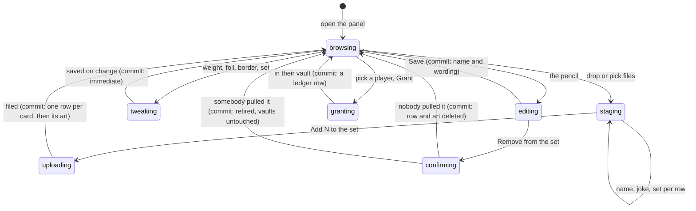

# Secret cards and their sets

## Summary

*Secret cards* are the admin-curated art that is not a person on the roster: the
fourth slot in every pack, the one shelf in the vault that never sorts against
the combine. This panel is where they are made. It is the only screen in the app
that sees the whole catalogue at once, and it is the only place a *set* — the
named collection a secret is filed into — can be created, renamed, coloured,
reordered, hidden or deleted.

Two rules shape everything here. These rows belong to the **league**, not to a
combine: nothing on this panel takes an event id, and a card uploaded this year
keeps turning up in packs next year. And **retiring a card removes it from future
pulls and never from anybody's vault** — you pulled it, you keep it. The panel
says so before it does it, and the database enforces it whatever the panel
intended.

What a secret card *is* — its look, its prism edge, the level rolled per copy —
belongs to [the card](../foundations/the-card.md#what-a-secret-card-is); how one
arrives in a pack belongs to [the daily secret](../cards/the-daily-secret.md).

## The simple case

You unlock the console and Secret Cards is the first panel on it, already open,
saying how many cards are in the set and reminding you that they belong to the
league rather than to this combine.

You drop twelve images on the dashed box. Each filename becomes a card name —
`gary-the-grill.webp` arrives as "Gary The Grill" — and each lands as a staged row
with a preview, an editable name, an empty wording line and a set picker already
set to whatever you chose in "Add to". You type twelve one-line jokes, tap "Add 12
to the set", and they are uploaded and filed.

Below that, the cards are grouped into collapsible sections, one per set, in the
order you arranged them, with the unsorted pile last. Open one and a "Whole set"
row sits at the top: pick a foil there and every card in the set wears it in one
write. Each card underneath carries its own foil strip, border strip, pull weight,
set picker and a "Grant to…" control. The pencil opens a sheet with room to type:
replace the art, fix the name, rewrite the joke, and — at the bottom, in red —
"Remove from the set".

## The interaction, event by event

### Arrive

One request fetches the whole catalogue: every card with a signed URL for its
art, every set including hidden ones, how many people have claimed a member code,
and how many hold each card. It is cached for half an hour and does not refetch
on focus, because nothing else in the app writes these rows.

Two numbers are computed on arrival, both admin-only:

- **"Pulled by N of M"** under every card — how many people hold it, against how
  many have claimed a code. Guests count in the first number, not the second.
- **Whether the set is exhausted.** When everyone who could pull has pulled
  everything pullable, an amber line says so and names the total — otherwise the
  commissioner has no way to know the daily drop has gone quiet and turned into
  nothing but duplicates.

> Technical note: that total is the one place in the app a secret-set size is
> printed, and it is behind the admin guard on a response marked `no-store`. No
> player-facing screen or response carries a count — see
> [the daily secret](../cards/the-daily-secret.md#the-one-number-that-is-withheld).
> A card's art is stored under its own id rather than its name, because a signed
> URL carries its path in plaintext and `secrets/07-the-dog.webp` would hand
> anyone who pulled one card both the joke and the shape of the set.

Sets are folded away by default; most visits are about cards. Sections start
collapsed too, tracked as "what is open" rather than "what is closed", so a set
created after the panel mounted is closed like the rest rather than springing
open.

### Leave without acting

Nothing is recorded. Staged files stay in the browser until you tap the button;
closing the panel, navigating away or reloading discards them, and their previews
are released rather than leaked.

### The tap that starts something

The panel has an unusual number of first writes, because most of its controls save
the moment you touch them rather than behind a Save button.

- **"Add N to the set."** Each image is downscaled and re-encoded in your browser
  first — 1600px on the long edge, WebP where the browser can — and the batch goes
  as one request of up to forty cards, each card's row inserted before its art.
- **A foil or a border chip.** Picking one *is* the intent, so it saves on
  change. Arrow keys walk the strip and fire a save per step; the saves are
  chained per card so the row settles on the last key you pressed rather than on
  whichever response arrived last. The strips stay enabled while a save is in
  flight — disabling a focused radio hands focus back to the page and costs a
  keyboard user their place.
- **A whole-set look.** One write for every card in the set, not a loop of twelve.
  A set whose cards disagree shows "Mixed" with nothing ticked: a real state you
  can select *from* but never *to*.
- **The weight field.** Saves on blur or Enter. A whole number from 0 to 10,000,
  where 100 is the baseline and 0 takes the card out of the draw without retiring
  it; empty resets it to 100.
- **A set's name field.** Saves on blur too. The set's id was derived from its
  first name and never changes, so a rename is only ever a label change and every
  card filed under it follows.
- **Grant.** Hands the chosen participant that card, marked as a grant, so it
  neither collides with nor spends their once-a-day pull.
- **Remove from the set.** A confirm box that states the rule out loud: "Anyone
  who already pulled it keeps it in their vault."

### While it runs

Spinners are per row, not per panel, so one card saving never freezes its
neighbours: a grant, a weight and a look each show their own, and a whole-set
look shows one on the set header. Toasts carry a stable id per card and per set,
so arrowing across twenty-two foils replaces one toast rather than stacking
twenty-two.

An upload batch is the one blocking operation: the drop zone dims, the button
reads "Uploading…", and twelve full-size images are re-encoded before anything is
sent.

### It settles

The catalogue is re-read after every write, so the panel always redraws from the
server rather than from what it hoped it wrote.

Uploads report per card: all twelve landing says "12 added to the set", any that
failed says how many. Because each row is inserted before its art, a card whose
upload failed survives as a row with **no art**, flagged "No art · not in packs",
invisible to the daily pull until you replace it — the safe direction to fail,
since an artless card must never burn somebody's once-a-day pull on a blank.

Removing settles two ways and the toast says which. If **nobody has pulled it**,
the row and its art file are both deleted: "Removed from the set." If **somebody
has**, the card is retired instead — dropped from every future pull, kept in
every vault that holds it: "Retired — it stays in the vaults of whoever pulled
it." The database refuses to delete a card with a ledger row behind it whatever
this screen intends, so the record of what people actually found cannot be edited
away.

A grant settles with one of three toasts: granted, "already had it — logged as a
duplicate", or "that finished *Pets* for them". The last is the commissioner's
copy of a ceremony they cannot see: the recipient is somewhere else in the garden
holding their own phone, and finds out there.

## Modifiers

| Modifier | At arrival | Changed during |
| --- | --- | --- |
| Who you are (guest · member · account · commissioner) | Commissioner only, and the gate is the whole console: a member who opens `/admin` gets the PIN screen, never a catalogue they cannot edit. This matters more here than anywhere else — the panel *is* the set, and the set is the one thing the app withholds. | Losing the admin token reverts the page to the PIN gate with any sheet open at the time. Nothing partially authored is kept. |
| The event's state (before the combine · running · finished) | Irrelevant to the content — secrets are league-wide and carry no event. But an **active event must exist**: authoring is authorized against the current combine's admin token, so out of season nobody can edit the set at all. | No effect. A card granted during a combine stamps that event for flavour only. |
| Dust switched on or off | No effect on authoring. It decides what a spare secret is worth when somebody sells it; see [milling and selling](../dust/milling-and-selling.md). | No effect. A *granted* duplicate credits nothing either way — unlike a pulled duplicate, which pays out when dust is on. |
| The device (phone · desktop · reduced motion · presentation mode) | On a phone the drop box is a "Browse files" button, since there is nothing to drag from; the foil and border strips render as swatch chips at every width, because a native picker is a list of names and "Nebula" is not a colour until you have seen it. | Border previews animate only on the row you are touching. A grid of permanently animating prism rings is the exact cost the card styles are written to avoid. |

## Cancel and interrupt

| Event | Before the first write | After it |
| --- | --- | --- |
| Back, or closing a sheet | Staged files, typed names and typed jokes are discarded whole. Closing the edit sheet with Cancel abandons the name and wording; the foil, border and set pickers inside it have already saved. | Nothing to undo. A retired card can only be un-retired outside this screen, and a deleted one is gone with its art. |
| Navigating away inside the app | Staging is lost. Nothing is recorded. | Writes already sent stand. An upload batch in flight keeps going. |
| Reload | Everything staged is lost, previews included. | The catalogue is re-read; every saved change is there. |
| Backgrounded | No effect. | An in-flight upload continues; the toast may be missed and the panel still redraws correctly on the next read. |
| Network lost mid-request | Nothing was sent. | An upload batch may have landed partly: rows for the cards it reached, art for fewer. The panel re-reads and shows exactly what survived, flagged "No art" where it did not. |
| The request fails or times out | Not applicable. | A red toast with the server's words. Look, weight and set edits leave the old value on screen, because none of them is optimistic. |
| The token expires or is cleared | For up to a minute after a 12-hour session ends the panel still looks live — the page re-checks the token once a minute — and the first tap in that window produces "Admin PIN required". | An upload batch that expires part-way is the worst case: cards already inserted stay, the rest fail. Re-entering the PIN and re-dropping the remainder is the repair. |
| Changed by someone else | A second commissioner's edits are not seen at all: this query is cached for thirty minutes and does not refetch on focus. Your panel is as stale as your last save. | Last write wins, silently. Two people editing the same card's look keep whichever arrived second. |
| A second tab or device | Both hold their own thirty-minute cache and can disagree for that long. | A grant is not idempotent: granting the same card twice hands out a duplicate the second time rather than refusing. |
| Reduced motion or presentation mode changes | No effect. | No effect. |

## Interactions with other systems

**Who you have to be.** The commissioner. Every handler here is guarded against the
*active event's* admin token, resolved server-side rather than taken from the
request, so last year's PIN left in an open tab cannot edit this year's set. What
that guard is not: any holder of the current PIN can rewrite or retire the
league's permanent collection, cards authored years earlier included. For a
thirteen-person league that is the intended blast radius.

**Realtime.** Nothing about the catalogue is broadcast, deliberately: publishing
the secret tables would stream the set to every connected phone. The one exception
is a *completed set*, which is published — a trophy is meant to be lore, and it is
the only channel that reaches a recipient standing somewhere else in the garden
when the commissioner grants them their last card. See
[collection trophies](../cards/collection-trophies.md).

**Offline and reconnection.** The panel renders from cache with the radio off, art
included where the browser still has it. No write succeeds, and an upload fails
*after* the encode, so the work of resizing twelve images is spent for nothing.

**Optimistic updates and rollback.** None. Every control waits for the server and
then re-reads the catalogue: a visible lag on a slow connection, and no chance of
a card showing a foil it does not have.

**The card economy.** Weight decides how often a card comes up in the daily draw,
and 0 removes it without retiring it; retiring removes it permanently. Neither
touches a copy anybody already holds, neither pays nor costs dust, and a granted
duplicate credits nothing. A secret's worth is realised only when its owner sells
it.

**Motion and sound.** Silent. The border previews animate only on the row under
your finger, never as a grid.

**Notifications and badges.** Nothing here lights the nav. A player granted a card
finds it the next time they open their vault, or — if it finished a set — from
the trophy arriving on their own phone.

**Sharing.** A secret can be shared like any card once somebody holds it. Nothing
about the panel is shareable, and no export anywhere carries a set size.

**The second device.** The half-hour cache lets two consoles hold different
pictures of the catalogue for a long time. Author from one.

**Accessibility.** The foil and border strips are real radio groups built from
hidden native inputs, so arrow keys select and the browser announces "3 of 22"
rather than the app faking it. Every chip carries its option's name, every strip
is labelled with the card or set it belongs to, and the current selection is
printed as text beside the caption — losing the dropdown was not allowed to mean
losing the vocabulary people argue about each other's cards with.

## Edge cases

- **A card somebody has pulled, removed.** Retired: it keeps its place in every
  vault that holds it, still shows on their shelf and can still be traded, and is
  simply never dealt again. A card nobody has pulled is deleted outright, art and
  all, with no undo and no trace.
- **A retired card cannot be brought back from this panel.** It renders at half
  opacity, flagged "Retired", with no control to reactivate it. See "Open
  questions".
- **A card with no art.** Never pullable, and its Grant control is hidden — the
  panel will not hand out a blank. An **empty set** renders no section at all;
  only the Sets manager lists it, with a count of zero.
- **Deleting a set with cards in it.** Refused: "That set still has cards in it —
  hide it instead". Deleting one somebody has *finished* is refused too, because
  the trophy points at it and deleting the set would erase what they did.
- **A set name that is already taken**, or one with no letters or digits in it at
  all, is refused with its own message rather than creating a second set with a
  colliding id.
- **A card filed into a set that has since been hidden.** It keeps its own option
  in the picker, or choosing anything else would be the only way out of a set
  that no longer appears in the list.
- **A set whose cards wear different foils.** The whole-set row reads "Mixed"
  with nothing ticked.
- **Two files with the same name in one drop.** Both stage, and removing one no
  longer removes the other. An image over 8.8 MB, or one that is not a PNG, JPEG
  or WebP, is rejected on the device with its filename in the message.
- **A pack when the set is empty.** Three cards and no fourth slot rather than an
  error: "Packs will just be three cards until there's at least one."

## Open questions and verification

- **A retired card has no way back.** The update path accepts an active flag and
  nothing in the panel ever sends it as true, so retiring is effectively
  one-way from the console. This looks like an oversight rather than a decision.
- **Grant is not idempotent.** A double tap, or a retried request after a
  timeout, hands out a real second copy — recorded as a duplicate rather than
  refused. The per-row spinner is the only thing preventing it, and it does not
  survive a reload.
- **The half-hour cache with no focus refetch** means the panel can be badly
  stale on a second device without any signal that it is. Read from the query
  configuration; not observed.
- Whether the recipient of a set-completing grant really sees the trophy arrive
  on their own phone without a refresh was read from the realtime publication,
  not watched on two handsets.
- Assumption: no player-facing response carries a set size. Checked against every
  secret-facing handler at this commit; the admin catalogue and the completed-set
  field are the only two places a total exists at all.

Verified against willyoubemyhero commit `b46f330`.
