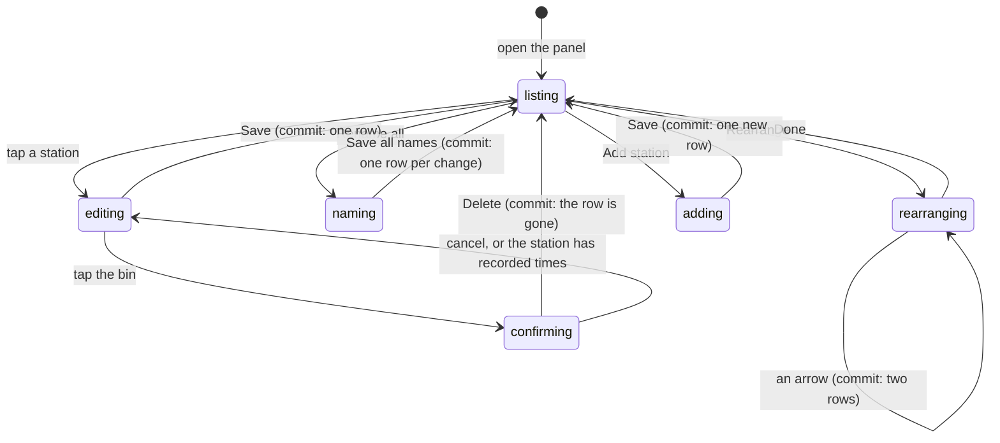

# Stations

## Summary

A _station_ is one obstacle on the course, and the list of them is the spine of a
run: their order is the order of the split buttons on the timing console, their
short labels are what a card back prints down the "vs. the field" ladder, and
their penalty amounts are the one-tap buttons a timekeeper hits when somebody
knocks a cone over. The Stations panel in the admin console names, reorders,
extends and retires that list.

Renaming is always safe. Reordering after runs exist reshuffles a ladder printed
on cards people already hold. Deleting a station that has splits or penalties
against it would take those times with it, so the panel refuses and offers the
Active switch instead — the interesting case, and the one this document spends
the most words on.

## The simple case

You unlock the console with the event PIN (see [getting in](getting-in.md)),
scroll to Stations and tap the header to open it. You get a numbered list —
"1 SPRINT", "2 TIRE FLIP" — each with its short label under it and any penalty it
carries.

You tap "Tire Flip". A sheet slides up with its name, short name, description,
penalty in seconds and two switches. You fix the spelling, tap Save, the sheet
closes, and a toast says "Station saved". The list redraws, and so does the
timing console above it. "Add station" at the bottom opens the same sheet empty,
with the next order number filled in; it lands at the end of the course.

## The interaction, event by event

### Arrive

Nothing is fetched for this panel. The station list is already on the page: it
arrives inside the event bundle every admin screen reads, alongside the runs, the
splits and the penalties. See [the event](../foundations/the-event.md).

Three things are decided from that bundle before anything is drawn:

- **The order.** Rows sort by their stored order number and are then numbered 1,
  2, 3 down the page — the number beside a row is its position, not the value
  stored against it, so a list seeded 10, 20, 30 still reads 1, 2, 3.
- **Whether runs exist.** If any run has been recorded, an amber strip appears:
  renaming is safe, reordering changes the ladder on player cards. A warning,
  never a lock.
- **Which stations are load-bearing.** Any station named by a split or a penalty
  in the bundle is marked as having recorded times, and its delete is disarmed.

On a phone the panel starts collapsed, like every other section of the console:
five open panels of fixed-height scroll boxes inside a scrolling page is a page
you cannot thumb through. On desktop it is always open.

### Leave without acting

Nothing is recorded. Opening the panel, expanding it, opening a station's sheet
and closing it again writes nothing. Half-typed text in the sheet is discarded
with the sheet; a half-typed batch of renames is discarded when you tap Cancel.

### The tap that starts something

There are four, and they commit different amounts:

- **Save, in the sheet.** One write. A blank name is refused on the device before
  anything leaves it — a nameless obstacle is a blank button on race day.
- **Save all names**, in the bulk rename. One write **per changed row**, sent one
  after another; untouched rows are not sent at all, and a batch with no changes
  closes silently rather than rewriting thirteen identical rows.
- **An arrow**, while rearranging. **Two** writes: the two stations swap their
  order values outright, every other row keeps the number it had, so repeated
  taps walk a station up the list one place at a time whatever the numbers were
  seeded as.
- **Delete**, behind the bin in the sheet. The device checks first — a station
  with any split or penalty against it never sends the request, and you get
  "_Sprint_ has recorded times — switch it to inactive instead". Otherwise a
  browser confirm asks once and the row goes.

The penalty field is typed in **seconds** and stored in milliseconds like every
other time in this app; see
[time and the clock](../foundations/time-and-the-clock.md). The short name is
capped at twenty characters, because it has to fit on a card back at eight
pixels.

### While it runs

The panel goes busy as a whole rather than per row: Save says "Saving…", the move
arrows grey out, the delete is disabled. Nothing is optimistic — the list on
screen is the one the last fetch returned, and it does not change until the write
comes back and the whole event bundle is re-read, which also picks up anything
else that landed while the sheet was open.

A bulk rename is the one case where the window is long enough to matter. The rows
are written one at a time, so a failure halfway leaves the earlier renames saved.
The message names the station that stopped the batch — "_Tire Flip_ did not
save" — rather than reporting a count, because the useful question afterwards is
which one to retry.

### It settles

A toast says what happened — "Station saved", "Station added", "Renamed 3
stations", "Station deleted" — the sheet closes, the rename batch collapses, and
the list redraws in its new order with its new names.

The timing console at the top of the same page redraws with it: an added station
appears as a new split button, a renamed one relabels its button, and a station
switched to inactive leaves the console entirely while keeping every time already
recorded against it.

Failure is a red toast carrying the server's own words, and nothing on screen
changes. The commonest one on an admin screen is "Admin PIN required" — the
12-hour session ended while the sheet was open.

## Modifiers

| Modifier                                                          | At arrival                                                                                                                                                                                                                                                                                                 | Changed during                                                                                                                                                                                                 |
| ----------------------------------------------------------------- | ---------------------------------------------------------------------------------------------------------------------------------------------------------------------------------------------------------------------------------------------------------------------------------------------------------- | -------------------------------------------------------------------------------------------------------------------------------------------------------------------------------------------------------------- |
| Who you are (guest · member · account · commissioner)             | Commissioner only. Everybody else is stopped at the door: `/admin` shows the PIN gate, not a console with a disabled panel, so a member never sees the station list at all. What they do see is the _result_ — station names on the timing bar, on the leaderboard and down the ladder on every card back. | The console re-locks within a minute of the token expiring — the page checks on a timer — and reverts whole to the PIN gate rather than disabling the panel in place. Any sheet open at the time goes with it. |
| The event's state (before the combine · running · finished)       | The panel is identical in all three. Before any run exists there is no warning strip and every station can still be deleted. Once a run has been recorded the strip appears and stations start becoming undeletable one at a time, as splits land on them.                                                 | A split recorded during your visit disarms that station's delete on the next refetch — up to 15 seconds later, because station data is not carried by realtime.                                                |
| Dust switched on or off                                           | No effect. Stations are combine machinery and touch nothing in the economy.                                                                                                                                                                                                                                | No effect.                                                                                                                                                                                                     |
| The device (phone · desktop · reduced motion · presentation mode) | On a phone the panel is collapsed until tapped and the edit sheet is a full-height bottom sheet; on desktop the panel is always open. Every control clears the 44px thumb target. Presentation mode does not apply — nothing on the console is cinematic.                                                  | No effect.                                                                                                                                                                                                     |

## Cancel and interrupt

| Event                                       | Before the first write                                                                                                                                                                               | After it                                                                                                                                                                                                                                                       |
| ------------------------------------------- | ---------------------------------------------------------------------------------------------------------------------------------------------------------------------------------------------------- | -------------------------------------------------------------------------------------------------------------------------------------------------------------------------------------------------------------------------------------------------------------- |
| Back, or closing a sheet                    | The draft is discarded whole. A swipe down, a tap outside, or the system back gesture all close the sheet and nothing is kept.                                                                       | Nothing to undo. A saved rename is saved; the way back is to type the old name and save again. A deleted station is gone.                                                                                                                                      |
| Navigating away inside the app              | Nothing recorded. The panel rebuilds from the cached bundle when you come back, with the sheet closed and the batch cleared.                                                                         | The write already landed. Leaving mid-batch abandons the rows not yet sent, and the ones already sent stay saved.                                                                                                                                              |
| Reload                                      | Everything staged is lost — the sheet, the rename drafts, the rearrange mode. The list itself is re-read from the server.                                                                            | Saved rows survive; unsent ones do not.                                                                                                                                                                                                                        |
| Backgrounded                                | No effect; nothing is in flight and no timer is running.                                                                                                                                             | An in-flight save keeps going. Coming back re-reads the bundle on focus, so the list is correct even if the toast was missed.                                                                                                                                  |
| Network lost mid-request                    | Nothing was sent.                                                                                                                                                                                    | The write may still have landed. The panel shows an error and the old list, and the correction is to look at the list after it refetches rather than to retry blind — a repeated rename is harmless, a repeated _swap_ puts the station back where it started. |
| The request fails or times out              | Not applicable.                                                                                                                                                                                      | A red toast with the server's message. Nothing on screen changes, so the list is briefly showing the old value for a row that may or may not have been written. The next refetch settles it.                                                                   |
| The token expires or is cleared             | For up to a minute after expiry the panel is still drawn and every control still looks live — the page re-checks the token once a minute. Tapping Save in that window produces "Admin PIN required". | Same, and worse in the middle of a bulk rename: the rows sent before expiry are saved and the rest fail one after another. Re-entering the PIN restores the console; the batch has to be started again.                                                        |
| Changed by someone else                     | A second commissioner's edits arrive on the next bundle refetch — up to 15 seconds, because the stations table is not published to realtime. Until then you are editing from a stale list.           | Last write wins, silently. Two people renaming the same station keep whichever save arrived second; there is no conflict warning.                                                                                                                              |
| A second tab or device                      | Both show the same list, both up to 15 seconds behind each other.                                                                                                                                    | The reorder is the dangerous one: two devices swapping different pairs can interleave into an order neither intended, and nothing detects it. Reorder from one device.                                                                                         |
| Reduced motion or presentation mode changes | No effect.                                                                                                                                                                                           | No effect.                                                                                                                                                                                                                                                     |

The reorder is the only action here that is two writes with no transaction around
them. If the first lands and the second does not, both stations end up holding
the same order number and the list sorts them arbitrarily until somebody moves
one again. Nothing warns; it simply looks as though the station did not move.

## Interactions with other systems

**Who you have to be.** The commissioner, holding an admin token for this event.
Both writes put `requireAdmin` on their first line, and every write in this app
runs with row-level security bypassed, so that guard is the whole protection. See
[getting in](getting-in.md) and
[identity and sessions](../foundations/identity-and-sessions.md).

**Realtime.** None for stations. Runs, splits, penalties, participants and draft
picks are broadcast; the stations table is not, so a rename reaches another phone
through the 15-second backstop poll or a window-focus refetch rather than
instantly. The commissioner's own panel refetches after each save, which is why
it feels live there and nowhere else.

**Offline and reconnection.** The panel renders from the cached bundle with the
radio off and every button is still there. Nothing saves: each tap fails with a
network error and the list keeps its old values until the next poll.

**Optimistic updates and rollback.** Nothing here is optimistic, deliberately. The
list is whatever the server last returned, so there is nothing to roll back — a
failed save leaves the old name on screen because the new one was never drawn.

**The card economy.** Stations feed it only through tiers. The fastest split at
any one station earns its owner the `stationKing` tier, so deleting a station
deletes the crown with it and can drop a card from `stationKing` to `base` the
moment the bundle refetches. See [the card](../foundations/the-card.md#what-a-tier-is).
No edition, level or dust value moves.

**Motion and sound.** None. The panel has no chime and no animation beyond a
sheet sliding up and a chevron rotating.

**Notifications and badges.** None. No dot on the nav reflects anything about
stations, and no player is told when one is renamed.

**Sharing.** Station names travel wherever a card does: an exported image carries
the ladder with its short labels baked in, and a recap archived after a rename
carries the new names. An image exported _before_ a rename keeps the old ones.

**The second device.** Two consoles on two phones is the normal race-day setup,
one timing and one fixing, and the station list is the one part of it where that
is risky: renames are safe from either, reordering is not.

**Accessibility.** Every row is a real button. The move arrows carry explicit
labels — "Move Sprint up", "Move Sprint down" — so thirteen identical arrow pairs
are distinguishable, and the bulk-rename fields are labelled with the station's
current name rather than "Name", so a screen reader user knows which row they are
in. The bin is labelled "Delete station" rather than by its icon.

## Edge cases

- **A station with recorded times.** The delete is refused on the device with a
  named toast and the sheet prints a line explaining why. The Active switch is the
  offered alternative: it drops the station from the timing console and keeps
  every split ever recorded against it.
- **The block is only on the device.** The delete handler checks that you are an
  admin and nothing else, and the database is set to _cascade_ splits away with
  the station rather than refuse. The rule that protects finished runs lives in
  one screen. See "Open questions".
- **A bundle that could not read the splits table** arrives as an empty list
  rather than an error, so the delete would be armed on a station that does have
  times.
- **Retiring a station leaves an empty ladder row.** The ladder on a card back is
  built from every station in the event, active or not, so a station switched off
  before anyone ran it prints a dash on every card.
- **"Record a split here" changes nothing.** The switch saves and reads back
  faithfully, but no screen consults it: the console draws a split button for
  every _active_ station regardless. See "Open questions".
- **Two stations with the same name.** Allowed; the console tells them apart by
  position. A station with no short name shows a dash in the admin list, falls
  back to its full name on the card ladder, and to "#" and its order number on
  the timing button.
- **Adding a station mid-combine.** It appears immediately as a new split button
  for the run in progress, and as an empty ladder row on the card of everybody
  who has already run. Only reordering warns; this does not.
- **Every station deleted.** The list says "No stations yet", the console shows
  no split buttons, and a card back reads "Stations not set yet."

## Open questions and verification

- **The delete guard is client-side only, and the database cascades.** The
  `splits` row points at its station with an on-delete cascade, and the delete
  handler carries no equivalent of the panel's check. Anything that reaches that
  handler another way — a stale tab, a second console build, a hand-made
  request — would silently delete a finished run's splits along with the station.
  This reads as a defect rather than a decision, and belongs in bug triage.
- **A station's writes are not scoped to the event they were authorized for.**
  The guard checks that you hold an admin token for the event id you sent, but
  the update and the delete then match on the station id alone. A token for this
  year's combine could edit a station belonging to another event. For a
  thirteen-person league the practical blast radius is small, but it is not the
  rule the guard implies.
- **The "Record a split here" switch appears to be inert.** Nothing in the app
  reads the value. Either the console should honour it or the switch should go;
  as it stands it is a control that promises something it does not do.
- **The two-write reorder has no transaction.** Read from the panel and its test,
  not observed failing; whether a half-completed swap is recoverable by tapping
  the arrow again was not tested.
- Whether a rename made on one console reaches a second within the backstop poll
  interval was read from the channel registry, not watched on two phones.
- Assumption: nothing else in the app writes the stations table. Nothing in the
  source does at this commit.

Verified against willyoubemyhero commit `b46f330`.
