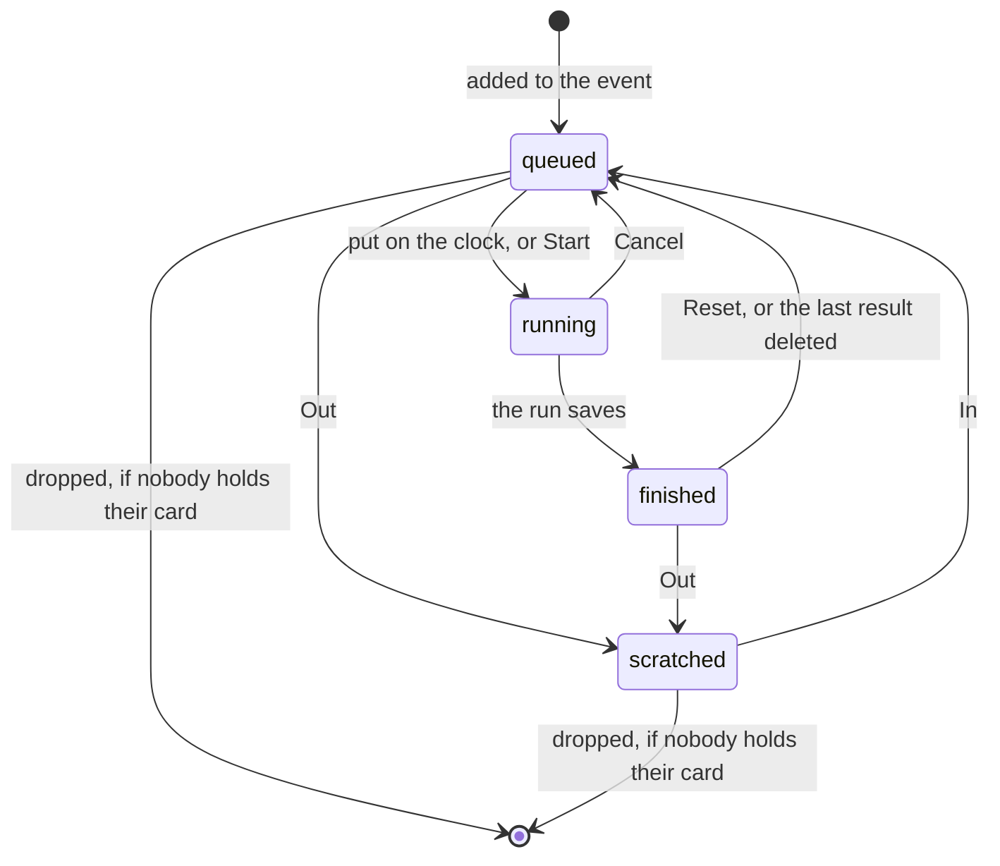

# The roster

## Summary

Thirteen names is the whole app. The roster panel on
[the console](getting-in.md) is where those names are added, taken out of the
field, put back in, dropped altogether, and — separately — handed the paper codes
that turn a person on a list into a *member* with a phone of their own.

Two panels, two very different risks. The roster panel is forgiving: a person
taken out of the field keeps their card, their page and their history, and can be
put back with one tap. The member codes panel is not: a code is shown once,
stored only as a hash, and cannot be recovered. Copy the list before you leave
the page or those codes are gone and the paper slips carrying the old ones no
longer work.

## The simple case

**Adding somebody.** The Combine Roster panel opens with two boxes — Name and an
optional Nickname — and an "Add to event" button. Type a name, tap it, and they
appear at the bottom of the list with the next running-order number. The panel's
header keeps a running count: "12 in · 1 out".

**Taking somebody out.** Each row carries a button reading **In** or **Out**,
which says where that person currently stands rather than what the tap will do.
Tapping it flips them. Out means *scratched* — struck through in the list, gone
from the field, off the leaderboard, out of contention for every tier. The
person, their card and their page are untouched either way, and the opposite tap
brings them straight back.

**Issuing codes.** The Member Codes panel says how many people have claimed —
"9/13 claimed" — and offers two buttons: issue codes for the ones who have not,
or re-issue every code in the league. Either way an amber list appears headed
"Copy these now", one name and one six-character code per line, with a Copy all
button. That list exists on that screen and nowhere else.

## The interaction, event by event

### Arrive

Both panels are read from the league, and both are collapsed on a phone until
tapped open — the console stacks a dozen of them, and a page of fixed-height
scroll boxes inside a scrolling page traps a thumb.

The roster panel lists everybody attached to this event in running order, with
scratched names struck through. The member codes panel lists the same people with
a word each: **claimed** if somebody has used their code, **code issued** if one
exists and nobody has, **no code** if none was ever made.

> Technical note: the claim record is league-wide while the panel is one event's,
> so the counter deliberately counts only claims belonging to this event's
> roster. Counting every claimed code in the database made "unclaimed" read zero
> as soon as a second event existed, which silently disabled the issue button.

### Leave without acting

Nothing is recorded — with one large exception, which is the whole hazard of this
screen. **A list of freshly issued codes is not stored anywhere.** It is on the
page and only on the page. Leaving the console, reloading it, or letting the
phone discard the tab takes it away permanently, and the codes it was showing are
already live in the database: the previous codes for those players stopped
working the moment the list appeared.

### The tap that starts something

Five taps write, and they are not equally reversible.

**Add to event** creates the person and then attaches them to this event at the
end of the running order. Two writes, in that order.

**The In/Out button** flips one athlete between *scratched* and the queue. It is
a single field, and the opposite tap puts it back.

**The bin icon** asks first — "Remove NAME from this event?" — and then does one
of two very different things depending on whether anybody in the league holds
that person's card. If nobody does, the roster row is deleted outright. If
anybody does, it is not deleted at all; they are marked scratched and the toast
says so: "NAME marked out — their cards stay in people's collections."

> Technical note: a roster row is the parent of every copy of that person's card,
> and deleting one used to cascade the card out of everybody's collection at
> once. That is how two players' cards disappeared from the league. Once a card
> has been packed, the row is no longer the commissioner's to delete.

**Reset combine** asks first and then deletes every recorded run for the event,
clears the timer on the phone doing the tapping, and puts everybody back in the
queue. Scratched athletes stay scratched — being out of the field is a roster
decision, not a result.

**Issuing codes** is the irreversible one. Each of the three routes into it —
unclaimed, everyone, one player — asks for confirmation first, and each says
plainly what it costs: re-issuing everyone stops every code already handed out
from working, while devices that have already claimed stay signed in until their
token expires.

### While it runs

Every one of these is a single request with the button disabled and reading
"Adding…", "Issuing…" or "Resetting…". Nothing is optimistic; the list redraws
when the league answers.

Issuing for a whole roster is a loop on the server, one player at a time, and it
is not atomic — see the edge cases.

### It settles

A roster change re-reads everything: the queue on the timing console, the
leaderboard, the Results panel and every screen showing the field all follow.

An issue settles into that amber list, and this is the moment that matters. **Copy
all** puts it on the clipboard as one `Name: CODE` line per player, ready to paste
into a notes app or a message; a blocked clipboard says so and asks you to select
the text by hand. Until that list is copied or written down it is the only copy in
existence, and the panel gives no second chance — there is no "show me those
codes again".

While the list is showing it replaces the claim-status list underneath it, so the
per-player Issue buttons are not reachable until the page is left and returned to.

## Modifiers

| Modifier | At arrival | Changed during |
| --- | --- | --- |
| Who you are (guest · member · account · commissioner) | Commissioner only, with a token bound to this event. Every write here refuses a token naming a different combine. Nobody else can see the panels at all, and the codes are never returned to any other reader. | A token expiring closes the console back to [the gate](getting-in.md). An issued list already on screen goes with it. |
| The event's state (before the combine · running · finished) | Before the combine this is the setup screen. Mid-combine the same controls work, and the timing console's queue follows them live. | Adding somebody mid-combine puts them at the end of the running order, and they appear in the queue immediately. Scratching the athlete currently on the clock removes them from the queue but does not stop a run in progress. |
| Dust switched on or off | No effect. | No effect. |
| The device (phone · desktop · reduced motion · presentation mode) | Panels are collapsed on a phone and always open on desktop. The issued list scrolls inside its own box on a phone. | No effect on the writes. Copying to the clipboard depends on the browser allowing it, which is the one device-shaped failure here. |

## Cancel and interrupt

| Event | Before the tap | After the tap |
| --- | --- | --- |
| Back, or closing a sheet | The confirmation dialog cancels cleanly and writes nothing. | Nothing to undo. In/Out is reversed by tapping again; a code is not reversible at all. |
| Navigating away inside the app | Nothing typed into the Add boxes survives, and nothing is written. | The roster change stands. **An issued code list is gone**, and the codes it showed are already the live ones. |
| Reload | Same: the boxes empty, nothing written. | Same. The roster is re-read from the league; the code list is not, because it was never stored. |
| Backgrounded | No effect. | No effect on the league. A phone that discards the tab while an issued list is on screen loses it exactly as a reload would. |
| Network lost mid-request | Nothing is written and the panel says it could not. | For adding a player, the two writes are separate: the person may exist without being attached to the event. For issuing, part of the roster may have been rotated — see the edge cases. |
| The request fails or times out | The panel raises the reason as a toast and leaves the boxes as they were. | Same. A failed issue reports "Could not generate codes" and shows no codes, whether or not any were written. |
| The token expires or is cleared | The console falls back to the gate; nothing is written. | The change already made stands. |
| Changed by someone else | Another commissioner's roster edit arrives over realtime and redraws the list. | Same. There is no locking: two people editing one roster is last-write-wins, per field. |
| A second tab or device | Both show the same roster. | A roster change appears in the other tab. **An issued code list does not** — it exists only on the tab that issued it. |
| Reduced motion or presentation mode changes | No effect. | No effect. |

Read the second column of the Navigating away and Reload rows together: they are
the same hazard said twice, and it is the only place in this app where an
ordinary interruption destroys something that cannot be recovered.

## Interactions with other systems

**Who you have to be.** A commissioner, for every write on this screen. They all
run with full database privileges and bypass row-level security, so the guard on
the first line of each handler is the only check, and it is bound to one event.
The read that lists claim status deliberately asks for only the claim columns and
never the code material — running as a privileged role, the columns it selects
are the entire defence.

**Realtime.** Roster changes reach every device over the event channel: the
queue, the board and the field count all follow. Codes are not broadcast, and
nothing tells a player their code has been rotated.

**Offline and reconnection.** Nothing on this screen works offline. Every control
is a server write.

**Optimistic updates and rollback.** None anywhere here. The list redraws only
when the league has answered.

**The card economy.** This is the screen where a roster decision meets people's
collections. Dropping somebody who has been packed is refused in favour of
retiring them, precisely so that a card already in a collection is never taken
away. Claiming a code is also what makes somebody able to trade and to be traded
with; a person with no code and no account is unreachable — see
[claiming your player](../accounts/claiming-your-player.md).

**Motion and sound.** None. Toasts and a collapsing panel.

**Notifications and badges.** None. There is no badge for "codes not yet handed
out" and no warning that an issued list is about to be lost, which is the one
piece of signalling this screen most needs.

**Sharing.** The codes are meant to leave the app — that is what Copy all is for
— but they leave as text the commissioner is now responsible for. Nothing in the
app prints them, mails them or keeps them.

**The second device.** A second console shows the same roster and the same claim
counts, and no issued codes.

**Accessibility.** The roster rows carry labelled controls — "Drop NAME from the
event" on the bin, an In/Out button that says which state it will move to. The
issued list is plain text in a scrollable region, so a screen reader can read the
codes out; the copy control is a labelled button rather than an icon alone.

## Edge cases

- **A partly-issued roster.** Codes are written one player at a time, and a
  failure part-way through leaves the earlier players' codes already rotated
  while the panel reports a failure and shows nothing. Those players' paper slips
  are now dead and their new codes were never displayed. The only remedy is to
  issue again for everyone.
- **Adding the same name twice** makes two people. The Add form always creates a
  new person; it never matches on a name it has seen before.
- **A person dropped from the event still exists.** They are removed from this
  combine's roster, not from the league, and can be added back — with a fresh
  running-order number at the end.
- **"Issue codes for unclaimed" reaches past this event.** The count on the button
  is this event's roster, but the issue itself covers every active player in the
  league who has not claimed. On a single-combine league these are the same set.
- **Collectors never get a paper code.** A signed-in account who is not a combine
  athlete is skipped by every bulk issue; they reach their cards by signing in.
- **A rotated code does not sign anybody out.** The claim record resets, but a
  member token already issued keeps working for its ninety days. Rotating is
  about the next claim, not this session — see
  [identity and sessions](../foundations/identity-and-sessions.md#edge-cases).
- **A code claimed twice is fine.** Codes stay valid after the first claim on
  purpose: people get new phones and clear browsers, and re-issuing for that in a
  group of thirteen is worse than the alternative.
- **The confusable characters are absent.** Codes are six characters from an
  alphabet with no `0`/`O`, `1`/`I`/`L`, `2`/`Z`, `5`/`S` or `8`/`B`, because they
  are read off paper in a garden. Claiming is case-insensitive and forgiving about
  stray spaces; the PIN is not.
- **Statuses the live app never writes.** An archived combine may carry statuses
  from a wider vocabulary — disqualified, absent, did not play. They are treated
  as out of contention, the same as scratched.

## Open questions and verification

- The partial-issue failure was read from the write loop and its test, not
  reproduced. How often it could happen in practice is unknown, but the
  consequence — a player whose code is dead and whose new code was never shown —
  is bad enough to be worth a second look.
- Whether the app writes `queued` or `waiting` for the same state depends on
  which control was used; nothing user-facing distinguishes them, and both read
  as "in the queue" everywhere. Whether that duality can ever surface was not
  determined.
- That a bulk issue reaches active players outside this event's roster was read
  from the handler. On the league this app is built for there is one event, so it
  has not been observed.
- Whether the clipboard control works on the phones this is actually run from was
  not tested; the fallback is to select the list by hand, which is fiddly on a
  small screen.
- Assumption: no screen other than this panel ever displays a plaintext code, and
  no server response other than the issue itself contains one. Confirmed by
  reading every handler at this commit.

Verified against willyoubemyhero commit `b46f330`.
