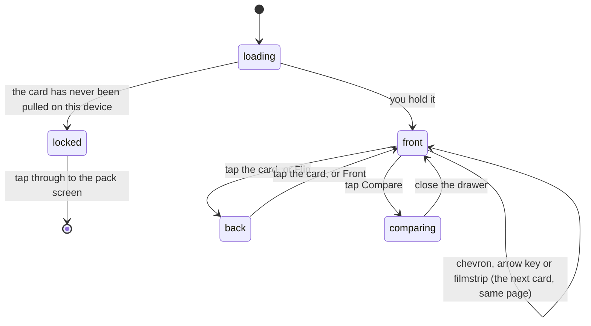

# A player card

## Summary

One roster card, alone, at the size it deserves. The card sits in an acrylic slab
with a serial plate; a badge above it names the tier or the finish; below it are
the actions, the trash talk, four headline numbers, a station-by-station
breakdown against the field, the whole roster as a scrolling strip, reactions and
comments, and a QR code so the printed card can link to its digital twin.

The page is public in every part but one. The tier, the time, the rank and the
breakdown are already on the leaderboard and stay. **The art is the thing a pack
buys**, so until this device has actually pulled the card, the slab holds a
face-down slot and a button to go and rip a pack.

## The simple case

You tap a card in [the vault](the-vault.md). The page arrives tinted in that
player's tier colour, a chime plays, and if the tier or the finish is worth it,
confetti goes off. The badge in the top right says "1 of 1 · Fastest official
time". The slab's plate reads "Collected · Gold" on the left, the event and year
in the middle, and "3/18" on the right.

You tap the card and it turns over: a stat panel with their bib, their order,
their pick, their official time and every station split as a bar with the gap to
the field's median beside it. You tap again and it comes back.

Under it, "Vs. the field" says "#1 of 4 · Faster than median at 2/2 · 2 stations
won", and lists each station with its place and gap. Under that, the whole roster
as thumbnails. You tap the next one along and the page becomes that card without
ever unloading.

## What is on the page

**The badge**, top right. One pill. On an ordinary copy it is the tier word with
the reason under it — "Station King" means nothing on its own, so "Fastest at a
station" rides along. On a copy wearing a special finish the metal takes the
headline in its own colour and the line underneath becomes the pull rate, because
a finish is luck rather than something somebody did on the course. See
[the card](../foundations/the-card.md#what-an-edition-is). On a phone the second
line is dropped; there is not enough screen for a third row of chrome above the
card.

**The slab.** An acrylic case with a label bar: whether _you_ hold the card and
in what finish on the left, the event and its year in the middle, and the serial
— the player's running order over the roster size, which is the number printed on
the physical card — on the right. At the foot, in a muted line of its own, how
many people in the league have packed it. The two are never on one line: one is
about you, the other about everybody else.

**The card.** Full size, tiltable, pinchable and turnable. See
[looking closer](looking-closer.md).

**Trophy and award pills** under the name: sets this player has finished, and
superlatives they have won. The award pills link to the awards screen; the trophy
pills link nowhere, because a set's contents are still nobody's business — the
trophy says it was finished and how big it was, and that is the whole story.

**Four tiles** — Order, Pick, Time, Rank. The time and the rank roll up to their
value rather than snapping into place, and print an em dash for a player with no
official run.

**Vs. the field.** One row per station in course order: the station's name, a bar
scaled to that player's slowest station, their split, their place among everyone
who ran it, and the gap to the field's median in words. A station they won is
drawn in the tier's own colour at full strength. Absent entirely when they have
no timed split anywhere. See
[time and the clock](../foundations/time-and-the-clock.md).

**The Set** — the roster as a strip of thumbnails, current card lit and centred.

**Reactions and comments**, then **your own pack stats** if this is your own card
and you have opened a pack, then the QR code.

## The interaction, event by event

### Arrive

The event bundle decides almost everything: the player, the tier, the splits, the
rank. Until it lands the page says "Loading…", and an id that is not on the
roster ends at "Player not found" with a link back to the vault.

Whether the card is locked waits on the collection, and an unsettled collection
counts as locked — face-down going face-up is a reveal, and the reverse is a
leak. A locked page keeps the slab, the badge, the name, the numbers, the
breakdown, the strip and the social; it swaps the card for a face-down slot
wearing the _event's_ universal back — never the player's own, which would be
half the reveal printed on the thing hiding it — and adds a button reading "Rip a
pack to see this card".

Landing on a card you hold is treated as an event: the tier's chime plays, and
for a champion, a podium card or any finish of gold or better, confetti in that
card's own colours. It fires once per card per page load, because arrowing back
and forth through the roster would otherwise turn a flourish into a machine gun.
It never fires on a locked card, and never under reduced motion. A cold page load
has no tap behind it, so the browser keeps the audio suspended and it is silent —
which is correct rather than something worked around.

### Leave without acting

Nothing is recorded. Looking at a card does not collect it. It used to, which
made walking the vault a one-tap way to own the whole set without ever ripping a
pack; the only way a card arrives now is a pack, a trade, a grant or a purchase.

### The tap that starts something

Three of the controls on this page write, and none of them writes to the card.

- **Pin** stores a card id on this device. See [favourites](favourites.md).
- **Sound** and **Tilt** are device settings; Tilt may raise a system permission
  prompt on a phone.
- **A reaction or a comment** is the only server write on the page, and it is the
  one place a guest is asked who they are — once, on the first tap, with the tap
  itself replayed afterwards so nobody has to press twice.

Share, Copy Link, Flip and Compare write nothing anywhere.

### While it runs

The three actions that act on the card itself — Flip, Share, Compare — are dead
while it is face-down. There is no face to turn, export or line up against
another.

Share takes a visible moment. The button reads "Rendering…", the signed art URLs
are refreshed first because a stale one rasterises blank, and **navigation is
frozen for the duration**: the export reads the page after a settle delay, so
stepping to the next card mid-export would hand it that card's artwork under this
card's filename. The chevrons and the arrow keys stop answering until it is done.

### It settles

A share drops a PNG named after the player. A failed one raises a message and
brings the button back. Copy Link puts the URL on the clipboard and says so, or —
where the browser refuses clipboard access — shows the URL so it can be copied by
hand. Flip leaves the card on whichever face you left it, until you step to
another card, which always arrives face up.

## Modifiers

| Modifier                                                          | At arrival                                                                                                                                                                                                                                                                                                               | Changed during                                                                                                                                                                          |
| ----------------------------------------------------------------- | ------------------------------------------------------------------------------------------------------------------------------------------------------------------------------------------------------------------------------------------------------------------------------------------------------------------------ | --------------------------------------------------------------------------------------------------------------------------------------------------------------------------------------- |
| Who you are (guest · member · account · commissioner)             | A guest sees the cards this handset has pulled and nothing the server could add — their collection is the device. A member's is the device reconciled against the server, so a card pulled on another phone unlocks here too. Your own pack stats appear only on your own card. The commissioner gets no extra controls. | Claiming a player uploads this handset's cards onto the name, and a page locked because the server had not vouched for the card can unlock. Nothing animates the change; it redraws.    |
| The event's state (before the combine · running · finished)       | Before any official run the badge says "Base · Combine athlete", the time and rank are em dashes, and "Vs. the field" is absent.                                                                                                                                                                                         | A result landing anywhere in the combine can change this card's tier live: the badge, the page tint, the slab, the bars and the confetti colours all follow. The chime does not replay. |
| Dust switched on or off                                           | No effect on this page.                                                                                                                                                                                                                                                                                                  | No effect.                                                                                                                                                                              |
| The device (phone · desktop · reduced motion · presentation mode) | On a phone the settings fold behind an overflow button and the chevrons either side of the card are gone — six chips wrapped to three rows and pushed the stats off the fold. Wider, all six chips sit on one line and the chevrons appear. Reduced motion drops the confetti, the count-ups and the tilt.               | A set finishing elsewhere can take the screen for a trophy ceremony over this page.                                                                                                     |

## Cancel and interrupt

| Event                                       | Before a write                                                                                                                                            | After                                                      |
| ------------------------------------------- | --------------------------------------------------------------------------------------------------------------------------------------------------------- | ---------------------------------------------------------- |
| Back, or closing a sheet                    | Returns to the vault, or closes the compare drawer. Nothing is lost.                                                                                      | A pin is already stored; a comment is already posted.      |
| Navigating away inside the app              | No effect. The flip state and the zoom are not remembered.                                                                                                | Same.                                                      |
| Reload                                      | Lands on the same card, front face, at 1x, with Tilt off. A `?vs=` in the URL survives but the drawer does not reopen.                                    | A stored pin and a posted comment survive.                 |
| Backgrounded                                | No effect. On return the bundle, the pull counts and the trophies refetch on focus. Any card tilt eases home.                                             | An in-flight comment may fail and can be retried.          |
| Network lost mid-request                    | Card art already fetched keeps rendering; art that was not falls back to the player's initials. A share cannot refresh its URLs and fails with a message. | A comment that landed stays posted.                        |
| The request fails or times out              | The page keeps its last known tier rather than falling back to base. A failed collection read leaves the device's own cards showing.                      | A failed reaction is rolled back to what the server holds. |
| The token expires or is cleared             | A member's copies stop resolving, so a page that showed a finish becomes a face-down slot again. The tier, time and rank are public and stay.             | No effect on anything already written.                     |
| Changed by someone else                     | Reactions, comments and tier changes arrive live. A trade completing can take the card out of your collection and lock the page under you.                | Same.                                                      |
| A second tab or device                      | Both show the same card. A pin made in another tab arrives; one made on another device does not.                                                          | Same.                                                      |
| Reduced motion or presentation mode changes | The count-ups stop rolling, the tilt goes dead and the confetti stops. Colours, badges and numbers never change.                                          | Same.                                                      |

## Interactions with other systems

**Who you have to be.** Nobody, to read the page — everything but the artwork is
public. Which copies unlock it depends on where your collection lives; see
[the collection](../foundations/the-collection.md). A guest may react and comment
like anyone else, and ownership of what they leave is decided from a signed token
rather than a device id, so a key copied out of somebody else's row cannot be
replayed to delete their trash talk.

**Realtime.** The event channel redraws the tier — and therefore the badge, the
tint, the slab, the bars and the numbers — without a refresh. Reactions and
comments arrive the same way. Pull counts and trophies refresh on focus instead,
because the tables behind them are deliberately kept off the wire.

**Offline and reconnection.** The page renders from cache. Share is the only
thing that needs the network and says so when it fails.

**Optimistic updates and rollback.** Only reactions, which show your tap
immediately and settle against the server's count.

**The card economy.** The slab's plate is the one place on this page that talks
about _your copy_ — the count and the finish — and it wears the finish's colour
rather than the tier's, because the two axes never merge.

**Motion and sound.** The tier chooses the chime on landing and the finish
chooses the confetti, so a base card with a good enough roll still stops the
garden. The Sound chip mutes every card sound in the app, per device. Under
reduced motion the confetti and the count-ups are dropped, not deferred.

**Notifications and badges.** None on this page.

**Sharing.** Two ways. Share exports a 1080×1350 PNG of the card with the event,
the name, the team, the quote, the badge, the order, the pick, the time and the
rank; the composite is never built at all for a locked card, since it would be an
export of the very art being withheld. Copy Link copies this page's URL, carrying
a `?vs=` comparison if one is set. See
[sharing](../cross-cutting/sharing.md).

**The second device.** The page is identical everywhere except the slab plate and
the lock, which follow the collection.

**Accessibility.** The card is a single button that reports which face is showing
and carries a label naming the player, the tier and the finish. A face-down slot
is one image announcing the player and that it is shut. Every chevron, thumbnail
and zoom control has a name. Tier and finish are text on the badge, never colour
alone.

## Edge cases

- **A player with no card art** shows their initials and the words "No card art"
  in the frame — the page is not blocked on artwork.
- **A player with no uploaded back** gets the generated stat panel instead, and
  the Flip button says "Stats" rather than "Flip" to say so.
- **A player with no official run** has no time, no rank and no breakdown, but
  still has a card, a tier and a page.
- **The last card's "next" is the first one.** Both the chevrons and the arrow
  keys wrap, so the roster is a loop rather than a line with two dead ends.
- **Stepping between cards never unloads the page**, which is why the card always
  arrives face up and why the compare drawer closes if the next card along is one
  you have not packed. The surface and the control that opens it have to agree.
- **The filmstrip shows no art for a card you have not packed** — just the name on
  a neutral chip. It never shows that card's tier colour either.
- **Your own pack stats appear on your own card only**, and only once the real
  numbers are known. A member who has never opened a pack gets nothing rather
  than a row of zeroes.
- **A trophy pill on somebody else's card prints a set size.** It is the one place
  a size is public, and only ever for a set that is already finished.
- **The QR code always points at this card**, with no comparison attached, so a
  printed card links to its own page rather than to a head-to-head.

## Open questions and verification

- The filmstrip is handed each thumbnail's finish and never draws one — the value
  is computed and dropped. The intent recorded in the source is that a thumbnail
  wears your copy's finish and that a locked one is dressed in a neutral
  placeholder; only the second half currently happens. No leak either way, but
  the strip shows less than it was meant to. Raised for triage.
- Flipping the card on this page makes no sound. The flip sound exists and fires
  where the card handles its own tap, but this page's magnifier takes the tap
  first, so the sound is never reached. Raised for triage.
- Whether the landing chime is genuinely silent on a cold load and audible after
  the first tap was read from the audio rules and not heard on a phone.
- Whether a tier changing mid-combine visibly redraws this page, tint and all,
  was read from the live-recompute path and not watched on race day.
- Assumption: nothing on this page collects a card. The route reads the
  collection and never writes to it, but this behaviour existed once and its
  removal is what the whole locked state is built on.

Verified against willyoubemyhero commit `b46f330`.
