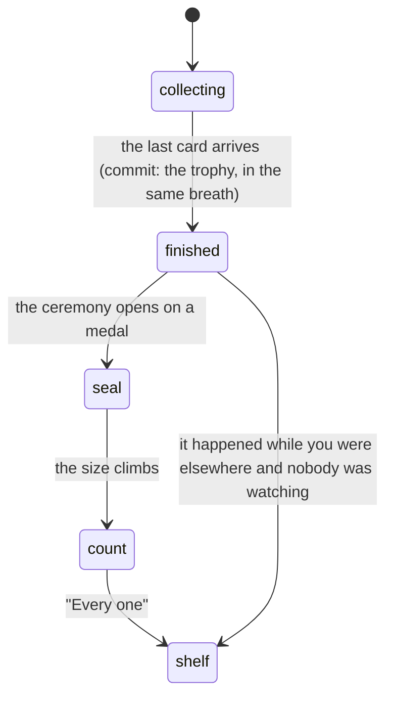

# Collection trophies

## Summary

Finishing a secret set is the one moment in the app where a set's size is said
out loud. Every other surface goes out of its way not to: no shelf carries a
denominator, no card back carries a serial, and a set you own nothing from is not
drawn at all. A **trophy** is the designed exception, because there the number
_is_ the prize — "you have all nine" means nothing if you never learn there were
nine.

A trophy is minted in the same breath as the card that finished the set, by the
database, inside the same lock. It is permanent, it is public, and it comes with
a ceremony that deliberately holds the number back until the card has been turned
over: you find out which card it was first, and only then that it was the last
one. What a set is, and how one otherwise reads, belongs to
[secret sets](secret-sets.md).

## The simple case

You tear today's pack, walk the three roster cards, and the fourth slot hands you
a Pets card you did not have. It turns over, the confetti goes up, and you look
at it for a second.

Then the screen goes gold. A medal springs in, and under it "Set complete" and
"Pets". A number climbs from nothing to nine, and settles: _9 cards, all of them._
One button, reading "Every one". You tap it and you are back on the pack summary,
where you were.

Open the Vault and there is a shelf you have not seen before, called "Complete",
sitting above your set shelves. On it is a gold plaque: a medal, "Pets", "9
cards", and today's date. Turn over any Pets card from now on and the back says
"Set complete" where it used to say when you pulled it. Your player page carries
a gold pill reading "Pets · 9", and so does everyone else's for the sets they
have finished.

## What counts as finished

You have finished a set when you hold a copy of **every card in it that is active
and has artwork**.

What is deliberately not part of that test is a card's pull weight. A
commissioner can drop a card's weight to zero to take it out of the daily draw
without retiring it — it is still real, still tradeable, still grantable — so it
still counts. Excluding it would mean an admin nudging a slider quietly finished
somebody's set for them.

Two things never complete. An empty set does not, so a set whose cards have all
been retired cannot vacuously complete for thirteen people at once on whatever
they happen to pull next. And the unsorted pile is not a set — there is no trophy
for "Secrets".

The size recorded is how big the set was **on the day you finished it**. Adding a
fourteenth card to a set somebody completed at thirteen does not take their
trophy away, and their plaque goes on saying thirteen.

## How a set closes

Five ways, and the app names each of them internally so a trophy always knows how
it was earned:

- **A pull.** [The fourth slot](the-daily-secret.md) hands you the last one. This
  is the path with a ceremony timed to it.
- **A trade.** The card you asked for was the last one. Both sides are checked,
  so one swap can finish a set for each of you, or two for one of you. See
  [answering an offer](../trading/answering-an-offer.md).
- **A grant.** The commissioner hands you the last card from
  [the admin screen](../admin/secret-card-sets.md).
- **A claim.** A guest cannot hold a trophy — the table is public, and a nameless
  row is not a trophy anybody can render — so a guest who has quietly finished a
  set banks it when they claim a player and those pulls become somebody's.
- **A backfill.** A one-time sweep when the feature arrived, for everyone who had
  already finished a set before there was anything to record it.

## The interaction, event by event

### Arrive

Every finished set in the league arrives as one list — not yours, everybody's. It
is the same list four surfaces read: your Complete shelf, the badge on a card
back, the pills on somebody else's player page, and the watcher that fires a
ceremony for a set that closed while you were looking somewhere else. One read
rather than four keeps them agreeing with each other.

It is public and unguarded, and it does carry sizes. That is not a hole in the
silence rule; it is the rule's exception, drawn tightly: a size in that list only
ever describes a set somebody has already finished, and a set nobody has finished
appears in it nowhere at all.

The device also reads its own note of which ceremonies it has already thrown.

### Leave without acting

Nothing is recorded about looking. The one write that happens without a
deliberate action is the note above: a phone opening the app for the first time
absorbs whatever is already on its owner's shelf and says nothing about it. Only
after that does it start celebrating what is new.

> Technical note: without that first silent pass there is no way to tell a phone
> that has genuinely never seen anything from one whose note is simply empty, and
> the two want opposite behaviour — a new phone must not fire a ceremony for
> every set its owner finished last summer, while a phone that has been here
> before must fire for the one that arrived overnight.

### The tap that starts something

**There is no tap.** The commit is the card arriving, and by the time anything is
drawn the trophy is already permanent — written by the same database call that
gave you the card, so two cards from the same set landing at once cannot both
read "not complete" and leave nobody told.

The only tap in the whole feature is "Every one", which dismisses the ceremony
and commits nothing.

### While it runs

The ceremony takes the whole screen. The nav bars fade out and go inert under it,
the way they do for a pack.

It runs in two beats. First the seal: a medal springs in, then "Set complete" and
the set's name in gold. Just under a second later the number appears and counts
up to the size, ending on "9 cards, all of them". The number is held back
deliberately — a total that simply appears is information, and a total that
climbs is an achievement, which is why the count is the centre of the composition
rather than a caption under something else.

A chime plays once, and it is the resolution of the one a secret card makes.
Somebody who has been pulling all season has heard the unresolved version dozens
of times without ever hearing it land. Confetti goes up with it.

When a set closes on the pack screen this all waits: the card is turned over
first, its own burst runs, and only then, after a beat, the gold. Two
celebrations on top of each other is one celebration nobody can read.

### It settles

The ceremony is dismissed and you are back exactly where you were — the pack
summary, the trade screen, or whatever page you happened to be on.

The trophy is on your Complete shelf in [the vault](the-vault.md), drawn as a
plaque rather than a card,
because a set is not a card and drawing it as one puts a fourteenth thing on a
shelf of thirteen. The plaque prints the medal, the set's name, the size, and the
date it was finished. A backfilled trophy prints no date at all: nothing in the
data records when a given person acquired a given card, and a traded card keeps
the date the _giver_ pulled it, so the app would rather say nothing than state a
day it cannot support — or have eight people appear to finish the same afternoon.

## Told about it somewhere else

Three of the five ways a set can close cannot fire a ceremony where it happened.
A grant runs on the commissioner's handset; the far side of a two-way trade is
not the person who pressed accept; a claim is a merge. Before there was a
watcher, all of those landed as a badge that had quietly changed.

So a watcher is mounted on every screen. It notices any trophy of yours the phone
has not celebrated and plays the ceremony wherever you are, which means a set
finished for you overnight is waiting when you next open the app. It works from
the difference between what the list says and what the phone remembers rather
than from a message, so a missed message costs nothing.

Trophies are queued rather than collapsed, because one accepted trade genuinely
can close two sets, and showing one of them would be worse than showing neither.
A ceremony is marked as shown **before** it is shown: a navigation can unmount it
half-way through, and a trophy that fires forever because nobody dismissed it is
worse than one somebody scrolled past.

## Modifiers

| Modifier                                                          | At arrival                                                                                                                                                                                                                                                                                                                                                                             | Changed during                                                                                                                                   |
| ----------------------------------------------------------------- | -------------------------------------------------------------------------------------------------------------------------------------------------------------------------------------------------------------------------------------------------------------------------------------------------------------------------------------------------------------------------------------- | ------------------------------------------------------------------------------------------------------------------------------------------------ |
| Who you are (guest · member · account · commissioner)             | A guest holds no trophies: the shelf is absent, the card backs say nothing, and no ceremony can fire. A member sees their own shelf and everybody's pills. An account changes nothing here. The commissioner sees the same as a member, plus, when a grant of theirs finishes somebody's set, a line in their own confirmation saying so — their copy of a ceremony they cannot watch. | Claiming a player banks every set the guest had already finished, in one sweep, at the moment their pulls become theirs.                         |
| The event's state (before the combine · running · finished)       | No effect. Sets and trophies are league-wide and permanent, and a trophy earned out of season is an ordinary trophy.                                                                                                                                                                                                                                                                   | No effect.                                                                                                                                       |
| Dust switched on or off                                           | No effect. Finishing a set pays a trophy and nothing else — no dust, no card, no discount.                                                                                                                                                                                                                                                                                             | No effect.                                                                                                                                       |
| The device (phone · desktop · reduced motion · presentation mode) | The ceremony is full-screen at any width. Reduced motion skips the medal's spring and goes straight to the number, and drops the count-up.                                                                                                                                                                                                                                             | The nav fades out under the ceremony and comes back when it is dismissed. A ceremony can open over any screen, including one already presenting. |

## Cancel and interrupt

| Event                                       | Before the last card lands                                                                                                                               | After it has landed                                                                                                                                                                                |
| ------------------------------------------- | -------------------------------------------------------------------------------------------------------------------------------------------------------- | -------------------------------------------------------------------------------------------------------------------------------------------------------------------------------------------------- |
| Back, or closing a sheet                    | Nothing to cancel.                                                                                                                                       | The trophy is already permanent. Backing out of the ceremony ends it; it will not play again, because the phone marked it shown before it opened.                                                  |
| Navigating away inside the app              | No effect.                                                                                                                                               | Same. The shelf, the badge and the pill are all there when you get to them.                                                                                                                        |
| Reload                                      | No effect.                                                                                                                                               | The trophy survives; the ceremony does not. A reload during it is the same as dismissing it.                                                                                                       |
| Backgrounded                                | No effect.                                                                                                                                               | The two beats are on timers, so a backgrounded ceremony may be at its end when you look again. Nothing is lost.                                                                                    |
| Network lost mid-request                    | The card that would have finished the set never arrives, so nothing is finished.                                                                         | The trophy landed with the card, in one step. There is no state where you hold the last card and have no trophy.                                                                                   |
| The request fails or times out              | Same — no card, no trophy.                                                                                                                               | If the response carrying the completion is lost after the write, the watcher finds the trophy on the next read and plays the ceremony late rather than never.                                      |
| The token expires or is cleared             | No effect on trophies already earned; they belong to the name, not the device.                                                                           | The shelf empties along with the rest of the collection until a token comes back. The trophy row is untouched.                                                                                     |
| Changed by someone else                     | A commissioner granting you your last card finishes the set from their phone; you find out through the watcher. A trade partner accepting does the same. | A commissioner adding a card to a set you have finished does not take the trophy away, and does not fire anything again.                                                                           |
| A second tab or device                      | Both read the same public list.                                                                                                                          | The phone's note of what it has celebrated is per device, so a second phone can play a ceremony for a set the first one already showed. Two tabs on one phone share the note and do not double up. |
| Reduced motion or presentation mode changes | No effect.                                                                                                                                               | The preference is read once when the ceremony opens, so flipping it mid-ceremony changes nothing until the next one.                                                                               |

## Interactions with other systems

**Who you have to be.** To _hold_ a trophy, somebody with a name on the roster —
a [member](../foundations/identity-and-sessions.md). To _read_ the list, nobody at all: it is public, and other people's
finished sets showing up on their player pages is most of the point. The write is
not a screen's to make; it happens inside the database call that hands over a
card.

**Realtime.** This is the one table in the secret-card feature that is published,
and deliberately so: a finished set is meant to be lore, and there is no other
channel that reaches somebody whose set was closed by a commissioner standing
across the garden. The message itself carries nothing — it is a nudge to refetch,
never a source of data.

**Offline and reconnection.** No connection, no acquisition, so no completion. A
trophy earned while a phone was offline is found on the next read and celebrated
then.

**Optimistic updates and rollback.** Nothing is optimistic. The ceremony fires
from a completion the server has already written, which is what lets it fire on
presence alone rather than on a comparison with what was on screen a moment ago.

**The card economy.** A trophy is not currency and cannot be spent, traded,
milled or sold. Completing a set does not protect the cards in it: they remain
ordinary copies, and trading one away leaves the trophy standing, because the
trophy records what you did and not what you still hold.

**Motion and sound.** Its own chime, its own confetti, and presentation mode for
the duration. Each fires once per ceremony; a queue of two plays two, rather than
the second arriving silent.

**Notifications and badges.** No dot anywhere. The ceremony _is_ the
notification, and the shelf is the record of it. The badge on a card back is the
only persistent mark, and it is a word rather than a count.

**Sharing.** No share button and no image export. A trophy travels as a pill on a
player page, which anybody can already see.

**The second device.** The trophies follow the name. What does not follow is the
phone's note of which ceremonies it has thrown, so a second device can replay one
you have already seen — and, on the other hand, a phone that has never been here
absorbs the whole shelf silently.

**Accessibility.** The ceremony is a dialog labelled with the set's name and the
word complete. The number sits in a polite live region so the size is announced
once it has settled rather than on every frame of the count, and the medal is
hidden from assistive technology. There is one control and it is a real button.

## Edge cases

- **A trade that finishes a set for both people.** Each phone celebrates its own.
  Yours are fired from the answer you are already holding; theirs reaches them
  through the watcher.
- **A trade that finishes two of your sets at once.** Two ceremonies, one after
  the other.
- **A second pull from a finished set.** Nothing. The completion is announced by
  the acquisition that minted it and by no other.
- **A set the commissioner tries to delete after somebody finished it.** Refused,
  with a sentence explaining why. Erasing the set would erase the trophy.
- **A set hidden or renamed after somebody finished it.** The trophy keeps a name
  either way: the current one if the set still exists, and its own identity if it
  does not, rather than disappearing.
- **Two people sharing a phone at a party.** The note of what has been celebrated
  is keyed to the person as well as the set, so one person's ceremony cannot be
  swallowed by the other's.
- **A queue cut short.** Closing the app mid-queue loses the ceremonies still
  waiting — they were marked shown as they were queued. The trophies are on the
  shelf regardless.

## Open questions and verification

- **A guest who finishes a set may never see its ceremony.** Their trophy is
  banked at the moment they claim a player — but that is also the first moment
  the phone has a name to prime against, so the silent first pass absorbs the
  brand-new trophy along with any history. Read from the priming rule and the
  claim path, not watched; it looks like a real gap rather than a decision.
- The timing of the beat between a secret's own burst and the gold was read from
  the source as deliberate and has not been watched on a slow phone, where the
  confetti may still be running.
- Whether a ceremony that opens over a pack still in its reveal composes cleanly
  was not observed; the two are mounted as siblings specifically so the effect
  behind one does not flatten the other.
- Assumption: the only two surfaces in the app that print a set size are the
  ceremony and the Complete shelf, plus the pill on a player page. Checked
  against every secret-facing server function and component at this commit.

Verified against willyoubemyhero commit `b46f330`.
