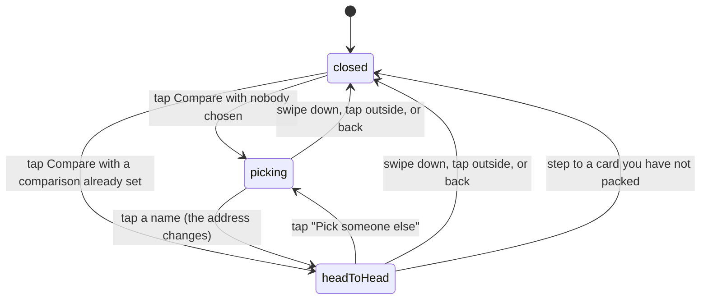

# Comparing cards

## Summary

Two players, side by side, station by station. Compare is a drawer that slides up
from the bottom of [a player card](a-player-card.md): pick somebody off the
roster and the drawer becomes a head-to-head — both official times, both ranks,
how many stations each of them won, and then every station in course order with
the faster split in that player's own tier colour.

It reads nothing it does not already have. Every number in it comes out of the
event bundle the page loaded, through the same arithmetic the card back and the
"Vs. the field" breakdown use, so a station somebody "wins" here means exactly
what it means everywhere else. Nothing is written, nothing is fetched, and the
whole thing works with the radio off.

## The simple case

You are on Alice's card. You tap **Compare** and a drawer comes up over the page
with "Pick someone to compare" across the top and the rest of the roster as a
grid of names, each with their initials in their own tier colour. Alice is not in
the list — she is the left-hand side.

You tap Bob. The heading becomes "Alice Ace vs Bob Bibb" and the grid is replaced
by two panes. Alice: 50.00, Rank #1, 2 won. Bob: 60.00, Rank #2. Under them, one
row per station — Alice's time on the left, the station's name in the middle,
Bob's on the right — with the faster of the two in bold, in that player's colour,
and the slower muted.

You swipe the drawer down. The page is where you left it, the Compare chip is
still lit, and the address bar now carries the comparison — so the link you copy
from this page is the head-to-head rather than just Alice.

## How it is reached

Compare sits in the row of three actions under the card, beside Flip and Share.
Like both of those it is **dead while the card is face-down**: a slot you have not
opened has no face to line up against another. It is also dead on a roster of one,
where there is nobody to line up against.

The comparison itself lives in the page's address, as a `vs=` on the end of the
URL. Picking somebody replaces the current address rather than adding to it, so
the back gesture does not walk backwards through everybody you tried; it leaves
the page.

Two consequences of it living in the URL are worth naming. **Copy Link carries the
comparison** — that is why it is in the address at all. And the chip stays lit
after the drawer is closed, because a comparison is still set.

## The interaction, event by event

### Arrive

The drawer opens closed, always. It never opens itself, not even when the page
was reached from a link that already names a comparison.

What it opens *into* depends on the address. With no comparison set, or one
naming somebody who is not on this roster, it opens on the picker. With a valid
one it opens straight on the head-to-head, already filled in.

Nothing is fetched. The drawer takes the roster, the tiers and the splits from
the page around it, so it is complete the instant it appears — including offline,
and including for a guest, since none of this is anybody's private data.

### Leave without acting

Nothing is recorded. Opening the drawer, reading it and dismissing it writes
nothing and tells nobody. Opening the picker and closing it again does not even
change the address; only actually choosing somebody does that.

### The tap that starts something

Tapping a name is the whole of it, and what it changes is the address. There is
no server write anywhere in this feature and therefore no guard on it, nothing to
confirm and nothing that can be refused.

Because the address is what changed, that tap is also what makes the comparison
shareable: from that moment the page's Copy Link hands over a head-to-head.

### While it runs

There is no window. The panes and the rows are computed from data already in
memory and appear in the same frame as the tap. Nothing is disabled, nothing
spins, and there is nothing to cancel.

### It settles

The drawer holds the head-to-head until it is dismissed, and the comparison
outlives it: closing the drawer leaves the `vs=` in place, so tapping Compare
again comes straight back to the same pair. "Pick someone else" clears it and
returns to the picker.

Stepping to another card keeps the drawer open and swaps the left-hand side to
the new player — unless that card is one you have not packed, in which case the
drawer closes with the chip that opens it, because the surface and the
affordance have to agree.

## Modifiers

| Modifier | At arrival | Changed during |
| --- | --- | --- |
| Who you are (guest · member · account · commissioner) | No effect on the content — times, ranks and splits are public. Identity only decides whether the card underneath is face-up, and therefore whether Compare can be tapped at all. A guest who has pulled the card on this phone can compare from it; one who has not, cannot. | Claiming a player can unlock the page underneath and with it the chip. |
| The event's state (before the combine · running · finished) | Before any official run both panes read "—:—" and "No official run", and there are no station rows to draw. During the combine the drawer shows whatever has been recorded so far. | The drawer is live: a result landing anywhere in the combine changes the times, the ranks, which side is bold and which stations count as won, without the drawer closing or being reopened. |
| Dust switched on or off | No effect. | No effect. |
| The device (phone · desktop · reduced motion · presentation mode) | A sheet from the bottom of the screen on every width, at most 85% of the height, with the body scrolling inside it. The picker is two names across on a phone, three wider. | Reduced motion shortens the drawer's own entrance; the content does not animate at all. A ceremony taking the screen sits over the drawer. |

## Cancel and interrupt

| Event | Before a name is picked | After |
| --- | --- | --- |
| Back, or closing a sheet | The drawer closes and the address is untouched. | The drawer closes and the comparison stays in the address. Back does not walk backwards through the names you tried — picking replaces rather than stacks — so it leaves the page. |
| Navigating away inside the app | The drawer goes with the page. | Same. The comparison is lost with the address unless the link was copied. |
| Reload | The drawer is closed on the way back, on the picker. | The drawer is closed on the way back, and reopens on the head-to-head because the comparison is in the address. |
| Backgrounded | No effect; nothing is in flight. On return the event bundle refetches on focus and the numbers may move. | Same. |
| Network lost mid-request | No effect. Nothing here makes a request. | No effect. |
| The request fails or times out | Not applicable. A stale bundle shows stale times rather than an error. | Not applicable. |
| The token expires or is cleared | No effect on the drawer. The card underneath can become face-down, which closes it. | Same. |
| Changed by someone else | A result landing redraws the picker's tier colours. | A result landing redraws both panes and every row live, including which side is bold. |
| A second tab or device | Nothing is shared. Two tabs hold two independent comparisons. | Same, unless the link was copied and opened on the other device. |
| Reduced motion or presentation mode changes | No effect on the content. | No effect on the content. |

## Interactions with other systems

**Who you have to be.** Nobody, in the sense that matters — there is no guard,
because there is no write. In practice you have to be somebody who holds the card
the drawer is opened from, because the chip is dead on a card you have not
packed.

**Realtime.** The drawer inherits the page's event subscription, so a result
landing during the combine updates it in place. That is the one thing about this
feature that is not static.

**Offline and reconnection.** Fully functional offline. Everything it shows was
already loaded.

**Optimistic updates and rollback.** Not applicable.

**The card economy.** None. A comparison is about what somebody did on the
course, so no edition, level, count or finish appears anywhere in it — the two
axes never meet here.

**Motion and sound.** Silent. No chime, no confetti, no card in the drawer at
all; the drawer's own slide is the only movement.

**Notifications and badges.** None.

**Sharing.** The comparison is the shareable part. Copy Link on the page carries
it, which is the reason it lives in the address rather than in the page's memory.
See [sharing](../cross-cutting/sharing.md).

**The second device.** Nothing is synchronised. A copied link is the whole
mechanism.

**Accessibility.** The drawer is a titled dialog whose heading names the pair,
and its body scrolls independently of the page beneath it. Each name in the
picker is a button labelled with that name. The winning side of a row is marked
by weight as well as colour, so the answer does not rest on colour alone —
although the row itself carries no text saying which side is faster, which is
noted below.

## Edge cases

- **A dead heat marks neither side.** Both times are drawn muted, because "faster"
  is strictly faster on both sides. This is the same rule the rank uses, where a
  tie shares a place.
- **A missing split loses to a recorded one.** A player with no time at a station
  shows an em dash and the other side is marked the winner, even if the station
  was never run rather than run slowly.
- **A player with no official run** still compares. Their pane says "No official
  run" instead of a rank, and their side of each row is an em dash.
- **A combine with no stations set up** shows the two panes and no rows at all,
  rather than an empty list with a heading over it.
- **"Won" in a pane counts stations won against the whole field**, not against the
  other person in the drawer. Both sides can read "2 won" in a comparison one of
  them loses on time.
- **A comparison naming somebody who is not on this roster** — an old link, a
  different combine — falls back to the picker rather than erroring.
- **A tier changing mid-drawer** recolours a name under you.
- **The picker shows every player, packed or not**, with their real tier colour on
  their initials.

## Open questions and verification

- A link carrying a comparison does not open the drawer. The recipient lands on
  the left-hand player's card with the chip lit and has to tap it to see the
  head-to-head, which is not what putting the comparison in the address was for.
  Raised for triage.
- A hand-edited link can name the same player on both sides, producing a
  comparison of somebody with themselves — two identical panes and every row a
  tie. The picker cannot produce it; only a URL can.
- The picker colours every name by its owner's tier, including players whose
  cards this device has not packed. Everywhere else the app dresses an unpacked
  card in a neutral colour on purpose. Tiers are public on the leaderboard, so
  this may be intended; it is inconsistent with the vault and the filmstrip
  either way, and is raised as a question rather than a defect.
- Whether the drawer is comfortable to read on a small phone with a long station
  list, given it is capped at 85% of the screen and scrolls inside itself, has
  not been checked by hand.
- Assumption: the two ladders are always aligned station for station. Both are
  built from the same station list in the same order, and the source says so, but
  a station added mid-combine while a drawer is open has not been tested.

Verified against willyoubemyhero commit `b46f330`.
