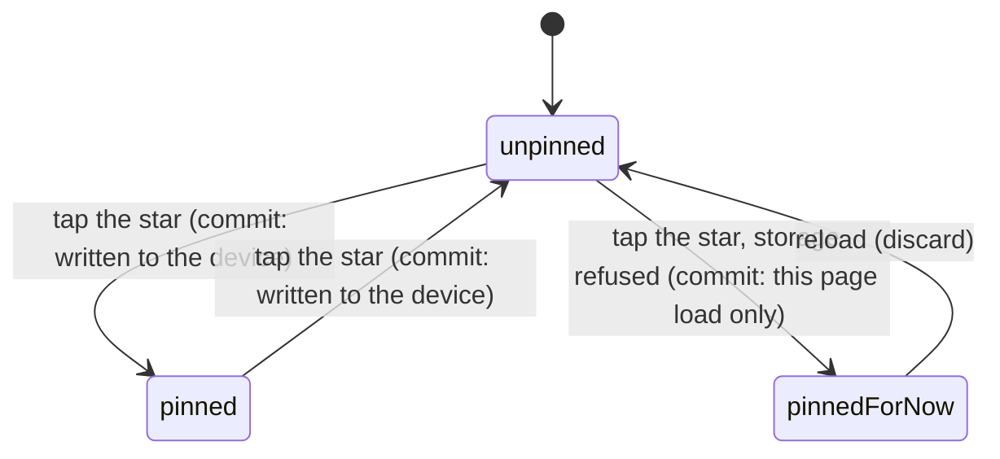

# Favourites

## Summary

Starring a card pins it to a shelf at the top of the vault and fills the star on
every grid the card appears in. It is the only per-card state anyone can set
without being anybody: it costs nothing, tells nobody, reaches no server, and
never leaves the phone it was set on.

The control is a star in the top-right corner of a card tile in
[the vault](the-vault.md), on roster tiles and secret tiles alike. The same
toggle appears on [a player card](a-player-card.md) as a chip reading "Pin" or
"Pinned" in that page's secondary settings. A filled star means pinned. The star
is not drawn at all on a *locked* card — a slot you have not opened yet — because
there is no copy to pin and nothing to show on the shelf.

## The simple case

You are scrolling the vault, you see a card you like, and you tap the star in its
corner. The star fills. A shelf called "Favourites" appears at the top of the
page with that card on it, and the card disappears from the shelf it was on — it
moves rather than appearing twice.

Tap the star again, on either copy of the tile, and it empties. The card returns
to its own shelf. If it was the only thing pinned, the Favourites shelf goes away
entirely rather than sitting there empty.

Nothing is submitted and nothing is confirmed. The change is on screen before
your thumb leaves the glass, and it is still there when you come back to the app
tomorrow — on that phone, in that browser.

## The interaction, event by event

### Arrive

The vault is drawn from two sources at once, and the pinned shelf is built from
the intersection. The list of pinned ids is read from the device; the cards
themselves come from the event roster and from the secrets you own.

The list is read *after* the first paint, never during it. On the first frame the
vault renders as though nothing is pinned, and the shelf appears a moment later.

> Technical note: the server has no access to the device's storage, so reading
> the list during render would hand the browser a different first paint than the
> one it is hydrating against. Every device preference in this app — the shelf
> order, the sound toggle, the trade badge — does the same dance for the same
> reason.

Each stored id is walked in the order it was pinned and matched against a roster
row or an owned secret. An id that matches neither is skipped in silence: the
card was traded away, or this device pinned it against a different combine.
Neither is worth an error, and neither is worth a gap on the shelf.

Ids carry a prefix — `p:` for a roster card, `s:` for a secret — so a roster card
and a secret can never collide even if the two tables mint the same identifier.

### Leave without acting

Nothing is recorded. Opening the vault, scrolling it, and leaving writes nothing
about favourites: no view count, no last-seen, no server call. The shelf you saw
is the shelf that was already there.

### The tap that starts something

The tap on the star is the whole write. What is decided at that instant:

- The card is appended to the *end* of the list, not the front. The shelf reads
  in the order you built it, so a card you pinned weeks ago is not shoved down
  the page every time you pin another.
- Only the id is stored. Never the edition the card is wearing — a trade can take
  your best copy away, and a cached finish would strand a favourite wearing metal
  its owner no longer holds.
- The tap does not reach the card underneath. A roster tile wraps its entire body
  in a link to the player page, and the star sits over it as a sibling rather
  than a child; it stops the event dead. A star that let the click through would
  open the player page every time somebody pinned a card.

### While it runs

There is no window. The write is synchronous, and there is no request, no
spinner, no disabled state and no way to cancel between tapping and the star
filling.

Two things happen in the same beat: the list is written to the device, and every
mounted grid is told. The vault's grid and the player page share one shelf, so
pinning from one lights the star on the other immediately.

### It settles

The star is filled, the Favourites shelf holds the card, and the shelf it came
from is one card shorter. If this is the first card ever pinned on this device,
the shelf is created and placed at the top of the page — but it is an ordinary
shelf from then on, and can be moved or rolled up like any other.

The failure path is quiet by design. If the browser refuses to store — private
mode, a full quota — the star still fills and the shelf still appears, and the
pin is lost on the next reload. The app trusts what it last set rather than
re-reading storage, precisely so the star does not visibly un-fill under the
thumb that tapped it. Losing a pin on reload is the honest cost; a star that
ignores the tap is not.

## Modifiers

| Modifier | At arrival | Changed during |
| --- | --- | --- |
| Who you are (guest · member · account · commissioner) | No effect. Favourites are per-device and ask for no identity. A guest, a member and the commissioner all get the same star on the same tiles. | No effect. Claiming a player or signing in neither carries pins across nor clears them; they belong to the browser. |
| The event's state (before the combine · running · finished) | No effect on the control. It changes which cards exist to pin, and a pinned card from a previous combine simply does not resolve. | A card whose tier upgrades mid-combine keeps its pin; the shelf redraws it at its new tier. |
| Dust switched on or off | No effect. | No effect. |
| The device (phone · desktop · reduced motion · presentation mode) | The star is dimmed rather than hidden-until-hover, because hover does not exist on the phone this is played on and a control you cannot find is not one. Under presentation mode the whole vault is inert. | No effect on the pin itself. |

Changing who you are mid-session is the only one of these with a trap in it, and
the answer is that there is no trap: pins are keyed to nothing but the browser,
so signing in on a second phone gives you your collection without your shelf.

## Cancel and interrupt

| Event | Before the tap | After the tap |
| --- | --- | --- |
| Back, or closing a sheet | Nothing to cancel. | Nothing to undo — the write already happened. Tapping the star again is the only way back, and it is not called undo. |
| Navigating away inside the app | No effect. | The pin is already written. The star is filled when you return. |
| Reload | No effect. | The pin survives, unless storage was refused, in which case it is gone. |
| Backgrounded | No effect. | No effect; nothing was in flight. |
| Network lost mid-request | No effect. There is no request. | No effect. Pinning works with the radio off. |
| The request fails or times out | Not applicable. | Not applicable. |
| The token expires or is cleared | No effect. Favourites need no token. | No effect. Signing out leaves the shelf exactly as it was. |
| Changed by someone else | A card traded away between the list being read and the grid being drawn resolves to nothing and is skipped. | A card traded away *after* pinning stops appearing on the shelf. The id stays stored, so the pin returns if the card ever comes back. |
| A second tab or device | The other tab's pins are read on arrival. | A pin made in another tab arrives and redraws this one. A second *device* shares nothing. |
| Reduced motion or presentation mode changes | No effect. | No effect. |

After any of these the user is still on the vault, still looking at the same
shelf. Nothing about favourites is ever left half-done, because there is no half:
the list is replaced whole or not at all.

> Technical note: a pin made in this tab and a pin made in another arrive by two
> different routes, and the app treats them differently on purpose. Its own
> writes are trusted from memory; another tab's are re-read from storage, because
> that tab actually did save.

## Interactions with other systems

**Who you have to be.** Nobody. This is the only card-level state in the app with
no guard behind it, because there is no server call to guard.

**Realtime.** None. No channel carries favourites, and no other player learns
that you pinned anything.

**Offline and reconnection.** Fully functional offline. Pinning, unpinning and
the shelf itself need no connection; only the card art behind them does.

**Optimistic updates and rollback.** Not applicable in the usual sense — there is
nothing to roll back to. The nearest thing is the blocked-storage path, where the
screen shows a pin the device did not keep, and reload is the correction.

**The card economy.** Favourites cost nothing, pay nothing and are not counted.
Pinning a spare does not protect it: it can still be milled, sold, listed or
traded away, and the shelf simply loses the card when it goes.

**Motion and sound.** No chime and no animation. The star fills through a colour
transition and nothing else, which is deliberate for a control tapped this often.

**Notifications and badges.** None. Nothing on the nav reflects favourites.

**Sharing.** Not shared and not exported. A card image exported from the player
page carries no sign of whether it was pinned.

**The second device.** Nothing is synchronised. Two phones signed into the same
account hold the same collection and two different shelves. This is a deliberate
consequence of storing pins per device rather than per member; if that ever
changes, it is one module's worth of work.

**Accessibility.** The star is a single toggle button reporting its state through
`aria-pressed` rather than swapping to a different control, so a screen reader
announces the change on the button the user just operated. Its label names the
card and the direction of travel — "Pin Alice Ace to the top", "Unpin Alice Ace
from the top" — so the control is unambiguous in a grid of thirty identical
stars. The star glyph itself is hidden from assistive technology.

## Edge cases

- **A card you no longer own.** The id stays stored and the card silently leaves
  the shelf. If the card comes back — traded back, pulled again — it reappears in
  its original position in the pin order.
- **A locked card.** No star is drawn, on the tile or on the player page. You
  cannot pin a slot you have not opened.
- **Every card in a secret set pinned.** That set's shelf disappears from the
  lower half of the page, because a pinned card moves rather than duplicating.
- **Nothing pinned.** There is no empty Favourites shelf. It is absent, not
  empty, on the same reasoning as the trophy shelf: a shelf that says "nothing
  yet" is a running reminder of something you have not done.
- **Junk under the key.** Anything that is not a list of strings — a bad parse, a
  wrong shape, another script's data — reads as an empty shelf rather than an
  error.
- **Duplicate taps.** Toggling is a true toggle; the same card can never be
  stored twice.
- **The same uuid on a roster card and a secret.** Impossible to confuse: the two
  id spaces are prefixed apart, and there is a test that says so.
- **Pinning from the player page.** The chip lives among that page's settings
  rather than its actions, alongside Tilt, because it changes how the card
  behaves rather than being the reason anyone opened the page.

## Open questions and verification

- The exact position of the Favourites shelf after a device has reordered its
  vault sections was read from the layout rules rather than observed. It is
  seeded first and stays movable, but which position it takes when a previously
  emptied shelf comes back has not been confirmed by hand.
- Whether a card pinned against a previous combine reappears if that combine
  becomes active again was inferred from the id-matching rule, not tested.
- The blocked-storage path was read from the code and its unit test; it has not
  been watched in a real private-mode browser on a phone.
- Assumption: no other feature reads or writes the favourites key. Nothing in the
  source does, but a stray write from a browser extension would present as junk,
  which reads as an empty shelf.

Verified against willyoubemyhero commit `b46f330`.
