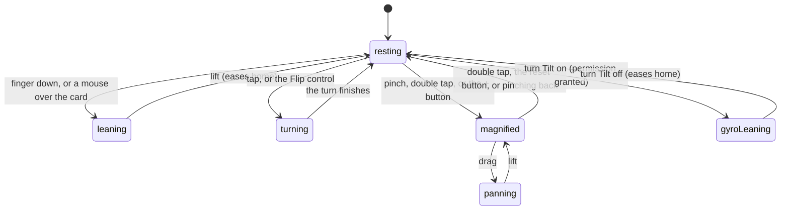

# Looking closer

## Summary

Handling a card. A full-size card leans under your thumb, blooms its foil where
the light would catch it, magnifies to four times its size under a pinch, turns
over on a tap, and — once you have given the browser permission — follows the
phone itself as you tilt it. This document owns those four gestures and how they
divide the screen between them.

They only exist where there is one card to handle: the hero card on
[a player card](a-player-card.md) and the sheet that opens a secret from
[the vault](the-vault.md). Every other card in the app — a vault tile, a
filmstrip thumbnail, a card on the pack's reveal stand — is deliberately quieter,
because thirty cards each running a tilt is what makes a phone crawl.

## The simple case

You are on a player's page. You put a thumb on the card and it immediately leans
away from you, from wherever you landed — you do not have to move for anything to
happen. Drag and it follows, instantly, with a band of foil sweeping across the
art and glints crawling over it at their own speed. Lift your thumb and it eases
back to flat and the foil fades out.

You tap it. It turns over — slowly out of the flat, quickly through edge-on,
settling a few degrees past its mark and rocking back — and the stat panel is
facing you. You tap again and it comes back, with a specular pass across the
front as it lands.

You pinch. The card grows under your fingers, and the point between them stays
where it is. Now the card no longer leans; the frame owns your finger, and
dragging pans the magnified art instead. Double tap and you are back at 1x.

## Which gesture wins

The card and the magnifier around it are two separate things, and they divide the
screen by state rather than by area.

| At 1x                                          | Magnified                           |
| ---------------------------------------------- | ----------------------------------- |
| The card leans under a finger or a mouse       | The card is flat and inert          |
| A drag tilts and does not scroll the page      | A drag pans the card                |
| A fast horizontal swipe steps to the next card | A drag is a pan and never navigates |
| A tap turns the card over                      | A tap still turns the card over     |
| A double tap magnifies to 2.4x                 | A double tap returns to 1x          |

> Technical note: the hero card claims the entire touch gesture — the page will
> not scroll while a finger is on it. That is not tuning, it is the only option:
> a browser decides once, at the start of a gesture, whether it owns the pan, and
> it never hands one back. The middle setting used to be in place and produced
> the complaint that "holding it barely tilts": vertical travel never reached the
> card at all, and the moment a thumb drifted a few pixels down the browser
> cancelled the gesture and the card snapped flat mid-drag.

## The interaction, event by event

### Arrive

The card arrives flat, face up, at 1x, with the device tilt off. None of that is
remembered between visits, and stepping from one card to the next resets the face
without resetting Tilt.

The card measures itself once as it mounts so that the first lean already sits at
the right camera distance instead of popping there on the first frame. Nothing
else is decided on arrival: there is no permission asked for, no setting read,
and no request made by any of this.

The tier decides how the card behaves at rest. A champion, a podium card and a
secret crawl gently on their own; the other tiers sit still until touched. Any
resting animation is dropped the moment a finger takes over, and never runs at
thumbnail size or under reduced motion.

### Leave without acting

Nothing is recorded. Tilting, zooming and flipping a card write nothing, tell
nobody and are gone the moment you leave the screen. There is no "last viewed
face" and no zoom that survives a reload.

### The tap that starts something

The only thing on this page that commits anything is **Tilt** — and only on a
phone that gates motion access.

Tapping Tilt asks the browser for permission to read the device's orientation.
That prompt has to come from a tap, which is exactly why the control is a chip
rather than something that turns itself on. Grant it and the card starts
following the handset. Deny it and a message says "Motion access denied" and the
chip stays off; there is no second prompt, because that decision belongs to the
browser from then on.

On everything else the chip simply turns on, with no prompt at all — which is
also true on a laptop with no gyroscope in it, where Tilt reports success and
then nothing happens.

### While it runs

The card tracks the finger with no easing at all, on purpose: easing here reads
as the card dragging behind your hand. The ease only appears on the way home,
which is why letting go feels like putting something down rather than dropping
it.

A single tap does not turn the card over immediately. It is held for a third of a
second in case a second tap is coming, because otherwise the first half of a
double tap would flip the card on its way to magnifying it.

While Tilt is on, the first reading taken is treated as level. The card is
oriented to however you happen to be holding the phone — standing at the bar,
lying on a couch — and about thirty degrees of roll sweeps it corner to corner.

The turn itself takes half a second: slow to leave the flat, quick through
edge-on, and it settles about three degrees past its mark before coming back. A
card that arrives exactly on its mark and stops reads as a number being
interpolated; one that overshoots and rocks reads as an object with mass. Light
runs across the edge as it turns and a specular pass crosses the face as it
lands, but **only on the way to the front** — turning a card back over to read
its stats is navigation, and celebrating somebody checking a number would be
wrong.

### It settles

The card is flat, or magnified and panned to wherever you left it, showing
whichever face you left showing. Nothing is written and nothing is confirmed.

Turning Tilt off eases the card home rather than leaving it cocked over with the
foil still lit. Stepping to another card resets the face and the zoom. Leaving
the screen resets everything.

## Modifiers

| Modifier                                                          | At arrival                                                                                                                                                                                                                                                                                                                                                          | Changed during                                                                                                                                                         |
| ----------------------------------------------------------------- | ------------------------------------------------------------------------------------------------------------------------------------------------------------------------------------------------------------------------------------------------------------------------------------------------------------------------------------------------------------------- | ---------------------------------------------------------------------------------------------------------------------------------------------------------------------- |
| Who you are (guest · member · account · commissioner)             | No effect. Handling a card asks for no identity. What identity decides is whether there is a face-up card to handle — a card you have not pulled has no magnifier around it at all, because there is nothing to pinch.                                                                                                                                              | No effect.                                                                                                                                                             |
| The event's state (before the combine · running · finished)       | The tier decides the foil pattern, the bezel, the resting crawl and the chime, so a card's behaviour changes as its tier does.                                                                                                                                                                                                                                      | A tier changing mid-combine redraws the card without interrupting a gesture in progress.                                                                               |
| Dust switched on or off                                           | No effect.                                                                                                                                                                                                                                                                                                                                                          | No effect.                                                                                                                                                             |
| The device (phone · desktop · reduced motion · presentation mode) | On a mouse, hover alone tilts and there is no permission prompt anywhere. On a phone the card must be touched, and a thumb's travel is amplified because a thumb wiggles a centimetre where a mouse sweeps the whole card. Reduced motion switches off the tilt, the resting crawl, the foil bloom and the turn's animation — a card still changes face, instantly. | Reduced motion is a live subscription: flipping the OS setting while a card is on screen takes effect immediately, and does not itself count as the card turning over. |

## Cancel and interrupt

| Event                                       | Before anything is stored                                                                                                                                                                  | After                                                     |
| ------------------------------------------- | ------------------------------------------------------------------------------------------------------------------------------------------------------------------------------------------ | --------------------------------------------------------- |
| Back, or closing a sheet                    | The card eases home. Nothing is lost, because nothing was held.                                                                                                                            | Not applicable — nothing about handling a card is stored. |
| Navigating away inside the app              | The zoom and the face reset. Tilt survives, because it belongs to the page rather than to the card.                                                                                        | Same.                                                     |
| Reload                                      | Everything resets: flat, face up, 1x, Tilt off. On a phone the motion permission itself is remembered by the browser, so turning Tilt back on may not prompt again.                        | Same.                                                     |
| Backgrounded                                | The card stops receiving orientation events and any animation pauses. It resumes where it was.                                                                                             | Same.                                                     |
| Network lost mid-request                    | No effect. None of these gestures makes a request. A card whose art never arrived shows the player's initials and still tilts, zooms and turns.                                            | No effect.                                                |
| The request fails or times out              | Not applicable. Where the artwork itself fails, the card steps down through smaller renditions before giving up, so a stalled fetch is usually invisible.                                  | Not applicable.                                           |
| The token expires or is cleared             | No effect on the gestures. A member's card can become a face-down slot underneath them, which removes the magnifier because there is nothing to look at.                                   | Not applicable.                                           |
| Changed by someone else                     | A tier arriving over realtime restyles the card mid-gesture. It does not interrupt a drag, a pinch or a turn.                                                                              | Not applicable.                                           |
| A second tab or device                      | Nothing is shared. Two tabs handle their own cards independently; the sound setting is the only thing that crosses between them.                                                           | Not applicable.                                           |
| Reduced motion or presentation mode changes | Reduced motion switching on mid-drag stops the card responding and it stays where the last frame put it until released. A ceremony taking the screen leaves the card as it was underneath. | Not applicable.                                           |

## Interactions with other systems

**Who you have to be.** Nobody. There is no guard, because there is no server
call — this is the largest interactive surface in the app that never touches the
database.

**Realtime.** None of its own. A tier arriving over the event channel changes how
the card looks while you are holding it.

**Offline and reconnection.** Fully functional offline, art permitting.

**Optimistic updates and rollback.** Not applicable.

**The card economy.** The finish adds an inner metal frame and a second glow on
top of the tier's, so both axes are visible at once; the tier's own glow is never
taken away to make room. A secret's prism edge traces the bezel and rides along
on both faces.

**Motion and sound.** The turn plays a card-stock sound where the card handles
its own tap. The Sound chip on a player's page mutes every card sound in the app
for this device, and unmuting is itself the tap that unlocks audio on browsers
that keep it suspended. Reduced motion silences everything and flattens the turn
to an instant change of face.

**Notifications and badges.** None.

**Sharing.** The exported image is a composed graphic, not a screenshot: it does
not carry the tilt, the zoom or the face you left the card on.

**The second device.** Nothing is shared. Motion permission in particular is per
browser, so granting it on a phone says nothing about a tablet.

**Accessibility.** The card is a button that reports which face is showing, so a
screen reader announces the change on the control the user just operated. Its
label names the player, the tier and the finish, and says the card can be
pressed to flip. Enter and Space turn it over. Every zoom and step control has a
name. The foil, the sparkle, the prism edge and the metal frame are all hidden
from assistive technology — they are decoration and nothing else.

## Edge cases

- **A generated back takes only the glare**, not the full foil, so the stats on it
  stay legible. Uploaded back artwork gets the whole treatment.
- **A pinch that ends with one finger still down** hands straight over to panning
  rather than making you lift and touch again.
- **A magnified card cannot be panned into empty space.** The offset is clamped so
  the frame always shows card.
- **A trackpad pinch and a wheel** both zoom; once magnified, an ordinary scroll
  over the card keeps zooming rather than scrolling the page out from under it.
- **A card thrown sideways** steps to the next card on the surfaces that offer
  one. On the pack's reveal stand the same throw turns the card over instead, and
  a throw that the system interrupts — an app switch, an incoming call — is
  deliberately not completed, because it is an interaction the user abandoned.
- **A secret opened from the vault swipes to the next secret you hold** rather
  than to a roster card, and always arrives face up however the last one was
  left.
- **Turning Tilt on twice** is a toggle: the second tap turns it off and the card
  eases home.
- **A device with no gyroscope** still lets Tilt switch on. Nothing happens, and
  nothing says so.
- **Reduced motion makes Tilt inert** even when it is switched on and permitted.

## Open questions and verification

- The permission prompt is the single most worthwhile thing here to check by
  hand, on a real phone, both granted and denied — including what happens on a
  second visit after a denial, which the source cannot answer because the answer
  belongs to the browser.
- Turning the card over on a player's page and in the secret sheet makes no
  sound. The sound exists and fires where the card handles its own tap, but the
  magnifier around it takes the tap first, so on both full-size surfaces it is
  never reached. Raised for triage.
- Tilt reporting success on a device with no motion sensor was read from the
  feature detection and not observed. A chip that lights up and does nothing is
  worth a product decision.
- Whether the tilt genuinely tracks without lag on an older phone, with the foil
  layers mounted, has not been measured.
- Whether the overshoot at the end of a turn reads as mass rather than as a
  wobble is a design intent stated in the source and has not been watched
  outdoors, which is where this app is used.

Verified against willyoubemyhero commit `b46f330`.
