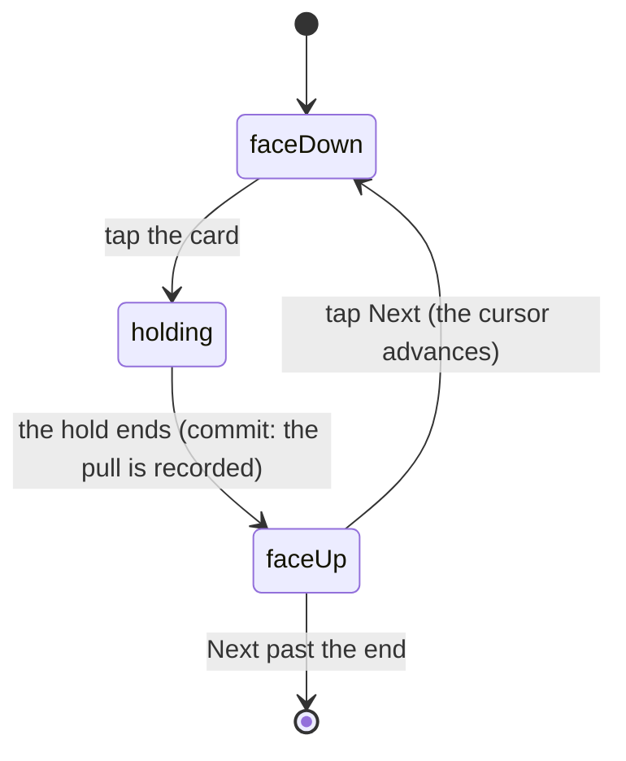

# Opening a pack

## Summary

From the moment the rip commits to the moment you walk off the end of the reveal
stand, the pack owns the whole screen. Two stages sit inside that: the
**ceremony**, which is the rest of the rip and the cards leaving the pack, and
the **reveal**, which is one card at a time on a stand, face-down until you turn
it.

What happens before the commit is [the sealed pack](the-sealed-pack.md); what
happens after you step off the end is [what you pulled](what-you-pulled.md). What
a secret is and how one gets into the pack is
[secrets in the pack](the-daily-secret.md); how the stand treats one is described
here, because it is the reveal stand's business.

## The simple case

The rip finishes travelling on its own. The strip breaks into shards and tumbles
away, light escapes the mouth of the pack, and the cards rise out still stacked,
spread into a fan hanging in front of you, hold there for a beat, then square up
into a deck.

The stand takes over. One card, face-down, on a mark in the middle of the screen.
Tap it. If it is a card you did not have, or better than the one you have, it
holds for a moment on a glowing edge; then it turns: a chime, the card's foil,
its name, a stamp in the corner saying NEW or ↑ GOLD or ×3, and confetti if the
pull deserved it. Tap Next and the following card arrives face-down. Do that
three times and you walk off the end into the columns.

Any of the three can be a secret. You find out on the stand: the room goes dark
around the face-down card and its edge starts to breathe.

There is a Skip control on screen throughout, for anyone who has seen it enough
times.

## The ceremony

Nine phases, about four seconds in total, and the rule the table is built on is
that **every phase has something that is changing**.

| Phase      | What is happening                                                        |
| ---------- | ------------------------------------------------------------------------ |
| anticipate | The pack takes the strain — a squash, before anything comes apart        |
| seam       | The seam lights and builds; the tear line is under tension, not yet open |
| rip        | The rip finishes travelling on its own, from wherever the finger stopped |
| peel       | The strip breaks into shards and tumbles away; light escapes the mouth   |
| launch     | Cards rise out of the mouth, still stacked                               |
| fan        | They spread into an arc hovering in front of the viewer                  |
| hold       | A beat where nothing moves, so the fan can be looked at                  |
| handoff    | They square up into a deck on the stand's mark                           |
| done       | Off the end — the stand owns the screen                                  |

> Technical note: the ceremony exists because the tear used to commit at 60% of
> the drag and unmount the wrapper on that same frame, so the strip never
> travelled the rest of the width and never came off. What the user saw was a
> crease.

Two pieces of that table are worth knowing because they are the difference
between the sequence reading well and reading badly. There is no phase in which
the pack is simply open and lit with nothing coming out of it — a held frame by
definition, which made the whole thing read as a slideshow being clicked through.
And the handoff is exactly long enough for the deck's spring to settle, because a
shorter one hands the stand a deck that is still moving, which is a visible jump
on the one frame both are on screen.

The cards come out in two stages rather than one long move from inside the pack
to the spread fan: cards that come _out_ and then _open_ read as a pack being
emptied, where a single move reads as a fan that happened to start small.

The fan is three identical backs, every day. It knows nothing about which cards
are coming and gives nothing away — a secret used to fly out wearing its rainbow
bezel, and that was a tell.

Each card carries a small amount of seeded jitter — a couple of degrees off its
own angle, a slightly different spring — so the fan reads as a hand somebody is
holding rather than as something machined. It is seeded off the pack, so a given
pack always opens the same way and a re-render mid-flight cannot re-roll a card's
angle underneath it.

Reduced motion silences the ceremony entirely. The pack still opens and the cards
are still dealt; only the production is skipped.

## The interaction, event by event

The unit here is one card's turn on the stand.

### Arrive

The ceremony hands over a deck on the stand's mark, and the stand mounts its
first card face-down on that same mark. Arriving at a pack you already tore skips
all of that and lands you on the card you were looking at — including one you had
turned but not pressed Next on.

Which card is on the stand, and how many are left, is decided here: three steps,
whatever kind of card is in each. If the server has not answered yet the stand
shows a pulsing back where the first card will be, and an inline retry if it
never does.

### Leave without acting

Nothing is recorded by looking. A card that is face-down stays face-down, the
position is already written, and coming back resumes exactly here.

The cards themselves are a different matter: the pack was dealt at the rip and a
member's copies were minted then, so leaving without turning anything does not
give the cards back. See [the sealed pack](the-sealed-pack.md#the-tap-that-starts-something).

### The tap that starts something

Tapping the face-down card. Everything about that card's turn is decided at that
instant: whether it holds first, which chime will play, which burst fires if
any, what the stamp in the corner says, and whether a second cue rides over the
top of the first for a special finish.

The tap is latched synchronously rather than through state, because neither a
second tap in the same tick nor a tap during the hold that follows is visible in
the revealed list yet.

### While it runs

A card worth waiting for holds face-down on a glowing edge for a beat before it
turns — every secret, and any roster card that is new to you or better than
yours. A plain duplicate turns straight over. For the whole of the hold the card
is still tappable, which used to be enough to run the entire sequence twice over
one card.

Nothing else on the screen is disabled. The Skip control is still there, and the
nav bars are faded and inert because a ceremony has the device.

### It settles

The card turns, the chime plays, and the pull is written into this device's
collection. The cursor does **not** move: a card you have not looked at yet is
not a card you are done with, so the run waits for Next.

A roster card whose finish the server did not mint — the daily cap was reached —
settles as Standard and claims nothing.

## The reveal stand

**The cursor advances only when you say so.** Revealing a card does not move it
on, because a card you have not looked at yet is not a card you are done with.
Walking off the end is what hands over to the columns.

**A card holds face-down before it turns.** That hold is load-bearing rather than
decorative: it is what forces the cursor move and the reveal into separate
renders. Batched together, the stand mounts the card already face-up and there is
no flip to see.

**The hold answers taps, and that used to be a bug.** For the whole of it the
card is still face-down and still tappable, so a second tap started an entire
second ceremony over the same card: two holds, two chimes, two confetti bursts,
two writes into the collection. It is latched now, and the latch is read
synchronously rather than from state, because neither a second tap in the same
tick nor a tap during the hold is visible in the revealed list yet.

**The finish arrives with the pack.** Every roster slot carries the finish
Postgres minted for your copy, and every secret slot the level it rolled. A slot
the server minted nothing for shows a Standard finish and the cues that would
celebrate a better one stay silent — a shine or a burst fired off a fallback is a
promise about a finish nobody has decided.

**Two cues, not one.** The tier chooses the chime. A special finish adds a second
cue over the top of it rather than replacing it, because the tier and the finish
are separate facts and the ear should hear them that way. Silent below gold, and
silent for a finish the server did not mint.

## New, better, or another one

Every slot is one of three things to the person turning it, and the stand says
which on the card's frame the moment it is face-up:

| Outcome       | What it means                                                                                      | The stamp        | The hold | The burst                                                              |
| ------------- | -------------------------------------------------------------------------------------------------- | ---------------- | -------- | ---------------------------------------------------------------------- |
| **New**       | No copy held before this pack.                                                                     | NEW              | Yes      | A new secret's framed shot from the corners. A new roster card: quiet. |
| **Upgrade**   | A duplicate whose finish (roster) or level (secret) strictly beats the best copy you already hold. | ↑ GOLD, ↑ EPIC … | Yes      | Two short columns straight up, in the new rung's metal.                |
| **Duplicate** | Another one, no better.                                                                            | ×N               | No       | Quiet. A duplicate secret shimmers; a wink, not a parade.              |

The tier's own celebration comes first whatever the outcome: a champion is a
champion in every collection, and a gold or better finish fires the confetti on
a base card. Only when the card itself is not a party does the collection get a
say, and then an upgrade is the louder of the two answers left — it is the one
the person did not have yesterday.

"Held before" is the server's own ledger for a member, snapshotted at the deal.
For a guest, whose collection lives on the phone, it is the phone's store at the
tear, written onto the pack row so the stamp reads the same after a reload.

## A secret on the stand

A secret is a step like any other: the same position in the heading, the same
dot in the row. What it gets is the card's own production, wherever in the pack
it landed.

Face-down, the room dims and the card's edge breathes a slow ring — that is the
first and only thing that says "secret" before the turn. The hold is longer than
a roster card's, with a riser under it. The turn is more than twice the house
length. As the face lands the screen goes black, flashes white through the
secret's own colour, and the whole column jolts. Then the level pips, the caption,
and the burst the outcome earned.

> Technical note: this used to be a fourth card with a piece of theatre in front
> of it — a fake "Pack Complete", a glitch, a bare stage — which only worked
> because the secret was always last. It can be first, second or third now, so
> the production kept everything that belonged to the card and dropped
> everything that belonged to its position.

## Modifiers

| Modifier                                                          | At arrival                                                                                                                                                                                            | Changed during                                                                                                          |
| ----------------------------------------------------------------- | ----------------------------------------------------------------------------------------------------------------------------------------------------------------------------------------------------- | ----------------------------------------------------------------------------------------------------------------------- |
| Who you are (guest · member · account · commissioner)             | A guest reveals the same kinds of card a member does. A guest's roster cards carry no finish — nothing is minted for them until they claim — and their "held before" is the phone's.                  | A guest who claims mid-pack returns to the same torn pack; the cards still face-down are filed one by one as they turn. |
| The event's state                                                 | The tiers on the revealed cards are whatever the event says right now.                                                                                                                                | A result landing mid-reveal can change a card's tier while you are looking at it.                                       |
| Dust switched on or off                                           | Decides whether a duplicate's line says what it would sell for.                                                                                                                                       | No effect.                                                                                                              |
| The device (phone · desktop · reduced motion · presentation mode) | Reduced motion skips the ceremony outright and the slam; the dark room still arrives for a secret. The screen enters presentation mode for the whole of this, so both nav bars fade and become inert. | Turning reduced motion on mid-sequence does not restart anything; it takes effect at the next beat.                     |

## Cancel and interrupt

| Event                                       | During the ceremony                                                           | On the stand                                                                                   |
| ------------------------------------------- | ----------------------------------------------------------------------------- | ---------------------------------------------------------------------------------------------- |
| Back, or closing a sheet                    | The cards are already dealt. Returning resumes on the first unturned card.    | Returning lands on the card you were on, including one you had turned but not pressed Next on. |
| Navigating away inside the app              | Same.                                                                         | Same. The position is written as it goes.                                                      |
| Reload                                      | The ceremony does not replay. You land on the card you were on.               | Same.                                                                                          |
| Backgrounded                                | The ceremony's clock keeps running; you may return past it.                   | A card mid-hold completes.                                                                     |
| Network lost mid-request                    | The deal is in the air. The stand shows a pulsing back, then an inline retry. | Cards already on the stand turn normally. A reload needs the network again for the art.        |
| The request fails or times out              | An inline retry where the first card would be; the retry gets the same pack.  | Same, on a reload.                                                                             |
| The token expires or is cleared             | No effect on cards already dealt.                                             | Same.                                                                                          |
| Changed by someone else                     | A tier can change under a card mid-reveal.                                    | Same.                                                                                          |
| A second tab or device                      | Both tabs read the same stored pack. The second does not replay the ceremony. | The position written by one tab is what the other resumes from.                                |
| Reduced motion or presentation mode changes | Turning reduced motion on does not stop a ceremony already playing.           | Takes effect at the next beat.                                                                 |

Nothing here can lose a card. The revealed set is written as each card turns, and
the position is written with it, so every interrupt resumes rather than restarts.

## Interactions with other systems

**Who you have to be.** Nobody. A guest is dealt the same kinds of card.

**Realtime.** Tier changes arrive live and can redraw a card that is on the stand.

**Offline and reconnection.** Turning cards already on the stand works offline.
The deal, and a reload's re-read for the art, do not.

**Optimistic updates and rollback.** A card is written into the local collection
as it turns, held apart from the reconciled one — a card the server has not
vouched for is exactly what a merge would prune, so without that separation a
guest's card would light up as they flipped it and then vanish. A member's copies
were minted at the deal, so the server vouches for them before they are turned.

**The card economy.** This is where cards enter a collection. A gold or better
finish fires the confetti whatever the tier did — a base card can stop the garden
if the roll was good enough. A duplicate's line says what it would sell for,
when dust is on.

**Motion and sound.** The whole document is motion and sound. See
[motion and sound](../cross-cutting/motion-and-sound.md) for the preferences that
change it.

**Notifications and badges.** Completing a set during a pack raises a trophy, and
it is deliberately held until the card has been turned over — you see _which_
card it was, and only then find out it was the last one.

**Sharing.** The summary can be shared, not the reveal.

**The second device.** The pack is the same; the position is not shared.

**Accessibility.** Reduced motion is honoured throughout. The stand is a tap
target with a heading that names which step it is on; the stamp on the frame is
labelled for a reader ("New card", "Upgraded to Gold — you now hold 2 of this
card", "You now hold 3 of this card").

## Edge cases

- **A very narrow phone.** The pack measures its real width and scales the fan by
  the ratio, rather than letting a card escape the viewport and be clipped.
- **A single card in the fan** sits dead centre rather than dividing by zero.
- **A card the server minted no finish for** shows Standard and claims nothing.
- **A duplicate secret you have seen enough of.** After a few, the hold is
  skipped: the full production on the fourth copy is a tax.
- **The automatic run** — the Skip path — steps through the remaining cards
  itself, holding each face-down for a beat so the flip is seen.
- **Turning a card twice** is impossible. Two independent latches, both read
  synchronously.
- **A carried pack.** A guest who tears, claims and comes back finds the cards
  the claim's adoption never saw filed one by one as they are turned.

## Open questions and verification

- Whether the four-second ceremony still reads as dense rather than long on a
  phone at arm's length is a judgement the source has revisited three times; it
  should be watched rather than taken on trust.
- Whether the dark room and the breathing ring are enough of a tell for a secret
  that arrives first in the pack, with no fan bezel ahead of it, has not been
  watched in a garden.
- Whether a tier changing under a card that is currently face-up on the stand
  produces anything jarring has not been watched.
- Assumption: the ceremony's timings are what ship. They are a table in the
  source, tuned against real phones, and are quoted here as read.

Verified against willyoubemyhero commit `752d4fb`.
