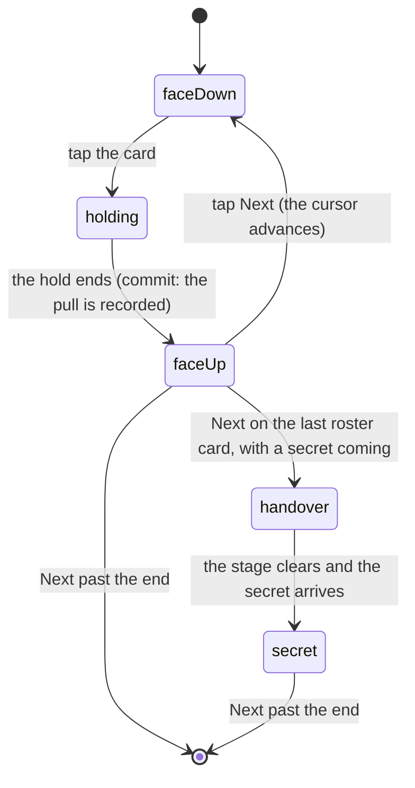

# Opening a pack

## Summary

From the moment the rip commits to the moment you walk off the end of the reveal
stand, the pack owns the whole screen. Two stages sit inside that: the
**ceremony**, which is the rest of the rip and the cards leaving the pack, and
the **reveal**, which is one card at a time on a stand, face-down until you turn
it.

What happens before the commit is [the sealed pack](the-sealed-pack.md); what
happens after you step off the end is [what you pulled](what-you-pulled.md). The
fourth card has its own document — [the daily secret](the-daily-secret.md) — but
the handover to it is described here, because it is the reveal stand's business.

## The simple case

The rip finishes travelling on its own. The strip breaks into shards and tumbles
away, light escapes the mouth of the pack, and the cards rise out still stacked,
spread into a fan hanging in front of you, hold there for a beat, then square up
into a deck.

The stand takes over. One card, face-down, on a mark in the middle of the screen.
Tap it. It holds for a moment on a glowing edge, then turns: a chime, the card's
foil, its name, and confetti if the pull deserved it. Tap Next and the following
card arrives face-down. Do that three times and you walk off the end into the
columns.

There is a Skip control on screen throughout, for anyone who has seen it enough
times.

## The ceremony

Nine phases, about four seconds in total, and the rule the table is built on is
that **every phase has something that is changing**.

| Phase | What is happening |
| --- | --- |
| anticipate | The pack takes the strain — a squash, before anything comes apart |
| seam | The seam lights and builds; the tear line is under tension, not yet open |
| rip | The rip finishes travelling on its own, from wherever the finger stopped |
| peel | The strip breaks into shards and tumbles away; light escapes the mouth |
| launch | Cards rise out of the mouth, still stacked |
| fan | They spread into an arc hovering in front of the viewer |
| hold | A beat where nothing moves, so the fan can be looked at |
| handoff | They square up into a deck on the stand's mark |
| done | Off the end — the stand owns the screen |

> Technical note: the ceremony exists because the tear used to commit at 60% of
> the drag and unmount the wrapper on that same frame, so the strip never
> travelled the rest of the width and never came off. What the user saw was a
> crease.

Two pieces of that table are worth knowing because they are the difference
between the sequence reading well and reading badly. There is no phase in which
the pack is simply open and lit with nothing coming out of it — a held frame by
definition, which made the whole thing read as a slideshow being clicked through.
And the handoff is exactly long enough for the deck's spring to settle, because a
shorter one hands the stand a deck that is still moving, which is a visible jump
on the one frame both are on screen.

The cards come out in two stages rather than one long move from inside the pack
to the spread fan: cards that come *out* and then *open* read as a pack being
emptied, where a single move reads as a fan that happened to start small.

The fan's spread is a total rather than a per-card step, so a fan holding four
cards on a day with a secret in it spans the same width as one holding three. A
fixed step is fine at three and pushes four past the edges of a phone, where an
escaped card is silently clipped rather than scrollable — which reads on screen
as a card that simply vanished.

Each card carries a small amount of seeded jitter — a couple of degrees off its
own angle, a slightly different spring — so the fan reads as a hand somebody is
holding rather than as something machined. It is seeded off the pack, so a given
pack always opens the same way and a re-render mid-flight cannot re-roll a card's
angle underneath it.

Reduced motion silences the ceremony entirely. The pack still opens and the cards
are still dealt; only the production is skipped.

## The interaction, event by event

The unit here is one card's turn on the stand.

### Arrive

The ceremony hands over a deck on the stand's mark, and the stand mounts its
first card face-down on that same mark. Arriving at a pack you already tore skips
all of that and lands you on the card you were looking at — including one you had
turned but not pressed Next on.

Which card is on the stand, and how many are left, is decided here. A secret that
is genuinely coming adds a step to the end of the run; one that is not does not,
so the stand never promises a card that will not arrive.

### Leave without acting

Nothing is recorded by looking. A card that is face-down stays face-down, the
position is already written, and coming back resumes exactly here.

The cards themselves are a different matter: the pack was dealt at the rip and
the pulls were recorded then, so leaving without turning anything does not give
the cards back. See [the sealed pack](the-sealed-pack.md#the-tap-that-starts-something).

### The tap that starts something

Tapping the face-down card. Everything about that card's turn is decided at that
instant: which chime will play, whether the confetti fires, and whether a second
cue rides over the top of the first for a special finish.

The tap is latched synchronously rather than through state, because neither a
second tap in the same tick nor a tap during the hold that follows is visible in
the revealed list yet.

### While it runs

The card holds face-down on a glowing edge for a beat before it turns. That hold
is load-bearing rather than decorative — see below — and for the whole of it the
card is still tappable, which used to be enough to run the entire sequence twice
over one card.

Nothing else on the screen is disabled. The Skip control is still there, and the
nav bars are faded and inert because a ceremony has the device.

### It settles

The card turns, the chime plays, and the pull is written into this device's
collection. The cursor does **not** move: a card you have not looked at yet is
not a card you are done with, so the run waits for Next.

If the server has not yet answered with this card's finish, the card settles as
Standard and corrects itself silently when the answer lands.

## The reveal stand

**The cursor advances only when you say so.** Revealing a card does not move it
on, because a card you have not looked at yet is not a card you are done with.
Walking off the end is what hands over to the columns.

**A card holds face-down before it turns.** That hold is load-bearing rather than
decorative: it is what forces the cursor move and the reveal into separate
renders. Batched together, the stand mounts the card already face-up and there is
no flip to see.

**The hold answers taps, and that used to be a bug.** For the whole of it the
card is still face-down and still tappable, so a second tap started an entire
second ceremony over the same card: two holds, two chimes, two confetti bursts,
two writes into the collection. It is latched now, and the latch is read
synchronously rather than from state, because neither a second tap in the same
tick nor a tap during the hold is visible in the revealed list yet.

**The finish is the server's answer, and the card waits for it rather than
guessing.** A card turned before that answer lands shows a Standard finish, and
the cues that would celebrate a better one stay silent — a shine or a burst fired
off a fallback is a promise about a finish nobody has decided yet. The card
itself updates when the answer arrives, and the columns show it with the shine it
earned.

**Two cues, not one.** The tier chooses the chime. A special finish adds a second
cue over the top of it rather than replacing it, because the tier and the finish
are separate facts and the ear should hear them that way. Silent below gold, and
silent for a finish the server has not answered with.

## The handover to the secret

Stepping onto the fourth slot is not a swap. It is a small piece of theatre with
a state machine behind it, because a roster card and the secret must never both
own the stage.

1. **Pack Complete.** The heading lies. The last roster card is still on the
   stand and the pack claims to be over, for about six-tenths of a second — long
   enough to be believed, short enough that nobody has started reaching for the
   back gesture.
2. **The glitch.** One flicker, and the purple coming up. The moment the pack
   stops being over.
3. **Clearing.** The roster card leaves. Nothing of the secret is on screen yet,
   and this phase ends when the card has *actually* unmounted rather than on a
   timer.
4. **Empty.** A bare stage, for a beat. The pause is the point.
5. **The secret.** It owns the stage.

The twist is only played when the run has earned it: a secret that is genuinely
coming, walked to rather than landed on by a reload, with neither reduced motion
nor the automatic run asking to get through it. A run that has not earned it goes
straight to clearing — skipping the pretence is not the same as skipping the
handover, and the roster card is cleared off the stage either way.

> Technical note: an earlier version of this ran off four booleans derived from
> each other during render, and it put the last roster card on screen over the
> secret in two different ways — once because the state lagged the cursor by a
> commit, and once because it replayed every time the secret's own status
> changed, which happens *while* the cursor is parked on it. Both are impossible
> now by construction: every event that is not a legal move is a no-op, and there
> is no state in which both cards are on the stage.

## Modifiers

| Modifier | At arrival | Changed during |
| --- | --- | --- |
| Who you are (guest · member · account · commissioner) | A guest reveals the same three roster cards. The fourth slot may show a claim gate instead of a card. | A guest who claims mid-pack returns to the same torn pack and can then pull the secret. |
| The event's state | The tiers on the revealed cards are whatever the event says right now. | A result landing mid-reveal can change a card's tier while you are looking at it. |
| Dust switched on or off | No effect on the reveal. | No effect. |
| The device (phone · desktop · reduced motion · presentation mode) | Reduced motion skips the ceremony outright and collapses the two beats in the handover that exist only to be watched. The screen enters presentation mode for the whole of this, so both nav bars fade and become inert. | Turning reduced motion on mid-sequence does not restart anything; it takes effect at the next beat. |

Reduced motion does not collapse the *transitions* in the handover, only the
pauses. The roster card is still cleared before the secret mounts, because that
is correctness rather than choreography.

## Cancel and interrupt

| Event | During the ceremony | On the stand |
| --- | --- | --- |
| Back, or closing a sheet | The cards are already dealt. Returning resumes on the first unturned card. | Returning lands on the card you were on, including one you had turned but not pressed Next on. |
| Navigating away inside the app | Same. | Same. The position is written as it goes. |
| Reload | The ceremony does not replay. You land on the card you were on. | Same. |
| Backgrounded | The ceremony's clock keeps running; you may return past it. | A card mid-hold completes. The handover has a deadlock breaker behind it for exactly this case. |
| Network lost mid-request | The cards are dealt locally and reveal normally; their finishes fall back to Standard. | Same. The secret slot shows its own failure. |
| The request fails or times out | The recording may not have landed. Turning cards still works; the finishes stay Standard. | Same. |
| The token expires or is cleared | No effect on cards already dealt. | The secret's gate may appear where a card would have been. |
| Changed by someone else | A tier can change under a card mid-reveal. | Same. |
| A second tab or device | Both tabs read the same stored pack. The second does not replay the ceremony. | The position written by one tab is what the other resumes from. |
| Reduced motion or presentation mode changes | Turning reduced motion on does not stop a ceremony already playing. | Takes effect at the next beat. |

Nothing here can lose a card. The revealed set is written as each card turns, and
the position is written with it, so every interrupt resumes rather than restarts.

## Interactions with other systems

**Who you have to be.** Nobody, for the three roster cards. The fourth slot is
where identity starts to matter.

**Realtime.** Tier changes arrive live and can redraw a card that is on the stand.

**Offline and reconnection.** The reveal works offline. Recording the pulls and
pulling the secret do not.

**Optimistic updates and rollback.** A card is written into the local collection
as it turns, held apart from the reconciled one — a card the server has not
vouched for is exactly what a merge would prune, so without that separation it
would light up as you flipped it and then vanish. The count is floored against
the snapshot the pack was dealt against rather than against whatever the
collection holds now, because the recording fires at tear time and can answer
before a card is turned.

**The card economy.** This is where cards enter a collection. A gold or better
finish fires the confetti whatever the tier did — a base card can stop the garden
if the roll was good enough.

**Motion and sound.** The whole document is motion and sound. See
[motion and sound](../cross-cutting/motion-and-sound.md) for the preferences that
change it.

**Notifications and badges.** Completing a set during a pack raises a trophy, and
it is deliberately held until the card has been turned over — you see *which*
card it was, and only then find out it was the last one.

**Sharing.** The summary can be shared, not the reveal.

**The second device.** The pack is the same; the position is not shared.

**Accessibility.** Reduced motion is honoured throughout. The stand is a tap
target with a heading that names what is on it; the handover's fake heading is a
deliberate lie for six-tenths of a second, which is noted as an open question.

## Edge cases

- **A four-card fan.** Only on a day with a secret confirmed as coming. The
  spread is scaled so four cards span the same width three would.
- **A very narrow phone.** The pack measures its real width and scales the fan by
  the ratio, rather than letting a card escape the viewport and be clipped.
- **A single card in the fan** sits dead centre rather than dividing by zero.
- **A replayed card** on a migrated pack gets the flip and the chime and writes
  nothing.
- **A card turned before the finish arrives** shows Standard and corrects itself
  silently when the answer lands.
- **The automatic run** — the Skip path — steps through the remaining cards
  itself, and waits for the stand to say the handover has happened rather than
  guessing a delay. Its ceiling is sized past the stand's own fallback so the two
  cannot disagree.
- **A backgrounded tab mid-handover.** The clearing phase would otherwise wait
  forever on an animation callback that never arrives; a floor well clear of the
  real exit breaks the deadlock. Its firing at all means something went wrong.
- **Turning a card twice** is impossible. Two independent latches, both read
  synchronously.

## Open questions and verification

- The "Pack Complete" heading is deliberately false for about six-tenths of a
  second. For a screen reader that announces headings on change, this is
  announced as a fact and then contradicted. Worth checking against a real
  screen reader, and worth a product decision either way.
- Whether the four-second ceremony still reads as dense rather than long on a
  phone at arm's length is a judgement the source has revisited three times; it
  should be watched rather than taken on trust.
- The deadlock breaker in the handover has an order of magnitude of slack and is
  never expected to fire. Whether it ever does in a backgrounded tab has not been
  observed.
- Whether a tier changing under a card that is currently face-up on the stand
  produces anything jarring has not been watched.
- Assumption: the ceremony's timings are what ship. They are a table in the
  source, tuned against real phones, and are quoted here as read.

Verified against willyoubemyhero commit `b46f330`.
