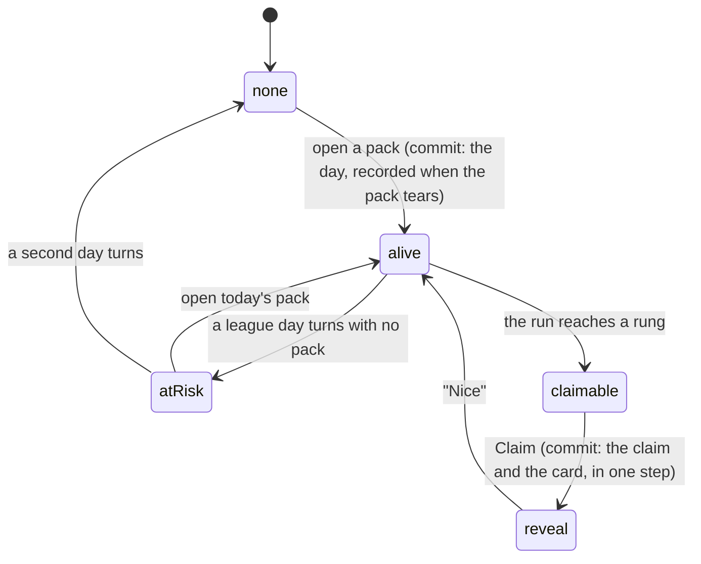

# Pack streaks

## Summary

A **streak** is the run of consecutive league days you opened a pack on. It shows
as a flame with a number beside it, on the pack screen and at the top of the
vault, and it is the only thing in the app that asks you to come back on a
Tuesday in February.

It is not stored anywhere. It is worked out, every time, by walking the record of
which days you opened a pack — which is why it costs almost nothing, and why a
guest who [claims a player](../accounts/claiming-your-player.md) keeps their
streak for free: the days move onto the name, and the walk simply finds more of
them.

At certain lengths a streak pays a **milestone**: one bonus secret card, with a
floor on how good the copy is allowed to be. The rungs are 3, 7, 14, 30 and 100
days. They are stored on every claim ever paid, so a rung may be added to the
ladder but never renumbered.

## The simple case

You open a pack on Monday, and again on Tuesday. On Wednesday the pack screen's
header carries a small flame with a 3 beside it, and under "Today's Pack" it says
*Day 3 — streak alive.*

You rip the pack, walk the cards, and the summary at the end has a new block in
it: a flame, "Day 3", and a button reading **Claim Three Days**. You tap it. The
screen goes dark, the flame swells, a number climbs to 3, and a card lands
face-down and turns over. It is a secret you did not have. One button — "Nice" —
and you are back on the summary, where the block now says *Streak alive. Come
back tomorrow.* and, under it, *Day 7 pays Rare or better.*

Miss a day and the flame reads the same number for one more day, with the line
changed to *open today's pack to keep it alive*. Miss two and it is gone.

## What a streak is

The walk counts back from the last day you opened a pack, one calendar day at a
time, and stops at the first gap.

**Yesterday still counts.** A run whose last pack was yesterday is alive but *at
risk*, which is the whole asymmetry the feature turns on — it is what earns the
line asking you to open today's pack, and what makes that line mean something. A
run whose last pack was the day before yesterday is gone.

The day in question is the league's, decided in the database, not your phone's.
The pack you are offered rolls over on the device's local date, because nothing
is at stake in which pack a handset is dealt; the day it is *recorded* against is
the league's, because a streak is something you own. See
[league days](../foundations/time-and-the-clock.md#league-days).

Nothing about a streak is shown at zero. No flame, no "Day 0", no block on the
summary, no progress bar. A streak nobody has is not a fact worth a third of a
phone-width header row, and a first pack should be a first pack rather than the
start of a chore.

## The ladder

| Rung | What it pays |
| --- | --- |
| Day 3 | A bonus secret, on the house. No floor — the plain rate. |
| Day 7 | A bonus secret, Rare or better. |
| Day 14 | A bonus secret, Epic or better. |
| Day 30 | A bonus secret, Legendary or better. |
| Day 100 | A bonus secret, Mythic, guaranteed. |

Every rung pays exactly one card, and every rung pays a **secret** rather than a
roster card. That is not a preference: a roster card has to belong to somebody on
the roster, so it cannot be given to a guest — and guests build real streaks. One
ladder for everybody was worth more than a second reward type.

The floor is a floor and not a pin: day 30 can still roll mythic on its own luck.
It only ever upgrades a roll, never caps one.

**The floors are what make a long run worth keeping.** Every rung stays
re-earnable, because a run that died and was rebuilt genuinely is a new run — and
when every rung paid the same card, three days on and one off paid a secret every
four days while a clean thirty paid four in thirty. Breaking your own streak on
purpose strictly beat keeping it. Now farming day 3 farms commons, and the thirty
nobody broke is the only route to a guaranteed legendary.

That promise is printed one rung ahead of wherever you are standing — *Day 7 pays
Rare or better.* — because a ladder nobody can see is not a reason to come back.

## The interaction, event by event

### Arrive

The streak is fetched against whoever this device is pulling as, and it is a pure
read: opening the pack screen or the vault never advances it and never spends
anything. What comes back is the length of the run, whether today's pack is
already in it, which rungs have been earned, which have been cashed, and whether
this person may cash one at all.

The query is keyed on the identity rather than on the event, because a streak is
a permanent record of showing up and an event id in the key would throw it away
every year. It is also gated on that identity having settled, so a phone changing
hands at a party never paints the previous person's streak for a frame.

Before either token has hydrated there is no streak and no flame — a blank
header, not a zero.

### Leave without acting

Nothing about the streak is recorded by looking. But **the day is recorded by
tearing the pack**, not by finishing it: walking away half-way through a reveal
still leaves today in the run. That is deliberate — the record is of the pack
being opened, not of anybody getting round to tapping the cards.

Leaving the summary without claiming a milestone leaves it claimable, and the
block will be there next time. Leaving it until the streak dies does not.

### The tap that starts something

**Claim.** Everything up to it is free.

The button offers the **highest** rung you have earned and not yet cashed, not
the lowest, so somebody arriving at day 14 having never claimed collects the big
one first and works down on the next taps rather than up.

It is a button rather than an automatic grant because the reward is a card, and a
card needs a reveal to be worth anything — and because a tap that loses its
answer costs nothing, since a second tap cannot pay twice.

The condition on it is not membership: you need an **account**, an email and a
password. A milestone buys a permanent collection card, and a device-local guest
identity is one cleared browser away from taking it with them, so the reward is
tied to something that survives the handset. A guest with an account can claim; a
member without one cannot. Without an account the block reads **Sign in to
claim**, and under it *Three Days is waiting. An account keeps it on every phone
you play from.* See [signing in](../accounts/signing-in.md).

> Technical note: the account check runs in the server handler and again inside
> Postgres, and the identity it checks comes off the verified token rather than
> anything the request carried. The rungs are written down in the database too,
> so the ladder is not something a caller can widen.

### While it runs

The button reads "Opening…" and refuses a second tap. Everything else on the
summary stays live.

Then the reveal takes the screen. The flame grows and a number counts up to the
run's length over about a second, with the rung's promise printed under it —
*Legendary or better* — because under a card this rung guaranteed, the card's own
base odds would be the odds of the thing that did not happen. Then the card
arrives face-down, holds for a beat, and turns onto its art.

A duplicate still gets the reveal, because it was bought with a month of showing
up, but it gets its own quieter chime and no confetti, and the button underneath
reads "Another one for the pile" instead of "Nice".

### It settles

The card is yours. The claim, the card and the roll all happened in one
database call, so there is no state where one landed and another did not — a
payout that fails takes its claim with it.

The block on the summary moves on to the next thing it has to say: another rung
if you have one waiting, otherwise *Streak alive. Come back tomorrow.* and the
promise of the rung above.

The bonus never costs you the day's free pull. It is recorded as a granted card
rather than a daily one, so the fourth slot is still there.

Failures are said on the button and never in a toast — a toast announces your
reward to whoever is glancing at the phone over your shoulder. *Already collected
— it's in your vault.* is the one a real person hits, by tapping twice on a bad
connection, and it means the card is already theirs.

## Modifiers

| Modifier | At arrival | Changed during |
| --- | --- | --- |
| Who you are (guest · member · account · commissioner) | A guest builds a real streak and sees the flame, the line and the block; so does a member. Neither can cash a rung until they have an account, and that is still durability rather than a permission level — the guard on the claim reads the same guest or member token as everything else, and the account is a condition on the reward, because a card has to survive the handset. The commissioner's streak is an ordinary member's. | Claiming a player carries the days across, so the flame does not move. Signing up turns the sign-in prompt into a Claim button. |
| The event's state (before the combine · running · finished) | No effect on the streak. The active event is stamped on a claim for flavour only, and a streak out of season is fine. | No effect. |
| Dust switched on or off | No effect. A milestone pays a card, never dust, and a duplicate credits nothing at the moment it lands. | No effect. |
| The device (phone · desktop · reduced motion · presentation mode) | The flame sits in a header row that keeps its height when the pack tears, so nothing slides on the frame the rip is meant to own. Reduced motion skips the count-up and puts the card straight on screen. | The reveal takes the whole screen and fades the nav out under it. |

## Cancel and interrupt

| Event | Before Claim | After Claim |
| --- | --- | --- |
| Back, or closing a sheet | Nothing to cancel; the rung stays claimable. | The card is already yours. Dismissing the reveal ends it and does not undo it. |
| Navigating away inside the app | Same. The block is where you left it. | Same. The card is in your vault. |
| Reload | The streak is refetched. Nothing was pending. | The reveal does not come back — a reload during it is the same as dismissing it. The card is unaffected. |
| Backgrounded | No effect. On return the streak refetches on focus. | The reveal's beats are on timers, so it may be waiting at its end. Nothing is lost. |
| Network lost mid-request | The button says *No signal. Tap to try again.* Nothing was written. | A claim whose answer never came back may still have landed. Tapping again returns *Already collected — it's in your vault.* rather than paying twice. |
| The request fails or times out | The reason is printed under the button: the streak is not there yet, there is nothing to give out right now, or sign in first. None is a failure worth retrying differently. | Same. |
| The token expires or is cleared | The flame goes blank and the block disappears, rather than the screen retrying behind a spinner. The days are still recorded against the identity. | The card belongs to the identity that claimed it, not to the device. |
| Changed by someone else | Nobody else can affect your streak. A commissioner retiring a secret card removes it from what a milestone can pay, never from anybody's vault. | Same. |
| A second tab or device | Both read the same streak. | Both tabs see the same claim; only one of them pays. Two connections racing the same rung produce one claim and one card. |
| Reduced motion or presentation mode changes | No effect. | The preference is read when the reveal opens, so flipping it mid-reveal changes nothing until the next one. |

## Interactions with other systems

**Who you have to be.** Anybody the server can name to *have* a streak — a
member, or a guest with a signed identity. To cash one, that same identity has to
have an account behind it. The identity is taken from the verified token in both
directions; there is no parameter for it anywhere, and the account check is made
against the identity the token named.

**Realtime.** None, deliberately. Neither the record of packs opened nor the
record of claims is published, because a broadcast would tell every connected
phone who just opened a pack and what they collected for it, which is the exact
opposite of a reveal. A streak changes at most once a day, so window focus and a
refresh after opening a pack are enough.

**Offline and reconnection.** The streak needs the network to be read and to be
cashed. The pack itself does not, but a pack opened with no signal does not
record its day until the record reaches the server.

**Optimistic updates and rollback.** Nothing is optimistic. The number on screen
is the number the server walked, and the card in the reveal is the card the
server rolled.

**The card economy.** A milestone pays a bonus secret, which is a
[secret card](../foundations/the-card.md#what-a-secret-card-is) like any other:
filed into a [set](secret-sets.md), countable towards
[finishing one](collection-trophies.md), sellable as a spare. It never
pays dust and never costs any. A duplicate upgrades the copy you already hold if
it rolled better, which is what stops a hundred days being spent on a card you
own.

**Motion and sound.** A rising tone under the flame, then the secret chime — or
the duplicate's quieter one — as the card turns, and confetti on anything that is
not a duplicate. The flame in the header pulses only while today's pack is
already in the run.

**Notifications and badges.** No dot on the nav for a claimable rung. The nudges
are the flame and the sentence under "Today's Pack", both of which are on screens
somebody is already looking at.

**Sharing.** Nothing about a streak is shared, exported or shown to anybody else.
No screen displays another person's streak, and no feed mentions one.

**The second device.** The streak follows the identity, so a member sees the same
number on any phone they claim on. A guest's follows their token, which means
clearing site data loses the run along with everything else.

**Accessibility.** The flame glyph is hidden from assistive technology and the
number carries a label. The reveal is a dialog named for the rung — "Day 7 streak
reward". The claim button says which rung it is cashing rather than just "Claim",
and its failure text sits next to it rather than arriving as a toast.

## Edge cases

- **Two packs in one league day.** Impossible to double-count. One pack a day is
  already the rule, and the record has one row per person per day, so a double
  tear, a refresh mid-reveal or a retried request all land on the same day.
- **A phone whose local day turns before the league's.** The device offers a
  fresh pack, and opening it records against a league day that already has a row.
  The streak does not advance twice.
- **A run that dies before it is cashed.** The rung is gone. The button is on the
  summary on the day you earn it, and a milestone earned on a streak that then
  broke is not claimable, because the run no longer ends today or yesterday.
- **A rebuilt streak.** Re-earns the whole ladder, because a run that died and
  was rebuilt is genuinely a new run. Claims are keyed to the run's first day.
- **A guest history merged in behind an existing run.** Claiming a player can
  push a run's first day backwards. A rung already paid on that run stays paid.
- **Nothing in the catalogue to give.** *Nothing to give out right now. Try again
  in a bit.* No claim is filed and nothing is spent, so the rung is still there
  when there is something to pay it with.
- **A capstone that can only be a duplicate.** It still rolls mythic, and a
  duplicate that rolled better upgrades the copy in the vault.
- **A run past a hundred days.** The flame keeps counting and the ladder says
  nothing more. There is no promise left to print, so the line is absent rather
  than empty.

## Open questions and verification

- Whether a guest who signs up mid-summary sees the block change from the sign-in
  prompt to a Claim button without a reload was not confirmed by hand.
- The behaviour of a phone whose local day and the league day disagree was read
  from the two clocks and the day rule rather than watched across a real
  boundary; it is the item most likely to produce a confusing evening.
- Assumption: no surface anywhere shows one person another person's streak.
  Checked against every streak-facing server function and component at this
  commit.

Verified against willyoubemyhero commit `b46f330`.
