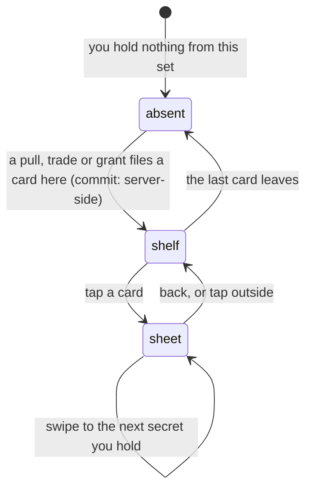

# Secret sets

## Summary

Every secret card is filed into one **set** — a named shelf the commissioner
authors — or into none, in which case it lands on a pile the vault heads
"Secrets". A set is the only structure the secret half of the collection has, and
to the person holding it a set reads as three things: a name, a colour, and how
many of it they hold.

It never reads as how many exist. No shelf carries a denominator, no card back
carries a serial, and **a set you own nothing from is not on the page at all**.
That silence is the feature rather than an omission: an empty "Pets" heading
would announce both that Pets exists and that you are behind on it, and not
knowing how much is left is what makes tomorrow's pull worth taking. There is one
designed exception, and it is a set you have already finished — see
[collection trophies](collection-trophies.md).

This document owns what a set is and how one reads. The shelf it is drawn on —
rolling it up, moving it, when it arrives — belongs to [the vault](the-vault.md).

## The simple case

You open the Vault. Between the pinned cards and the roster there is a run of
shelves, one per set you hold something from: "Cornhole Collection", "WAGs",
"Pets". Each wears a colour of its own — a tinted panel, a coloured heading, a
soft glow while it is open — and carries a small number on the right, which is
how many of that set are on this shelf.

You tap a card. It opens big in the middle of the screen: the art, the name, the
flavour line the commissioner wrote, and under it the level of _your_ copy in its
own colour. Swipe and you are on the next secret you own. Tap the card and it
turns over.

Tomorrow you pull a secret from a set you had none of. A new shelf appears,
already open, at the bottom of the run.

## What a set is

A set has a name and a place in an order, both the commissioner's, and optionally
a colour picked from a fixed palette of twenty. The colour is chosen from a list
rather than typed, so the palette can be retuned without rewriting anything, and
a colour dropped from the list reads as "no theme" rather than as a broken shelf.
An untinted set wears the shared secret green that every shelf wore before sets
had themes.

Four sets shipped with the feature — Cornhole Collection, WAGs, Pets, Legacy Pets
— and the commissioner has been able to add more ever since. Renaming one is
free; its identity underneath is not, so a set can be relabelled but never
re-founded. A card filed into a set the commissioner has since hidden still shows
under that set, after the named ones and before the unsorted pile, labelled with
whatever the set was called. Cards do not fall off the page because an admin
tidied up. See [secret card sets](../admin/secret-card-sets.md) for the authoring
side.

A card in no set is _unsorted_. The admin panel calls that pile "Unsorted",
because filing is work only the commissioner can do. Your vault calls it
"Secrets", because on your own shelf "Unsorted" reads as though you left your
cards in a mess.

## The interaction, event by event

### Arrive

Two reads build the shelves and they land separately. The cards you hold come
from the server, scoped to whoever this device is pulling as — a member by name,
a guest by their token. The names and colours of the sets come from the server
too, and they carry **no sizes at all**.

Your cards are then grouped into the commissioner's order, with anything filed
under a set that no longer exists after the named ones and the unsorted pile
last. Empty groups are dropped, which is exactly what makes a set you own nothing
from absent rather than empty.

Until the set list lands, a shelf falls back to the four sets that shipped, so a
newer set can briefly head itself with its raw identity before settling to its
name.

> Technical note: the set list is fetched by every device that opens the vault
> and is not gated on holding anything, so the _names_ of the active sets travel
> to a phone that owns none of them. They never become headings — a set is drawn
> only if a card you hold is filed into it — and nothing in that response says
> how big a set is, which is the property the feature actually protects.

### Leave without acting

Nothing is recorded. Scrolling the vault, opening a card, swiping through every
secret you own and leaving writes nothing anywhere: no view count, no last-seen,
no server call. Looking at your own cards is free.

### The tap that starts something

**No tap on this screen writes to the server.** Tapping a card opens the sheet
and changes nothing at all. The two taps that write anything write to the phone —
rolling a shelf up and moving one — and both belong to [the vault](the-vault.md),
on exactly the same footing as [favourites](favourites.md).

Which set a card belongs to is never yours to set. That is a commissioner action
made on the admin screen, and it reaches your shelf the next time the card list
is fetched.

### While it runs

There is no window and no request. The sheet swipes through the secrets **in the
order they are on screen**, across every shelf, top to bottom, including any
pinned up to Favourites. It used to swipe a flat newest-first list while the page
was already grouped, so the card to the right of the one you were looking at was
rarely the card that came next.

### It settles

The sheet closes onto the shelf you opened it from. A shelf that has just lost
its last card disappears rather than sitting empty, and one that has just gained
its first appears at the end of the run.

## What a set does not say

The heading is the name and a count of what you hold. There is no "of", no
progress bar, no silhouettes of cards you have not found, and no empty slots. An
unpulled secret is not _missing_ — it is unknown, and the page says nothing about
it.

The card sheet keeps the same rule. It shows the level of your copy and that
level's pull rate, the date you first pulled it, "Pulled ×3" if you hold spares,
and how many _people_ have found the card — never how many cards there are. The
back prints the card's name, its flavour line, its level and odds, and either the
date you pulled it or, on a card from a set you have finished, a "Set complete"
mark in its place.

The sheet is a dialog rather than a screen with an address. A URL is shareable,
and a secret card is the one thing in this app that must not be. Somebody showing
you their phone is the intended channel and the only one.

## Modifiers

| Modifier                                                          | At arrival                                                                                                                                                                                                                                                                                                                                    | Changed during                                                                                                                                                                              |
| ----------------------------------------------------------------- | --------------------------------------------------------------------------------------------------------------------------------------------------------------------------------------------------------------------------------------------------------------------------------------------------------------------------------------------- | ------------------------------------------------------------------------------------------------------------------------------------------------------------------------------------------- |
| Who you are (guest · member · account · commissioner)             | The shelves follow whoever this device is pulling as. A guest holds secrets and gets shelves for them; a member's shelves follow their name onto any phone. A device with neither identity has no secrets and so no shelves at all. The commissioner's vault is an ordinary member's — the admin view of the same sets is a different screen. | Claiming a player moves everything the guest pulled onto the participant, so the same cards regroup under a new name. A set the guest had already finished banks its trophy at that moment. |
| The event's state (before the combine · running · finished)       | No effect. Sets are league-wide and permanent: they are not scoped to a combine and do not reset with one.                                                                                                                                                                                                                                    | No effect.                                                                                                                                                                                  |
| Dust switched on or off                                           | No effect. A spare secret is worth dust only when somebody sells it — see [milling and selling](../dust/milling-and-selling.md).                                                                                                                                                                                                              | No effect.                                                                                                                                                                                  |
| The device (phone · desktop · reduced motion · presentation mode) | Two cards across on a phone, three or four wider. Tiles carry the set's foil but no tilt and no zoom; the sheet is where a card can be pinched and turned. Under presentation mode the whole vault is inert.                                                                                                                                  | Reduced motion stills the foil and the prism edge. Rolling a shelf up drops the cards inside it entirely, which is what stops a page of shelves running a tilt each.                        |

## Cancel and interrupt

| Event                                       | Before the tap                                                                                                                                                                                                                                     | After the tap                                                                                                                  |
| ------------------------------------------- | -------------------------------------------------------------------------------------------------------------------------------------------------------------------------------------------------------------------------------------------------- | ------------------------------------------------------------------------------------------------------------------------------ |
| Back, or closing a sheet                    | Nothing to cancel.                                                                                                                                                                                                                                 | The sheet closes onto the shelf it opened from, at the same scroll position. Nothing was written, so there is nothing to undo. |
| Navigating away inside the app              | No effect.                                                                                                                                                                                                                                         | No effect. The shelves are rebuilt from cache on return.                                                                       |
| Reload                                      | No effect.                                                                                                                                                                                                                                         | No effect on the sets. Which card was open is not remembered; the shelf is.                                                    |
| Backgrounded                                | No effect; nothing is in flight. On return the card list refetches if it has gone stale.                                                                                                                                                           | An open sheet is still open, showing the same card.                                                                            |
| Network lost mid-request                    | The shelves render from whatever the cache holds. With nothing cached there are no secret shelves at all, and the roster alone.                                                                                                                    | A cached card stays readable; its art may not load.                                                                            |
| The request fails or times out              | No secret shelves appear, and no error either. An absent shelf and a shelf you own nothing from look the same — which is exactly what the feature already promises. A failed set-name read leaves the shelves labelled from the four that shipped. | No effect.                                                                                                                     |
| The token expires or is cleared             | Every secret shelf disappears together, because the cards were fetched against an identity that has just gone away. A member who has claimed before sees a line saying their secrets are on their name and not on this phone.                      | An open sheet empties with the list behind it.                                                                                 |
| Changed by someone else                     | A commissioner renaming a set changes the heading on the next fetch; retiring one leaves your cards under its old name. Retiring a _card_ removes it from future pulls and never from your shelf.                                                  | Same, and a refetch while the sheet is open can move the card under it — see the edge cases.                                   |
| A second tab or device                      | The other tab reads the same cards. A second _device_ shares the cards and none of the shelf arrangement.                                                                                                                                          | Same.                                                                                                                          |
| Reduced motion or presentation mode changes | No effect on the shelves.                                                                                                                                                                                                                          | The foil stops moving; the sheet stays open.                                                                                   |

Nothing about a set is ever left half-done. The grouping is recomputed whole from
the cards you hold every time either read changes, so there is no partial state
for an interrupt to strand.

## Interactions with other systems

**Who you have to be.** Anybody the server can name — a member, or a guest with a
signed identity. The shelves are built from a read scoped to that identity, which
is what makes them yours; there is no parameter anywhere that could ask for
somebody else's. Nothing on this screen writes, so there is no guard to fail.

**Realtime.** None. The secret card tables are deliberately kept out of the
realtime publication, because a broadcast carrying those rows is a row count, and
a row count is a set size. Shelves change when the screen refetches, which it
does on focus and after a pull.

**Offline and reconnection.** The shelves render from cache. Reading a cached
card works offline; its art does not.

**Optimistic updates and rollback.** Nothing here is optimistic, because nothing
here is in flight.

**The card economy.** A set is a filing scheme, not a currency. Being in a set
changes nothing about what a spare sells for, and completing one pays no dust.
The only thing completion pays is a trophy.

**Motion and sound.** The shelves are silent. A card's foil animates on its tile,
and the prism edge spins, pulses, shimmers or sits steady according to the look
the commissioner gave that card — a property of the card, never of the set.
Reduced motion stills all of it.

**Notifications and badges.** None. No shelf carries a dot and nothing on the nav
counts sets. The Pack tab's dot means a drop is waiting, never that a set is
close.

**Sharing.** A secret card has no address and no share button. It can leave a
phone only inside the pack image exported from
[what you pulled](what-you-pulled.md), which prints the card and says nothing
about the set it belongs to.

**The second device.** A member's secrets follow their name; a guest's follow
their token, so clearing site data loses them. The shelf order follows neither.

**Accessibility.** The card sheet is a dialog titled with the card's name and
described as a secret you pulled from a pack, with labelled previous and next
controls and a position readout — "3 / 7" — that counts what you hold and not
what exists. The shelf headings themselves are covered in
[the vault](the-vault.md).

## Edge cases

- **A card filed nowhere and a card filed into an empty name.** The same pile.
  They used to be two shelves with the same heading, and because the vault
  derives a shelf's identity from the group they collided — the second pile's
  cards vanished off the page entirely.
- **A set you have pinned every card of.** No shelf. A pinned card _moves_ to
  Favourites rather than appearing twice, so the shelf it came from empties and
  drops out. It returns the moment one card is unpinned.
- **A rolled-up set.** Its cards are still in the sheet's swipe, so swiping past
  the end of an open shelf can land on a card from a shelf that is closed.
- **A set the commissioner hid.** Your cards stay, under the set's own name,
  after the named sets and before "Secrets". Not a new pile and not an error.
- **A colour the commissioner retired.** The shelf falls back to the shared
  secret green rather than to nothing.
- **Your first secret ever.** One shelf, one card, a count of 1. There is no
  "1 of ?" and no hint about what else is in there.
- **Every secret you hold is unsorted.** One shelf headed "Secrets" and no named
  sets — which says nothing about whether named sets exist.
- **A duplicate.** The card does not appear twice. Its tile reads "Pulled ×2",
  and the shelf's count still counts the card once, because the count is of cards
  and not of copies.
- **A set whose cards you traded away.** The shelf disappears, and nothing marks
  that it was ever there — except a trophy, if you had already finished it.

## Open questions and verification

- The set list travelling to a device that holds no secrets was read from the
  vault's fetch, not observed. It carries names and colours only; whether the
  league would rather it were not fetched until something is held is a product
  question rather than a defect.
- The brief window in which a newly created set heads itself with its raw
  identity, before the set list lands, was read from the fallback rather than
  watched on a slow connection.
- Whether a shelf that empties and later refills returns to the position this
  device moved it to, or to the end of the run, was read from the merge rule and
  not confirmed by hand.
- Assumption: no response reaching a member carries a secret set's size except a
  completion. Checked against every secret-facing server function at this commit.

Verified against willyoubemyhero commit `b46f330`.
