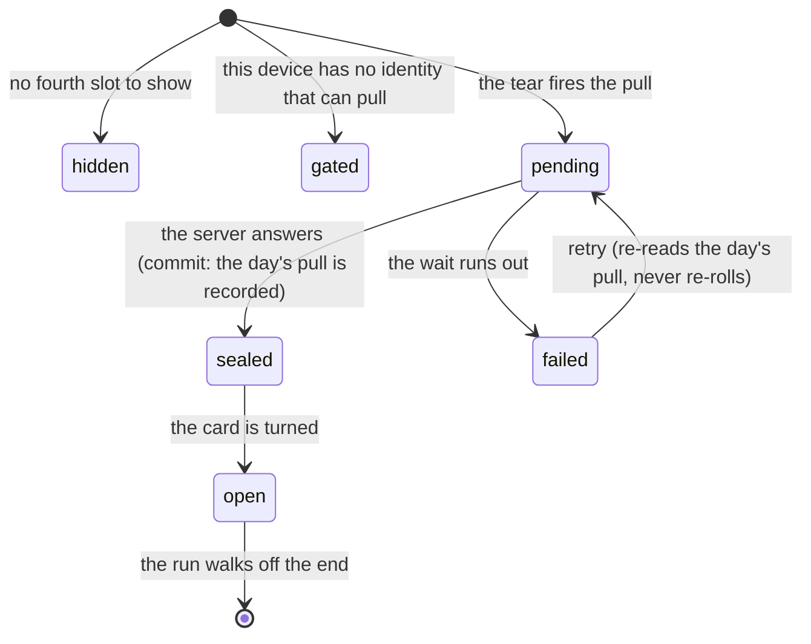

# The daily secret

## Summary

The fourth slot in a pack is not a roster card. It is one *secret card* a league
day — art an admin uploaded that is not a person on the roster — and it is the
only thing in the app that is genuinely once-a-day, decided by the server, and
gone until tomorrow.

This document owns the fourth slot in every state it can be in. The theatre of
handing the stand over to it belongs to [opening a pack](opening-a-pack.md); what
a secret card *is* belongs to [the card](../foundations/the-card.md#what-a-secret-card-is).

## The simple case

You tear a pack. Behind the three roster cards there is a fourth, and the fan
flies four instead of three. You turn the roster cards one at a time; when you
press Next on the last one, the pack says it is complete, then very obviously is
not, and the fourth card arrives on the bare stand.

You turn it. It is a secret: a rainbow prism edge, a foil the commissioner chose,
and under it the level of *your* copy — Mythic, Legendary, Epic, Rare or Common.

Tomorrow there is another. Not before.

## The interaction, event by event

### Arrive

Opening the pack screen asks a pure read: is there a card waiting today. It never
spends the drop, because reaching this screen is one mis-tap away from the vault.
The answer decides whether the Pack tab wears a dot and whether the fan will fly
three cards or four.

A device with no identity at all is answered too, with everything false, so the
screen can render before a guest session exists.

### Leave without acting

Nothing is spent. The status query writes nothing, and a pack left sealed leaves
the day's secret untouched and still available.

### The tap that starts something

The tear, not a tap on the slot. Committing the rip fires the pull — from an
effect watching the torn pack rather than from inside the tear, which is what
catches the first-timer who tears, meets the claim gate, goes and claims, and
comes back to a pack the tear will never run over again.

At that instant the day's card is decided, by Postgres, from an identity taken
from a verified token. Nothing about it is chosen on the phone.

### While it runs

A pulsing card back on the fourth slot, and a short ceiling on the wait. The
ceremony is playing over the top of it, which is deliberate: firing at the rip
buys the round trip the ceremony's whole run as a head start.

The rest of the pack is unaffected. The three roster cards reveal normally
whatever the fourth slot is doing, because the secret must never be able to stall
the sequence.

### It settles

The card is recorded against your identity, server-side, and the slot goes from
pending to sealed. It is yours from that moment whether or not you have looked at
it — turning it over is theatre, and the pull already happened.

On failure the slot shows a retry inline rather than a toast, because this is a
screen somebody is enjoying. A row may have landed anyway, which is exactly why
the retry re-reads rather than re-rolls.

## What decides it

The pull takes **no input at all**. Whoever is asking comes from a verified token
and the card is chosen by Postgres.

That is the whole security design of the feature. A handler that accepted an
identity from the request would let anybody spend somebody else's daily pull,
which is exactly why a guest's identity is a signed token rather than a device
identifier.

A guest gets a drop as readily as a member does. The pack screen mints an
anonymous identity for an unclaimed device the moment it lands, so the fourth
slot is theirs rather than a locked box.

Calling twice in one league day returns **the same card**, marked as not fresh,
rather than failing — so a double tap, a retried request, or a reload part-way
through resumes the reveal instead of losing it.

The day is the league's, decided in the database, not the device's local date.
This is deliberately unlike the pack, whose day is local: a pack has no identity
behind it and nothing at stake, and a secret has both.

## The states of the fourth slot

| State | What it means | What the user sees |
| --- | --- | --- |
| hidden | Nothing to show | No fourth slot |
| gated | The device has no identity that can pull | An invitation to claim a player |
| pending | The pull is in flight | A pulsing card back |
| failed | The pull did not complete | A retry, inline |
| sealed | A card is waiting to be turned | A face-down card |
| open | It has been turned over | The card |

Only a card that is *actually coming* holds the reveal stand — sealed, pending,
or one just turned over and still being looked at. A guest with no identity, a
failed pull and an empty set all fall through to the columns, where the slot
still shows its gate or its retry exactly as it would have.

**The secret must never be able to stall the sequence.** That rule is why the
list above splits the way it does.

## When it is pulled

Not on arrival. Reaching the pack screen is one mis-tap away from the vault, and
it must never spend the drop — the status query that decides whether the tab
shows a dot is a pure read for exactly this reason.

Not on tapping the card either: an unbounded round trip racing the face-down hold
would either stall or lie.

It is fired by the *tear*, and specifically from an effect watching the torn pack
rather than from inside the tear itself. That last distinction catches the
commonest first-timer path: a guest tears the pack, meets the claim gate, goes to
claim a player, and comes back to the same already-torn pack — where the tear
will never run again.

Firing at the rip also buys the ceremony's whole run as a head start on the round
trip, which is about two free seconds off the thing most likely to make somebody
wait.

## The wait, and giving up

The pull has a short ceiling on it. Staring at a pulsing card while your friends
look at theirs is worse than a retry tap.

Giving up does not cancel the request, and a row may still land server-side.
That is fine, and it is why the retry **re-reads the day's pull rather than
rolling a new one**: whatever happened on the first attempt, the second returns
the same card.

The retry is a real retry rather than a no-op. Clearing the failure alone would
leave every value the pull depends on unchanged, so nothing would re-run.

## Modifiers

| Modifier | At arrival | Changed during |
| --- | --- | --- |
| Who you are (guest · member · account · commissioner) | A member pulls against their name; a guest against a server-minted identity; a device with neither sees the claim gate. A member's secrets follow them to a new phone, a guest's follow the token. | Claiming mid-pack moves everything the guest pulled onto the participant — secrets, packs, and the streak milestones those packs already paid. |
| The event's state | The pull stamps the active event for flavour only. A pull out of season is fine; no active event is not an error. | No effect. |
| Dust switched on or off | A duplicate pull credits nothing either way. Its worth is realised only when somebody sells it. | No effect. |
| The device (phone · desktop · reduced motion · presentation mode) | Reduced motion collapses the beats in the handover but never skips the handover itself. | No effect. |

## Cancel and interrupt

| Event | Before the card is turned | After |
| --- | --- | --- |
| Back, or closing a sheet | The pull has already landed server-side; the card is yours whether or not you have looked at it. Returning shows it sealed. | The card is in your vault. |
| Navigating away inside the app | Same. | Same. |
| Reload | Resumes with the card sealed on the stand, because an unturned secret is re-read rather than re-rolled. | The cursor is put past the end — that card has been seen, and re-running its ceremony on every reload would turn the payoff into a toll. |
| Backgrounded | An in-flight pull may time out and offer a retry. | No effect. |
| Network lost mid-request | The slot shows its retry. A row may have landed anyway; the retry returns the same card. | No effect. |
| The request fails or times out | Retry, inline. Never a toast — this is a screen somebody is enjoying. | No effect. |
| The token expires or is cleared | The slot falls back to its gate. | The card stays in the vault it was pulled into; it belongs to the identity, not the device. |
| Changed by someone else | A commissioner retiring a card removes it from future pulls, never from anybody's vault. | Same. |
| A second tab or device | Both tabs ask; both get the same card. The pull is idempotent within a league day. | Same. |
| Reduced motion or presentation mode changes | No effect on the pull. | No effect. |

A card minted just now has never been seen, whatever the device's stored reveal
state says — local midnight and league midnight can be hours apart, so a resumed
pack can carry a stale "already revealed" for a card that did not exist when it
was written.

## Interactions with other systems

**Who you have to be.** Somebody the server can name: a member, or a guest with a
signed identity. A device with neither sees a gate rather than an error.

**Realtime.** None. The drop is a request, not a broadcast.

**Offline and reconnection.** The pull needs the network. Everything else in the
pack does not.

**Optimistic updates and rollback.** Nothing about the secret is optimistic. The
card on screen is the card the server chose.

**The card economy.** A duplicate pull credits nothing at the moment it lands.
Its worth is realised only when somebody sells it; see
[milling and selling](../dust/milling-and-selling.md). Streak milestones pay
bonus secrets rather than roster cards, because a roster card cannot be granted
to a guest and guests build real streaks.

**Motion and sound.** The secret has its own chime, called explicitly rather than
derived from a tier — the value the app stores on a secret's look is a
placeholder that nothing may branch on. A duplicate has a second chime of its
own.

**Notifications and badges.** The Pack tab carries a dot in the secret's own
colour when a drop is waiting, and it names itself for a screen reader rather
than sharing a generic "something is waiting" with the Trade tab.

**Sharing.** A secret can be shared like any card. The response that carries it
is the only one in the app permitted to say a set has been completed — see below.

**The second device.** A member's secrets follow their name. A guest's follow
their token, which means clearing site data loses them.

**Accessibility.** The gate and the retry are text and a button.

## The one number that is withheld

**How many secret cards exist is never sent.** No screen shows a total, no
response carries a set size, and a shelf shows how many of a set you hold without
a denominator. A set you own nothing from does not appear at all, because an
empty heading leaks the shape of what you have not pulled yet.

There is exactly one exception, and it is narrow: a pull that has just *finished*
a set says so. On every other pull — which is all but one in a season — that
field is empty.

Even then the order is the point. The completed set is held back until the card
has been turned over: you see which card it was, and only then find out it was
the last one. See [collection trophies](collection-trophies.md).

## Edge cases

- **An empty set, or every card missing its art.** The slot says there is nothing
  today rather than showing an error. It is not a failure to retry — there is
  genuinely nothing to hand over.
- **A retired card.** Removed from future pulls, never from anybody's vault. You
  pulled it, you keep it.
- **A duplicate.** The card arrives normally with its own chime. Two people can
  hold the same secret at two different levels, which is the whole point of a
  level belonging to the copy rather than the card.
- **A guest who clears site data** loses the identity and, with it, the secrets
  attached to it. Nothing server-side can tell that apart from a new phone.
- **Two tabs tearing at once.** Both pulls return the same card.
- **A pull that times out and then lands.** The retry finds it and returns it.
- **Midnight during a reveal.** The pack is never re-sealed under a thumb, but
  the fourth slot can re-arm while the three cards do not — which is the exact
  confusion the midnight check exists to resolve.

## Open questions and verification

- The short ceiling on the pull is quoted from the source as "short on purpose";
  how long it actually feels on a poor connection in a garden has not been
  watched, and it is the item most likely to produce a bad experience on the day.
- Whether a guest who claims mid-pack sees the fourth slot change from a gate to
  a card without a reload has not been confirmed by hand.
- The claim that a stale "already revealed" flag is correctly ignored for a
  freshly minted card was read from the pull path, not tested across a real
  league-midnight boundary.
- Assumption: no response anywhere in the app carries a secret set size. This was
  checked against every secret-facing server function at this commit, and there
  are key-exact assertions in the test suite that exist to keep it true.

Verified against willyoubemyhero commit `b46f330`.
