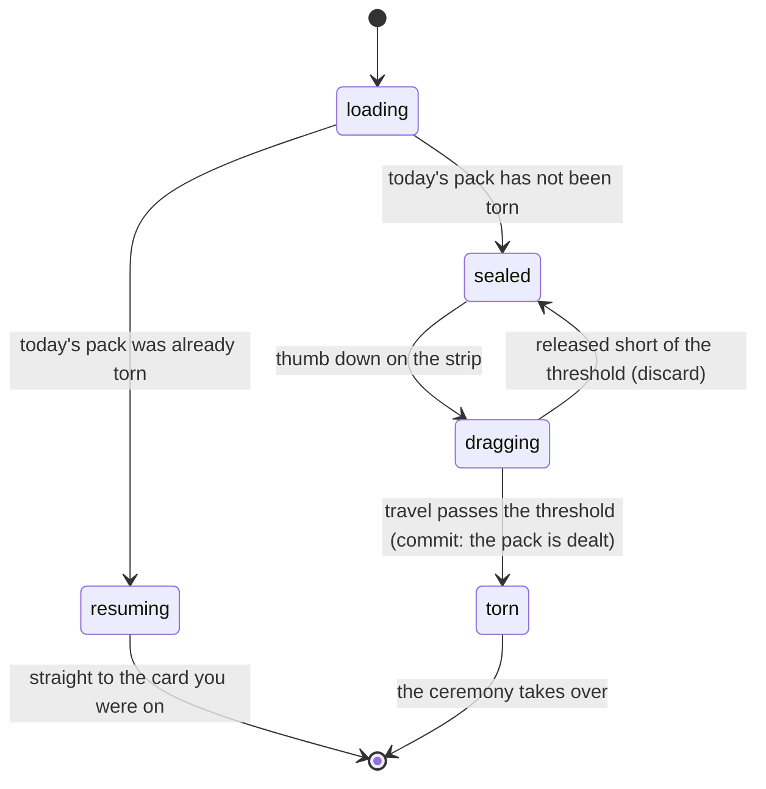

# The sealed pack

## Summary

Once a league day there is a pack waiting for you. This document covers
everything up to the moment it comes apart: what the screen decides before it
draws, why the pack in front of you is yours and not everybody's, what the
wrapper does under a thumb, and what commits the rip.

The pack is three roster cards, plus a fourth slot for
[the daily secret](the-daily-secret.md). What happens after the rip commits
belongs to [opening a pack](opening-a-pack.md).

## The simple case

You tap Pack. A sealed wrapper is on the screen, wearing the event's card back.
You put a thumb on the tear strip at the top and drag sideways. The seam lights,
the foil starts to part behind your thumb, and somewhere past halfway it goes:
the rip finishes on its own and the pack opens.

If you let go before that, the strip springs back and nothing has happened.

Come back later the same day and the wrapper is gone — you are returned to the
card you were looking at, not to the start. Come back tomorrow and there is a
fresh pack.

## Whose pack it is

The three cards are dealt from a seed built out of three things: the event, the
league day, and *who you are*. That means two people standing next to each other
open different packs, and refreshing cannot reroll yours.

Identity here is the member you claimed, or failing that the handset. A guest
gets an anonymous identity minted for them the moment they land on this screen,
so the fourth slot is theirs rather than a locked box.

> Technical note: packs used to be dealt without an identity, so every phone in
> the league opened the same two cards. That never made much sense when the whole
> roster is browsable in the vault anyway, and it made "how many people packed
> this card" a number that only measured who had opened the app.

The last of the three slots is special. It prefers a card your collection does
not already hold — which is the only mechanism by which a set ever completes. The
collection it checks is a *baseline*: a snapshot taken at the moment the pack was
dealt, never the live one, because a baseline that shifted while you were
revealing would re-deal a card underneath you.

That baseline is taken per person rather than once. A phone changes hands in this
league, and a snapshot taken once meant the next person's guaranteed-new card was
chosen out of the previous person's collection.

## The interaction, event by event

### Arrive

Before anything is drawn the screen has to settle three questions, and it draws
nothing until they are answered.

**Who is this pack for.** The browser is asked who it is holding. For one render
on every mount the answer is not known yet, and nothing is dealt against a
half-known identity — otherwise a claimed member would see a device-seeded pack
flash first.

**Has today's pack already been torn.** One pack a day, so a return visit resumes
rather than deals. A stored pack from yesterday is simply ignored; the next tear
overwrites it.

**Has the server reconciled the collection.** Until it has, there is no baseline,
so there is nothing to deal and the wrapper is not tearable. This lasts a beat.

The wrapper wears the *event's* card back, never a player's — the pack is shown
before anything has been dealt, and a per-player back would be the reveal,
printed on the outside of the pack.

### Leave without acting

Nothing is recorded. Reaching this screen is one mis-tap from the vault, and it
must not spend anything: the daily secret is not pulled on arrival, no pack is
dealt, and no streak day is counted. All of that waits for the rip.

### The tap that starts something

The rip. Everything about it is measured as horizontal *travel* from where the
finger landed rather than as an absolute position — an earlier version compared
the pointer against the pack's own top edge, which meant a single tap below that
line opened the pack with no drag at all.

Full travel is 80% of the pack's width. The rip commits at 60% of that. Short of
it, the strip springs back.

Two things are decided at the instant it commits:

- **The pack is dealt** — the three cards are fixed, written down, and will not
  change. This happens at the rip rather than at the end of the ceremony, so the
  two round trips it unblocks get the ceremony's whole run as a head start.
- **Whether the fan is holding three cards or four**, latched here rather than
  read live. The secret's pull is fired *by* the tear, so its state changes while
  the ceremony plays, and a card count that changed mid-flight would remount the
  cards halfway through their arc. A secret only earns the fourth slot on a
  positive answer from the server; a status query still in flight counts as no,
  because flying a fourth card that never lands is a worse lie than a fan that
  simply did not preview one.

### While it runs

Between thumb-down and the commit, the tear is live under the finger. The seam
does not simply switch from joined to parted at the front: there is a shoulder
ahead of it where the foil is stretching but has not yet given, so the boundary
never meets the intact seam at a right angle. Without that it reads as a
rectangle being revealed rather than as something coming apart.

The ragged line the wrapper separates along is seeded off the pack, so a given
pack always tears the same way. Two people opening the same pack see the same
rip, and a re-render mid-drag cannot re-roll the edge underneath the animation
playing over it.

Letting go short of the threshold springs the strip back and leaves the pack
exactly as it was. Nothing has been dealt and nothing recorded.

### It settles

The rip commits and the screen hands over to the ceremony. From that moment the
pack is torn, the cards are chosen, and there is no way back to a sealed wrapper
for the rest of the day.

## Resuming

A pack you already opened does not replay. Coming back lands you on the card you
were looking at — not the start, and not the production. A payoff, not a toll.

The stored position is the answer where there is one. Packs written before the
reveal stand existed carry no position, and are recognised by its absence: those
put every card down as revealed the moment the wrapper came off, so replaying one
faithfully lands past the end and renders the finished columns — which is
indistinguishable from the stand never having shipped. Only the ones that were
*finished* under the old ceremony are replayed; one that stopped partway is
resumed exactly as it stands.

A replayed card gets the flip and the chime and nothing that writes. The pull it
represents was recorded the first time round, and counting it again would inflate
the count for good.

## Midnight

A tab left open past midnight used to sit on yesterday's pack forever, which
became actively confusing once the secret's day moved to the server: the fourth
slot re-arms while the three cards do not. The screen now checks, by polling
rather than by scheduling, because a phone suspends timers the moment its screen
goes dark.

It never re-seals a pack under somebody's thumb. Eating a card mid-reveal is a
far worse bug than a stale tab, and the same goes for pulling the pack out from
under a ceremony that has three cards in the air.

## Modifiers

| Modifier | At arrival | Changed during |
| --- | --- | --- |
| Who you are (guest · member · account · commissioner) | Decides which pack is dealt. A guest is minted an identity on arrival so the fourth slot is theirs. A member's pack follows their name rather than the handset. | Claiming mid-pack does not re-deal what is already torn. A guest who tears, hits the secret's claim gate, claims, and comes back returns to the same torn pack. |
| The event's state | No active event means no roster and nothing to deal. | No effect on a pack already dealt. |
| Dust switched on or off | No effect on the pack. | No effect. |
| The device (phone · desktop · reduced motion · presentation mode) | Reduced motion silences the ceremony, not the pack: the tear still opens it and the cards are still dealt. A narrower phone shrinks the pack and its fan with it rather than letting cards push the page sideways. | No effect on the tear. |

Changing identity mid-drag is not possible. Everything the pack is dealt from is
latched before the rip commits.

## Cancel and interrupt

| Event | Before the rip commits | After |
| --- | --- | --- |
| Back, or closing a sheet | Nothing dealt, nothing recorded. The pack is sealed when you return. | The pack is torn. You resume where you were. |
| Navigating away inside the app | Same. | Same. |
| Reload | Same — a sealed pack is sealed. | Resumes on the card you were on. |
| Backgrounded | The drag ends wherever it was; short of the threshold it springs back. | The ceremony continues or is past; the position is already written. |
| Network lost mid-request | The wrapper is not tearable until the collection reconciles, so a dead connection on arrival means a pack that cannot be opened yet. | The cards are dealt locally. What needs the network is recording them and pulling the secret. |
| The request fails or times out | The pack stays untearable and the screen shows nothing has been dealt. | The cards are yours on the device; the secret slot shows its own failure and a retry. |
| The token expires or is cleared | A member whose token has gone is dealt a device pack instead. | No effect on a pack already dealt. |
| Changed by someone else | Nothing else can change your pack. | Nothing else can change your pack. |
| A second tab or device | Two tabs share the device's stored pack. Both show the same sealed wrapper. | The second tab resumes the same pack, at the position the first one wrote. |
| Reduced motion or presentation mode changes | No effect on the tear. | Turning reduced motion on mid-ceremony does not restart anything. |

After an interrupt before the commit, the pack is exactly as it was. After one
past the commit, the cards are dealt and the position is written as it goes —
there is no state in which a card is lost.

## Interactions with other systems

**Who you have to be.** Nobody. A guest is given an identity rather than a gate.
The gate on the fourth slot is [the daily secret's](the-daily-secret.md), not the
pack's.

**Realtime.** None during the tear. The pack does not change once dealt.

**Offline and reconnection.** A pack cannot be dealt without the server having
reconciled the collection first. Once dealt, the cards are on the device.

**Optimistic updates and rollback.** The cards are written locally as they are
revealed and reconciled against the server's record separately. See
[opening a pack](opening-a-pack.md).

**The card economy.** The finish on each card is decided by Postgres, not here.
The pack knows which cards; it does not know what they are wearing until the
server answers.

**Motion and sound.** The tear has no sound. The ceremony does; see
[motion and sound](../cross-cutting/motion-and-sound.md).

**Notifications and badges.** The Pack tab carries a dot when a secret is
waiting, which is a fact about the fourth slot rather than about the pack.

**Sharing.** A pack is not shareable. Its summary is; see
[what you pulled](what-you-pulled.md).

**The second device.** A member's pack follows their identity, so the same pack
is dealt on both. Only the device that tore it knows how far through it you are.

**Accessibility.** The tear is a drag with no keyboard equivalent, which is
recorded as an open question below.

## Edge cases

- **A tap with no drag** does not open the pack. This was a real bug, fixed by
  measuring travel rather than position.
- **A pack dealt against an empty baseline** cannot happen: the wrapper refuses
  to tear while there is no baseline, so the last slot always has something to
  guarantee against.
- **A phone that changed hands** is detected — the stored pack records who it was
  dealt to — and the new person is not dropped into the previous one's reveal.
- **A stored pack with no owner recorded** predates per-person packs and is
  treated as a match, so nobody mid-reveal on the day that shipped lost their
  cards.
- **Two taps in the same tick** cannot deal twice; the tear is latched
  synchronously rather than through state, which also survives development-mode
  double mounting.
- **Midnight during a ceremony.** The pack is not re-sealed until the ceremony
  and the reveal are done.
- **A roster smaller than the pack size** deals what there is.

## Open questions and verification

- The tear has no keyboard or switch-control path that was found in the source.
  If that is correct it is an accessibility gap worth filing rather than
  documenting; it is raised here rather than assumed.
- The exact feel of the 60% threshold — whether a hesitant drag reads as
  unresponsive — can only be judged on a phone and has not been.
- The behavior at midnight was read from the polling effect; a tab genuinely left
  open across the boundary has not been observed.
- Whether a guest who claims mid-pack sees anything change on the three roster
  cards has not been confirmed. The reading says no.
- Assumption: the wrapper is untearable for only a beat while the collection
  reconciles. On a slow connection that beat could be long enough to read as a
  broken pack, and no loading affordance for it was found.

Verified against willyoubemyhero commit `b46f330`.
