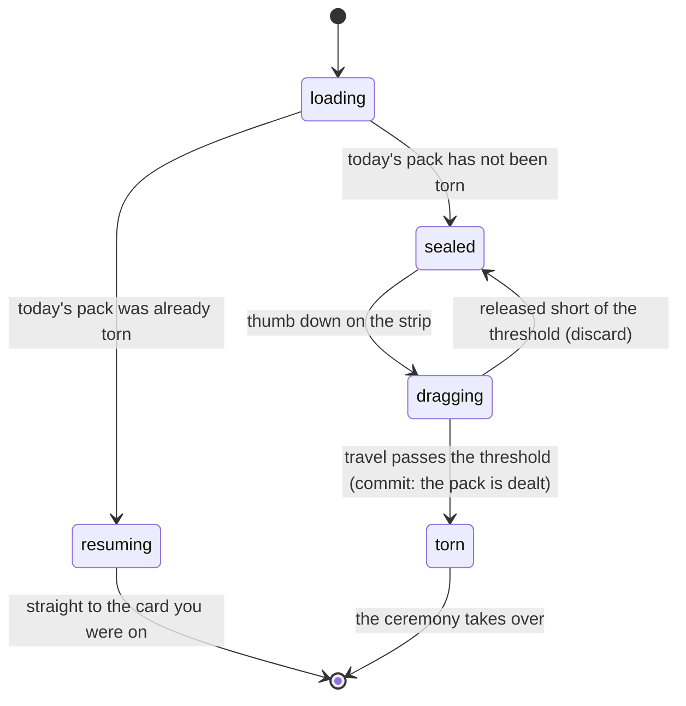

# The sealed pack

## Summary

Once a league day there is a pack waiting for you. This document covers
everything up to the moment it comes apart: what the screen decides before it
draws, why the pack in front of you is yours and not everybody's, what the
wrapper does under a thumb, and what commits the rip.

The pack is three cards, dealt by the server from one pool of roster cards and
[secrets](the-daily-secret.md), owned or not. What happens after the rip commits
belongs to [opening a pack](opening-a-pack.md).

## The simple case

You tap Pack. A sealed wrapper is on the screen, wearing the event's card back.
You put a thumb on the tear strip at the top and drag sideways. The seam lights,
the foil starts to part behind your thumb, and somewhere past halfway it goes:
the rip finishes on its own and the pack opens.

If you let go before that, the strip springs back and nothing has happened.

Come back later the same day and the wrapper is gone — you are returned to the
card you were looking at, not to the start. Come back tomorrow and there is a
fresh pack.

## Whose pack it is

The three cards are dealt by the server, for _you_: the member you claimed, or
failing that the handset. A guest gets an anonymous identity minted for them the
moment they land on this screen, so the pack is theirs rather than a locked box.
Two people standing next to each other open different packs, and refreshing
cannot reroll yours — the server answers the same pack back all day.

Nothing on the phone decides the cards. They are drawn from one hat: every
roster card of the active event and every secret with its art uploaded, owned or
not, three distinct cards at a time. There is no guaranteed-new slot any more.
A duplicate is a duplicate, and a duplicate that beats the copy you hold is an
[upgrade](opening-a-pack.md#new-better-or-another-one).

> Technical note: the pack used to be dealt on the phone from a seed, with the
> last slot swapped for a card the local collection did not hold, and a fourth
> slot for a secret drawn separately. Two authorities over one pack, two
> midnights, and a server that had to take the phone's word for which cards it
> had dealt. One Postgres function deals the whole pack now, keyed on the league
> day, and the phone only ever asks for it.

## The interaction, event by event

### Arrive

Before anything is drawn the screen has to settle three questions, and it draws
nothing until they are answered.

**Who is this pack for.** The browser is asked who it is holding. For one render
on every mount the answer is not known yet, and nothing is dealt against a
half-known identity — otherwise a claimed member would see a device-seeded pack
flash first.

**Has today's pack already been torn.** One pack a day, so a return visit resumes
rather than deals. A stored pack from yesterday is simply ignored; the next tear
overwrites it. A row written by the old client — three ids and nothing about
which slot was which — is not today's pack either; the server is asked, and it
either resumes today's or deals it.

**Has the server said what day it is, and has the collection reconciled.** The
pack is keyed on the league day, and a guest's "held before" is read off the
reconciled collection at the deal. Until both have answered the wrapper is not
tearable. This lasts a beat.

The wrapper wears the _event's_ card back, never a player's — the pack is shown
before anything has been dealt, and a per-player back would be the reveal,
printed on the outside of the pack.

### Leave without acting

Nothing is recorded. Reaching this screen is one mis-tap from the vault, and it
must not spend anything: no pack is dealt and no streak day is counted. All of
that waits for the rip.

### The tap that starts something

The rip. Everything about it is measured as horizontal _travel_ from where the
finger landed rather than as an absolute position — an earlier version compared
the pointer against the pack's own top edge, which meant a single tap below that
line opened the pack with no drag at all.

Full travel is 80% of the pack's width. The rip commits at 60% of that. Short of
it, the strip springs back.

One thing is decided at the instant it commits: **the server is asked for the
pack.** The request goes out at the rip rather than at the end of the ceremony,
so the round trip gets the ceremony's whole run as a head start, and the answer
is usually waiting by the time the deck lands on the stand. The fan itself is
always three identical backs — it knows nothing about which cards are coming,
and gives nothing away.

### While it runs

Between thumb-down and the commit, the tear is live under the finger. The seam
does not simply switch from joined to parted at the front: there is a shoulder
ahead of it where the foil is stretching but has not yet given, so the boundary
never meets the intact seam at a right angle. Without that it reads as a
rectangle being revealed rather than as something coming apart.

The ragged line the wrapper separates along is seeded off the pack, so a given
pack always tears the same way. Two people opening the same pack see the same
rip, and a re-render mid-drag cannot re-roll the edge underneath the animation
playing over it.

Letting go short of the threshold springs the strip back and leaves the pack
exactly as it was. Nothing has been dealt and nothing recorded.

### It settles

The rip commits and the screen hands over to the ceremony. From that moment the
pack is torn and there is no way back to a sealed wrapper for the rest of the
day. If the server's answer is slow the stand shows a pulsing back where the
first card will be; if it fails, an inline retry — never a toast. The pack is
still yours: asking again returns the same deal.

## Resuming

A pack you already opened does not replay. Coming back lands you on the card you
were looking at — not the start, and not the production. A payoff, not a toll.

Coming back also asks the server for the pack again. The cards on this device
are only ids and progress; a secret's art is a signed picture that expires, and
the server answers the same pack with fresh pictures. The stand waits that beat
before drawing anything, and holds your progress across it.

## Midnight

The pack's day is the league's — New York's midnight, the same clock everything
else daily in the app runs on. It used to be the device's, and anybody up between
the two clocks watched the secret re-arm while the three cards did not. The
screen checks for the day turning by polling rather than by scheduling, because
a phone suspends timers the moment its screen goes dark, and it trusts the
server's own answer about the day over the phone's clock while the wrapper is
sealed.

It never re-seals a pack under somebody's thumb. Eating a card mid-reveal is a
far worse bug than a stale tab, and the same goes for pulling the pack out from
under a ceremony that has three cards in the air.

## Modifiers

| Modifier                                                          | At arrival                                                                                                                                                                                                         | Changed during                                                                                                                                                     |
| ----------------------------------------------------------------- | ------------------------------------------------------------------------------------------------------------------------------------------------------------------------------------------------------------------ | ------------------------------------------------------------------------------------------------------------------------------------------------------------------ |
| Who you are (guest · member · account · commissioner)             | Decides whose pack is dealt. A guest is minted an identity on arrival so the pack is theirs. A member's pack follows their name rather than the handset, and their roster copies are minted at the deal.           | Claiming mid-pack does not re-deal what is already torn. The pack is carried across, and the cards still face-down at the claim are filed one by one as they turn. |
| The event's state                                                 | No active event means no roster and nothing to deal.                                                                                                                                                               | No effect on a pack already dealt.                                                                                                                                 |
| Dust switched on or off                                           | No effect on the pack.                                                                                                                                                                                             | No effect.                                                                                                                                                         |
| The device (phone · desktop · reduced motion · presentation mode) | Reduced motion silences the ceremony, not the pack: the tear still opens it and the cards are still dealt. A narrower phone shrinks the pack and its fan with it rather than letting cards push the page sideways. | No effect on the tear.                                                                                                                                             |

Changing identity mid-drag is not possible. Everything the pack is dealt from is
latched before the rip commits.

## Cancel and interrupt

| Event                                       | Before the rip commits                                                                                                             | After                                                                                                                                  |
| ------------------------------------------- | ---------------------------------------------------------------------------------------------------------------------------------- | -------------------------------------------------------------------------------------------------------------------------------------- |
| Back, or closing a sheet                    | Nothing dealt, nothing recorded. The pack is sealed when you return.                                                               | The pack is torn. You resume where you were.                                                                                           |
| Navigating away inside the app              | Same.                                                                                                                              | Same.                                                                                                                                  |
| Reload                                      | Same — a sealed pack is sealed.                                                                                                    | Resumes on the card you were on.                                                                                                       |
| Backgrounded                                | The drag ends wherever it was; short of the threshold it springs back.                                                             | The ceremony continues or is past; the position is already written.                                                                    |
| Network lost mid-request                    | The wrapper is not tearable until the server has answered, so a dead connection on arrival means a pack that cannot be opened yet. | The deal is in the air. The stand shows a pulsing back, then an inline retry; the pack is still yours and the retry gets the same one. |
| The request fails or times out              | The pack stays untearable and the screen shows nothing has been dealt.                                                             | An inline retry where the first card would be. Nothing is lost: the server answers the same pack to the retry.                         |
| The token expires or is cleared             | A member whose token has gone is dealt a device pack instead.                                                                      | No effect on a pack already dealt.                                                                                                     |
| Changed by someone else                     | Nothing else can change your pack.                                                                                                 | Nothing else can change your pack.                                                                                                     |
| A second tab or device                      | Two tabs share the device's stored pack. Both show the same sealed wrapper.                                                        | The second tab resumes the same pack, at the position the first one wrote.                                                             |
| Reduced motion or presentation mode changes | No effect on the tear.                                                                                                             | Turning reduced motion on mid-ceremony does not restart anything.                                                                      |

After an interrupt before the commit, the pack is exactly as it was. After one
past the commit, the cards are dealt and the position is written as it goes —
there is no state in which a card is lost.

## Interactions with other systems

**Who you have to be.** Nobody. A guest is given an identity rather than a gate.

**Realtime.** None during the tear. The pack does not change once dealt.

**Offline and reconnection.** A pack cannot be dealt without the server. Once
dealt, the cards are on the device; a reload asks again for the art.

**Optimistic updates and rollback.** The cards are written locally as they are
revealed and reconciled against the server's record separately. See
[opening a pack](opening-a-pack.md).

**The card economy.** The finish on each roster card and the level on each
secret are decided by Postgres at the deal, and arrive with the pack.

**Motion and sound.** The tear has no sound. The ceremony does; see
[motion and sound](../cross-cutting/motion-and-sound.md).

**Notifications and badges.** The Pack tab and the vault's button carry a dot
while today's pack is unopened. It says nothing about what is inside.

**Sharing.** A pack is not shareable. Its summary is; see
[what you pulled](what-you-pulled.md).

**The second device.** A member's pack follows their identity, so the same pack
is dealt on both. Only the device that tore it knows how far through it you are.

**Accessibility.** The sealed pack is a button as well as a drag target. It is
focusable, announces itself as "Tear the pack open", and opens on Enter or Space
— which commits the rip outright rather than asking for a threshold nobody can
express with a key. The button role, the label and the key handler are all
dropped the instant the rip commits, and the wrapper is hidden from assistive
technology from then on: a sealed pack is a button, an opening one is a short
film.

## Edge cases

- **A tap with no drag** does not open the pack. This was a real bug, fixed by
  measuring travel rather than position. Enter and Space are the deliberate
  exception: a key has no travel to measure, so it commits the rip outright.
- **Nothing to deal** — no roster and no secrets with art — is said out loud on
  the stand rather than shown as an error, and the day is not spent.
- **A phone that changed hands** is detected — the stored pack records who it was
  dealt to — and the new person is not dropped into the previous one's reveal.
- **A stored pack with no owner recorded** predates per-person packs and is
  treated as a match, so nobody mid-reveal on the day that shipped lost their
  cards.
- **Two taps in the same tick** cannot deal twice; the tear is latched
  synchronously rather than through state, which also survives development-mode
  double mounting.
- **Midnight during a ceremony.** The pack is not re-sealed until the ceremony
  and the reveal are done.
- **A roster smaller than the pack size** is made up from the secrets; with
  neither there is nothing to deal.

## Open questions and verification

- The exact feel of the 60% threshold — whether a hesitant drag reads as
  unresponsive — can only be judged on a phone and has not been.
- The behavior at midnight was read from the polling effect; a tab genuinely left
  open across the boundary has not been observed.
- Whether a guest who claims mid-pack sees anything change on the three roster
  cards has not been confirmed. The reading says no.
- Assumption: the wrapper is untearable for only a beat while the server answers
  the day and the collection reconciles. On a slow connection that beat could be
  long enough to read as a broken pack, and no loading affordance for it was
  found.

Verified against willyoubemyhero commit `752d4fb`.
