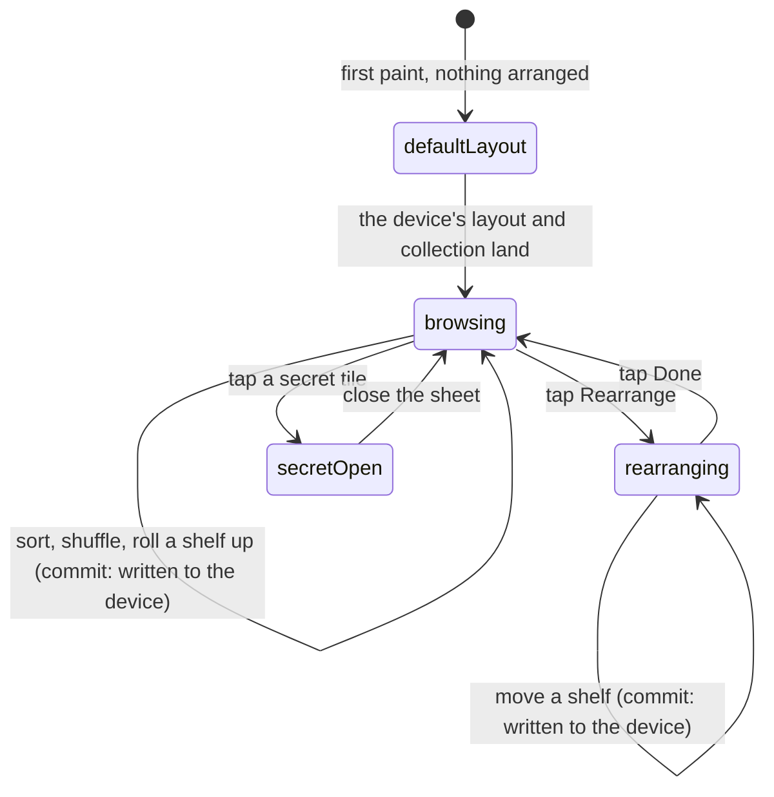

# The vault

## Summary

The vault is the screen the app opens to: everything you hold, on shelves you
arrange yourself. A header counts what is printed, what you have collected and
what your streak is worth, and puts the Open Pack button where a thumb already
is. Below it the page is a stack of collapsible shelves — your pinned cards, the
sets you have finished, one shelf per secret set you own something from, and the
roster last — each of which can be rolled up or moved, per device, forever.

It is the one screen in the app that reads everything and writes nothing to the
server. Every control on it — the sort, the shuffle, the shelf order, the roll-up
state, the star — changes what this browser shows and tells nobody.

## The simple case

You open the app and land on the vault. The header says "The Vault", under it
"18 of 18 cards printed · 4 collected", and beside it a big Open Pack button with
a coloured ring around it because today's secret is still waiting.

Below that, shelves. "Roster" holds the whole field: four cards face-up with a
tick under them, the rest face-down slots reading "Not packed yet". Above the
roster, a shelf named after the secret set you have started pulling from, with
two cards on it.

You tap "Rarity" and the four cards you own sort themselves best-first; the
face-down slots stay where they were, in name order, saying nothing about each
other. You tap the shelf header for Roster and it rolls up, leaving a title bar.
You tap "Rearrange", press the up arrow beside the secret shelf twice, and tap
"Done". Come back tomorrow, on this phone, and it is exactly as you left it.

## What is on a shelf

Shelves are built from what you hold, so a shelf only exists once there is
something on it:

- **Favourites** — cards you have starred. Absent until you star one. See
  [favourites](favourites.md).
- **Complete** — a plaque for each secret set you have finished, newest first.
  Absent until you finish one. This is the only shelf entitled to print a set
  size, because it only ever describes something already done. See
  [collection trophies](collection-trophies.md).
- **One shelf per secret set** you own a card from, in the order the commissioner
  arranged the sets and wearing that set's colour, with the unsorted pile last
  under "Secrets". A set you own nothing from does not appear at all — an empty
  header would leak the shape of what you have not pulled, which is the one thing
  the whole feature withholds. See [secret sets](secret-sets.md).
- **Roster** — every person on the combine roster, held or not. Last by default,
  because it is the one shelf you already know by heart.

A card appears on exactly one shelf. Starring a roster card or a secret moves it
up to Favourites rather than duplicating it, so a set whose every card is pinned
disappears from the lower half of the page.

## The interaction, event by event

### Arrive

Three things land at different moments and the page settles once as they do.

The first paint is the default: shelves in their default order, all open, and
every roster card face-down. The server has no access to the device's storage, so
the arrangement is read _after_ the first frame — the same dance every device
preference in this app does.

Then the collection reconciles. Until the server has answered, the page treats
every card as locked, because a card popping from face-down to face-up is a
reveal while the reverse is a leak. The counters in the header wait with it: "4
collected" does not appear until the number is the real one.

> Technical note: the device's own card store used to be trusted directly and had
> been inflated by an older behaviour where merely looking at a card collected
> it. Every count on this screen now waits for the server to say what you
> actually hold, which is why the header fills in a beat after the page draws.

The rest arrives independently and never blocks the page: the roster and its
tiers, signed URLs for the art, your secrets, the set names, the league's
trophies, how many people have packed each card, your streak, and — for a member,
and only while dust is on — your balance. A person who has signed in but has no
player on the roster also gets a one-time name prompt above the header: until
they name themselves their pulls are filed against the handset and nobody can
trade with them.

### Leave without acting

Nothing is recorded. Opening the vault, scrolling it and leaving writes nothing —
no view count, no last-seen, no server call. The sort you chose and the shuffle
you rolled are not remembered either; both are per-visit, and the page comes back
in Name order.

### The tap that starts something

The vault makes no server writes at all, so the only taps that commit anything
are the ones that touch this device's storage: rolling a shelf up, moving one,
and starring a card. Each is a single synchronous write to the browser.

Two smaller decisions are made at that instant. **Rolling a shelf up stores the
shelf, not the arrangement** — opening one says nothing about where it should
sit, and pinning the order there would freeze a layout the owner never made and
strand every set that arrives afterwards behind it. **The first move pins
everything currently on screen**, not just the shelf that moved, because a
one-item stored list would let the merge scatter its neighbours next time.

Closed shelves are what is stored, never open ones, so a set appearing for the
first time — somebody's first pull from a new set — arrives open rather than
hidden behind a tap nobody knows to make.

### While it runs

There is no window. No request, no spinner, no disabled state and nothing to
cancel. The shelf moves under the thumb that moved it, and every other mounted
view of the vault is told in the same beat.

The one thing that does take time is the sort settling as the collection
reconciles, and that is a single re-order rather than a progressive one.

### It settles

The arrangement is on the device. It survives a reload, a navigation and closing
the app, and it belongs to that browser: a second phone signed into the same
account gets your collection and its own default layout.

If the browser refuses to store — private mode, a full quota — the shelves still
move and still roll up for this page load, and the arrangement is gone on the
next reload. The screen trusts what it last set rather than re-reading storage,
precisely so a shelf does not visibly spring back under the thumb that moved it.

## Modifiers

| Modifier                                                          | At arrival                                                                                                                                                                                                                                                                                    | Changed during                                                                                                                                                                                      |
| ----------------------------------------------------------------- | --------------------------------------------------------------------------------------------------------------------------------------------------------------------------------------------------------------------------------------------------------------------------------------------- | --------------------------------------------------------------------------------------------------------------------------------------------------------------------------------------------------- |
| Who you are (guest · member · account · commissioner)             | A guest sees the roster, their secrets and a "Claim your player" link; no dust chip, no trophies, and no roster card they have not pulled on this phone. A member sees the same page plus their trophies and, with dust on, a balance chip. The commissioner's vault is an ordinary member's. | Claiming a player mid-session brings the secrets already pulled on this phone onto the name, and the trophy shelf can appear. The shelf arrangement is untouched — it belongs to the browser.       |
| The event's state (before the combine · running · finished)       | Before any official run every roster card is `base`, so the Rarity sort is one flat bucket behind the name tie-break.                                                                                                                                                                         | A result landing anywhere in the combine redraws tiers here without a refresh, and the Rarity sort re-orders under you. Shuffle is seeded, so a bundle update does not silently reshuffle the grid. |
| Dust switched on or off                                           | On, and only for a member: a dust balance chip sits beside the title and links to the shop. Off: no chip, and no balance is even asked for.                                                                                                                                                   | The chip appears or disappears on the next read of the event. Nothing else on the page moves.                                                                                                       |
| The device (phone · desktop · reduced motion · presentation mode) | Two cards across on a phone, three or four wider. Tiles are deliberately non-interactive: no tilt, half the foil, and no zoom, because thirty cards each running a tilt is what makes the page crawl.                                                                                         | Reduced motion drops the animated foil layers on every tile. A set finishing elsewhere can raise a full-screen trophy ceremony over this page and fade the nav out under it.                        |

## Cancel and interrupt

| Event                                       | Before the first stored change                                                                                                                                                                                                                      | After                                                                                                                     |
| ------------------------------------------- | --------------------------------------------------------------------------------------------------------------------------------------------------------------------------------------------------------------------------------------------------- | ------------------------------------------------------------------------------------------------------------------------- |
| Back, or closing a sheet                    | Nothing to cancel. Closing the secret sheet returns to the same scroll position.                                                                                                                                                                    | Nothing to undo — the write already happened. Moving the shelf back is the only way back.                                 |
| Navigating away inside the app              | No effect. The sort and the shuffle are lost; the page comes back in Name order.                                                                                                                                                                    | The arrangement is already written and is there when you return.                                                          |
| Reload                                      | No effect.                                                                                                                                                                                                                                          | The arrangement survives, unless storage was refused, in which case it is gone. The sort and the shuffle are always gone. |
| Backgrounded                                | No effect; nothing is in flight. On return the event, the pull counts, the trophies, the streak and the secret status all refetch on focus.                                                                                                         | No effect.                                                                                                                |
| Network lost mid-request                    | The page renders from whatever was cached. Card art that has not been fetched shows a placeholder with the player's initials; counters that never answered stay blank rather than showing zero.                                                     | No effect. Arranging shelves works with the radio off.                                                                    |
| The request fails or times out              | A failed collection read leaves the device's own cards showing rather than disowning them, so the page degrades to "what this phone remembers". A failed set-name read means secret shelves fall back to plain labels.                              | No effect.                                                                                                                |
| The token expires or is cleared             | A member whose token has expired loses the server half: trophies, the dust chip and the collected counts stop resolving. The roster still renders. There is no retry storm — the collection query gives up after one refusal.                       | No effect. The arrangement needs no token.                                                                                |
| Changed by someone else                     | A tier changing anywhere in the combine arrives over the event channel and redraws the affected cards live. A trade completing removes a card from your collection on the next read. A card leaving takes its shelf with it if it was the last one. | Same. A shelf that empties disappears from the page and drops out of the stored order the next time you move something.   |
| A second tab or device                      | Another tab's arrangement is read on arrival. A second device shares the collection and nothing about the layout.                                                                                                                                   | A shelf moved in another tab arrives and redraws this one.                                                                |
| Reduced motion or presentation mode changes | The foil layers stop or start. Nothing about the layout changes.                                                                                                                                                                                    | Same. A trophy ceremony taking the screen leaves the page exactly as it was underneath.                                   |

## Interactions with other systems

**Who you have to be.** Nobody. Every read here either needs no identity or
degrades to nothing without one, and the page makes no writes a guard could
refuse. Identity only changes how much of the page has anything in it.

**Realtime.** One subscription matters here: the event channel, which redraws
tiers as results land. Pull counts, secrets, trophies and the streak deliberately
have no channel — broadcasting a pull would attach the puller's name to it — so
those refresh when the window regains focus, which for a once-a-day drop is
enough.

**Offline and reconnection.** The shelves, the arrangement and the roster render
from cache. Card art does not, and falls back to initials. Nothing on the page
needs a connection to be usable.

**Optimistic updates and rollback.** None. Every change this screen can make is
local and immediate; there is nothing in flight to roll back.

**The card economy.** The vault is where a spare shows up as "Pulled ×3" and
where a finish is finally visible on the tile. What you can do with a spare lives
elsewhere — see [milling and selling](../dust/milling-and-selling.md).

**Motion and sound.** Silent. No chime on any control here, and the tiles carry a
deliberately reduced foil. The one exception is a trophy ceremony arriving from
somewhere else, which takes the whole screen.

**Notifications and badges.** Two, both in the header: a coloured ring and dot on
the Open Pack button while a secret is waiting, and an "Offer waiting" pill while
an unread trade offer is in. The Trade tab carries the same news permanently; the
pill exists because a tab's dot is easy to miss under a thumb on the screen you
are already looking at.

**Sharing.** Nothing on this screen is shareable. A single card is, from its own
page — see [a player card](a-player-card.md).

**The second device.** The collection follows a member; the arrangement, the
starred shelf, the sort and the trade-unread dot do not. Two phones on one
account show the same cards on two different layouts.

**Accessibility.** Each shelf is a headed region carrying its own count, and
while the vault is not being rearranged that header has one job — two targets a
thumb-width apart is the mistap the mode exists to remove. A move arrow that has
reached the end of the list is marked unavailable rather than genuinely disabled,
so a keyboard user does not lose their place mid-rearrange. A face-down slot
announces itself as an image named "<player> — not packed yet".

## Edge cases

- **A roster with nobody on it** says "No participants yet." A roster whose every
  card has been pinned upstairs says "Every card is pinned to Favourites." The
  two look identical in the markup and mean opposite things, so they are two
  states rather than one shrug.
- **A rolled-up shelf drops its cards from the page entirely** rather than hiding
  them, because every tile in one is running a foil layer. The Rearrange toggle
  only appears when there is more than one shelf to move.
- **A move at either end of the list does nothing** rather than wrapping. A wrap
  would send the shelf you are pushing upward to the very bottom, which reads as
  the app losing it.
- **A set you owned on your old phone** is dropped from the stored order rather
  than holding a gap nothing fills. A set this device has never seen falls in at
  the end, and moving it takes one tap.
- **Shuffle is not a sort.** It stays lit until you tap one of the four sorts, and
  tapping it again reshuffles. It is seeded on the event, so a result landing
  mid-shuffle does not reorder the grid under your thumb.
- **The Rarity sort never names a card you have not packed.** Locked slots all
  share one rank well clear of the real ones and fall back to the name tie-break,
  so they say nothing about each other — and while the collection is still
  reconciling the whole grid is one flat bucket in name order. A finish only ever
  breaks a tie inside a tier, so a platinum DNF cannot outrank a base champion.
- **A face-down slot still links to its player's page.** The detail page is gated
  too, and it is where somebody finds out what they are missing.
- **The secrets line, the packs line and the streak line are absent at zero**
  rather than showing a zero. "0 secrets pulled" would announce that a set exists
  at all.
- **A member on a new phone** who has not claimed again gets a line saying their
  secrets are on their name rather than on this handset — set once at claim and
  never cleared, so a collection does not appear to have silently vanished.
- **A trophy earned before the trophy table existed** prints no date. Nothing in
  the schema records when a given person acquired a given card, and eight people
  appearing to finish the same afternoon would be worse than saying nothing.

## Open questions and verification

- The order a shelf returns to after it has been emptied and comes back — a set
  whose last card was traded away and then traded back — was read from the merge
  rule rather than observed.
- The secret sheet swipes through every secret on the page in shelf order,
  including secrets on shelves that are currently rolled up. Whether that is
  intended, or whether a rolled-up shelf should drop out of the swipe, was not
  resolvable from the source.
- Whether the grid visibly settles once when the collection reconciles, and how
  long that takes on a real phone on a garden network, has not been watched.
- Whether a tier upgrading mid-combine visibly re-orders a Rarity-sorted grid
  under the user was read from the live-recompute path and not seen on race day.
- Assumption: no control on this screen writes to the server. Nothing in the
  route does, but the header's Open Pack button leads to a screen where the first
  thing that happens is a pack being dealt.

Verified against willyoubemyhero commit `b46f330`.
