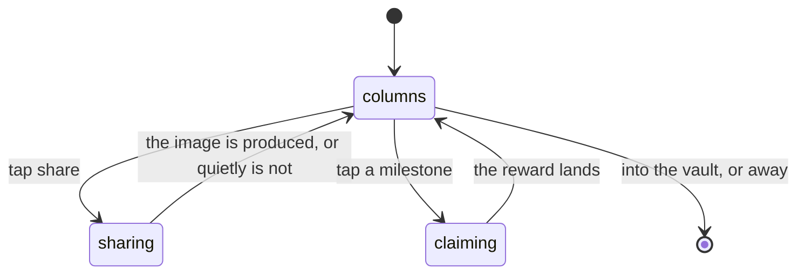

# What you pulled

## Summary

When you step off the end of the reveal stand, the pack does not simply stop
being a pack — it takes a curtain call. Every pull is laid out at once, in the
order it was dealt, with the collection counter that was hidden for the whole
reveal, a way to share it, and somewhere to go next.

This document owns the final stage of a pack. Getting there is
[opening a pack](opening-a-pack.md).

## The simple case

You press Next on the last card. The stand gives way to a layout holding
everything you just pulled: three cards in a row, each with its tier and its
finish — or, for a secret, its prism edge and its level — and the stamp the stand
gave it: NEW, ↑ GOLD, ×3.

Under them: how many cards you now hold, where your streak stands, a milestone to
claim if you have earned one, a button to share the pack as an image, and a link
into the vault.

Come back to this screen later the same day and it is what you land on. The pack
is finished; there is nothing left to turn.

## Why it exists

The sequence used to _stop_ rather than finish. The last card was turned and the
screen simply became a grid with a link back to the vault. Everything built up
over the previous thirty seconds was spent, and nothing collected it.

Laying every pull out at once is only allowed _here_, after each has been earned
one at a time. The same layout shown earlier would spend the payoff before it was
earned — which is the same reason the grid is a destination and never a stage.

## What is on it

**The cards.** In dealt order, each with the tier it wears and the finish on
your copy, and each with the stamp it earned on the stand. A secret sits in the
slot it was dealt in, wearing its prism edge, with its level pips and either its
level line or — on a plain duplicate — the wink and what it would sell for. The
subtitle admits a secret was in the pack only once it has been turned.

**The collection counter.** Hidden for the whole reveal and shown here. A running
total during the reveal would turn each card into an increment.

**The streak.** Where you stand, and the next rung above it. That block is absent
rather than zero until the query answers — a missing block reads as "still
loading", where a zero reads as "you have no streak", and only one of those is
true. Once every rung is behind you there is no next one to promise, and the line
says nothing rather than inventing something.

**A milestone to claim**, when one is owed. See [pack streaks](pack-streaks.md).

**Share.** Renders the pack as an image. See [sharing](../cross-cutting/sharing.md).

**Somewhere to go.** A link into the vault, so the screen has an exit that is not
the back gesture.

## The interaction, event by event

### Arrive

Landing here happens two ways: walking off the end of the stand, or opening the
pack screen again on a day whose pack is already finished. The second is
indistinguishable from the first except that no ceremony played.

Everything on the screen is already known by this point. There is no fetch that
gates the layout; the streak and the milestone fill in when they answer.

### Leave without acting

Nothing is recorded. The pack is finished either way, and looking at the curtain
call is not part of finishing it.

### The tap that starts something

Three things on this screen write: claiming a milestone, sharing, and following a
link out. Only the first changes anything.

### While it runs

Claiming a milestone is a server call with a disabled button behind it. Sharing
happens on the device — the shareable image is rendered off-screen and rasterised
on demand, and it is kept mounted rather than created on the click, because a
node that arrives in the same tick as the tap has no layout yet to measure.

### It settles

A claimed milestone pays a bonus secret, revealed with the same production the
daily one gets. A share hands the image to the device.

A share that could not be produced simply brings the button back. It is not worth
an error somebody has to dismiss on a screen they are enjoying.

## Modifiers

| Modifier                                                          | At arrival                                                                                                             | Changed during                                                 |
| ----------------------------------------------------------------- | ---------------------------------------------------------------------------------------------------------------------- | -------------------------------------------------------------- |
| Who you are (guest · member · account · commissioner)             | A guest sees the same three cards. Cashing a milestone requires an account, so the button says so rather than failing. | Claiming a player mid-screen changes nothing on the cards.     |
| The event's state                                                 | The tiers shown are live and can change while the screen is open.                                                      | A result landing re-draws a card's tier here as anywhere else. |
| Dust switched on or off                                           | No effect on this screen. A duplicate credits nothing at pull time either way.                                         | No effect.                                                     |
| The device (phone · desktop · reduced motion · presentation mode) | The layout is built for a phone. Reduced motion removes the entrance animation, not the layout.                        | No effect.                                                     |

## Cancel and interrupt

| Event                                       | Before claiming or sharing                                                                                | After                             |
| ------------------------------------------- | --------------------------------------------------------------------------------------------------------- | --------------------------------- |
| Back, or closing a sheet                    | Nothing is lost. The pack is finished and this screen is what you return to today.                        | A claimed milestone is claimed.   |
| Navigating away inside the app              | Same.                                                                                                     | Same.                             |
| Reload                                      | Lands back here.                                                                                          | Same.                             |
| Backgrounded                                | An in-flight claim may fail and can be retried.                                                           | No effect.                        |
| Network lost mid-request                    | Sharing still works — it is produced on the device. Claiming does not.                                    | A claim that landed is paid.      |
| The request fails or times out              | The claim button returns; the share button returns silently.                                              | No effect.                        |
| The token expires or is cleared             | The milestone button stops being offered.                                                                 | A reward already paid stays paid. |
| Changed by someone else                     | A tier can change under a card here.                                                                      | Same.                             |
| A second tab or device                      | Both show the same finished pack. A milestone claimed in one is not offered in the other after a refresh. | Same.                             |
| Reduced motion or presentation mode changes | No effect.                                                                                                | No effect.                        |

## Interactions with other systems

**Who you have to be.** Nobody, to see the columns. An account, to cash a
milestone.

**Realtime.** Tier changes arrive live.

**Offline and reconnection.** The layout renders from what is already known.
Sharing works; claiming does not.

**Optimistic updates and rollback.** The claim is not optimistic; the reward
appears when the server has paid it.

**The card economy.** This is where a pull's finish is finally shown honestly,
and where the streak's payout is offered.

**Motion and sound.** A milestone's bonus secret gets the full reveal. There is a
deliberate gap between a secret's own burst and the sound of a set closing behind
it, long enough that the two read as consequence rather than as one noise — the
confetti is still in the air when the second starts, and the ear has to have
finished the first chime before the second lands on it.

**Notifications and badges.** A completed set raises a trophy here rather than
during the reveal.

**Sharing.** The pack image is this screen's own feature.

**The second device.** The finished pack is the same on both; the position that
got you here is not shared.

**Accessibility.** Every card's tier and finish is text under it. The share
button's failure is silent, which is the right call for a decorative action and
is noted below as something a screen reader user would not learn about.

## Edge cases

- **A pack with no secret** is three roster cards and a subtitle that says come
  back tomorrow. Nothing on the screen admits a secret could have been here.
- **A pack with three secrets** is three secrets in a row. The layout does not
  change shape for any mix.
- **Every rung already claimed.** No next milestone is promised, because there is
  nothing left to promise.
- **The streak query still in flight** leaves a gap rather than a zero.
- **A share on a device that refuses it** brings the button back with no message.
- **Landing here without a ceremony** — reopening a finished pack — looks
  identical to arriving off the stand.

## Open questions and verification

- The silent failure of the share button means a screen reader user gets no
  feedback at all from a failed share. Worth a product decision; raised here
  rather than resolved.
- Whether the collection counter is genuinely hidden for the whole reveal, on
  every path including the automatic run, was read from the layout and not
  watched.
- The gap between a secret's burst and a set closing behind it was read as a
  constant; whether it reads as consequence rather than noise has not been heard.
- Assumption: this screen never fetches anything that gates its layout. The
  streak and milestone blocks fill in late by design, and nothing else was found
  that could leave the screen empty.

Verified against willyoubemyhero commit `752d4fb`.
