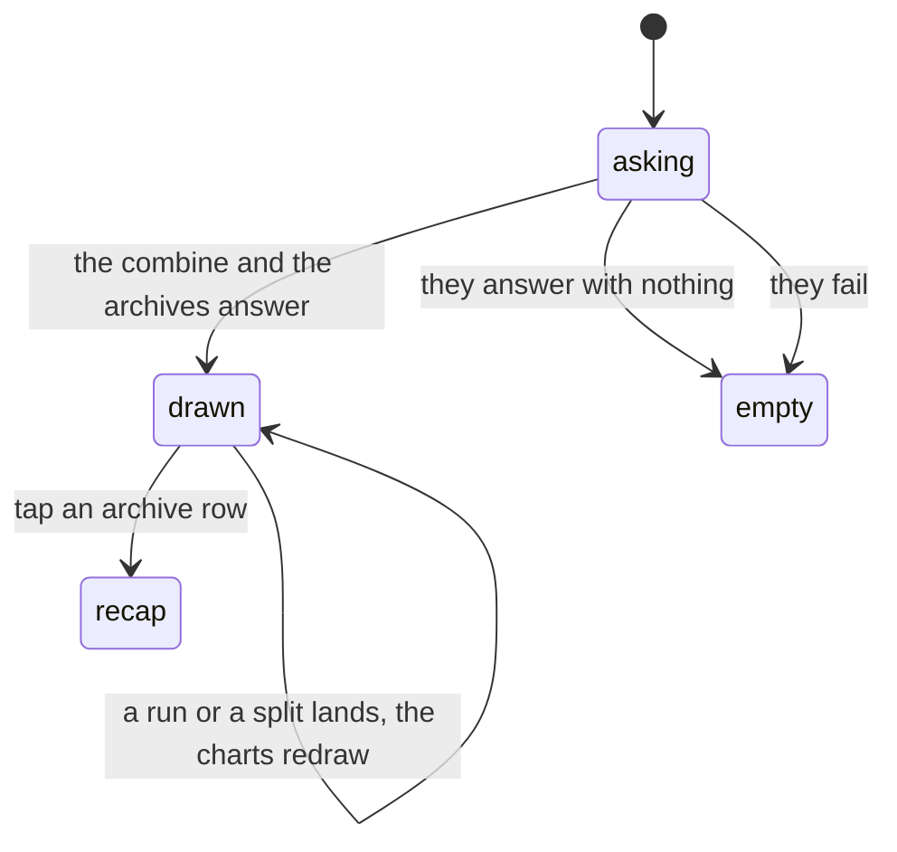

# Analytics and the archive

## Summary

Two charts and a list, on the last tile of the
[League hub](../foundations/navigation-and-screens.md#the-league-hub). The charts
say which obstacle is actually the hard one and who has the fastest time on the
board. The list underneath is every combine ever archived, each one a link to
[its own recap](the-recap.md).

Nothing on this screen writes, and nothing on it asks who you are. A guest, a
member, the commissioner and a stranger with the link all see exactly the same
page.

## The simple case

You open Analytics from the League hub. Three panels stacked down the page.

**Average Split by Station** — a bar chart, one pair of bars per obstacle in
course order: the average time everybody took at that station and the best time
anybody has taken there, in seconds. Touch a bar and a dark tooltip names the
station and the two numbers.

**Personal Bests** — a numbered list of the ten fastest official finishes on the
board, each player counted once at their own best time.

**Archive** — every combine that has been archived, newest first, with the year
it ran and the date it was filed. Tap one and you land on its recap.

## What the charts count

The station chart counts **every** split recorded at that station, whether the
run it belonged to was made official or not — a practice attempt, a run that was
later voided, and the run that decided a tier all pull the same average.

A station nobody has reached yet is drawn anyway, as a pair of flat bars at zero,
because the chart is built from the course rather than from the results. A
station with splits but no _segment_ times behaves the same way and drags its own
average toward zero, which reads on the chart as an obstacle everybody flew
through.

Personal Bests is stricter: official runs only, one row per player, fastest
first, and capped at ten. With thirteen on the roster the three slowest
finishers are simply not on it — there is no "and 3 more" line.

Both are the same milliseconds every other screen works in, formatted at the very
end: seconds to two decimals in the chart, the app's usual minutes-and-hundredths
in the list. See [time and the clock](../foundations/time-and-the-clock.md).

## The archive

The list is not scoped to the current combine. It is every archive row in the
database, newest first, so an archive of the combine you are standing in appears
alongside last year's the moment the commissioner files it.

Each row shows the event's name and year and the date it was archived, in the
device's own date format. Tapping it opens `/recap/<slug>`.

The archive has no tile of its own on the League hub. It already lives on this
screen, and a second door to one room reads as two rooms.

Archives are made by the commissioner, from the admin console, one button at a
time. Nothing here can create, rename or delete one.

## The interaction, event by event

The two failing paths and the genuinely empty one land in the same place, which
is the most surprising thing about this screen and is covered under edge cases.

### Arrive

Two reads. The [event bundle](../foundations/the-event.md), shared with every
other combine screen and usually already in cache by the time you get here; and
the archive list, which is its own request and is cached for a minute.

The charts are computed on the device from the bundle — the splits, the stations
and the runs that are already on the phone. Nothing is aggregated server-side and
no analytics query exists.

This screen takes the bundle's data and ignores everything else the bundle tells
it. It does not show the "Reading the combine…" state, the "can't reach the
combine" state, or the banner that says the live feed is down. What it shows
while it waits is "No split data yet."

### Leave without acting

Nothing is recorded. There is no view count, no last-opened, no server call other
than the two reads. Opening the archive and closing it again tells nobody.

### The tap that starts something

There is no write on this screen at all, so the phase never really arrives. Two
taps do anything: a bar, which opens a tooltip and closes it again, and an
archive row, which leaves for [the recap](the-recap.md).

That is the whole surface. No filter, no date range, no export, no way to change
what is counted.

### While it runs

Nothing is ever in flight from here. What does happen while you are looking is
that the combine keeps moving: the shared live channel is still open underneath
this screen, so a run finishing or a split being corrected redraws both charts
where you are standing, without a refresh.

### It settles

The charts settle when the combine does. Once the last official time is in, the
station bars and the top ten stop moving, and the page is a record rather than a
readout.

## Modifiers

| Modifier                                                          | At arrival                                                                                                                                                                                                                                                                                 | Changed during                                                                                                       |
| ----------------------------------------------------------------- | ------------------------------------------------------------------------------------------------------------------------------------------------------------------------------------------------------------------------------------------------------------------------------------------ | -------------------------------------------------------------------------------------------------------------------- |
| Who you are (guest · member · account · commissioner)             | No effect. The whole page is public and identical for everybody; nothing is personalised, and your own best time is not marked.                                                                                                                                                            | No effect. Claiming a player or unlocking the console changes nothing on this screen.                                |
| The event's state (before the combine · running · finished)       | This is the axis that matters. Before any run both charts are empty and the archive may hold last year's. During, both charts move. After, they settle.                                                                                                                                    | Changes arrive live. A commissioner correcting a split moves both bars for that station under you.                   |
| Dust switched on or off                                           | No effect on the page. It changes the bottom bar from five columns to six underneath it.                                                                                                                                                                                                   | No effect beyond that reflow.                                                                                        |
| The device (phone · desktop · reduced motion · presentation mode) | The chart is a fixed height and the station names are drawn at a fixed size, so a course with many stations crowds its own axis on a phone. The tooltip is tap-to-open rather than hover. The page runs to the edges of the screen, with no side gutter — unlike the other League screens. | No effect. Nothing here animates, so reduced motion has nothing to turn off, and no ceremony ever takes this screen. |

## Cancel and interrupt

| Event                                       | Before any tap                                                                                                 | After a tap                                                                             |
| ------------------------------------------- | -------------------------------------------------------------------------------------------------------------- | --------------------------------------------------------------------------------------- |
| Back, or closing a sheet                    | Nothing to cancel.                                                                                             | Nothing to undo. A tooltip closes; a recap you opened is a page you can come back from. |
| Navigating away inside the app              | No effect. The bundle stays cached and the live channel is held through its grace period.                      | No effect.                                                                              |
| Reload                                      | Both reads happen again. The archive list is served from cache for a minute.                                   | Same.                                                                                   |
| Backgrounded                                | The live feed may drop. Nothing on this screen says so, and the charts silently stop moving until it recovers. | Same. Regaining focus refetches the bundle.                                             |
| Network lost mid-request                    | The charts show their empty text as though there were no data.                                                 | No effect; nothing was in flight.                                                       |
| The request fails or times out              | Identical to having no data: "No split data yet.", "No official finishes yet.", "No archived events yet."      | No effect.                                                                              |
| The token expires or is cleared             | No effect. This screen needs no token of any kind.                                                             | No effect.                                                                              |
| Changed by someone else                     | This is the normal case: a live combine changes constantly and the charts follow it.                           | Same.                                                                                   |
| A second tab or device                      | Every device computes the same charts from the same bundle and agrees.                                         | Same.                                                                                   |
| Reduced motion or presentation mode changes | No effect.                                                                                                     | No effect.                                                                              |

## Interactions with other systems

**Who you have to be.** Nobody. Both reads are public, neither carries a guard,
and the archive list is served through the read-only public role rather than the
privileged one.

**Realtime.** Inherited whole from the event bundle. The charts are live without
this screen doing anything to make them live — and without saying so when the
feed is down. See
[realtime and staleness](../cross-cutting/realtime-and-staleness.md).

**Offline and reconnection.** The last bundle stays on screen and the charts keep
drawing from it. A cold open with no connection shows the three empty lines.
Reconnecting refills everything without a reload.

**Optimistic updates and rollback.** Neither applies. Nothing is written, so
there is nothing to be optimistic about.

**The card economy.** None. A fast split changes a card's tier through the
[event](../foundations/the-event.md), not through this screen, and nothing here
is worth dust.

**Motion and sound.** No chimes and no ceremonies. The chart's bars animate into
place when the data changes, which is the chart library's own behaviour rather
than anything this app asked for.

**Notifications and badges.** None. No dot on the nav ever refers to analytics or
to a new archive.

**Sharing.** Nothing on this screen exports. The archive rows are the sharing
surface: a recap has a plain public URL that works for anybody, with no token in
it. See [sharing](../cross-cutting/sharing.md).

**The second device.** Nothing is per-device. Two phones side by side show the
same charts within a beat of each other.

**Accessibility.** The charts are drawn as graphics with no text alternative, so
a screen reader gets the panel headings and nothing else — the numbers behind the
bars exist nowhere in text. Personal Bests and the archive are ordinary lists and
read fine.

## Edge cases

- **Loading, failed and genuinely empty look identical.** All three read "No
  split data yet." / "No official finishes yet." / "No archived events yet." The
  app has a shared vocabulary for exactly this distinction — a spinner, a
  can't-reach message with a retry, and a degraded banner — and this is one of
  the few combine screens that does not use it.
- **A degraded live feed is silent here.** Every other spectator screen puts a
  banner up. This one keeps drawing the last numbers it had.
- **Unofficial runs count toward the station averages** but not toward Personal
  Bests, so the two panels can disagree about who was quick.
- **A station with no splits is still drawn**, as a pair of zero bars.
- **An official run with no time** takes a place in Personal Bests and prints
  nonsense where its time should be, rather than being skipped.
- **Eleventh place and below is invisible.** No count, no expander, no note that
  the list was cut.
- **The archive spans combines.** Two events archived in the same year get
  numbered slugs, and both appear as separate rows with the same name and year;
  the archived-on date is the only thing that tells them apart.
- **Re-archiving the same combine adds a row** rather than replacing one. The
  list grows a near-duplicate every time the commissioner presses the button.
- **The chart's colours are its own.** It is drawn in fixed blues rather than the
  palette the rest of the app is built from, so it does not follow a theme change.

## Open questions and verification

- That the loading and failed states are indistinguishable from an empty combine
  was read from the screen's own data handling; it has not been watched on a
  phone with the connection cut. It is the highest-value verification item here,
  and the most likely genuine defect in this document.
- What an official run with a missing time actually renders was derived from the
  formatting rules rather than observed. It should not be reachable through the
  admin screens; whether it ever is has not been established.
- Whether the station names collide on a phone at thirteen stations was inferred
  from the fixed font size, not measured.
- The tooltip's behaviour under a thumb — how it opens, whether it stays, how it
  closes — is the chart library's, and was not tested on a touch device.
- The page having no side gutter, unlike its sibling League screens, was read
  from the layout and not compared side by side on a phone.
- Assumption: no archive is ever deleted. Nothing in the app deletes one, so the
  list only grows.

Verified against willyoubemyhero commit `b46f330`.
