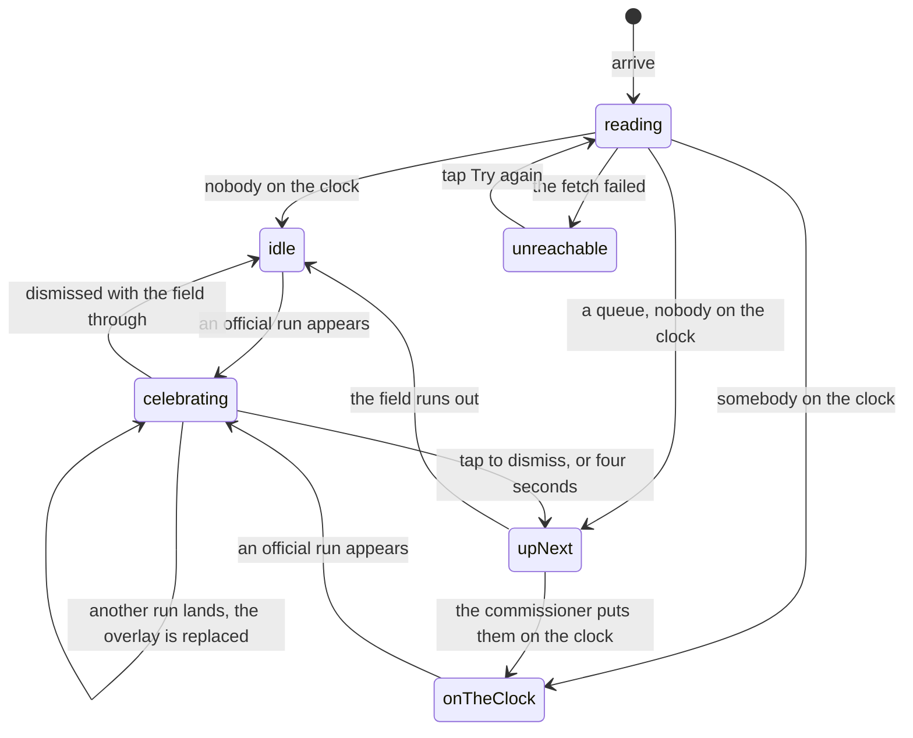

# Live timing

## Summary

Live timing is the crowd screen: one big ring counting up, the athlete the room
should be looking at inside it, the top five underneath, and a full-screen
celebration every time somebody crosses the line. It is reached from the Live
tile on [the League hub](../foundations/navigation-and-screens.md#the-league-hub),
which is the only way in.

For a spectator it is entirely read-only. The only taps on it are dismissing a
celebration and following a name to a player's page. The clock on it is
unofficial by construction and says so. The commissioner sees timing controls
docked under the ring that nobody else does; those belong to
[running the clock](../admin/running-the-clock.md).

## The simple case

You are standing in the garden with a beer. You tap Live on the League hub. The
screen says "Reading the combine…" briefly, then a cyan ring the width of the
phone draws itself with somebody's card art faint behind the digits.

The commissioner puts the next athlete on the clock and the ring starts counting
from that instant, with "On the Clock" under the digits and the word
**Unofficial** under that. The athlete's name sits below the ring in large
capitals; tapping it opens their card.

They finish. Within a beat the screen goes dark, confetti fires from both bottom
corners, and their name and time land in the middle with either "New leader" or
how far off the lead they were. It clears after about four seconds, or
immediately if you tap it. The top five underneath has already reordered and the
tally beside it has moved from 4/13 to 5/13.

## The clock the crowd watches

The ring is **not** the official time and never becomes it. It counts from the
moment the commissioner put somebody _on the clock_, which is usually a beat
before they tap start, so it reads slightly ahead of the number that ends up in
the record. That gap is expected rather than a fault, and it exists so the big
screen counts up from something real rather than from whenever the browser
happened to load. The full account is in
[time and the clock](../foundations/time-and-the-clock.md#two-clocks-and-only-one-of-them-counts).

The word "Unofficial" only appears while somebody is genuinely on the clock. If
the commissioner is timing a run on this same device the ring switches to that
run's own clock and the label goes away, because at that point the number on
screen is the one being recorded. The arc around the digits completes a lap
every sixty seconds and starts again; it is decoration, and the digits are the
number that matters.

## Who the ring is looking at

In order of precedence: **whoever the commissioner put on the clock**, because
that is a deliberate "this person is stepping up now" action; failing that, **the
first athlete in running order** who is neither finished nor scratched, labelled
"Up Next" rather than "Standby" so a [running order](the-running-order.md) that
has just been re-randomized immediately puts its new number one on this screen;
failing that, **nobody**, and the ring holds a silhouette while the screen says
why.

That last case is the one this screen is careful about, because four different
situations used to look identical and it congratulated all of them:

| What is actually true          | What the screen says                              |
| ------------------------------ | ------------------------------------------------- |
| The roster could not be read   | "Couldn't read the roster just now — retrying."   |
| There is no roster yet         | "No roster yet. The commissioner sets the field." |
| Everybody has run              | "Every athlete is done. Nice work."               |
| There are athletes still to go | "Nobody on the clock right now."                  |

"Every athlete is done" is only true when there was a field to be done in the
first place. Before the very first fetch returned, this screen used to print it
over a `0/13` counter.

None of these four appears while there is somebody to show: with athletes still
queued the ring holds the next one and the status line reads "Up Next". The last
row is what you get when no athlete can be found but the tally says the field is
not through — everybody marked finished, but not everybody carrying an official
run.

## The interaction, event by event

### Arrive

The active combine, then its bundle. Until the first lands the screen says
"Reading the combine…" rather than drawing an empty ring.

Once it has the bundle, three things are decided at once: who the ring is
looking at, what the ring is counting from, and which finishes count as already
seen. That last one matters: opening this screen halfway through a combine does
**not** replay the celebrations you missed. Every official run in the first
bundle is marked seen, silently, and only runs that appear after that fire a
celebration. Without it, arriving at 5pm would throw eight consecutive overlays
at you.

> Technical note: the clock is anchored on the stamp on the roster row, not on
> a fresh reading of the current time each render. The bundle refetches every
> few seconds while the combine is live, and re-anchoring on every refetch would
> make the ring stutter backwards.

### Leave without acting

Nothing is recorded. Watching does not touch the combine, and there is no
attendance, no viewer count and no "was watching" state anywhere.

### The tap that starts something

For a spectator there is none. This screen has no write path at all: no guard,
no server function, nothing to commit and nothing to undo. The taps that exist
are navigation — an athlete's name, a name in the top five — and dismissing a
celebration, which affects only that phone and only for the four seconds the
overlay would otherwise have run.

Everything that _does_ write here — start, split, pause, finish, reset — is
behind the commissioner's controls, which render nothing at all without a valid
admin token for this combine. See
[running the clock](../admin/running-the-clock.md).

### While it runs

Between arrival and leaving, this screen is in constant motion without anybody
touching it. The ring interpolates smoothly while it is running and freezes
amber when it is not. The bundle refetches on every change to the combine, so
the athlete in the ring, the top five and the tally all move under you. Each new
official run fires its own celebration.

The celebration is a full-screen overlay, so a finish arriving while the next
athlete is already on the clock hides a running clock for those four seconds.

### It settles

There is no settled state during a combine — the screen is a window, and it
stops moving when the combine does. Once the last athlete is through the ring
holds a silhouette at `00:00` in amber, the message reads "Every athlete is
done. Nice work.", and the top five is the final one.

## The finish celebration

It fires once per official run that was not in the bundle when you arrived,
carrying the athlete's name, their official time, and either "New leader" or
"+3.10 off lead". Confetti fires from both bottom corners for a little over a
second unless the device asks for reduced motion, in which case the overlay
appears without it and is otherwise unchanged. It auto-dismisses after roughly
four seconds; tapping anywhere dismisses it immediately.

> Technical note: the four-second timer used to be torn down and rebuilt every
> time the bundle refetched, which on a live combine is every few seconds. The
> result was that finishers two through thirteen got a blocking overlay with no
> confetti and no way out except a tap. The timer is now keyed to the finish
> itself rather than to the screen around it.

Two finishes landing in the same refetch overwrite each other: only the second
is shown. In practice that needs two athletes to be marked official within the
same few seconds.

## Modifiers

| Modifier                                                          | At arrival                                                                                                                                                                                                                                 | Changed during                                                                                                                                                                                               |
| ----------------------------------------------------------------- | ------------------------------------------------------------------------------------------------------------------------------------------------------------------------------------------------------------------------------------------ | ------------------------------------------------------------------------------------------------------------------------------------------------------------------------------------------------------------ |
| Who you are (guest · member · account · commissioner)             | A guest, a member and an account holder see exactly the same screen. A commissioner holding an unexpired admin token for _this_ combine additionally gets the timing bar under the ring, and the ring switches to the run they are timing. | An admin token expiring, being cleared, or being minted mid-visit adds or removes the timing bar within a minute without a reload. Nothing a spectator sees changes.                                         |
| The event's state (before the combine · running · finished)       | The load-bearing row. Before it, the ring is on standby and the screen names which kind of nothing it is looking at. During, it is the point of the screen. After, it congratulates the field.                                             | Every transition arrives live. The screen is never reloaded between phases and never needs to be.                                                                                                            |
| Dust switched on or off                                           | No effect.                                                                                                                                                                                                                                 | No effect beyond the bottom bar reflowing underneath.                                                                                                                                                        |
| The device (phone · desktop · reduced motion · presentation mode) | The ring is a fixed 340 pixels whatever the screen; on a desktop the layout widens around it rather than the ring growing. Reduced motion removes the confetti from celebrations and nothing else.                                         | Turning reduced motion on mid-combine takes effect from the next finish, not the one on screen. This screen never enters presentation mode; the big-screen version of it is [the TV board](the-tv-board.md). |

## Cancel and interrupt

| Event                                           | Watching                                                                                                                                                                                          | While a celebration holds the screen                                                                                                        |
| ----------------------------------------------- | ------------------------------------------------------------------------------------------------------------------------------------------------------------------------------------------------- | ------------------------------------------------------------------------------------------------------------------------------------------- |
| Back, or closing a sheet                        | Leaves the screen. Nothing to cancel.                                                                                                                                                             | Tapping the overlay dismisses it. A back gesture leaves the screen and the celebration with it.                                             |
| Navigating away inside the app                  | No effect; nothing is in flight. Coming back re-reads the combine.                                                                                                                                | The celebration is gone and does not resume. Coming back re-marks every official run as seen, so it will not replay.                        |
| Reload                                          | The screen rebuilds from scratch: two requests, then the ring.                                                                                                                                    | The celebration is lost and will not fire again — a reload re-establishes the "already seen" baseline.                                      |
| Backgrounded                                    | The ring stops animating while the tab is hidden and jumps to the correct time on return, because it counts from a stamp rather than accumulating. The live channel may drop; the banner says so. | The four-second timer may not run while hidden, so a celebration can still be on screen when you come back to the phone. Tapping clears it. |
| Network lost mid-request                        | Whatever was last drawn stays drawn and stops updating. The ring keeps counting — it needs no network, only the stamp it already has.                                                             | No effect. The celebration is entirely local.                                                                                               |
| The request fails or times out                  | If nothing had loaded, "Can't reach the combine" with a Try again button. If the screen had already drawn, the degraded banner appears over live-looking but stale content.                       | No effect.                                                                                                                                  |
| The token expires or is cleared                 | For a spectator, no effect — this screen needs no token. A commissioner's expiring token removes the timing bar and reverts the ring to the crowd's clock.                                        | Same.                                                                                                                                       |
| Changed by someone else, arriving over realtime | The normal case, not an exception. A run starting, finishing, being edited or being reset arrives within a beat and redraws everything: the ring, the name, the top five, the tally.              | A finish arriving during a celebration replaces it, and the new finisher gets their own full four seconds.                                  |
| A second tab or device                          | Every device watching sees the same thing, within its own clock skew. Two tabs share one connection per browser.                                                                                  | Each device runs its own celebration and dismisses it independently. Dismissing on your phone does not dismiss it on the TV.                |
| Reduced motion or presentation mode changing    | Takes effect at the next celebration.                                                                                                                                                             | The celebration on screen keeps the confetti it already started.                                                                            |

Nothing here can be interrupted into a bad state, because nothing on it is a
transaction. The worst any of these produces is a missed celebration.

## Interactions with other systems

**Who you have to be.** Nobody, to watch. The commissioner's bar renders only
against an unexpired admin token bound to this combine, and every control on it
is guarded again on the server — the bar being on screen is not what authorises
the write.

**Realtime.** This screen is the strongest argument for the event's live
channel: a finish reaching thirteen phones in a garden within a beat is the
product. When the channel is unhealthy the screen polls every few seconds
instead and says so in a banner; celebrations still fire, a little late.

**Offline and reconnection.** The ring keeps counting offline, because it counts
from a stamp it already holds; everything else freezes at its last value.
Reconnecting refetches, which can deliver several finishes at once — and only
the last of them is celebrated.

**Optimistic updates and rollback.** None. Everything on screen is what the
server last said.

**The card economy.** A finish landing here is the same event that upgrades a
card's tier mid-combine. Nothing here pays dust or grants a card.

**Motion and sound.** The confetti and the overlay are the app's loudest moment
outside the pack. Both respect the device's reduced-motion preference; neither
makes a sound. See [motion and sound](../cross-cutting/motion-and-sound.md).

**Notifications and badges.** None. A finish produces no dot on the bottom bar
and no notification on a phone that is not looking at this screen.

**Sharing.** Nothing here exports. A finisher's result becomes an image from
[the leaderboard](the-leaderboard.md) instead. The screen's own URL carries
broadcast-style link preview text.

**The second device.** The intended setup is several at once: phones in hands
and [the TV board](the-tv-board.md) on a screen. Each computes the crowd's clock
independently from the same stored instant, so they agree to within their own
clock skew.

**Accessibility.** The ring's digits and status line are text, and the top five
is a numbered list. The celebration is a full-screen button, so it is reachable
and dismissible from a keyboard, but it is not announced as a dialog and does
not move focus into itself — a screen reader user gets no signal that the screen
has changed.

## Edge cases

- **The digits change format at one minute.** Below a minute the ring reads
  `41:32` — seconds and hundredths, colon-separated, with a small `s` after it —
  and at a minute it becomes `1:41.32`. Everywhere else a sub-minute time is
  written `41.32`.
- **A device with a clock behind the server's** floors at zero rather than going
  negative, so the ring sits at `00:00` for a second before moving. That is
  clock skew on the phone, not a stalled run.
- **An unreadable stamp** — corrupt or missing — holds the ring at zero and drops
  the "Unofficial" label, while the athlete's name is still shown.
- **An official run with no time** sorts to the _top_ of the top five with an em
  dash where its time should be. The leaderboard sorts the same run to the
  bottom.
- **Athletes out of contention appear in the top five.** Somebody scratched or
  disqualified with an official run is out of contention for every tier but not
  for this list.
- **The tally counts runs against people.** "5/13 done" is five official runs
  against thirteen non-scratched roster entries, so an athlete re-timed twice
  counts twice — and enough of that tips the screen into "Every athlete is done"
  while people are still queueing.
- **A status the live app never writes.** The archive vocabulary also holds
  disqualified, did-not-play and absent. Picking who is up next only skips
  _finished_ and _scratched_, so an athlete carrying one of the others sits in
  the ring as "Up Next" indefinitely.

## Open questions and verification

- **The top five and the leaderboard sort a timeless official run in opposite
  directions.** One puts it first, the other last. At most one of those is
  intended.
- **The ring's sub-minute format disagrees with the rest of the app.** `41:32`
  for forty-one seconds reads as forty-one minutes to anybody who has just come
  from the board. Likely a defect, though it may be a deliberate scoreboard
  convention; it has not been confirmed with the league.
- **Only the last of a batch of finishes is celebrated.** Two runs marked
  official between refetches produce one overlay. Whether that ever happens in a
  real combine depends on how quickly the commissioner works.
- Whether an athlete carrying a disqualified or absent status can block the "Up
  Next" slot was read from the code and not reproduced.
- That the ring recovers correctly after a phone has been locked for several
  minutes follows from it counting off a stored stamp, but should be watched on
  a real phone before a real combine. The gap between the crowd's clock and the
  official time has not been measured either.
- Assumption: the celebration makes no sound. Nothing in the source plays one,
  but the ceremony audio elsewhere in the app loads lazily and was not
  exhaustively traced.

Verified against willyoubemyhero commit `b46f330`.
