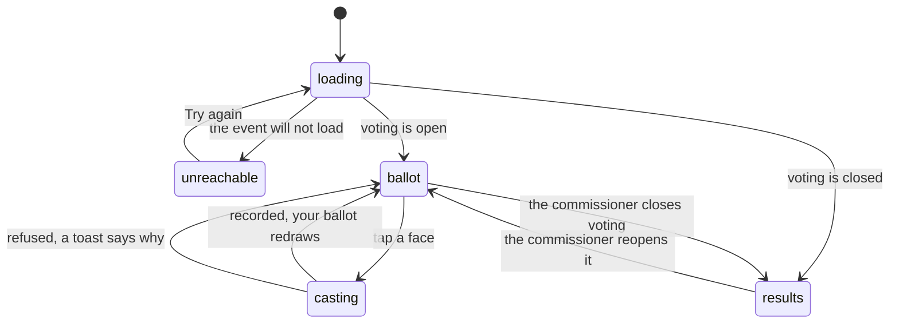

# The awards

## Summary

Six superlatives the league votes on, one screen behind the
[League hub](../foundations/navigation-and-screens.md#the-league-hub). Every
member gets one vote per category and can change it as often as they like until
the commissioner closes voting. It is a secret ballot: no player ever sees a
tally, before or after, and the only thing that becomes public is the winner of
each category — published as a gold pill under that player's card. Voting needs a
[member](../foundations/identity-and-sessions.md) token; a guest gets the whole
screen, faces and all, with every button dead and one line telling them where to
get a code.

## The simple case

You open Awards from the League hub. Six panels, one per superlative, each with
an emoji, a name and a one-line brief: "MVP — carried the whole combine on their
back", "Most Likely to Puke — we all know. Vote honestly."

Under each brief, the roster: every player on the event, in alphabetical order,
as a small tile with their face on it. Tap one. A toast says "Vote recorded" and
the tile lights up. Tap somebody else in the same panel and the light moves —
one vote per category, and changing your mind replaces it rather than adding to
it. A line at the bottom keeps count: "Voted in 3 of 6 categories." Nobody can
see any of this but you: not the running totals, not who you voted for, not even
how many people have voted.

Later — usually after the beers and before the draft — the commissioner closes
voting. The same screen turns into a results page: the header now reads "Voting
is closed. Here's how it landed", each panel shows its winner as a gold pill, and
a category two people tied in shows both of them with the word "tied" beside
them.

## The six superlatives

MVP · Best Card Art · Biggest Trash Talker · Most Likely to Puke · Weakest Link ·
Most Clutch. Fixed for the app rather than set per event, and the same six
everywhere an award is mentioned: this page, the commissioner's tally, and the
badge on a player's page.

## A category can be added, never renamed

Each category has a hidden id written into two places in the database — every
ballot ever cast, and every award ever published. Renaming one orphans both: the
votes cast under the old id stop matching the category they were cast in, and the
winner published under it loses the badge they won.

For the user this means nothing at all. No screen shows an id, and the _label_ on
the page can be reworded freely: the label is passed in fresh every time voting
closes, so retitling "Weakest Link" to something kinder changes the heading and
the published award name and breaks nothing.

For the product it constrains a lot. The set is append-only for the life of the
league: a seventh superlative can be added at any time and simply has no history,
but a category that turns out to be a bad joke cannot be swapped for a better one
— only abandoned, and it keeps its winners. There is a test whose whole job is to
fail when somebody edits an id, and its message says to add one instead.

> Technical note: the ids live in `src/lib/awards.ts` and are persisted in
> `award_votes.category` and `awards.award_type`. The published _name_ is not
> derived from the id — it is the label the app passes in at the moment of
> closing — which is what makes relabelling free and renaming fatal.

## Closing the vote

Only the commissioner can close voting, from the League Awards panel in the
[admin console](../admin/getting-in.md). That one action counts the ballots,
writes a winner row for every category anybody voted in, and locks the event
against further votes. A tie is published as joint winners rather than broken:
with thirteen voters a tie is common, and picking one by row order would be a lie
about what the room voted.

Closing can be undone. Reopening deletes the published winners, unlocks the event
and leaves every ballot where it was, so a re-close republishes with the late
votes included.

## The interaction, event by event

### Arrive

Four things are asked for, and they arrive independently. The
[event bundle](../foundations/the-event.md) brings the roster and, on the event
itself, the flag that says whether voting is closed. The published winners come
next, and they are public — a member, a guest and a stranger with the link all
get the same list. Player photos and card fronts are fetched for the tiles.

Your own ballot is the fourth, and only asked for if the device holds a member
token. There is no request a guest could make that would return somebody else's
votes: the only thing that endpoint ever returns is the votes belonging to the
token on the request.

While the bundle is in flight the screen says "Reading the awards…" rather than
drawing six empty panels; if it fails outright the screen says it cannot reach
the combine and offers a retry. An unhealthy live feed puts a banner at the top,
and the page keeps itself current by polling instead.

### Leave without acting

Nothing is recorded. No half-filled ballot is kept, because there is no such
thing — each tap is a complete vote and there is no submit button to leave
unpressed. Opening the screen and walking away tells nobody you were there.

### The tap that starts something

The tap on a face **is** the vote — no confirmation step, and this is the one
screen in the combine where an ordinary member writes to the database. What is
decided at that instant, inside a single transaction in Postgres:

- The event row is locked, so this vote and a commissioner closing voting cannot
  interleave. One finishes first and the other sees the result.
- Voting is re-checked for being closed. A screen that has not noticed the lock
  yet still cannot slip a vote past it.
- The nominee is checked against the event roster. Somebody who is not in this
  combine cannot be voted for, even if their id is on the page.
- The vote replaces your previous vote in that category rather than adding to it.
  A database constraint permits exactly one row per member per category, and that
  constraint, rather than the screen, is what makes one-vote-per-category true.

Who you are is never taken from the page: the voter is read from the signed
member token on the request, which is why there is no version of this screen
where you choose who you are voting _as_.

### While it runs

The face you tapped goes dim and stops accepting taps. Nothing else changes: the
rest of the panel and all five other panels stay live, so two votes in different
categories can be in flight at once without interfering. Nothing is optimistic —
your choice does not light until the server has confirmed it and your ballot has
been read back.

### It settles

A toast says "Vote recorded", your ballot is refetched, the tile lights, and the
counter at the bottom goes up.

On failure the toast carries the server's own words rather than a generic
apology, because each means something different here: "Voting is closed" (the
commissioner got there first), "Nominee is not in this event" (the roster changed
under you), "Claim your player first" (the token expired while the page was
open). Nothing needs rolling back — nothing was applied before the answer came.

## Modifiers

| Modifier                                                          | At arrival                                                                                                                                                                                                                                                                                                                                                                                       | Changed during                                                                                                                                                                                            |
| ----------------------------------------------------------------- | ------------------------------------------------------------------------------------------------------------------------------------------------------------------------------------------------------------------------------------------------------------------------------------------------------------------------------------------------------------------------------------------------ | --------------------------------------------------------------------------------------------------------------------------------------------------------------------------------------------------------- |
| Who you are (guest · member · account · commissioner)             | A member sees a live ballot. A guest sees the same six panels with every tile at half opacity and a line above them: "Claim your player to vote", linking to [the claim screen](../accounts/claiming-your-player.md). An account holder is a member or a guest and gets whichever they are. The commissioner votes as an ordinary member here; the tally lives in the console, not on this page. | Claiming a player mid-visit lights every tile at once, without a reload — the member token is watched rather than read once. Losing the token has the reverse effect: the tiles go dead where they stand. |
| The event's state (before the combine · running · finished)       | No effect. Voting is open from the moment the event exists, including before anybody has run; the phase of the combine is not what gates it, the commissioner's lock is.                                                                                                                                                                                                                         | No effect. A card upgrading its tier mid-combine does not touch a ballot.                                                                                                                                 |
| Dust switched on or off                                           | No effect. Nothing here is bought, sold or paid for.                                                                                                                                                                                                                                                                                                                                             | No effect.                                                                                                                                                                                                |
| The device (phone · desktop · reduced motion · presentation mode) | Two tiles per row on a phone, three from tablet width up. Nothing animates beyond a colour change, so reduced motion changes nothing. This screen never raises [presentation mode](../foundations/navigation-and-screens.md#presentation-mode).                                                                                                                                                  | No effect. If a trophy ceremony takes the screen over this page, the ballot underneath is inert until it finishes and untouched afterwards.                                                               |

The identity axis is the only one that does anything, and it does all of it: the
difference between a ballot and a poster is one token.

## Cancel and interrupt

| Event                                       | Before the tap                                                                                                                                     | After the tap                                                                                                                                         |
| ------------------------------------------- | -------------------------------------------------------------------------------------------------------------------------------------------------- | ----------------------------------------------------------------------------------------------------------------------------------------------------- |
| Back, or closing a sheet                    | Nothing to cancel; nothing was started.                                                                                                            | No effect. The vote is already in the database. Voting again is the only way to change it, and it is not called undo.                                 |
| Navigating away inside the app              | No effect. Nothing is held on the screen.                                                                                                          | The request is already on its way and lands regardless. You will not see the toast.                                                                   |
| Reload                                      | No effect. The ballot is re-read from the server and comes back as it was.                                                                         | The vote survives — it is a row in Postgres, not device state.                                                                                        |
| Backgrounded                                | No effect.                                                                                                                                         | No effect; a request already sent completes without the page watching.                                                                                |
| Network lost mid-request                    | No effect. There is nothing in flight.                                                                                                             | The write may have landed anyway. The toast says it failed; reloading shows the truth. Casting the same vote twice is harmless — it replaces itself.  |
| The request fails or times out              | Not applicable.                                                                                                                                    | The toast carries the reason and the tile does not light. Nothing partial is left behind: the vote is one transaction and either happened or did not. |
| The token expires or is cleared             | The tiles are dead and the claim prompt is showing before you touch anything.                                                                      | The next tap is refused with "Claim your player first". Votes already cast stay cast — they belong to the participant, not to the token.              |
| Changed by someone else                     | The commissioner closing voting turns this screen into the results page, and the winners arrive live. The lock itself can lag; see the edge cases. | A vote in flight when voting closes is either counted or refused, never silently dropped. That is the whole reason the count runs inside a row lock.  |
| A second tab or device                      | Both read the same ballot from the server, so they agree on arrival.                                                                               | A vote cast in one tab does not push to the other. The second tab shows the old choice until it refetches — thirty seconds of staleness, or a reload. |
| Reduced motion or presentation mode changes | No effect.                                                                                                                                         | No effect.                                                                                                                                            |

Nothing here can be left half-done. There is no draft ballot and no multi-step
submission: one tap, one transaction, one row.

## Interactions with other systems

**Who you have to be.** A member, for both the write and the read of your own
ballot. Reading the published winners needs nobody. The tally and the
close/reopen switch need an admin token bound to this event. On the database side
the ballot table is invisible to the public role entirely — not column-scoped,
not filtered, revoked — so the running tally cannot be read out of the network
tab.

**Realtime.** The published winners are live: the moment the commissioner
publishes, every phone on this screen or a player's page redraws with the badge
on it. The lock flag is not — it rides on the event, which the live channel does
not watch, so a phone can briefly know the winners without knowing voting closed.

**Offline and reconnection.** Read-only offline, and only from cache. A vote cast
with no signal fails with a toast and can be cast again later; nothing queues.

**Optimistic updates and rollback.** Neither. The tile lights only after the
server confirms, which on a slow connection in a garden is a visible beat. The
trade is deliberate for a vote: a tile that lights and then un-lights would read
as the app losing your ballot.

**The card economy.** No dust, no cards, no cost. Winning a superlative changes
nothing about a card's tier, edition or price. "Best Card Art" is voted on the
art, and it cannot make the card rarer.

**Motion and sound.** None. No chime, no ceremony, no confetti when voting
closes; the pill simply appears.

**Notifications and badges.** Nothing on the bottom bar ever reflects awards. No
dot when voting opens, when it closes, or when you win one — you find out by
looking, or because thirteen people in a garden tell you.

**Sharing.** The winners are public and the URL is plain, but nothing here
exports an image, and a won award does not appear on the shared picture of a
card. See [sharing](../cross-cutting/sharing.md).

**The second device.** Your ballot follows the participant, not the phone, so a
member who claims on a second handset sees the votes they already cast. Neither
device pushes to the other; the second catches up on its next fetch.

**Accessibility.** Each tile is an ordinary button carrying the player's name as
text; the category emoji is hidden from assistive technology and the label beside
it carries the meaning. The lock icon on a closed category is decorative — the
header says voting is closed in words. A chosen tile is marked with a tick and a
colour, which is a gap: nothing announces the selected state on the button.

## Edge cases

- **Voting for yourself is allowed.** This is a friend group, not an election.
- **A member who is not on this event's roster can still vote.** The check is on
  the nominee, not the voter, and the voter comes from a signed token rather than
  the page — so the only person this admits is a claimed league member not
  rostered for this combine. A test records it as deliberate, not an oversight.
- **A category nobody voted in publishes nothing**, and reads "No votes cast."
- **Winners arrive before the lock does.** The winners come over realtime; the
  lock flag is read from the event with a sixty-second staleness window and no
  subscription. For up to a minute a member can be looking at a live ballot for a
  vote that is already over, and a tap in that window is refused.
- **The vote counts are recorded and never shown.** Each published award carries
  its own count — "9 votes", "Tied with 1 other — 4 votes" — and no screen prints
  it. The ballot stays secret in both directions.
- **A winner who has left the roster** shows as "Someone", and the pill points
  nowhere useful.
- **"Couldn't read the votes just now."** A closed category with no winner says
  this instead of "No votes cast." whenever _any_ table in the event bundle
  failed to read, including tables with nothing to do with awards.
- **Closing twice** republishes from scratch rather than doubling up, and
  reopening keeps the ballots.
- **A superlative's badge is not on the card back.** It is a gold pill under the
  card on [a player's page](../cards/a-player-card.md), in the row that holds
  their set trophies, and tapping it comes back here. Turning the card over shows
  nothing about it.

## Open questions and verification

- The gap between the winners arriving over realtime and the lock flag catching
  up was derived from the two subscriptions and their staleness windows, not
  watched. How long a member sees a live ballot after voting closes, and whether
  the refused tap reads to them as a bug, is the most valuable item here.
- The glossary describes award badges as part of the card back. At this commit no
  card back renders one; the badges print under the card on the player's page.
  Either the glossary entry or the card back is wrong, and which one is a
  decision rather than a fix.
- Nothing announces a tile's chosen state to a screen reader. The tick and the
  colour are the only cues, and both are visual. Read from the markup, not tested
  with a reader.
- The counts written onto every published award are read by no screen. Whether
  they are meant to be shown is a product question.
- Assumption: the commissioner closes voting once per combine. Nothing prevents a
  close/reopen/close cycle, and the tests cover it, but a member watching the
  results turn back into a ballot has not been observed.

Verified against willyoubemyhero commit `b46f330`.
