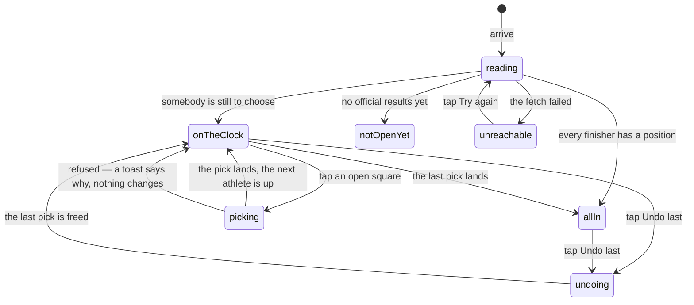

# The draft

## Summary

The draft is what the combine is for. Everybody runs the course, the times
decide the picking order, and then — fastest first — each athlete chooses which
slot they want in the fantasy draft. This screen is where that happens: a card
naming whoever is choosing, and a grid of numbered squares that fill in as they
are taken.

It is reached from the Draft tile on
[the League hub](../foundations/navigation-and-screens.md#the-league-hub), which
is the only way in. Everybody can watch. Only the commissioner can tap a square,
and only the commissioner can take the last one back.

## The simple case

You tap Draft on the League hub. A lit card at the top names the athlete
choosing, with their combine time under their name; below it, a grid of squares
numbered one upward. Taken squares glow and carry the name of whoever holds
them. Open squares say "Open".

The person choosing calls out a number. The commissioner taps that square. It
lights up with their name, a toast reads "Doug Weidensaul picks #3", and the
card at the top moves on to the next-fastest athlete who has not picked yet.
Every phone in the garden follows within a beat.

If somebody calls the wrong number, the commissioner taps **Undo last**. The
most recent pick is removed, its square goes back to Open, and that athlete is
choosing again.

When the last athlete has chosen, the card at the top is replaced by "All picks
are in. Congrats on a clean draft."

## What a pick means

A pick is a number attached to a person for this combine. It appears in four
places and does nothing anywhere else:

- On the athlete's **card back**, as the "Draft" vital.
- On their **player page**, in the same row of vitals.
- On [the leaderboard](the-leaderboard.md), as a "Pick #3" badge — on a phone
  the badge is hidden and only appears from a small-tablet width up.
- In the vault, as one of the orders the roster can be sorted into.

It is not a tier, it does not change how a card looks, it pays no dust and it
grants nothing. A pick is the actual outcome of the day: which slot you get in
the fantasy draft that follows. See
[the card](../foundations/the-card.md#what-a-tier-is) for what *does* change how
a card looks.

## Who is choosing

The picking order is the leaderboard's order: every official run, fastest first.
Whoever is fastest among those who have not yet taken a position is on the
clock.

Two consequences worth stating plainly:

- **An athlete with no official run never picks.** They are not in the order at
  all. Somebody who did not finish, or whose run was never marked official, is
  skipped silently rather than added at the end.
- **The grid is sized by the roster, not by the field.** There is one square per
  person on the roster, including anybody scratched. With more squares than
  pickers, squares are left Open when the draft is over, and the screen still
  says every pick is in.

The picking order also inherits the leaderboard's handling of athletes out of
contention: a scratched athlete with an official run is out of contention for
every tier but is still in the picking order here.

## The interaction, event by event

### Arrive

The active combine, then its bundle. Until it lands the screen says "Reading the
draft board…".

From the bundle the screen works out three things: the picking order, which
positions are already taken, and who is on the clock. All three come from the
roster and the runs — the same numbers the board is drawn from — so the draft
board can never disagree with the leaderboard about who was faster.

Whether the squares are tappable is decided by the admin token on the device,
read after the first paint. On a commissioner's phone the squares become live a
beat after they are drawn; on everybody else's they stay dim.

### Leave without acting

Nothing is recorded. Watching the draft board writes nothing, and there is no
record of who was looking.

### The tap that starts something

A tap on an open square. There is no confirmation: the tap is the commit.

The square must be open, there must be somebody on the clock, and no other pick
or undo may be in flight — otherwise the square is inert. The request names both
the athlete and the position. The server checks only that the caller is the
commissioner for this combine; **that the athlete named is the one whose turn it
is, is the screen's convention rather than a rule the server enforces.** Undo
carries no argument at all beyond which combine it is: the server finds the most
recent selection itself.

Two rows go into the database: an entry in the record of selections, numbered by
how many selections already exist, and the position stamped onto the athlete's
roster row. The screen reads the second of those; the first is what undo walks
back.

### While it runs

Every square is disabled and Undo last with them, so a double-tap cannot spend
two positions. Nothing is optimistic — the square does not light until the
server has answered.

The rest of the screen stays live. A run being edited or an athlete being reset
during a pick redraws the board underneath, which can change who is on the clock
between the tap and the answer.

### It settles

The screen refetches the combine itself rather than waiting for the change to
arrive over the live feed, and only then shows the toast.

> Technical note: it used to wait on the live feed alone. With the socket down —
> a blocked websocket, a throttled tab — a pick landed in the database and the
> person who had just picked was still looking at their own name on the card at
> the top.

Every other device gets the pick over the live feed a beat later. On failure a
red toast carries the reason, the squares come back, and nothing has changed.

Undo settles the same way: the last selection is deleted, that athlete's
position is cleared, the board refetches, and a toast reads "Undid last pick".

## Modifiers

| Modifier | At arrival | Changed during |
| --- | --- | --- |
| Who you are (guest · member · account · commissioner) | Guests, members and account holders see the same board with dim, inert squares and no Undo button. Only a commissioner holding an unexpired admin token for the active combine can tap anything. A member's own pick is made for them by the commissioner; there is no self-service pick. | An admin token appearing or expiring turns the squares live or dim within a minute, without a reload. A pick already in flight completes: it was authorised when it left. |
| The event's state (before the combine · running · finished) | The load-bearing row. Before any official result the board says "No combine results yet. Draft board opens once athletes finish." While the combine runs the picking order changes every time somebody finishes. After it, the order is settled and the draft is the point of the screen. | A run finishing mid-draft inserts that athlete into the picking order *ahead of slower athletes who have not picked yet*, so a fast late finisher can take the clock away from somebody who was about to choose. |
| Dust switched on or off | No effect. A pick pays no dust and costs none. | No effect. |
| The device (phone · desktop · reduced motion · presentation mode) | The grid is three squares wide on a phone, five or six on wider screens. Nothing else differs. | No effect. This screen has no ceremony and never enters presentation mode. |

## Cancel and interrupt

| Event | Before the tap | After it |
| --- | --- | --- |
| Back, or closing a sheet | Nothing to cancel. | Nothing to undo by leaving. The pick is written; Undo last is the only way back, and it is a new write rather than a cancellation. |
| Navigating away inside the app | No effect. | The write completes without the screen. The toast is lost; the pick is not. |
| Reload | The board is fetched again from scratch. | Same. The new pick is what comes back. |
| Backgrounded | No effect. Returning to the tab refetches the board. | The request continues. On return the square is taken and the toast may have gone unseen. |
| Network lost mid-request | The board keeps its last values and stops updating. Squares stay tappable but a tap will fail. | The pick may have landed anyway. The screen shows a failure toast and leaves the squares as they were; the next refetch — or the live feed reconnecting — tells the truth. |
| The request fails or times out | "Can't reach the combine" with a Try again button if nothing had loaded; the degraded banner over stale squares if it had. | A red toast with the reason. The most likely reason is that somebody else took the position first, which the database refuses outright. |
| The token expires or is cleared | The squares go dim and Undo last disappears. The board is otherwise unchanged. | A request that left with a valid token completes. The next tap is refused by the server. |
| Changed by someone else, arriving over realtime | The normal case. A pick made on another device, a run finishing, a result being edited — all redraw the board within a beat, including who is on the clock. | A pick arriving from elsewhere while yours is in flight can mean yours is refused, because the database allows one athlete per position and one position per athlete. |
| A second tab or device | Both show the same board. | Two commissioners tapping the same square: one wins, the other gets an error toast. Two commissioners tapping *different* squares both succeed, and each has numbered its entry by a count read before the other's landed. |
| Reduced motion or presentation mode changing | No effect. | No effect. |

## Interactions with other systems

**Who you have to be.** Anybody, to read. A commissioner holding an unexpired
admin token bound to this combine, to pick or to undo — enforced on the first
line of both handlers. The dim squares are a courtesy; the guard is the
protection. Behind that, the database itself refuses a second athlete on the
same position and a second position for the same athlete, so the worst a race
between two commissioners produces is an error toast.

**Realtime.** The board subscribes to the combine's live channel and redraws on
any change to the roster, the runs or the selections. It does not rely on that
for its own writes, which force a refetch instead.

**Offline and reconnection.** The board stays on screen and stops updating. A
pick made with no connection fails with a toast; whether it landed is settled by
the next refetch.

**Optimistic updates and rollback.** Neither. A square does not light until the
server has confirmed it, which is the right trade for a screen a room of people
is reading out loud.

**The card economy.** A pick touches it only as a number on a card back. It
grants no card, costs no dust, and changes no tier or edition.

**Motion and sound.** None beyond a glow on a taken square and the card at the
top swapping to the next athlete.

**Notifications and badges.** None. The toast lands on the commissioner's phone
only; everybody else learns their pick by watching the board.

**Sharing.** Nothing exports from this screen. Its URL carries link-preview text
reading "Combine winners select their fantasy draft positions live."

**The second device.** Intended to be read on several at once — phones in hands
while the commissioner taps. Every device shows the same board within a beat.

**Accessibility.** Each position is a real button carrying its number and its
holder's name as text, so a screen reader announces "3, Doug Weidensaul" rather
than a colour. Taken and unavailable squares report themselves as disabled. The
card at the top is not a live region, so a screen reader user is not told the
clock has moved to the next athlete; they have to go back and read it.

## Edge cases

- **Undo with nothing to undo** still reports success. The button is always
  present for a commissioner, and tapping it on an empty draft shows "Undid last
  pick" having done nothing at all.
- **Undo after the draft is complete** takes the last pick back and puts that
  athlete on the clock again, so "All picks are in" is reversible.
- **A position taken between the draw and the tap** is refused by the database
  and surfaces as an error toast. The square then redraws as taken.
- **A square that is Open but cannot be picked.** If a selection is recorded and
  the stamp on the athlete's roster row is not, the board keeps showing the
  square as Open while the database considers it taken. Every attempt on it then
  fails.
- **More squares than pickers.** With scratched athletes on the roster the grid
  is longer than the picking order, so squares remain Open after the screen says
  every pick is in.
- **A fast finisher arriving mid-draft** jumps the picking order and takes the
  clock from whoever was about to choose. Nothing warns about it.
- **No official results yet** shows "No combine results yet. Draft board opens
  once athletes finish", and a failed read says so instead rather than pretending
  the combine has not started.
- **An athlete with two official runs** appears twice in the picking order; once
  they have a position, both entries carry it and they do not pick twice.

## Open questions and verification

- **The draft has a lock in the data and no lock in the app.** The combine
  carries a `draft_locked` flag which no screen reads and nothing sets — unlike
  the running order, which at least reads its equivalent. A commissioner who
  expects a completed draft to be un-tappable does not get one.
- **Undo reports success when there is nothing to undo.** Harmless, but it tells
  a commissioner they have reversed something they have not.
- **The selection entry and the stamp on the athlete are two separate writes,**
  and the second one's result is not checked. If it fails, the board and the
  database disagree about which positions are free, and the disagreement is only
  visible as a square that refuses every tap.
- **Selections are numbered by counting the existing ones,** so two picks made
  in the same second can be given the same number. Undo takes the highest, which
  in that case is one of two arbitrarily.
- **Picking order is enforced only by the screen.** The server takes whichever
  athlete the request names, so a pick made out of order is refused by nothing
  except the fact that this screen offers no way to compose one. Whether that
  matters depends on whether the commissioner is the only person who can reach
  the write, which they are.
- The behaviour of a pick made while the picking order is changing underneath
  was reasoned about from the code and not reproduced.
- Assumption: no screen other than this one writes a draft position. Nothing in
  the source does.

Verified against willyoubemyhero commit `b46f330`.
