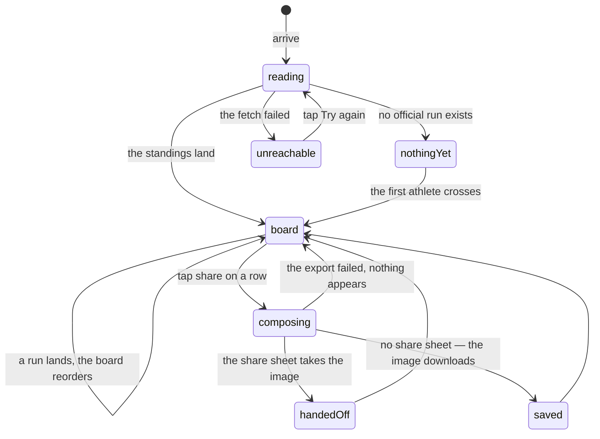

# The leaderboard

## Summary

The leaderboard is the public record of the combine: every official run, fastest
first, with the athlete, their penalty time, their draft pick and their official
time. It is the one combine screen with a tab of its own on the bottom bar,
because a card's whole claim to a tier is a time on this board and the cards are
what the app is for the other 364 days of the year.

Nothing on it can be changed from it. The only thing anyone can do here is take
one row away as a picture: a share button on every row builds a portrait result
card and hands it to the phone's share sheet.

## The simple case

You tap **Board** on the bottom bar. The screen says "Reading the standings…"
for a moment, then draws the list. The leader sits at the top with a lit rail
down the left edge of their row and a ringed number 1; second and third get the
same bezel without the ring; everybody after that gets a plain grey disc. Each
row carries the athlete's card art — their photo if there is no art yet, their
initials on a colour derived from their name if there is neither — their name,
their fantasy team — or their nickname, or an em dash — and their official time
in large scoreboard digits. Penalty time hangs off that line in amber:
`+2.00 pen.`

You tap the share icon on your own row. A beat later the phone's share sheet
opens with a 1080 × 1350 image of your result: the event year, your name and
team, your place in a glowing ring, your official time at the size of a
billboard, and every station split under it.

Somebody finishes their run out in the garden and the board reorders itself
under your thumb, without a refresh and without a tap. See
[the event](../foundations/the-event.md#how-fresh-it-is).

## What the board is, and what it is not

The board ranks **official runs**, not people. A run appears here the moment the
commissioner marks it official; an unofficial one never appears at all. What
makes a run official, and why only official runs count, belongs to
[time and the clock](../foundations/time-and-the-clock.md#what-makes-a-run-official).

**The board shows places; it does not name tiers.** No "1 of 1" badge, no
"Station King" chip, no foil anywhere on this screen. The tiers are computed
from exactly these numbers and are worn by the cards — see
[the card](../foundations/the-card.md#what-a-tier-is) — but the board speaks
only in places and times. A ranked list of thirteen names read while standing up
does not need a second ranking vocabulary layered over it.

The two rankings do not agree in every case. A dead heat shares the place for a
tier and splits it on the board, which numbers its rows by position. Anybody out
of contention — scratched, disqualified — is out of contention for every tier
but still occupies a row here, so the numbers below them read one worse than the
cards say. And the count in the header, "13 finished", counts official runs
rather than athletes. All three are recorded as suspected defects in
[open questions](#open-questions-and-verification).

## The interaction, event by event

### Arrive

Two requests: which combine is active, then that combine's bundle. Until the
first one lands the screen says "Reading the standings…" over a spinner rather
than showing an empty board — a distinction the whole family of spectator
screens shares, and one that was bought after the fact.

> Technical note: a failed table read comes back as an empty list, which is
> indistinguishable from "there is nothing here". The bundle therefore carries
> the names of the tables it could not read, and this screen uses that to choose
> between "couldn't read the results just now" and "no official times yet". See
> [what the bundle holds](../foundations/the-event.md#what-the-bundle-holds).

The rows are built once the bundle is in hand: every official run, matched to
the roster row for that athlete, sorted by official time with a missing time
sorting last. Card art and photos are signed URLs fetched separately, so a row
can draw its name and time before its picture arrives.

Nothing on this screen depends on who you are. It looks identical to the
commissioner and to somebody who opened the app ninety seconds ago.

### Leave without acting

Nothing is recorded — no view count, no last-seen, no call beyond the two reads.
The event's live channel is held open for a few seconds after you leave in case
you come straight back, which is the event's behaviour rather than this
screen's.

### The tap that starts something

The share icon is the only tap on this screen that does anything but navigate.
It writes nothing to the database and tells nobody. What it starts is local
work: that row is remembered as the one being shared and its icon goes inert so
a second tap cannot start a second export, and a full-size result card is built
off-screen — 1080 × 1350, parked ten thousand pixels off the corner of the page
so it is never visible and never reachable by a thumb.

The card is filled from the row: the event name and year, the athlete's name and
fantasy team, their photo, their official time, their penalty time if there is
any, their place, and every split recorded against that run, each labelled with
its station's name. The place printed is the row's position on the board, so it
inherits the dead-heat behaviour described above.

### While it runs

The app waits a tenth of a second for the off-screen card to draw, then
rasterises it to a PNG. On a phone this is a visible pause: the tapped icon is
dim, the rest of the board is fully live, and the board keeps reordering
underneath if somebody finishes meanwhile.

There is no progress indicator and no cancel. Backing out of the screen during
the pause abandons the export silently.

### It settles

If the phone can share files, the system share sheet opens holding the image,
named `combine-<eight characters>.png`. Choosing a destination sends it;
dismissing the sheet ends the export with nothing sent, and the app treats that
exactly like sharing it — no error, no retry prompt. If the phone cannot share
files, which is most desktop browsers, the image downloads instead.

Either way the tapped icon comes back to life and the off-screen card is torn
down. The board is unchanged: sharing a result is not an event anybody else can
see.

## Modifiers

| Modifier | At arrival | Changed during |
| --- | --- | --- |
| Who you are (guest · member · account · commissioner) | No effect. The board is public, identical for all four, and has no control on it that any of them unlocks. The commissioner edits results from [the admin screens](../admin/editing-a-result.md), never from here. | No effect. Claiming a player or signing in mid-visit changes nothing on this screen. |
| The event's state (before the combine · running · finished) | Before the combine the board says "No official times yet — check back after the first athlete crosses." While it runs the board is partial and reorders live. After it, the board is the settled record. | This is the axis the screen is built around. A run landing anywhere in the event redraws the board within a beat, and a row can move under a thumb that is reaching for its share button. |
| Dust switched on or off | No effect on the board itself. It changes the bar underneath it from five tabs to six, which shifts the Board tab one column left. | Flipping it mid-visit reflows the bottom bar under the board. The board does not redraw. |
| The device (phone · desktop · reduced motion · presentation mode) | On a phone the "Pick #4" badge is hidden and the row shows avatar, name, time and share only; from a small-tablet width up, the badge appears. The share result goes to the share sheet on a phone and to a download on a desktop. | Rotating or resizing past that width shows or hides the pick badge live. Reduced motion and presentation mode change nothing: this screen has no ceremony and never claims the screen. |

The load-bearing row is the event's state. Everything else about this screen is
constant; what the board says is entirely a function of how much of the combine
has happened.

## Cancel and interrupt

| Event | Before the share tap | After it, while the image is being made |
| --- | --- | --- |
| Back, or closing a sheet | Nothing to cancel. | Dismissing the share sheet without choosing a destination ends the export quietly — no image sent, no error, no retry offered. Backing out of the screen abandons the export. |
| Navigating away inside the app | No effect; nothing is in flight. | The export is abandoned. Nothing was written, so there is nothing left half-done. |
| Reload | The two reads are made again from scratch. | The export is lost. The board comes back and the row is still there to share again. |
| Backgrounded | No effect. Returning to the tab refetches the bundle, so the board is current before you have finished looking at it. | The export may stall until the tab is visible again — nothing is corrupted, the share sheet simply arrives late or not at all. |
| Network lost mid-request | The board keeps whatever it last drew and stops updating. If nothing had loaded, the screen shows "Can't reach the combine" with a Try again button. | The image is built entirely on the device, so it completes. Only the athlete's photo is remote — a photo that has not cached yet is left out and the card falls back to initials. |
| The request fails or times out | An error card with the reason and a Try again button that refetches both reads. If the board had already drawn, a later failure shows the degraded banner over the stale rows instead of replacing them. | An export that fails leaves no message at all: the icon comes back to life and nothing appears. |
| The token expires or is cleared | No effect. The board needs no token of any kind. | No effect. |
| Changed by someone else, arriving over realtime | The normal case, not an exception. A run being marked official, edited or reset arrives over the event's live channel and the board redraws. | The board behind the export redraws, but the card already being built holds the numbers it was given. A place that changes between the tap and the share sheet ships the old place. |
| A second tab or device | Each browser holds its own connection to the event and sees the same board. | Two exports in two tabs are independent; neither knows about the other. |
| Reduced motion or presentation mode changing | No effect. | No effect. |

After any of these the user is still on the board, looking at the same rows.
Nothing about this screen can be left half-done, because nothing on it is
written.

## Interactions with other systems

**Who you have to be.** Nobody. This screen makes no write, so there is no guard
behind it — the only screen in the combine area of which that is true. The
public read that feeds it is column-scoped in the database, which is why the
board can name a time and a penalty but has no access to a run's private notes.

**Realtime.** The board is a subscriber to the event's single live channel and
redraws on any change to runs, splits, penalties, the roster or the draft. When
that channel is unhealthy a banner reading "Live feed down — refreshing every
few seconds" sits above the board and the numbers keep updating, a few seconds
behind. The banner is a caveat, not an error: the numbers under it are real.

**Offline and reconnection.** What has been drawn stays drawn, and reconnecting
refetches, so a phone that lost signal mid-combine catches up without a reload.
Sharing keeps working offline apart from a photo that was never cached.

**Optimistic updates and rollback.** Neither. The board is always exactly what
the server last said, and there is nothing to roll back.

**The card economy.** The board is upstream of it: the times on it decide tiers,
tiers decide how a card looks, and none of it touches what a copy is worth. A
place on the board pays no dust and grants no card. See
[the card](../foundations/the-card.md#what-a-tier-is).

**Motion and sound.** None. No chime, no confetti, no ceremony. A row that
changes place slides through a colour transition and nothing else. The finish
celebration belongs to [live timing](live-timing.md), not here.

**Notifications and badges.** None. Nothing on the bottom bar reflects the
board, and no dot appears when somebody finishes.

**Sharing.** This is the screen sharing lives on. The exported card carries the
event name and `willyoubemyhero.com` across its foot, so an image forwarded
through three group chats still says where it came from. The board's own URL
carries link-preview text for when the link is pasted rather than the image.

**The second device.** Every device watching the same combine shows the same
board within a beat. An export is per-device and leaves no trace on any other.

**Accessibility.** Times, places and penalties are all text, and the digits are
large by design rather than by a setting. Two things fall short: the ranked
board is marked up as an unordered list, so a screen reader does not announce it
as a numbered one, and every share button carries the same label — "Share result
card" — so thirteen in a row are indistinguishable without reading the row
around them.

## Edge cases

- **An official run with no time.** Renders as an em dash and sorts to the
  bottom of the board.
- **A run whose athlete is not on the roster.** The row still appears with an em
  dash for the name and a question-mark avatar — what a roster read failing
  while the runs read succeeds looks like.
- **No official times yet.** The board names which it is: "No official times yet"
  when the read worked, "Couldn't read the results just now — retrying" when it
  did not. With no active combine at all it draws the first of those, because
  there is nothing to fetch.
- **A photo that has not loaded when share is tapped.** The exported card falls
  back to initials. The tenth of a second the export waits is for the card to
  draw, not for its picture to arrive.
- **Splits on the exported card** are listed in whatever order the database
  returned them, which is not guaranteed to be course order. Two stations with
  the same name collide and one of the two is dropped.
- **A run edited while its card is being exported** ships the numbers it was
  given at the tap.
- **The share sheet dismissed** is indistinguishable from a successful share as
  far as the app is concerned.

## Open questions and verification

- **The board's numbering splits a dead heat while a tier shares it.** Two
  identical official times produce places 1 and 2 on the board and champion for
  both athletes. The tie rule is stated and tested for tiers; the board does its
  own positional numbering and has no such rule. This looks like a defect rather
  than a decision.
- **Athletes out of contention still hold a place on the board.** A scratched or
  disqualified athlete with an official run is excluded from every tier but is
  not excluded from the board, so the numbers under them are one worse than the
  cards say. Also likely a defect.
- **The "finished" count counts official runs.** Two official runs for one
  athlete count twice, and both rows appear. Whether the app ever leaves two
  runs official for the same athlete was not established.
- Whether the tenth-of-a-second wait before rasterising is enough on a cold
  cache was read from the code, not measured on a phone; a photo that has not
  decoded yet produces a card with initials where a face should be. Whether the
  signed artwork URL survives the export's cache-busting is the same question
  and was not tested either.
- Neither the share sheet on a phone nor the download fallback on a desktop has
  been watched by hand.
- Assumption: no screen other than [the admin screens](../admin/editing-a-result.md)
  writes an official time, so the board is never the source of a change it then
  has to redraw.

Verified against willyoubemyhero commit `b46f330`.
