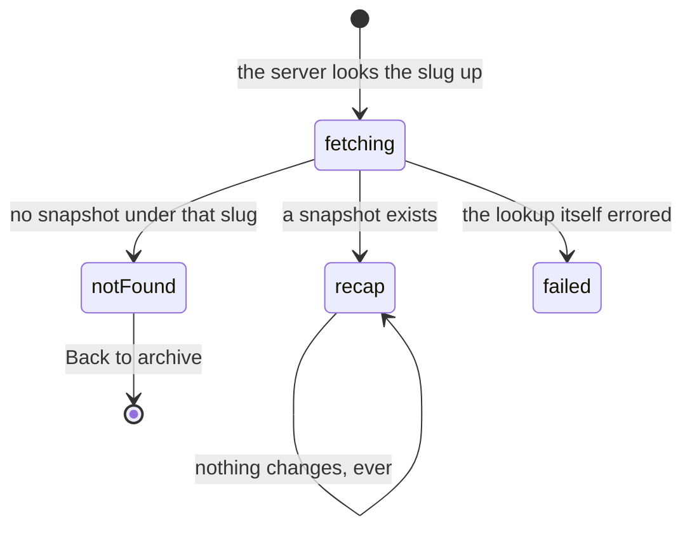

# The recap

## Summary

A finished combine, frozen and given a public address of its own. The
commissioner archives an event; the app takes a copy of everything about it and
files it under a slug made from the name and the year. From then on
`/recap/draft-combine-2026` is a page anybody can open — no token, no app, no
account — showing the final board and the draft order exactly as they stood at
the moment it was filed.

It is the only screen in the app that never changes. Everything else in the
combine is live; this is a photograph of it.

## The simple case

Somebody sends you a link. You open it and get a header — "Recap · Archived 14
July 2026", then the combine's name and year in the app's display type — and two
lists.

**Final Leaderboard**: every official run, fastest first, numbered, with the
player's name and their time.

**Final Draft Order**: the picks, in draft position order, numbered.

That is the whole page. No photographs, no cards, no splits, no penalties, no
superlatives, no controls. Scrolling to the bottom is the end of it.

If the slug is wrong you get "No recap found." and a link back to the archive on
[the Analytics screen](analytics-and-the-archive.md).

## Where a recap comes from

The commissioner presses "Archive Event" in the admin console and confirms. The
app copies the event row, the roster, the stations, every run, every split, every
penalty and every draft pick into a single stored snapshot, stamps it with the
time, and gives it a slug: the event's name and year, lowercased and hyphenated,
trimmed to sixty characters. A slug already in use gets `-2`, then `-3`.

A toast on the commissioner's phone names the new address. Nothing else in the
app announces it, and no player is told.

Archiving does not close, lock or end anything. The live combine carries on
exactly as it was, and archiving it twice makes two recaps rather than updating
one.

## How it differs from the live screens

Every other combine screen fetches the event bundle, joins a live channel and
redraws when something changes. A recap does none of that.

- **It is loaded before the page is drawn**, on the server, so it arrives already
  full. There is no spinner and no empty first frame.
- **It never updates.** No live channel, no polling, no refetch on focus. A time
  corrected in the live event after archiving does not move on a recap.
- **It knows nothing about the active event.** The recap of the combine you are
  standing in and the recap of one from three years ago behave identically.
- **It needs nothing from the device.** No token is read, no storage is touched,
  and no request the page makes carries an identity.
- **It has no empty state worth the name.** The absence of a recap is a
  not-found page, not an empty one.

What it keeps from the app is the shell: the top bar and the bottom bar are still
there, so a link opened by a stranger still looks like the app and offers a way
into it.

## The interaction, event by event

### Arrive

The slug in the URL is looked up before the page renders. One row comes back, or
none.

None is not an error: the route treats it as a missing page and shows "No recap
found." with a link back to the archive. A lookup that actually fails — the
database unreachable, the request refused — shows "Recap failed to load."
instead, with no retry button and no detail.

When a snapshot is found, the two lists are built from it on the spot. Official
runs are sorted fastest first and numbered from one; the draft picks are sorted
by the position they were picked into. The draft section is omitted entirely when
the snapshot holds no picks — the heading does not appear over an empty list.

### Leave without acting

Nothing is recorded. A recap has no view count, no visitor log and no way to tell
that anybody opened it. The only trace a visit leaves is in whatever hosts the
page.

### The tap that starts something

There is nothing to tap. No control on this page writes anything, and there is no
version of this page that does — no comments, no reactions, no share button, no
print. The only link on it is the one on the not-found page, back to the archive.

This is the one document in the set where the phase is genuinely empty rather
than merely quiet.

### While it runs

Nothing runs. The page is finished the moment it is drawn.

### It settles

It arrived settled. The state it is in is the state it will be in next year.

## Modifiers

| Modifier                                                          | At arrival                                                                                                                                                                                  | Changed during                                                                                     |
| ----------------------------------------------------------------- | ------------------------------------------------------------------------------------------------------------------------------------------------------------------------------------------- | -------------------------------------------------------------------------------------------------- |
| Who you are (guest · member · account · commissioner)             | No effect. The page is public and identical for everybody, including somebody who has never opened the app. Only the commissioner can _create_ one, and that happens on a different screen. | No effect. Claiming a player or unlocking the console mid-visit changes nothing on the page.       |
| The event's state (before the combine · running · finished)       | No effect. A recap is not attached to the active event and does not consult it. Archiving a combine that is still running simply captures it mid-flight.                                    | No effect. The live combine can start, finish or be re-run underneath and the recap will not move. |
| Dust switched on or off                                           | No effect on the page. The bottom bar under it gains or loses the Shop tab like everywhere else.                                                                                            | No effect beyond that reflow.                                                                      |
| The device (phone · desktop · reduced motion · presentation mode) | Two plain lists at one width, centred on a wide screen. Nothing animates, so reduced motion has nothing to turn off. The page runs to the edges of the screen with no side gutter.          | No effect. No ceremony ever takes this screen.                                                     |

Every axis in this table is inert, which is the point: a recap that read
differently depending on who opened it would not be a record.

## Cancel and interrupt

| Event                                       | Before the page is drawn                                                              | After it is drawn                                                  |
| ------------------------------------------- | ------------------------------------------------------------------------------------- | ------------------------------------------------------------------ |
| Back, or closing a sheet                    | The navigation is abandoned and nothing is left behind.                               | No effect. Nothing to undo.                                        |
| Navigating away inside the app              | Same.                                                                                 | No effect.                                                         |
| Reload                                      | The slug is looked up again from scratch and gives the same answer.                   | Same.                                                              |
| Backgrounded                                | An in-flight page load may need to be retried by the browser.                         | No effect. Nothing is running, so nothing drifts.                  |
| Network lost mid-request                    | The page does not load; the browser's own failure is what the user sees.              | No effect. The page is already complete and needs nothing further. |
| The request fails or times out              | "Recap failed to load." — no retry button, no reason. Reloading is the only recovery. | Not applicable.                                                    |
| The token expires or is cleared             | No effect. No token is read on this page.                                             | No effect.                                                         |
| Changed by someone else                     | Not possible. A snapshot is written once and never edited by anything in the app.     | Not possible.                                                      |
| A second tab or device                      | Both get the same page. There is nothing per-device to disagree about.                | Same.                                                              |
| Reduced motion or presentation mode changes | No effect.                                                                            | No effect.                                                         |

## Interactions with other systems

**Who you have to be.** Nobody, to read one. A commissioner for this event, to
make one. The read goes through the public role rather than the privileged one,
so a recap is public in the database as well as in the app.

**Realtime.** None, deliberately. This is the only combine screen with no live
channel behind it.

**Offline and reconnection.** A recap already loaded stays readable with the
radio off; it needs nothing more from the server. A cold open with no connection
does not load at all.

**Optimistic updates and rollback.** Neither. Nothing is written from this
screen.

**The card economy.** None. A recap shows no cards, no tiers, no editions and no
dust, and archiving a combine neither grants nor destroys anything.

**Motion and sound.** Nothing animates and nothing plays.

**Notifications and badges.** None. Archiving a combine puts no dot on anybody's
nav and sends nothing to anybody's phone.

**Sharing.** This _is_ the sharing surface for a combine. The URL carries no
token and no identity, the page states the event's name and year in its title and
link preview, and it works for somebody who has never opened the app. See
[sharing](../cross-cutting/sharing.md).

**The second device.** Nothing to sync. Two devices on the same link see the same
page.

**Accessibility.** Two ordinary numbered lists with text in them, which is the
most screen-reader-friendly page in the app almost by accident. The rank bubbles
are numbers rather than icons, and no meaning is carried by colour alone.

## Edge cases

- **A slug that does not exist** shows "No recap found." and a link back to the
  archive. It is not a 404 in the app's own style — it is the route's own
  not-found panel, without the "404" heading the rest of the app uses for a bad
  URL.
- **A slug that is gibberish** and a slug that was correct but has since been
  removed are the same page. Nothing distinguishes them.
- **An official run with no time recorded** sorts to the _top_ of the leaderboard
  and prints a dash where the time should be, so an incomplete run can appear to
  have won.
- **A combine with no official runs** shows the "Final Leaderboard" heading over
  nothing at all — no row, no message.
- **A run whose player is not in the snapshot** prints "?" for the name.
- **The draft section vanishes** rather than showing empty when nobody was
  picked.
- **The snapshot holds more than the page shows.** Stations, splits, penalties
  and the full roster are all captured and all sent to the browser; only the two
  lists are drawn. Nothing in it is private — it is the same material the app
  already publishes — but a recap is a bulkier page than it looks.
- **Superlatives are not in it.** Award winners live outside the snapshot, so an
  archived combine never shows who won MVP. See [the awards](the-awards.md).
- **Re-archiving the same combine** produces `…-2`, `…-3` and so on, up to
  nineteen, and both rows show the same name and year on the archive list. Only
  the archived-on date tells them apart.
- **A very long event name** is cut to sixty characters in the slug. The page's
  own heading is not cut.

## Open questions and verification

- The archived-on date is rendered in the device's own locale, and the page is
  rendered on the server first. Whether the two ever disagree — and what the
  browser does about it — was not established.
- Whether a snapshot written by an older version of the app still renders was not
  tested. The page reads a handful of named fields out of it, and a snapshot
  missing one of them is expected to fall through to "Recap failed to load."
  rather than to a blank page, but that path was reasoned about rather than
  exercised.
- An official run with a null time taking first place was derived from the
  sorting rule. Whether the admin screens can produce such a run at all is a
  question for [editing a result](../admin/editing-a-result.md).
- `/recap/<slug>` is not in the smoke suite that renders every other public
  route, so nothing currently catches a recap page that stops rendering.
- Assumption: nothing ever deletes an archive. No screen offers it and no handler
  performs it, so a slug once published stays published.

Verified against willyoubemyhero commit `b46f330`.
