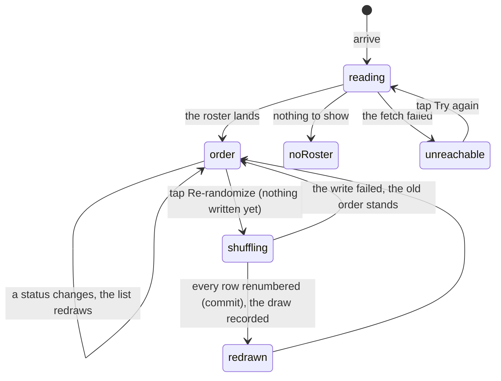

# The running order

## Summary

The running order is the list of who goes when: the whole roster, numbered from
one, with each athlete's status beside their name. It is what the crowd screen
reads to decide who is up next, and it is the only thing on race day that
everyone wants to see and nobody but the commissioner may touch.

It is reached from the Order tile on
[the League hub](../foundations/navigation-and-screens.md#the-league-hub), which
is the only way in. For everybody except the commissioner it is a read-only
list. For the commissioner it carries one button — **Re-randomize** — which
redraws the whole order in a single tap, with no confirmation and no undo.

## The simple case

You tap Order on the League hub. After "Reading the running order…" the list
draws: a numbered chip, the athlete's card art, their name, their fantasy team,
and a status badge on the right. Whoever is currently running has a lit rail
down the left edge of their row.

The commissioner taps Re-randomize. The button reads "Shuffling…" for a moment,
the list redraws in a new order, and a toast says "Running order re-randomized".
Everybody else's phone redraws too, without a tap.

Scratched athletes do not go in the hat. They are dropped to the bottom of the
list in a block, so the draw never hands a slot to somebody who is not running
and the crowd screen never has to skip a number.

## What a row says

The number is the athlete's place in the order, not their bib and not their
finishing position. The badge on the right is the athlete's status, printed as
the database holds it: _waiting_, _running_, _finished_, _scratched_. A running
athlete's badge is solid; a finished one is tinted; a scratched one is red.
Anything else the schema allows — _up next_, _delayed_, _absent_ — would print
here verbatim with its underscores turned into spaces, because the badge shows
the stored word rather than a translation of it.

Tapping a name opens that athlete's card. Nothing else on the row is tappable.

## Who may change it

Three ways the order changes, and all three are the commissioner's:

- **Re-randomize**, from this screen, which redraws everybody.
- **Adding somebody to the roster**, from [the roster](../admin/the-roster.md),
  which appends them to the end.
- **Removing somebody**, which either deletes their row or — if anyone has
  already packed their card — retires them as scratched, which drops them to
  the tail on the next draw.

There is no drag-to-reorder anywhere in the app, and no way for a member to
swap themselves up the list. The button is not what protects the order: every
write goes through a handler whose first line demands an unexpired admin token
bound to _this_ combine, so a request forged without one is refused whether or
not any button was on screen.

The button also disappears when the combine's order is locked. Nothing in the
app can set that lock today; it exists in the data and is read by this screen
alone.

## The interaction, event by event

### Arrive

The active combine, then its bundle. The roster arrives already sorted by
running order and is sorted again on the device, so a row whose number changed
between the two never appears out of place.

The Re-randomize button's presence is decided on arrival from two things: an
admin token on this device whose combine matches the active one, and whether the
order is locked. The token is read after the first paint, so the button appears
a beat after the list on a commissioner's phone.

### Leave without acting

Nothing is recorded. Reading the order writes nothing at all.

### The tap that starts something

Re-randomize. There is no confirmation step, so this tap is the commit — one
thumb on a phone in a garden re-draws the whole field.

At that instant the app draws a fresh random seed and shuffles the field with
it, holding the scratched athletes out of the draw and appending them
afterwards. Everybody is then renumbered one upwards, so the numbers are always
a clean run with no gaps whatever they were before.

> Technical note: the shuffle is seeded and the seed is stored with the draw, so
> a randomization can be replayed and checked afterwards. The seeds are readable
> by nobody but the server — a seed a player could read is a draw a player could
> predict.

### While it runs

The button reads "Shuffling…" and is disabled. The list underneath still shows
the _old_ order: nothing is optimistic here, and the screen does not move until
the server has answered.

Two writes go out in sequence. The first renumbers every row. The second records
the draw — the order before, the order after, and the seed — as an audit entry.
Only the first is what anybody sees.

### It settles

The screen forces a refetch rather than waiting for the change to arrive over
the live feed, and only then shows the toast. A reshuffle nobody can see is
worse than no reshuffle, and this is the screen everyone in the garden is
looking at.

Every other device gets the new order over the live feed a beat later, including
the crowd screen, which immediately puts the new number one in its ring.

On failure a red toast carries the reason and the list is unchanged — unless the
failure was in the second write, in which case the order really did change and
the toast still says it failed. See [edge cases](#edge-cases).

## Modifiers

| Modifier                                                          | At arrival                                                                                                                                                                                                            | Changed during                                                                                                                                                                                                 |
| ----------------------------------------------------------------- | --------------------------------------------------------------------------------------------------------------------------------------------------------------------------------------------------------------------- | -------------------------------------------------------------------------------------------------------------------------------------------------------------------------------------------------------------- |
| Who you are (guest · member · account · commissioner)             | Guests, members and account holders get the same read-only list. Only a commissioner holding an unexpired admin token for the active combine sees Re-randomize. Claiming a player or signing in changes nothing here. | An admin token being minted, cleared or expiring makes the button appear or vanish within a minute, with no reload. A shuffle already in flight completes regardless: the request was authorised when it left. |
| The event's state (before the combine · running · finished)       | The load-bearing row. Before the combine this is the screen the league actually looks at. While it runs, one row is lit and the statuses change under you. After it, the list is a record of who ran in what order.   | Nothing stops a re-randomization mid-combine or after it. Athletes who have already finished are shuffled along with everybody else and simply get new numbers they will never use.                            |
| Dust switched on or off                                           | No effect.                                                                                                                                                                                                            | No effect.                                                                                                                                                                                                     |
| The device (phone · desktop · reduced motion · presentation mode) | Identical on both, at a narrower maximum width than the board. No animation beyond a colour transition on the running row.                                                                                            | No effect. This screen never enters presentation mode.                                                                                                                                                         |

## Cancel and interrupt

| Event                                           | Before Re-randomize                                                                                                                         | After it                                                                                                                                                                                                                                     |
| ----------------------------------------------- | ------------------------------------------------------------------------------------------------------------------------------------------- | -------------------------------------------------------------------------------------------------------------------------------------------------------------------------------------------------------------------------------------------- |
| Back, or closing a sheet                        | Nothing to cancel.                                                                                                                          | Nothing to undo. The order has been rewritten and there is no undo control; the only way back is another draw, which will not reproduce the old one.                                                                                         |
| Navigating away inside the app                  | No effect.                                                                                                                                  | The writes are already on their way and complete without the screen. The toast is lost; the new order is not.                                                                                                                                |
| Reload                                          | The list is fetched again from scratch.                                                                                                     | Same. The new order is what comes back.                                                                                                                                                                                                      |
| Backgrounded                                    | No effect. Returning to the tab refetches.                                                                                                  | The request continues. On return the list shows the new order, though the toast may have gone unseen.                                                                                                                                        |
| Network lost mid-request                        | The list keeps its last values and stops updating.                                                                                          | The important question: **the renumbering may have landed anyway**. Each row is written separately, so a connection dying mid-write can leave some athletes renumbered and others not. The screen will show whatever the next refetch reads. |
| The request fails or times out                  | The screen shows "Can't reach the combine" with a Try again button if nothing had loaded, or the degraded banner over stale rows if it had. | A red toast with the reason. The button comes back. Whether anything was written depends on which of the two writes failed.                                                                                                                  |
| The token expires or is cleared                 | The button vanishes. The list is unaffected.                                                                                                | A request that left with a valid token completes. The next one is refused by the server with an error toast, which is the commissioner's signal to sign in again.                                                                            |
| Changed by someone else, arriving over realtime | The normal case. A status changing, an athlete being added, a run starting — all redraw this list within a beat, with no refresh.           | A second commissioner's draw arriving mid-shuffle is the one genuine hazard: both drew from the same starting list, and the last write wins field by field rather than as a whole.                                                           |
| A second tab or device                          | Both show the same list.                                                                                                                    | Both redraw. A commissioner with the screen open twice can fire two draws in quick succession; the second one's "previous order" is whatever it last read, which may not be what is in the database.                                         |
| Reduced motion or presentation mode changing    | No effect.                                                                                                                                  | No effect.                                                                                                                                                                                                                                   |

## Interactions with other systems

**Who you have to be.** Anybody, to read. A commissioner holding an unexpired
admin token bound to this combine, to write — enforced on the first line of both
handlers, not by the button.

**Realtime.** The list subscribes to the combine's live channel and redraws on
any roster change. The one thing that does _not_ arrive live is the order lock,
which lives on the combine's own record and is only re-read when the screen
refetches for another reason.

**Offline and reconnection.** The list stays on screen and stops updating.
Reconnecting refetches. A draw fired with no connection fails with a toast and
changes nothing — usually.

**Optimistic updates and rollback.** Neither, deliberately. The list does not
move until the server has confirmed the new order, and the screen forces its own
refetch rather than trusting the live feed to deliver it.

**The card economy.** None. A running order number appears on a card's back as
its "Order" vital and nowhere else; it affects no tier, no edition and no dust.

**Motion and sound.** None. The running row's rail fades in and that is the
whole of it.

**Notifications and badges.** None. A re-randomization produces a toast on the
commissioner's own phone and nothing anywhere else — the other twelve people
find out by watching the list move.

**Sharing.** Nothing exports from this screen. Its URL carries link-preview text
reading "Who's up when."

**The second device.** Every device shows the same order within a beat. The
crowd screen is the most important consumer of it: a fresh draw puts a new
athlete in its ring immediately.

**Accessibility.** The list is marked up as a numbered list, which matches what
it is. The status badge is text rather than a colour alone. The order number
sits in its own chip and is read out before the name.

## Edge cases

- **A failed audit write reports a failure that did not happen.** The
  renumbering and the record of it are two separate writes. If the first
  succeeds and the second fails, the order really has changed and the toast
  still says "Failed to shuffle". The list redraws anyway a beat later over the
  live feed, which is the confusing part.
- **A partly applied draw.** Each athlete's number is written individually and
  none of the results is checked, so a draw that half-lands leaves duplicate
  numbers in the list, with two athletes sharing a place and one number missing.
- **Two commissioners drawing at once.** Neither draw is aware of the other, and
  both were computed from the same starting list. The result is one of the two
  draws, or a mixture.
- **A draw computed against a stale list.** An athlete added seconds earlier is
  not in the payload and keeps their old number, which can collide with a number
  the draw has just handed to somebody else.
- **Every athlete scratched.** The draw shuffles nothing and renumbers the
  scratched block. The list still renders.
- **An empty roster.** The screen says "No roster yet. The commissioner sets the
  field", or "Couldn't read the roster just now — retrying" if that is what
  actually happened. The two are told apart rather than guessed at.
- **The order locked.** The button disappears. The server does not check the
  lock, so a request made without the button still succeeds.
- **A re-randomization mid-combine** renumbers people who have already run.
  Nothing prevents it and nothing warns about it.

## Open questions and verification

- **Nothing checks the result of the renumbering writes.** They go out in
  parallel and the handler reports success regardless. A partial failure would
  be silent and would leave the field with duplicate numbers. This looks like a
  defect.
- **The failure toast can lie.** A failure in the second write reports the whole
  shuffle as failed when it succeeded. Also likely a defect.
- **The order lock is unreachable.** `running_order_locked` is read by this
  screen and set by nothing in the app, so the button cannot be hidden by any
  action a commissioner can take today. Either the control is missing or the
  check is vestigial.
- **The draw is recorded and never shown.** Every re-randomization stores the
  previous order, the new order and the seed. No screen reads any of it. This is
  a deliberate audit trail waiting for a reader, not a bug, but it is worth
  knowing that the history exists.
- Whether a re-randomization mid-combine confuses the crowd screen — which reads
  the first unfinished athlete in order — was reasoned about but not performed.
- The absence of a confirmation on a destructive, irreversible, one-tap action
  is stated here as observed. Whether the league wants one is a decision, not a
  finding.
- Assumption: the status badge prints the stored status verbatim. The four the
  live app writes were confirmed; the wider vocabulary in the schema was read
  but never seen on screen.

Verified against willyoubemyhero commit `b46f330`.
