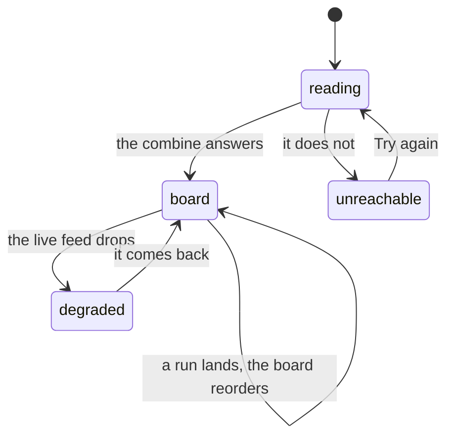

# The TV board

## Summary

The spectator view for a screen nobody is holding: a two-column leaderboard in
type big enough to read from the other side of a garden, with whoever is on the
clock named in the corner. It updates itself as runs land and is meant to be
opened once, on a laptop plugged into a television, and left alone for the
afternoon.

It has no tab on the bottom bar and no tile on the
[League hub](../foundations/navigation-and-screens.md#the-league-hub). The only
way to it is to type `/tv`, or to follow the link the commissioner has in the
admin console. That is deliberate: it is not a screen anybody wants to arrive at
by accident on a phone.

## The simple case

Somebody opens `/tv` on the laptop, drags the window to the television and puts
the browser in full screen.

Across the top: the wordmark, "Draft Combine 2026", and — on the right — either
"On the Clock" or "Up Next" over a name in cyan.

Below it, two columns of results. Each row is a rank bubble, a face, a name, the
fantasy team under it, and the time in glowing digits. First place carries a lit
bezel; the top three carry a filled bubble. Sixteen rows fit, which is more than
the thirteen the combine has.

Somebody finishes. Their row appears, everything below it shifts down, and the
board is correct again without anybody touching the laptop.

## Getting it onto the television

The commissioner's console has a Spectator Access panel with two things in it: a
QR code, and a link labelled "TV big-screen: /tv".

The QR code is **not** for the television. It points at
[the live screen](live-timing.md) and exists so a spectator can point a phone at
it and follow along in their hand. The `/tv` link underneath is the one to open
on the machine driving the big screen.

The board also asks search engines not to index it — one of three screens that
do, alongside the claim screen and the admin console.

## How a screen takes the whole device — and why this one does not

The app does have a mechanism for a screen claiming the whole device. A screen
playing something cinematic raises a flag; the top bar and the bottom bar fade to
nothing and become _inert_ — faded and unreachable rather than unmounted, because
unmounting the header reflows every page under it and the flag flips
mid-ceremony. Exactly one thing uses it today: the pack ceremony.

The TV board does not use it. It keeps the app's top bar and bottom bar and
simply bleeds its own background out past them to the edges of the screen. So a
television showing the board also shows a phone-sized nav bar pinned to the
bottom of it, and a wordmark across the top.

> Technical note: the flag lives at the root of the app rather than in a route,
> because the thing it has to move is the shell, which is the route's
> grandparent. A route cannot dim a nav it does not render. Nothing stops `/tv`
> raising it; it simply never asks.

## The interaction, event by event

### Arrive

The [event bundle](../foundations/the-event.md) is asked for, and with it the
signed URLs for every player's photograph and card front.

Until the bundle lands, the whole screen is one line in enormous grey type:
"Reading the combine…". If it fails and there is nothing cached, the same slot
says "Can't reach the combine" over a large "Try again" button — sized to be
pressed by somebody who has walked over to the laptop, not tapped by a thumb.

Once a board exists, failure stops taking the screen and becomes a banner across
the top instead: "Live feed down — refreshing every few seconds". The numbers on
screen are still the last real ones.

Who is on the clock is decided the same way it is on every other spectator
screen: a player the commissioner has actually started always wins, and with
nobody running the board falls back to the next person in the running order. With
nobody left it prints nothing rather than an idle message.

### Leave without acting

Nothing is recorded. Closing the tab tells nobody, and the board keeps no state
of its own to lose.

### The tap that starts something

Nothing on this screen writes. There are exactly two things to press: "Try again"
on the unreachable state, which asks for the combine again, and a player's name,
which opens [their card](../cards/a-player-card.md) — useful on a laptop, and a
trap on a television nobody can navigate back on.

### While it runs

The board is what runs. It holds the same shared live channel every combine
screen holds, so a run finishing, a split correcting or a penalty landing
reorders it in place.

The artwork behind the faces is signed with URLs that expire after eight hours
and are re-signed every three, specifically so a board left open all afternoon
never reaches the cliff and starts showing broken images at five o'clock.

### It settles

When the last athlete finishes, the board stops moving and the corner stops
naming anybody. Nothing marks the end — there is no final flourish, no "combine
complete" state. The board simply becomes the result.

## Modifiers

| Modifier                                                          | At arrival                                                                                                                                                                                                                                                                                           | Changed during                                                                                                                                                                                                                                  |
| ----------------------------------------------------------------- | ---------------------------------------------------------------------------------------------------------------------------------------------------------------------------------------------------------------------------------------------------------------------------------------------------- | ----------------------------------------------------------------------------------------------------------------------------------------------------------------------------------------------------------------------------------------------- |
| Who you are (guest · member · account · commissioner)             | No effect. Everything on the board is public and identical for everybody. The commissioner sees no extra controls here; the clock is run from [the admin screens](../admin/running-the-clock.md) on a phone.                                                                                         | No effect.                                                                                                                                                                                                                                      |
| The event's state (before the combine · running · finished)       | This is the axis the board exists for. Before the first official time it shows its empty panel; during, it reorders as people finish; after, it holds the final order.                                                                                                                               | Changes arrive live and in place. Nothing needs reloading between phases.                                                                                                                                                                       |
| Dust switched on or off                                           | No effect on the board. The bottom bar showing underneath it gains or loses the Shop tab.                                                                                                                                                                                                            | No effect beyond that reflow.                                                                                                                                                                                                                   |
| The device (phone · desktop · reduced motion · presentation mode) | Everything is sized for distance and none of it scales to the screen: the same two columns and the same enormous type appear on a phone, where the board is cramped and mostly unusable. Nothing on the board animates, so reduced motion changes nothing. The board never raises presentation mode. | If the browser driving the television is signed in as a member and a set completes, the trophy ceremony takes the whole screen — including this one — because that ceremony lives above every route. It hands the screen back when it finishes. |

## Cancel and interrupt

| Event                                       | Before any press                                                                                                                                   | After a press                                                                                                             |
| ------------------------------------------- | -------------------------------------------------------------------------------------------------------------------------------------------------- | ------------------------------------------------------------------------------------------------------------------------- |
| Back, or closing a sheet                    | Nothing to cancel.                                                                                                                                 | "Try again" cannot be cancelled; it is one request and it either answers or fails again.                                  |
| Navigating away inside the app              | No effect. Following a player's name is the only way it happens from here.                                                                         | No effect.                                                                                                                |
| Reload                                      | The bundle and the artwork are fetched again from scratch. On a fresh browser this means the big "Reading the combine…" state for a moment.        | Same.                                                                                                                     |
| Backgrounded                                | A television does not background, but a laptop that sleeps will. The live feed drops and the polling underneath it pauses while the tab is hidden. | Same. Waking the machine refetches and the board catches up.                                                              |
| Network lost mid-request                    | The board keeps its last numbers and puts the banner up. It does not blank.                                                                        | Same.                                                                                                                     |
| The request fails or times out              | With nothing cached, the whole screen becomes "Can't reach the combine" and a button. With something cached, a banner.                             | Same.                                                                                                                     |
| The token expires or is cleared             | No effect. The board reads no token of any kind.                                                                                                   | No effect.                                                                                                                |
| Changed by someone else                     | The normal case. Every change to the combine is somebody else's, and the board is built for it.                                                    | Same.                                                                                                                     |
| A second tab or device                      | Two televisions show the same board within a beat of each other.                                                                                   | Same.                                                                                                                     |
| Reduced motion or presentation mode changes | No effect on the board itself.                                                                                                                     | A ceremony raised elsewhere in the app on the same browser fades the board's own chrome out and dims the board behind it. |

## Interactions with other systems

**Who you have to be.** Nobody. No guard, no token, no gate. Anyone who can reach
the URL sees the board, which is the whole point of a spectator screen.

**Realtime.** Inherited from the shared event channel, along with the degraded
state and the harder polling that backs it up. This screen is one of the few that
shows the degraded banner in type large enough to read from across a garden.

**Offline and reconnection.** The last board stays up. Reconnecting refetches and
reorders. A board that was never loaded shows the unreachable state instead.

**Optimistic updates and rollback.** Neither. The board only ever shows what the
server last said.

**The card economy.** The board is where card art earns its second job: a
player's card front is used as their avatar, falling back to their photograph and
then to their initials on a generated colour. A player with no artwork is never
missing from the board, only plainer.

**Motion and sound.** Silent, and still. Rows appear and disappear without
transitions and nothing chimes when somebody finishes — a board that is watched
rather than operated does not need to attract attention to itself.

**Notifications and badges.** None on the board. The bottom bar underneath it
still carries its dots, which is one of the odder consequences of the board not
hiding the chrome: a trade offer for whoever owns the laptop puts a dot on the
television.

**Sharing.** Not shareable as an image, and marked not to be indexed. The thing
you share is the URL, and it works for anyone.

**The second device.** Nothing per-device. The board is the same everywhere.

**Accessibility.** Contrast and size are the accessibility story here and both
are good. Rank is a number rather than a colour, the on-the-clock label is words
rather than an icon, and the degraded banner is text. The player's name is a
link, which is fine on a laptop and pointless on a television.

## Edge cases

- **An official run with no time recorded** sorts to the _top_ of the board and
  prints a dash where the time should be, so an incomplete run can appear to be
  leading.
- **A run whose player is not on the roster** draws a row with a dash for a name
  and no link.
- **No official times yet** shows a single full-width panel saying so. If a table
  in the bundle actually failed, the same panel says "Couldn't read the results
  just now — retrying." instead, which is the distinction most of the spectator
  screens exist to make.
- **More than sixteen finishers** are cut off with no indication. The combine has
  thirteen, so this is headroom rather than a limit anybody meets.
- **Nobody on the clock and nobody queued** leaves the top-right corner empty
  rather than saying so.
- **A scratched player** is skipped when choosing who is up next, and still
  appears on the board if they have an official time.
- **The board on a phone** is a real thing somebody will do — the URL is
  guessable and the commissioner's console links to it. It renders, it just
  renders badly: two columns of oversized type on a four-inch screen.
- **The nav is still there.** On a television the board carries a phone's bottom
  bar across the bottom of it, with tappable tabs nobody can tap.

## Open questions and verification

- The board has never been watched on an actual television at this commit. How
  the fixed type sizes read at three metres, and whether sixteen rows fit at
  1080p without scrolling, are the two most valuable verification items in this
  document.
- Whether the three-hourly re-signing of the artwork actually keeps a board alive
  past eight hours was read from the caching rules, not observed over an
  afternoon.
- The behaviour when a trophy ceremony takes over a browser that is driving a
  television was reasoned from where the ceremony host is mounted, not seen. It
  is unlikely in practice — the laptop is rarely a member — but nothing prevents
  it.
- Whether a laptop sleeping and waking recovers the board without a reload was
  inferred from the channel's health handling.
- `/tv` is not in the smoke suite that renders every other public route, so
  nothing currently catches a board that stops rendering.
- Assumption: the board is never the screen a commissioner runs the clock from.
  It has no controls at all, so a commissioner who opened it expecting them would
  have to go elsewhere.

Verified against willyoubemyhero commit `b46f330`.
