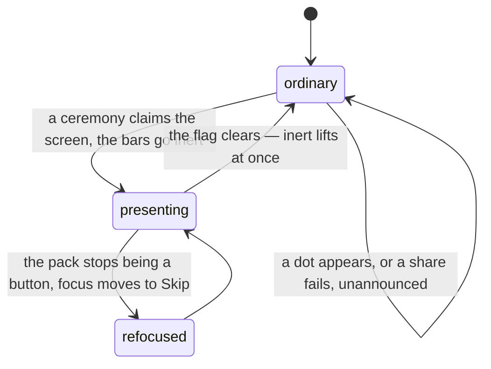

# Accessibility

## Summary

This document gathers what the rest of the description establishes about who can
use this app and how, and it is worth more for what it admits than for what it
claims. The good parts are real and deliberate: toggles report their state on the
control you just operated, badges say what is waiting rather than that _something_
is, a card announces its player and its tier as one thing, and chrome that has
been dimmed to nothing is made genuinely unreachable rather than merely invisible.

The gaps are real too. A ceremony built on a lie tells that lie plainly to
anybody reading the page rather than watching it. Two of the three share buttons
fail without a word. Nothing that arrives is ever announced. And the sound
toggle — the one control somebody might urgently want — is on a screen you have
to go and find.

## The simple case

You open the vault with a screen reader. Each tile is a card announced as its
player, its tier and its finish, and beside it a toggle button that says "Pin
Alice Ace to the top" and reports pressed once you have. You reach the pack tab
and it says "Pack — a secret is waiting", so you know before you get there.

You open the pack. The wrapper is a button called "Tear the pack open"; Enter
opens it. The pack disappears from the page and a polite status says "Opening
your pack", with focus moved onto the Skip control, because the thing you were
standing on has stopped existing. From then on, each card is a button labelled
with its player, its tier and "press to flip".

Getting from one card to the next is where it stops going well. The stand has no
Next control. Right arrow steps forward, and nothing says so.

## What works, and why

- **A toggle reports its own state.** The star on a card is one button carrying
  `aria-pressed` rather than two different controls, and its label names both the
  card and the direction of travel, so it is unambiguous in a grid of thirty
  identical stars. See [favourites](../cards/favourites.md).
- **Each badge names its own thing.** A dot on a tab changes that tab's spoken
  label to "Trade — a trade offer is waiting" or "Pack — a secret is waiting",
  rather than the two of them sharing a generic "something is waiting". The dot
  itself is hidden, because the wording carries the whole message. See
  [notifications and badges](notifications-and-badges.md).
- **Presentation mode uses `inert`, not opacity.** Chrome faded to nothing is
  still chrome a thumb or a tab key can reach, so the bars are made properly
  unreachable while a ceremony is playing. Coming back is instant rather than
  faded, so the nav is never tappable while it is still invisible.
- **A card is one thing.** Name, tier and finish are read as a single title, with
  "press to flip" appended when there is a back, rather than as a pile of
  decorative fragments. The foil, the glare, the sparkle and the prism edge are
  all hidden.
- **A locked slot says what it is.** "_Name_ — not packed yet", as one image,
  rather than eighteen unlabelled backs.
- **The face-down cards flying out of the pack are hidden entirely**, so the
  ceremony does not fill the page with unlabelled buttons.
- **Failures are words.** The degraded feed banner is text beside its icon, and
  the two error cards name what failed and offer a retry.
- **Colour is never the only cue.** Tier and finish are text on the badge as well
  as colour on the frame; the two nav dots differ in colour _and_ in wording.
- **Reduced motion is honoured live**, everywhere, and flipping it mid-ceremony
  cuts to the end rather than freezing. See [motion and sound](motion-and-sound.md).

## The interaction, event by event

### Arrive

Each screen sets a title. Every gated screen states its gate in text rather than
hiding itself, so a member and a guest reach the same places and are told
different things there.

There is no skip link to the main content, so a keyboard user passes the
wordmark, the account control and — on a wide screen — the whole nav on every
page.

### Leave without acting

Nothing is recorded.

### The tap that starts something

Almost every control in the app is a real button or link and answers Enter and
Space. The exceptions are gestures with no visible equivalent, and there are
three: **panning a zoomed card** (zoom in, zoom out and reset all have buttons;
moving the picture around does not), **tilting a card by dragging or by
gyroscope** (decorative, and disabled under reduced motion anyway), and
**stepping through the reveal stand**, where a swipe or the right arrow key is
the only way forward and the arrow key is nowhere announced.

The one gesture that reads as pointer-only turns out not to be: the sealed pack
is a focusable button labelled "Tear the pack open", and Enter or Space commits
the tear outright, skipping the drag threshold. It stops being a button the
instant the rip commits, so it never still announces itself as something you
can open.

### While it runs

Focus is moved once, deliberately: the pack goes hidden as it comes apart, so
focus is moved onto Skip rather than left inside a hidden subtree, where in
practice it lands silently on the page body. A polite status says the pack is
opening, because otherwise the only news is that a button vanished.

Under reduced motion there is no ceremony and therefore no Skip control, which is
correct — but it also means the polite "Opening your pack" is never said.

### It settles

The bars come back and are reachable in the same frame. Nothing announces that
the pack is open, that a card was collected, or that a share succeeded or failed.
The one thing that does announce itself is a finished set: its card count is in a
polite live region, and the ceremony is a dialog labelled with the set's name.

## Modifiers

| Modifier                                                          | At arrival                                                                                                                                                                                                             | Changed during                                                                                                          |
| ----------------------------------------------------------------- | ---------------------------------------------------------------------------------------------------------------------------------------------------------------------------------------------------------------------- | ----------------------------------------------------------------------------------------------------------------------- |
| Who you are (guest · member · account · commissioner)             | The same controls for everybody. Gated screens explain their gate in text rather than disappearing, which is the accessible choice and also the discoverable one.                                                      | Claiming or signing in redraws the account menu in place; nothing announces it beyond the toast that follows.           |
| The event's state (before the combine · running · finished)       | Changes what the numbers say, not how they are read. Times, ranks and tiers are text throughout.                                                                                                                       | A tier upgrading mid-combine changes a card's spoken title the next time it is read. Nothing announces it.              |
| Dust switched on or off                                           | Adds a sixth tab, reachable and labelled like the other five.                                                                                                                                                          | The bar gains a tab under the reader's cursor. Not announced.                                                           |
| The device (phone · desktop · reduced motion · presentation mode) | This is the axis that matters most. Reduced motion silences audio and haptics as well as motion, so somebody who wants a still screen and audible feedback cannot have both. Presentation mode makes the chrome inert. | Reduced motion applies immediately. Presentation mode is raised by a ceremony and cannot be turned off from outside it. |

## Cancel and interrupt

| Event                                       | Before a ceremony claims the screen                                                                                                                                                                   | While it holds it                                                                                                                                                                           |
| ------------------------------------------- | ----------------------------------------------------------------------------------------------------------------------------------------------------------------------------------------------------- | ------------------------------------------------------------------------------------------------------------------------------------------------------------------------------------------- |
| Back, or closing a sheet                    | Focus returns to the previous screen; there is no prompt, because nothing is ever unsaved.                                                                                                            | Presentation mode is released on the way out, so the bars are not left inert on every screen after it. This is a real bug that was fixed; leaving them inert would have been unrecoverable. |
| Navigating away inside the app              | Focus is not managed across route changes; the new screen starts wherever the browser leaves it.                                                                                                      | Same as back.                                                                                                                                                                               |
| Reload                                      | The page starts from the top.                                                                                                                                                                         | Nothing replays. A pack resumes at its saved position with no announcement of where that is.                                                                                                |
| Backgrounded                                | No effect.                                                                                                                                                                                            | Timers stall; the sequence resumes where it was. Sound scheduled ahead of time still plays.                                                                                                 |
| Network lost mid-request                    | Nothing announces it. Five combine screens show a banner that a reader will only find by going to look.                                                                                               | The ceremony carries on. A failed fourth slot shows a labelled retry rather than a silent gap.                                                                                              |
| The request fails or times out              | The two failure cards are text with a named retry. Two of the three share buttons say nothing at all.                                                                                                 | Same.                                                                                                                                                                                       |
| The token expires or is cleared             | Controls disappear and gates appear, silently. A screen quietly loses an ability it had a moment ago.                                                                                                 | Same.                                                                                                                                                                                       |
| Changed by someone else                     | Never announced. A tier changing, an offer arriving, a trade landing and a set closing all redraw the page under the reader with no live region between them — except the set, which gets a ceremony. | Same.                                                                                                                                                                                       |
| A second tab or device                      | No effect.                                                                                                                                                                                            | No effect.                                                                                                                                                                                  |
| Reduced motion or presentation mode changes | Applies at once.                                                                                                                                                                                      | Reduced motion turning on cuts the ceremony to its end, which is the right behavior and is not announced either.                                                                            |

## Interactions with other systems

**Who you have to be.** Nothing about accessibility is gated. Every identity gets
the same markup.

**Realtime.** Everything that arrives live arrives silently. There is no live
region anywhere in the combine screens, so a board reordering, a run finishing or
a tier changing is invisible to anybody not re-reading the page. See
[realtime and staleness](realtime-and-staleness.md).

**Offline and reconnection.** A dead connection produces a banner on five screens
and nothing anywhere else. See [offline](offline.md).

**Optimistic updates and rollback.** The one visible rollback in the app — a pin
that storage refused, discovered on reload — is silent by design, and correctly
so: a star that un-filled under the thumb that tapped it would be worse.

**The card economy.** Prices, balances and counts are all text. Nothing about
dust depends on colour.

**Motion and sound.** Reduced motion is honoured throughout and read live. It is
also the only control over sound that most people will ever find, because the
mute toggle lives on one screen. See [motion and sound](motion-and-sound.md).

**Notifications and badges.** Each badge names itself; the dot is hidden. Neither
is a live region.

**Sharing.** No share announces its outcome, and on a player card page the
off-screen composite that gets rasterised is left in the accessibility tree, so
its whole text is read a second time. See [sharing](sharing.md).

**The second device.** Nothing here differs between devices.

**Accessibility.** This document.

## Edge cases

The edge cases of this document are its gaps, so they are the whole of it.

- **"Pack Complete" is deliberately false.** For a little over half a second the
  stand's heading says the pack is finished when a fourth card is coming. Watching
  it, the lie is interrupted by a flicker and a purple glow before you can act on
  it. Reading the page, there is no flicker and no glow — there is a heading that
  says the pack is over, and no reason not to leave.
- **The reveal stand has no Next control.** A swipe or the right arrow key is the
  only way forward. "Reveal all" is a real button, but it is deliberately a ghost
  — nine-pixel text at 45% opacity — and it is removed entirely on the secret's
  step, which is the one step somebody might most want to get past.
- **Nothing that arrives is announced.** No dot, no trade, no run, no reorder.
- **Two of the three shares fail in silence**, with no live region and no message.
- **The card page's settings chips do not report their state.** "Pin/Pinned",
  "Sound/Muted" and "Tilt" change their label and their colour but carry no
  pressed state, unlike the star on the same page's tiles. On a phone all three
  are inside an overflow menu, where there is no pressed state to be had.
- **The sound toggle is one tap deeper than it should be**, on a screen away from
  every sound it controls.
- **Reduced motion is all or nothing.** It takes the audio and the haptics with
  the animation.
- **No skip link**, and no focus management across route changes.
- **Small targets.** The star is 36 pixels square and the zoom controls are 32,
  both under the 44 that a thumb in a garden wants. The nav tabs, which matter
  most, are comfortably large.

## Open questions and verification

- **The claim in [the sealed pack](../cards/the-sealed-pack.md) that the tear has
  no keyboard path is wrong at this commit.** The sealed wrapper handles Enter and
  Space and commits the tear directly. That document should be corrected rather
  than this one softened.
- None of this has been run with a real screen reader. Everything here was read
  from markup, labels and comments, and the whole document is a list of
  hypotheses until somebody drives the app with VoiceOver on a phone.
- Whether the false "Pack Complete" heading is actually announced depends on how
  the reader treats a heading that changes in place; it was not observed.
- Whether the off-screen share composite is reached in practice depends on the
  reader's handling of content positioned far off-canvas. It is in the tree
  either way, which is the part that can be fixed.
- Contrast ratios were not measured. The "Reveal all" ghost and the small
  uppercase tracking used throughout are the obvious places to check first.
- Assumption: no component in the app traps focus except the shadcn dialogs and
  menus, which are out of scope and were not audited.

Verified against willyoubemyhero commit `b46f330`.
