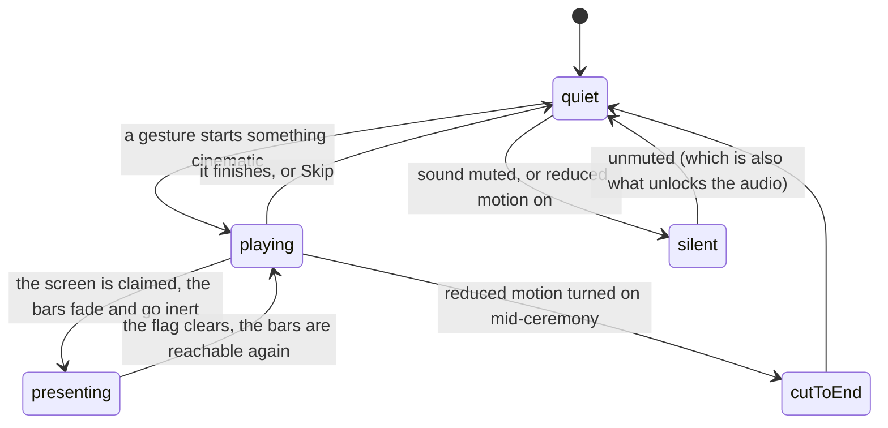

# Motion and sound

## Summary

The app makes noise, buzzes the handset and takes the whole screen for about
eight seconds a day. All of it belongs to one place — the pack — with a handful
of smaller echoes elsewhere: a card flipping, a milestone, a set closing, an
athlete finishing. This document owns what plays, when, what the two switches
turn off, and the one rule that governs the whole area: **reduced motion
silences the ceremony, but it never skips a handover that is correctness rather
than choreography.**

There are two independent switches. The system's _reduced motion_ preference,
which the app reads live and which silences everything. And a _sound_ toggle that
belongs to the device, which mutes the audio and deliberately leaves the haptics
alone.

## The simple case

You drag the wrapper open. The pack takes the strain, the seam rises, the rip
travels across it in six crinkles that tighten as they go, the foil lets go, and
the cards fly up, fan out and square themselves into a deck on the stand. Under
two seconds, eleven distinct sounds, each with its own small buzz.

Then one card at a time. A card lands, you turn it, and on the frame its face
arrives you get a spray of light, a chime pitched to its tier, and a tap on the
handset — one event, not three. A rare finish lays a rising two-note shine over
the top. The last roster card holds face-down for most of a second before it
turns, because the pause is the trick.

Turn reduced motion on and none of that happens. The pack still deals, the cards
are still yours, and the stand is on screen the instant the rip commits.

## The interaction, event by event

### Arrive

Nothing plays on arriving anywhere. Every sound in this app is the consequence of
a gesture, with exactly one exception — the very quiet handling sound under the
pack's anticipation squash, which exists so the sequence opens with something
rather than with silence.

The device's saved mute preference is restored high in the tree, before the first
card can be tapped. The reduced-motion preference is read live, so flipping it in
system settings while the app is open takes effect without a reload.

> Technical note: nothing is downloaded. Every sound is synthesised at the moment
> it plays, so there is nothing to host, nothing to wait for, and sound works
> offline. Confetti is the exception — its code is fetched the first time
> something is won.

### Leave without acting

Nothing is recorded and nothing plays.

### The tap that starts something

Three gestures own almost all of this: the tear, turning a card, and reaching the
fourth slot. Each is described where it lives — [the sealed
pack](../cards/the-sealed-pack.md), [opening a pack](../cards/opening-a-pack.md)
and [the daily secret](../cards/the-daily-secret.md).

What is decided at that instant: whether the ceremony plays at all (reduced
motion), whether it makes a sound (mute), and whether the screen is claimed.

### While it runs

**Presentation mode** is the flag a screen raises while it is playing something
cinematic. Both bars fade to nothing and become _inert_ — not unmounted, because
unmounting the header reflows every page under it, and the flag flips mid-
ceremony. The room behind the scene is a dark wash and a vignette, so the card
sits in a pool of light rather than on a flat rectangle.

Fading _out_ is part of the ceremony taking the screen. Coming back is not: the
bars become reachable again the instant the flag clears, because a fade-in would
leave the nav tappable and focusable while it was still invisible.

**Loudness follows the tier**, on a scale that is deliberately not the vault's
ranking. A champion lights the room fully; a penalty-box card is _funnier_ than a
base card and gets more colour than its rank deserves; a DNF is the quietest
thing on the scale, because the card is meant to read as the power being cut. A
rare finish adds to that rather than scaling it, so a platinum base card lands
harder than a plain one without pretending its owner won the race.

**The chimes are a family.** Six tier triads, brighter and more resolved for
better pulls. The secret's bell is the odd one out on purpose: four voices,
stacked fifths and octaves with no third in it, so it rings instead of landing —
which is what "there is more of this" sounds like. A duplicate secret gets the
top half of that same bell. And a finished set gets the resolution: the same
notes with the third the bell has been missing dropped into the middle of it.

**The haptic is not the sound.** Every cue buzzes as well as chimes, and muting
does not stop the buzz. The commonest reason to reach for mute is standing in a
garden next to somebody else's phone, which is a reason to silence the chimes and
no reason at all to stop the handset tapping back.

**Confetti has four shapes**, and they are different gestures rather than
different sizes: an outward pulse from behind a card that lands (light, not
paper); a proper burst for a champion, a podium or a good enough finish; two
shots fired inward from the bottom corners for a secret, which reads as the card
being _framed_; and, for a finished set, a gold curtain falling across the whole
screen for a second and a half — the only gesture in the app that outlasts the
moment it belongs to.

### It settles

The bars come back, the room comes up, and the screen is ordinary again. Nothing
about motion or sound is written anywhere except the mute flag.

## What reduced motion turns off

The pack ceremony outright: the rip still deals the pack and the stand takes over
in the same tick, which is exactly what the screen did before the ceremony
existed. Also: all sound, all haptics, all confetti, the fake ending, the
secret's blackout-flash-shake, the camera shake, the card's tilt and gyro, the
idle shimmer and sparkle, the blur behind presentation mode, and the flip
animation — a card turns instantly instead of over half a second.

What it does **not** turn off is the sequence itself. The roster card is still
cleared before the secret is allowed to mount, because that is correctness rather
than choreography; the deadlock timer behind it is not shortened either, for the
same reason. The pack is still dealt, the cards are still recorded, the fourth
slot is still pulled, and a finished set still gets its ceremony — instantly, and
in silence.

## Modifiers

| Modifier                                                          | At arrival                                                                                                                                                                                     | Changed during                                                                                                                   |
| ----------------------------------------------------------------- | ---------------------------------------------------------------------------------------------------------------------------------------------------------------------------------------------- | -------------------------------------------------------------------------------------------------------------------------------- |
| Who you are (guest · member · account · commissioner)             | No effect. Every identity gets the same ceremony, and a guest's pack is as loud as anybody's.                                                                                                  | No effect.                                                                                                                       |
| The event's state (before the combine · running · finished)       | Changes which tier a card wears and therefore which chime and how bright the room gets. Before any official run everything is base, so the whole app is quieter.                               | A card whose tier upgrades mid-combine will chime differently the next time it is revealed.                                      |
| Dust switched on or off                                           | No effect.                                                                                                                                                                                     | No effect.                                                                                                                       |
| The device (phone · desktop · reduced motion · presentation mode) | This axis _is_ the document. A device with no vibration motor loses the haptics silently. Safari suspends audio until a gesture, so the first sound after unmuting is the one that unlocks it. | Reduced motion flipping mid-ceremony cuts to the end rather than freezing where it stands: half a production is worse than none. |

## Cancel and interrupt

| Event                                       | Before the ceremony starts                                                                                                                                                         | While it is playing                                                                                                                                                                              |
| ------------------------------------------- | ---------------------------------------------------------------------------------------------------------------------------------------------------------------------------------- | ------------------------------------------------------------------------------------------------------------------------------------------------------------------------------------------------ |
| Back, or closing a sheet                    | Nothing to cancel.                                                                                                                                                                 | Presentation mode is released on the way out, so the bars do not stay faded and inert on every screen after it. Sounds already queued still play out.                                            |
| Navigating away inside the app              | No effect.                                                                                                                                                                         | Same as back. Timers are cleared with the screen; a ceremony that outlived it would call back into a route that has moved on.                                                                    |
| Reload                                      | The mute preference is restored before anything can be tapped.                                                                                                                     | The ceremony is gone. The pack resumes where it was, without replaying the rip.                                                                                                                  |
| Backgrounded                                | No effect.                                                                                                                                                                         | Sound scheduled ahead of time still plays on the audio clock, which keeps running when timers are throttled — which is why a rip is six crinkles rather than one coalesced smack. Visuals stall. |
| Network lost mid-request                    | No effect. Sound needs no connection.                                                                                                                                              | No effect on the ceremony. The fourth slot may fail; the ceremony does not stall waiting for it.                                                                                                 |
| The request fails or times out              | No effect.                                                                                                                                                                         | The stand shows the failed slot and a retry rather than a silent gap.                                                                                                                            |
| The token expires or is cleared             | No effect; neither switch needs a token.                                                                                                                                           | No effect.                                                                                                                                                                                       |
| Changed by someone else                     | No effect.                                                                                                                                                                         | A live update lands on the screen underneath; nothing about the ceremony reacts to it.                                                                                                           |
| A second tab or device                      | The mute flag is shared between tabs on one device — flipping it in one catches the other up, so a tab cannot show "muted" while it keeps making noise. Two devices share nothing. | Independent.                                                                                                                                                                                     |
| Reduced motion or presentation mode changes | Applies immediately: the next gesture gets the reduced path.                                                                                                                       | Reduced motion turning on cuts the ceremony to its end. Presentation mode is owned by the ceremony and cannot be changed from outside.                                                           |

## Interactions with other systems

**Who you have to be.** Nobody. Neither switch asks for an identity.

**Realtime.** Nothing arriving live animates or chimes. The single exception is a
finished set, whose ceremony fires off the row appearing — which is how a set
closed by an admin grant or by the far side of a trade still gets celebrated on
the right phone.

**Offline and reconnection.** Everything here works offline. See
[offline](offline.md).

**Optimistic updates and rollback.** The chime and the burst fire on the frame a
card's face arrives, which is before the server has necessarily agreed about the
finish. A finish the server has not answered with yet gets no shine, rather than
a shine that might be wrong.

**The card economy.** A finish above silver buys a shine and extra particles.
Nothing else in the economy makes a sound; milling, selling and buying are silent
by design.

**Motion and sound.** This document.

**Notifications and badges.** Silent. No dot ever chimes or buzzes. See
[notifications and badges](notifications-and-badges.md).

**Sharing.** An exported image carries none of this.

**The second device.** The mute preference does not travel. Reduced motion is a
system setting on each device.

**Accessibility.** Reduced motion is honoured everywhere, read live rather than
once, and it silences audio and haptics as well as motion — which is generous,
and also means somebody who wants sound without motion cannot have it. The sound
toggle is the reverse and is described under its own gap in
[accessibility](accessibility.md). Under presentation mode the bars are made
genuinely inert rather than merely invisible.

## Edge cases

- **The sound toggle is on one screen.** It lives in the settings chips on a
  player card page, and on a phone it is behind that page's overflow menu. The
  ceremony it exists to silence is on a different screen entirely, so somebody
  in a garden has to leave the pack, open a card, find the overflow and come
  back.
- **Muting does not stop the buzzing.** Deliberate, and stated in the code.
- **Reduced motion does not shorten the reveal holds.** The last roster card
  still waits most of a second face-down, and the secret still waits over a
  second and a half — with no sound and no animation to fill it.
- **A phone with no vibration motor** loses every haptic with no fallback, which
  on a desktop browser is most of the pack's second channel.
- **A ceremony interrupted by a route change** clears its timers; one interrupted
  by a reload does not replay.
- **Gyro tilt is opt-in per card and asks the system for permission**, from a tap
  rather than on arrival, because iOS requires it. A refusal says "Motion access
  denied" and the card stays still. Reduced motion disables it outright.
- **Toasts are not part of presentation mode.** They render outside it, so a
  message can land on top of a ceremony.

## Open questions and verification

- None of the sound design has been heard on a phone speaker in a garden, which
  is the only environment that matters for it.
- Whether the haptic patterns read as intended on Android and on iOS — the
  vibration API behaves differently on each — was not tested.
- Whether reduced motion's long unfilled holds feel broken rather than calm is a
  judgement that needs a person with the preference on.
- That the sound toggle exists on exactly one screen was read from the source; it
  is raised as a likely gap rather than described as a design.
- Assumption: no other component raises presentation mode. Only the pack and the
  trophy ceremony do at this commit.

Verified against willyoubemyhero commit `b46f330`.
