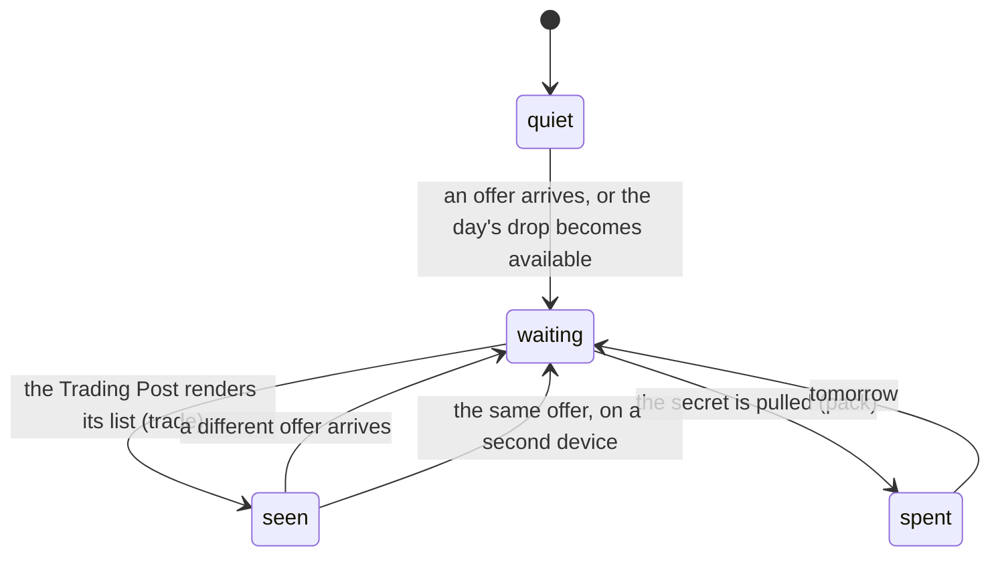

# Notifications and badges

## Summary

The app tells you that something is waiting in exactly two places, and both are
dots on the bottom bar: **a trade offer on Trade** and **a secret on Pack**. They
are independent, they mean different things, and they are drawn differently on
purpose. Everything else the app has to say arrives as a toast at the top of the
screen, in the moment, about something you just did.

There are no push notifications, no emails, and no badge on the home-screen icon.
Nothing in this app reaches a phone that is not open.

## The simple case

You are anywhere in the app. Somebody sends you an offer. A cyan dot appears on
the Trade tab within a beat — no sound, no buzz, no toast. You tap Trade, the
offers load, and the dot goes out. It goes out because you looked, not because
you answered.

Separately, on a day you have not pulled yet, the Pack tab wears a dot in the
secret set's own rainbow rather than the app's cyan. That one goes out when you
pull, not when you look.

## The two dots

**A trade offer is waiting.** Shown when your inbox holds at least one pending
offer this device has not seen. Members only — a guest has no inbox and no dot.
Cleared by the Trading Post rendering its list, which is as soon as the offers
arrive rather than on a tap nobody would think to make.

**A secret is waiting.** Shown when today's drop is genuinely available to you
and you have not taken it. It leaks nothing: a guest who has not been given an
identity yet, and a member who has already pulled, see the tab exactly as it
always was. See [the daily secret](../cards/the-daily-secret.md).

Neither dot ever carries a number. The count is not the point, and a numeral at
that size is a smudge.

The vault's header echoes both, because a dot on a tab is easy to miss under a
thumb: the Open Pack button takes a coloured ring and its own dot, and an "Offer
waiting" pill appears beneath it — but only when there is something to answer, so
it is not the nav drawn twice.

## The interaction, event by event

### Arrive

The bottom bar is mounted on every screen, so it is where the app asks its three
standing questions: is an offer waiting, is a secret waiting, is dust on. All
three are answered from caches the screen you are on has usually already filled,
so the bar costs no extra round trip on most pages.

The trade dot needs a list of what this device has already seen, which lives on
the phone. That list is read *after* the first paint, so on the very first frame
nothing is marked seen and the dot may appear and then go out — the same
hydration dance every device preference in this app does.

### Leave without acting

Nothing is recorded, with one exception that matters: **opening the Trading Post
marks every offer in it as read**, whether or not you answer any of them. Leaving
that screen untouched still clears the dot.

### The tap that starts something

Tapping a tab with a dot on it is a plain navigation. What clears the dot is the
list arriving, not the tap.

### While it runs

An offer arriving is delivered by a *nudge*: a broadcast on a private topic that
carries *nothing at all*. It means "something of yours moved, go and ask
properly", and asking properly means the same guarded request the screen always
used. Nothing about the offer travels over the wire; the topic is derived from
your participant id and the server's own secret, so nobody can work out anybody
else's.

> Technical note: the same nudge covers four things — offers, marketplace
> listings, your own stall and your dust balance — rather than minting a second
> topic. A sale moves your dust when you were not the one who tapped anything,
> and there is no payload to tell the two apart, so all four are refreshed on
> either. For thirteen people that is cheaper than a second topic to keep in
> step.

The secret dot has no live delivery at all. The tables behind it are kept out of
the live feed on purpose, because a broadcast would tell every connected phone
that somebody had just pulled something. Coming back to the tab is refresh
enough for a once-a-day drop.

### It settles

The dot is on or off. Nothing is written anywhere except the trade seen-list, and
that is stored on the phone rather than in the league's database.

## Toasts

Toasts appear at the top centre, with a colour for success or failure and a close
button. They are always about something you just did, never about something that
arrived.

The commissioner sees most of them: every save, upload, rename, grant and reset
confirms in a toast, and every failure names itself. A player sees very few —
a trade sent, accepted, declined or pulled; a link copied; motion permission
refused; a card export that failed. **The pack screen raises none at all**, which
is deliberate: a screen somebody is enjoying is not a screen to interrupt.

## Modifiers

| Modifier | At arrival | Changed during |
| --- | --- | --- |
| Who you are (guest · member · account · commissioner) | Only a member can have a trade dot; a guest has no inbox and no private topic. Both a guest and a member can have a secret dot, because both can hold secrets. The commissioner sees the same two dots as anybody, plus almost every toast in the app. | Claiming a player starts the topic subscription and the dot becomes possible. Signing out drops it and the dot goes quiet. |
| The event's state (before the combine · running · finished) | No effect on either dot. | No effect. |
| Dust switched on or off | No effect on the dots. It changes the bar from five columns to six, so both dots move sideways. | The bar reflows live under the thumb. |
| The device (phone · desktop · reduced motion · presentation mode) | Both dots are drawn on the phone's bottom bar and on the desktop top bar, identically. Under presentation mode the whole bar is faded and inert, dots included. | Neither dot animates, chimes or buzzes under any setting. |

## Cancel and interrupt

| Event | Before the dot is cleared | After it is cleared |
| --- | --- | --- |
| Back, or closing a sheet | No effect; the dot is not a screen. | No effect — clearing already happened when the list rendered. |
| Navigating away inside the app | The dot travels with you; it is on the bar, not on the screen. | Same. |
| Reload | The dot is recomputed from the server's list and the phone's seen-list. It comes back exactly as it was. | Stays clear, because the seen-list is on the phone. |
| Backgrounded | The topic subscription may drop. Coming back refetches on focus, so a dot that should have appeared appears then. | Same. |
| Network lost mid-request | Both dots hold whatever they last knew: a failed refetch leaves the previous answer in place rather than clearing it. A dot that should have appeared while you were offline does not. | No effect. |
| The request fails or times out | A failed offers read does not retry: an expired member token should surface the claim prompt, not three retries on the way to it. | No effect. |
| The token expires or is cleared | The trade dot disappears along with the inbox. The secret dot disappears with the identity. | Same. The seen-list stays on the phone and is still correct if the same person claims again. |
| Changed by someone else | This is how the trade dot appears at all. | An offer accepted or withdrawn elsewhere removes it from your inbox, and the dot goes out on its own. |
| A second tab or device | Two tabs on one phone share the seen-list: clearing the dot in one clears it in the other. Two *devices* do not — reading an offer on your phone leaves the dot on the tablet indoors. | Same. This is a deliberate trade rather than an oversight: cross-device unread would need a table, a write path and a merge rule. |
| Reduced motion or presentation mode changes | The bar fades out and becomes inert; the dots go with it. | Same. |

## Interactions with other systems

**Who you have to be.** A member, for the trade dot. An actor — member or guest —
for the secret dot. Nobody, for a toast.

**Realtime.** The trade dot is the app's one piece of push. It runs on a
broadcast topic rather than a published table, precisely because publishing the
trade tables would make them readable by the whole league. See
[realtime and staleness](realtime-and-staleness.md).

**Offline and reconnection.** Neither dot updates offline. Both recover on
reconnection through the focus refetch. See [offline](offline.md).

**Optimistic updates and rollback.** The seen-list is written and trusted from
memory rather than re-read, so a browser that refuses to store still clears the
dot for that page load. The dot comes back on the next reload, which is the
honest cost.

**The card economy.** A marketplace sale sends the same nudge, so your dust
balance updates on a screen you were not looking at. There is no dust badge.

**Motion and sound.** Nothing here makes a sound, animates or buzzes. A dot
appears; that is all.

**Notifications and badges.** This document.

**Sharing.** Nothing about a dot is shared or exported.

**The second device.** Server-side facts — is there an offer, is there a secret —
are the same on both. The *unread* half is per device, so the trade dot can be
lit on one phone and clear on another.

**Accessibility.** Each badge names its own thing rather than sharing a generic
"something is waiting": the tab's own label becomes "Trade — a trade offer is
waiting" or "Pack — a secret is waiting", so a screen reader user is told *what*
without having to go and look. The dot itself is hidden from assistive
technology, because the wording carries the whole message. Neither dot is a live
region, so an offer arriving while you are reading elsewhere is not announced —
you find out the next time you reach the tab.

## Edge cases

- **Opening the Trading Post clears every dot in it**, including offers you
  scrolled straight past. Reading is the whole gesture.
- **The seen-list cannot grow forever.** Only offers still in the inbox are
  remembered; an offer that has been accepted, declined, cancelled or voided can
  never return to pending, so it never needs remembering again.
- **Junk under the key** reads as nothing having been seen — everything unread,
  which is a working screen.
- **Blocked storage** clears the dot for the page load and lets it back on the
  next reload.
- **The two dots are different colours.** The pack's wears the secret set's own
  edge rather than the app's cyan, because two cues in one bar reading as the
  same thing is worse than one.
- **A dropped nudge is slow, not broken.** The server never blocks a trade
  waiting for one, gives up after two seconds, and logs nothing but a status
  code.
- **A toast can land on top of a ceremony**, because toasts are rendered outside
  presentation mode.
- **No dot for anything else.** Not for a completed trade, not for dust, not for
  a set you finished, not for a run finishing. A finished set announces itself
  with a ceremony instead; see [collection trophies](../cards/collection-trophies.md).

## Open questions and verification

- Whether the trade dot appears fast enough to feel like a notification, on a
  real phone with real signal, has not been watched.
- The first-frame flicker while the seen-list is read was reasoned from the
  hydration pattern and not observed; it may be invisible.
- Whether a screen reader user ever discovers a dot they were not told about is
  the open accessibility question here, and it is raised again in
  [accessibility](accessibility.md).
- Whether the commissioner's volume of toasts is useful or noise on a busy race
  day is a judgement that needs a real combine.
- Assumption: nothing else in the app writes to the trade seen-list key. Nothing
  at this commit does.

Verified against willyoubemyhero commit `b46f330`.
