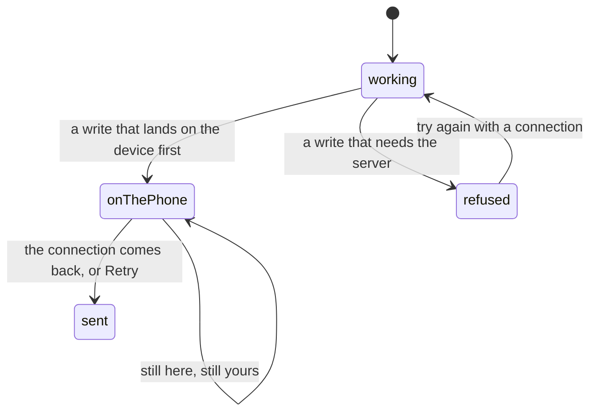

# Offline

## Summary

This is a party app played in a garden, and gardens have bad signal. The honest
answer to "what still works with the radio off" differs sharply by feature, and
the split is not where a user would guess: knowing who you are, browsing what you
already hold, starring a card and **timing a whole run** all work with no
connection at all. Dealing a pack, pulling the secret, trading, and anything that
touches dust do not, and mostly say so badly.

There is no offline mode and no offline banner. The app has exactly one visible
notion of connectivity — the combine feed's health, described in
[realtime and staleness](realtime-and-staleness.md) — and it covers five screens.
Everything else fails one request at a time.

## The simple case

You are timing somebody. The signal goes. You keep tapping splits, you take a
penalty, you hit Finish, and the clock stops on the right number. The save fails,
and the screen says "Could not reach the server" with a **Retry** beside it. When
the signal comes back you tap Retry and the exact time you recorded goes up —
not a re-read of a clock that has moved on.

Now put the phone down and open the pack screen instead. There is no pack. The
roster it would be dealt from lives on the server, and nothing here caches it.

## The interaction, event by event

### Arrive

Everything the device knows about you is read locally and needs nothing:

- **Who you are.** The guest, member and admin tokens live on the phone and are
  read and date-checked there. A token that has expired is dropped without asking
  anybody. See [identity and sessions](../foundations/identity-and-sessions.md).
- **What you hold.** The collection is kept in a database on the device as well
  as on the server, so which cards you have, at which tier and finish, survives a
  dead connection. What does not survive is everything the cards point _at_ — the
  roster names, the stations, the times, and all the artwork.
- **Your preferences.** Pinned cards, the sound toggle, the unread dot, how far
  through today's pack this device got.

The consequence is worth stating plainly: on a **cold start with no connection**
the vault renders its shell and its counts and almost nothing else, because the
roster never arrives. On a page that was **already loaded** when the signal went,
what was fetched stays on screen and simply stops updating.

> Technical note: nothing the server said is written to disk. The query cache is
> memory only, so a reload is what turns "stale" into "gone".

### Leave without acting

Nothing is recorded, online or off.

### The tap that starts something

The dividing line is whether the tap writes to the phone first.

**Writes that land on the device and work with the radio off:** starring a card,
muting sound, marking offers read, starting a run, taking a split, adding a
penalty, stopping the clock, and how far through a pack you have got.

**Writes that need the server and cannot be queued:** the secret pull, every
trade, every dust operation, listing or buying on the marketplace, claiming a
milestone, signing in, claiming a player, and everything on the admin screens
except the run console.

There is one exception in the middle. **Tearing a pack** deals from the roster
already on screen and writes the three cards to the device immediately; only the
"packed by" counts go to the server, and those retry three times with a pause
between them, then wait for the connection to come back before trying again. It
is the one place in the app that watches for reconnection deliberately.

### While it runs

A request with no connection behind it does not hang forever, but it does not
report quickly either — it fails when the browser gives up. Most screens show a
disabled button and a spinner for that whole time.

Nothing anywhere queues a failed write for later. There is no outbox.

### It settles

A run that could not be saved stays on the phone with a **Retry**, and the retry
sends the same record, so a save five minutes later cannot rewrite the time. That
recovery path exists because a failed save used to be unrecoverable: the console
flipped to "finished", hid every control, and left a real person's time stranded
in storage.

Everything else settles as an error message, or — twice — as nothing at all. A
[pack share](sharing.md) that fails brings its button back with no message, and
so does a leaderboard share.

## Modifiers

| Modifier                                                          | At arrival                                                                                                                                                                                                                                                                                                            | Changed during                                                                                                                                        |
| ----------------------------------------------------------------- | --------------------------------------------------------------------------------------------------------------------------------------------------------------------------------------------------------------------------------------------------------------------------------------------------------------------- | ----------------------------------------------------------------------------------------------------------------------------------------------------- |
| Who you are (guest · member · account · commissioner)             | A guest's collection is entirely on the device, so a guest is the identity that survives a dead connection best. A member's cards live on the server and only their local mirror is readable offline. The commissioner is the identity that most needs offline to work, and the run console is the one place it does. | Claiming a player or signing in needs the server and simply fails. The device keeps whatever identity it had.                                         |
| The event's state (before the combine · running · finished)       | Race day is when the connection is worst and when the writes matter most; that is why the run console is built around a dead connection rather than against one.                                                                                                                                                      | An event that changes while a phone is offline arrives whole when it reconnects.                                                                      |
| Dust switched on or off                                           | Irrelevant offline: every dust screen needs the server for its first byte.                                                                                                                                                                                                                                            | A dust call made on a stale switch refuses in the database, not on the phone — so being wrong about the switch costs a button that answers "not yet". |
| The device (phone · desktop · reduced motion · presentation mode) | The app is installable and a service worker is registered from a third-party service, so it can be added to a home screen. What that worker caches is not decided in this project.                                                                                                                                    | No effect. The chimes are synthesised on the device rather than downloaded, so sound works offline.                                                   |

## Cancel and interrupt

| Event                                       | Before the write leaves the device                                                                                                                                                      | After it leaves                                                                                                                                                                                                                                                                  |
| ------------------------------------------- | --------------------------------------------------------------------------------------------------------------------------------------------------------------------------------------- | -------------------------------------------------------------------------------------------------------------------------------------------------------------------------------------------------------------------------------------------------------------------------------- |
| Back, or closing a sheet                    | Nothing has been sent, so nothing is stranded. A run in progress stays in progress — it is not tied to the screen that started it.                                                      | The request carries on. Its result lands in a cache nobody is looking at.                                                                                                                                                                                                        |
| Navigating away inside the app              | Client-side and works offline. The run console can be started on one screen and finished on another.                                                                                    | Same. A run's save is not cancelled by leaving.                                                                                                                                                                                                                                  |
| Reload                                      | Whatever is on the phone comes back: the run, the collection, the pack position, the pins. Everything the server said is gone.                                                          | A reload during a save loses the knowledge that a save was in flight; the run is still on the phone, still stopped, and can be retried.                                                                                                                                          |
| Backgrounded                                | The clock is anchored to wall-clock time rather than to the page, so a phone that locks mid-run keeps the right elapsed time.                                                           | The request may be suspended and resume, or fail. Either way the record is already on the phone.                                                                                                                                                                                 |
| Network lost mid-request                    | This is the case the whole document is about. Nothing is lost that was written locally first.                                                                                           | **The important question, and the answer is: you cannot tell.** A run save that dies after leaving may or may not have landed. Retry is safe anyway — the run carries a key the server writes against, so a second attempt updates the same row rather than making a second one. |
| The request fails or times out              | The screen shows its own message. The run console distinguishes an expired admin session from lost signal, because the generic wording sent people looking for signal they already had. | Same.                                                                                                                                                                                                                                                                            |
| The token expires or is cleared             | Reading and dropping an expired token is a purely local act and works offline.                                                                                                          | An admin token that expired mid-run is why the console names that failure separately: the fix is the PIN, not the signal.                                                                                                                                                        |
| Changed by someone else                     | Nothing arrives while offline. The screen is exactly as stale as the moment the connection went.                                                                                        | Reconnecting refetches; see [realtime and staleness](realtime-and-staleness.md).                                                                                                                                                                                                 |
| A second tab or device                      | Both hold their own copy of everything local. A run started on one phone does not appear on another.                                                                                    | The second device learns about the save the same way everyone else does — by refetching.                                                                                                                                                                                         |
| Reduced motion or presentation mode changes | No effect. Both are read from the device.                                                                                                                                               | No effect.                                                                                                                                                                                                                                                                       |

## Interactions with other systems

**Who you have to be.** No guard runs on the phone. Every guard is on the server,
so an offline device is not "signed out" — it is simply unable to ask.

**Realtime.** The combine feed goes degraded and, on five screens, says so. No
other screen has any way to tell you it has stopped hearing.

**Offline and reconnection.** This document. The one deliberate reconnection
handler in the app re-sends a torn pack's card ids when the browser reports the
connection back or the tab becomes visible again.

**Optimistic updates and rollback.** The local-first writes are not optimistic —
they are the real thing, and the server copy is the follower. That is why they
survive: there is nothing to roll back to.

**The card economy.** Entirely unavailable offline. Milling, selling, the shop
and the marketplace all fail at the first request, and would refuse in the
database even if they reached it while the switch was off. See
[dust](../dust/dust.md).

**Motion and sound.** Both work offline. Every sound in the app is synthesised at
the moment it plays rather than loaded from a file, precisely so there is nothing
to wait on. Confetti is fetched on demand the first time something is won, so the
very first celebration on a cold offline device is silent visually and audible
anyway.

**Notifications and badges.** Both dots freeze at whatever they last knew. A
failed refetch leaves the previous answer in place, so a dot neither appears nor
clears while the connection is down. On a cold offline start neither can be
computed at all, so both are absent.

**Sharing.** An export needs the artwork, and the artwork is signed storage URLs
that expire after an hour. Offline, or on a stale URL, the image rasterises blank
or the export throws — and on two of the three share buttons that failure is
silent. See [sharing](sharing.md).

**The second device.** Nothing syncs offline, and nothing queues to sync later.

**Accessibility.** Nothing here changes for a screen reader except the silences.
A failed pack share, a failed leaderboard share and a failed background record
all end with the screen looking exactly as it did before, with nothing announced.

## Edge cases

- **A blocked storage box.** Private mode, or a browser with site data off, takes
  the local half away too. The collection stops collecting, the pack is dealt
  fresh on every load rather than once a day, and pins last one page load. Every
  one of those is a deliberate degradation rather than an error.
- **A run recorded by a build that is newer than this one** is refused rather
  than guessed at, and it is never deleted — it may be the only copy of a time
  somebody actually ran.
- **A clock that steps mid-run.** The run is anchored to wall-clock time, which
  a network time correction can move. That was chosen knowingly: a reload
  mid-run used to corrupt the time every single time, and a clock step during a
  forty-second run is rare.
- **Two Finish taps in one tick** cannot stamp two different times; the second is
  swallowed.
- **A pack torn offline** is real. The three cards are yours, on that device. The
  counter that says how many people packed each card is the only thing waiting.
- **The fourth slot offline** shows a failed state with a retry rather than
  pretending there is no secret today. See
  [the daily secret](../cards/the-daily-secret.md).
- **No "you are offline" message exists anywhere** outside the combine screens.

## Open questions and verification

- The whole document was read from storage modules, guards and failure branches;
  none of it has been watched on a phone in airplane mode, which is the obvious
  and highest-value verification pass for this area.
- What the third-party service worker caches — whether the app shell loads at all
  on a cold offline start — is not decided in this repository and was not
  determined. It changes the answer to the most important question here.
- Whether a failed run save that actually landed produces a visible duplicate on
  retry was reasoned from the client key, not tested end to end.
- How long a request with no connection takes to report failure varies by browser
  and was not measured.
- Assumption: nothing in the app queues writes for later. Nothing at this commit
  does; the pack's card-id retry is a re-attempt loop, not a queue.

Verified against willyoubemyhero commit `b46f330`.
