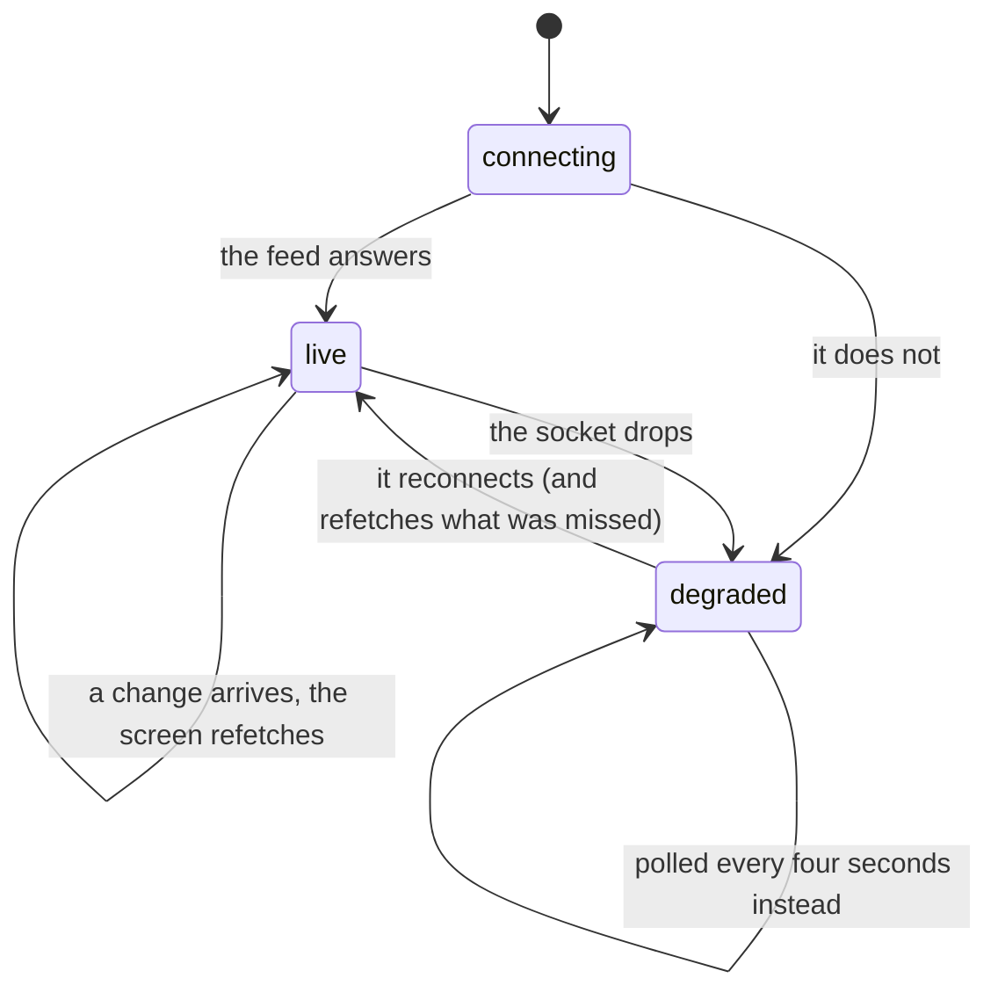

# Realtime and staleness

## Summary

Most of what changes in this app is changed by somebody else: a run finishing, a
tier flipping, a trade landing, a set closing. This document owns the answer to
"will I see that without doing anything", screen by screen. The short version is
that the combine arrives live, the collection arrives live in the places where a
stranger can move your cards, and everything else waits for you to come back to
the tab. Where the live feed is down, five screens say so and the rest quietly
poll instead.

## The simple case

You are looking at the board while somebody runs. They finish, the commissioner
saves the time, and the board reorders under you a beat later. Nothing was
tapped, nothing was refreshed, and no spinner appeared: the screen was told that
something in the event moved and went back for the whole picture.

If the live feed is not working, the same thing still happens — just a few
seconds later, and with a banner across the top saying so.

## The interaction, event by event

### Arrive

A screen that wants the combine joins the event's one channel. If another screen
already has it open, it joins that rather than opening a second, and is told the
current health immediately — so arriving on a degraded page shows the banner on
the first frame instead of pretending everything is fine for a second.

Health starts at *connecting*, which is deliberately not the same as degraded. If
it were, every page load would flash an offline banner before the socket had had
a chance to answer.

> Technical note: the event's own channel is described in
> [the event](../foundations/the-event.md#how-fresh-it-is), which owns the bundle
> it keeps fresh. Trade offers travel on a second, entirely different kind of
> channel — see [notifications and badges](notifications-and-badges.md).

### Leave without acting

Nothing is recorded. The channel is held open for a few seconds after the last
screen using it goes away, rather than closed immediately, because a route change
unmounts the old screen before mounting the new one and closing there would cost
a reconnect and a window in which changes land unseen.

### The tap that starts something

Nothing you tap makes updates arrive faster or slower. The two controls in this
area are **Try again** on a screen that failed to load at all, and the act of
coming back to the tab, which refetches on its own. Everything else that changes
a screen live was tapped by somebody else, on their phone, and belongs to their
document.

### While it runs

The live feed never carries the change itself. It carries "something moved", and
the screen goes back and asks properly. That is the rule everywhere in the app —
the event bundle, the trade feed, reactions, awards, trophies — and it is why a
screen can never drift into a state that half-merged somebody else's edit.

While the feed is healthy a slow poll runs underneath as a backstop, once every
fifteen seconds, one timer for the whole event rather than one per screen. A tab
that is hidden does not poll at all: a phone in a pocket is not watching, and it
refetches on being looked at again anyway.

While the feed is degraded that poll speeds up to every four seconds, and the
five combine screens raise a banner: **"Live feed down — refreshing every few
seconds."** It is a caveat rather than an error, and the wording says so — the
numbers are real, they are just a little behind.

### It settles

Every phone in the garden shows the same picture within a beat of each other.
When a dropped socket comes back, the screen does not simply resume the stream:
it refetches, because everything that changed while it was down was delivered to
nobody.

## What arrives without a refresh

- **The combine.** Runs, roster and statuses, draft picks, splits and penalties.
  This is what redraws the board, [live timing](../combine/live-timing.md), the
  [running order](../combine/the-running-order.md), the
  [draft](../combine/the-draft.md) and a card's tier mid-event.
- **Reactions and comments** on a player card, and **award votes**.
- **Completed trades.** A trade landing is the app's one live signal that two
  collections changed, so it refreshes the [feed](../trading/the-trade-feed.md),
  both sides' offers and spares, and the "packed by" counts on phones belonging
  to people who were not even in it.
- **A finished set.** A trophy row appearing is the notification — see
  [collection trophies](../cards/collection-trophies.md) — which is how a set
  closed by an admin grant or by the far side of a trade still gets its ceremony.
- **An offer waiting for you**, by a different route: a *nudge*, described in
  [notifications and badges](notifications-and-badges.md).

## What does not

- **Today's secret.** The tables behind it are kept out of the live feed on
  purpose: a broadcast would tell every connected phone that somebody had just
  pulled something. Coming back to the tab is refresh enough for a once-a-day
  drop. See [the daily secret](../cards/the-daily-secret.md).
- **Your card counts and your collection.** Refreshed when a trade lands or when
  you come back to the tab, never pushed.
- **Your dust balance**, except when a marketplace sale moves it, which sends the
  same nudge an offer does. See [dust](../dust/dust.md).
- **Your streak** and today's pack. Both are read when the screen opens.
- **The event's own settings**, including the dust switch, which is fetched with
  a one-minute freshness window rather than watched.

## Modifiers

| Modifier | At arrival | Changed during |
| --- | --- | --- |
| Who you are (guest · member · account · commissioner) | The combine feed is public and identical for everyone. Only a member has a private topic to be nudged on, so only a member gets live offers, sales and dust. | Claiming a player starts a topic subscription that a guest never had. Signing out drops it. |
| The event's state (before the combine · running · finished) | Before and after the combine almost nothing changes, so the feed is quiet and its health is invisible. | Race day is the only time any of this is load-bearing, which is also the only time the signal is bad. |
| Dust switched on or off | No effect on what arrives. | Flipping it reflows the nav on every phone within a minute, because the event is refetched rather than pushed. |
| The device (phone · desktop · reduced motion · presentation mode) | No effect. A hidden tab does not poll. | A screen under presentation mode still refetches; the ceremony simply covers it. |

## Cancel and interrupt

| Event | Before a change arrives | After it arrives |
| --- | --- | --- |
| Back, or closing a sheet | Nothing to cancel; watching writes nothing. | The refreshed data is already in the cache and is there when you return. |
| Navigating away inside the app | The channel is held through a short grace period rather than closed, so a fast tab-to-tab costs no reconnect. | The new screen shares the same cache and sees the change without asking again. |
| Reload | Everything in memory is gone; both requests are made from scratch and the channel is opened fresh. | Same. |
| Backgrounded | The poll stops while the tab is hidden and the socket may drop. | Coming back refetches on focus, so a phone out of a pocket gets the current picture before you have finished looking at it. |
| Network lost mid-request | The health state goes degraded, the banner appears on the five screens that carry it, and the last-fetched picture stays on screen. | Cached data stays; it simply stops updating. Nothing is wiped to an empty state. |
| The request fails or times out | A whole-request failure shows "Can't reach the combine" with a **Try again**. A single table failing is named rather than silently rendered as empty. | Same. The wording says "Nothing is lost — this screen is read-only". |
| The token expires or is cleared | No effect on the combine feed, which needs no token. A member's private topic stops being subscribed, so offers and sales fall back to focus refetch. | Same. |
| Changed by someone else | This is the normal case, not an exception. Every combine screen is built for it. | The screen refetches and redraws. |
| A second tab or device | Each browser holds its own channel and its own poll; both see the same changes. Two tabs on one phone each keep their own copy. | Same. |
| Reduced motion or presentation mode changes | No effect on delivery. | No effect. A change landing mid-ceremony is applied to the screen underneath it. |

## Interactions with other systems

**Who you have to be.** Nobody, to watch the combine. A member, to be nudged
about anything private — the topic is derived from your participant id and the
server's secret, and a guest has no such thing.

**Realtime.** This document.

**Offline and reconnection.** The health state is the app's only visible notion
of connectivity, and it only covers the combine feed. Everything else fails
individually. See [offline](offline.md).

**Optimistic updates and rollback.** Nothing arriving over the feed is
optimistic; it is always what the server last said. Screens that write
optimistically own that behavior themselves, and a live change landing mid-write
is described in their own documents.

**The card economy.** A trade landing refreshes both collections. A marketplace
sale nudges the seller, who did not tap anything. Milling and buying refresh only
the phone that did them.

**Motion and sound.** None. A live update never animates and never chimes; the
one exception is a finished set, whose ceremony is fired by the row appearing.
See [motion and sound](motion-and-sound.md).

**Notifications and badges.** The two dots on the bottom bar are fed from this
machinery — one from the private topic, one from a focus refetch. See
[notifications and badges](notifications-and-badges.md).

**Sharing.** A shared image is a snapshot of the moment it was rendered. Nothing
about it updates.

**The second device.** Both devices see the same changes independently. Nothing
is coordinated between them, and per-device state — the unread dot, the sound
toggle, pinned cards — never travels.

**Accessibility.** The degraded banner is text with an icon beside it, not an
icon alone, so it reads. It is not announced when it appears: it is a plain
element rather than a live region, so a screen reader user who is already past
the top of the page is not told the feed went down. The count on a finished
set's ceremony is the one place in this area that announces itself politely.

## Edge cases

- **Only five screens say the feed is down.** The board, live timing, the
  running order, the draft and the awards carry the banner. The vault, the pack,
  the trading post, the shop, a player card, analytics, the admin console and the
  TV board all watch the same channel and say nothing about its health — the
  admin console and the TV board being the two where it would matter most.
- **A partial bundle.** One table failing is reported by name rather than
  coalescing to an empty list, because a failed roster read used to look exactly
  like a finished field.
- **Splits and penalties are not filtered by event.** A change to either fires a
  refetch on every event's watchers. With one active combine this is invisible.
- **Recovery costs an extra read.** Coming back from degraded refetches even if
  nothing changed, which is the price of not knowing what was missed.
- **Joining a nudge topic is itself a refetch**, for the same reason: whatever
  settled between the first read and the subscription landing was broadcast to a
  listener that did not exist yet.
- **Two tabs, two channels.** They do not share. Nothing is wrong with that; it
  is one extra socket per tab.

## Open questions and verification

- The fifteen-second backstop poll and the four-second degraded poll were read
  from the channel registry and not measured. Whether a screen updating a beat
  late is noticeable in a garden has not been observed.
- The grace period on route changes was read from the registry, not timed.
- Whether a real socket drop on a bad garden connection produces the degraded
  banner promptly, or sits in "connecting" for a long time first, is the single
  most valuable verification item in this document.
- That the vault, the pack, the trading post, the admin console and the TV board
  never surface feed health was read from their imports. Whether that is
  deliberate for all of them, or an oversight for the admin console in
  particular, is a question for the league rather than for the code.
- Assumption: no screen merges a realtime payload into its cache. Nothing at this
  commit does, and three separate modules say in comments that they never will.

Verified against willyoubemyhero commit `b46f330`.
