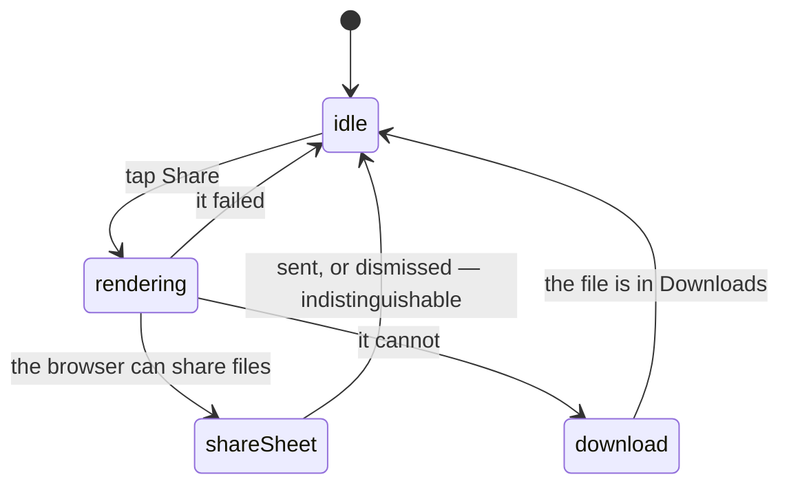

# Sharing

## Summary

Three things in this app can be turned into a picture: one player's card, a whole
pack, and one result off the leaderboard. Each renders as a 1080×1350 portrait
PNG — Instagram's shape, because the group chat is the destination — and each
hands the finished file to the phone's own share sheet, falling back to a
download where that is not available.

Separately, every screen has its own text for a link preview, and the root path
carries the vault's, because "/" is the URL people actually paste. No preview
anywhere carries an image.

## The simple case

You are looking at a card you like. You tap **Share**, the button says
"Rendering…" for about half a second, and the phone's share sheet comes up with a
PNG attached: the app's wordmark, the year, the card's art at trading-card
proportions inside a frame in its own colour, the name, the fantasy team, the
trash-talk quote, and four stats — order, pick, time and rank. You pick a chat
and send it.

The same button on the pack summary gives you all four cards on one image, with
the secret bigger underneath the roster three and a "Collected N / M" line at the
bottom. The board's rows each carry a small share icon that gives you one
result, splits and all.

## What is in each image

**A card.** The tier's colour frames it, and the finish's metal is printed
*inside* that frame, exactly as the card wears it — a special finish takes the
headline badge and the tier drops to the line under it, following the same rule
as everywhere else. Where there is no art, the player's initials fill the frame.

**A pack.** The three roster cards across one row, then "One More Card" and the
secret a third wider on its own row below, then the collection counter. The
widths are solved against the canvas rather than chosen, because the canvas is
fixed and clips what does not fit.

> Technical note: sized for three cards and then given a bigger secret
> underneath, the pack image overflowed by about 170 pixels and cut the counter
> off the bottom of exactly the packs worth sharing. The layout now gives the
> roster row up whatever the secret takes.

**A result.** The athlete, the official time, the penalty time, the rank and
every split.

## The interaction, event by event

### Arrive

Nothing happens on arrival, but something is already mounted: an off-screen copy
of the finished graphic, sitting ten thousand pixels off the left of the page. It
has to be laid out for real — a node the browser has never measured cannot be
rasterised — so it is moved out of sight rather than hidden.

On a player card page that off-screen copy is mounted the whole time you are on
the page. On the pack summary and the leaderboard it is mounted only while a
share is in flight, or when there is a pack to share.

### Leave without acting

Nothing is recorded. No screen counts shares, and nothing tells the league you
made one.

### The tap that starts something

Tapping Share disables the button and starts a render. On a player card the app
first refreshes the artwork's signed addresses, because they expire after an hour
and a stale one rasterises as a blank rectangle, then waits a beat for the
refreshed picture to actually paint before taking the snapshot.

Nothing is written and nothing is sent to the league. This is the one "action" in
the app that is purely local.

### While it runs

The button reads "Rendering…" and cannot be tapped again. On the pack summary the
label goes to "Shared" for a couple of seconds afterwards, which it says whether
the file went to a chat or merely landed in the downloads folder.

Handing the file to the system share sheet is where the app's involvement ends.
Whether you send it, and to whom, the app never learns — and cancelling the sheet
looks exactly like sending it.

### It settles

The button comes back. On success, nothing else changes anywhere.

**On failure the three buttons behave differently, and two of them say nothing at
all.** A player card that could not be exported raises a message: "Could not
export card". A pack that could not be exported does not — the button simply
comes back, on the reasoning that a share that could not be produced is not worth
an error somebody has to dismiss on a screen they are enjoying. A leaderboard
result that could not be exported says nothing either, and does not even catch
the failure.

For somebody using a screen reader that difference matters more than it looks.
The button's own text is the only signal, it is not in a live region, and nothing
announces the change — so a failed pack share is indistinguishable from a
successful one: in both cases the label returns to something ordinary and no
message is spoken. There is no way to tell whether a file was produced except by
going to look for it.

## Link previews

Every screen sets its own title and description, so a link pasted into a chat
says which screen it is: the vault, a pack, the trading post, dust, the board,
the league hub, live timing, the running order, the draft, the awards, analytics,
a recap, the TV board, sign-in, claim and admin each have their own.

The root path is a redirect to the vault and is not a screen, but it carries the
vault's preview text anyway, because it is the link people share.

Claim, admin and the TV board ask search engines not to index them.

**No preview carries an image.** The root, live timing and sign-in ask for the
large-image style of preview card, which then has no image to show. A link to
this app arrives in a chat as text.

## Modifiers

| Modifier | At arrival | Changed during |
| --- | --- | --- |
| Who you are (guest · member · account · commissioner) | No effect. Sharing needs no identity and no guard — there is no server call in it. Anybody can export any unlocked card. | No effect. |
| The event's state (before the combine · running · finished) | Decides what the image says. Before any official run the time and rank print as dashes; during, an exported card can be out of date within a minute. | An image is a snapshot. A card whose tier upgrades after the export does not update the picture you sent. |
| Dust switched on or off | No effect. Nothing about dust or a card's value appears in any image. | No effect. |
| The device (phone · desktop · reduced motion · presentation mode) | A phone gets the system share sheet; a desktop browser almost always gets a download instead. Neither is announced. | No effect. Rendering is not animated and makes no sound. |

## Cancel and interrupt

| Event | Before the render starts | While it is rendering |
| --- | --- | --- |
| Back, or closing a sheet | Nothing to cancel. | The render carries on in a page that is going away; the share sheet may still appear over the next screen. Dismissing the sheet is indistinguishable from sending. |
| Navigating away inside the app | No effect. | The off-screen composite unmounts with the screen. A render already under way finishes against a node that has gone, which is one of the ways a share fails silently. |
| Reload | No effect. | The render is gone. Nothing is left half-written; there is nothing to write. |
| Backgrounded | No effect. | Rasterising may stall until the tab is looked at again. The button stays on "Rendering…" for as long as that takes. |
| Network lost mid-request | The artwork may already be loaded, in which case a share still works. | A card page refreshes its artwork addresses first, so a dead connection fails there — with a message on a player card and in silence on the other two. |
| The request fails or times out | Not applicable. | Same as above: the player card names it, the pack and the leaderboard do not. |
| The token expires or is cleared | No effect. Sharing needs no token. | No effect. |
| Changed by someone else | A tier that changed a moment ago is in the image if the screen had it. | The image is whatever the screen held when the snapshot was taken. |
| A second tab or device | Independent. | Independent. |
| Reduced motion or presentation mode changes | No effect. | No effect. Nothing about sharing is animated. |

## Interactions with other systems

**Who you have to be.** Nobody. There is no guard, because there is no server
call: the picture is composed and rasterised on the phone.

**Realtime.** None. An image never updates.

**Offline and reconnection.** A card page's export refreshes its artwork
addresses first and so needs a connection; the pack and the board use whatever is
already loaded. See [offline](offline.md).

**Optimistic updates and rollback.** Not applicable. Nothing is written.

**The card economy.** No image mentions dust, a price, or what a card is worth. A
locked card cannot be exported at all — its off-screen composite is not even
mounted, because it would be an export of the very art being withheld.

**Motion and sound.** Silent and still.

**Notifications and badges.** None.

**Sharing.** This document.

**The second device.** Nothing is coordinated. Each device renders its own copy.

**Accessibility.** The board's share control is an icon button with a spoken
label. The other two are labelled buttons with visible text. What is missing is
the outcome: no share announces success or failure, and two of the three announce
nothing at all in either case. On a player card page the off-screen composite is
also left in the accessibility tree, so its whole text — the wordmark, the year,
the name, the quote and four stats — is read a second time to anybody going
through the page linearly.

## Edge cases

- **A pack with no secret** renders three cards and no fourth row, and the roster
  three are printed larger to fill the space.
- **A card with no art** prints the player's initials rather than an empty frame.
- **A quote or a name that wraps** was budgeted for: the layout reserves two
  lines under each card so a long name cannot push the footer off the bottom.
- **A locked card's Share is disabled**, and the graphic behind it is never
  built.
- **A stale artwork address** rasterises the card blank rather than failing,
  which is why the export refreshes them and waits before taking the snapshot.
- **The second badge on a card graphic is never printed.** The graphic supports a
  tier line under a metal headline, but the player card page passes nothing for
  it — the metal is the whole caption there.
- **"Shared" is optimistic.** The pack button says it after a download as well as
  after a real share, and after a share sheet that was dismissed.
- **Copy Link** is the fourth way to share, and the only one that is not an
  image: it copies the card's URL, carrying the comparison partner when there is
  one. If the clipboard refuses — it needs a secure context, and permission on
  some browsers — the URL is shown in a message so it can be copied by hand.

## Open questions and verification

- The share sheet path has not been watched on a real phone. Whether the file
  arrives with a sensible name in each chat app is unknown.
- Whether the leaderboard's share ever works on the first tap was not confirmed:
  the off-screen composite is mounted by the same tap that renders it, with a
  fixed hundred-millisecond wait in between, which reads as a race.
- The absence of any preview image was read from every page's head block. Whether
  that is a deliberate decision for a private league app or an oversight is a
  question for the league.
- Whether html-to-image reproduces the fonts faithfully on iOS Safari, where the
  page's web font is loaded from a third party, was not tested.
- Assumption: nothing about a share reaches the server. No handler at this commit
  is called by any of the three paths.

Verified against willyoubemyhero commit `b46f330`.
