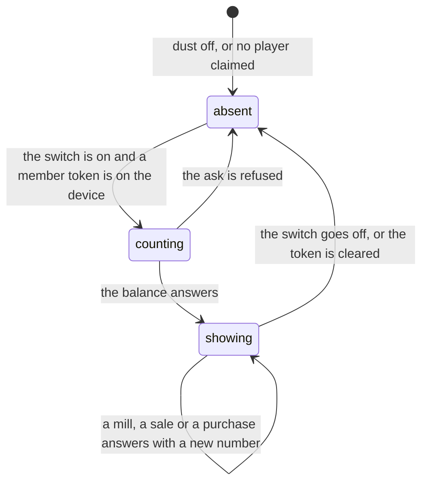

# Dust

## Summary

Dust is the app's only currency. It is banked against a person rather than a
device or a combine, it exists only while the commissioner has switched it on,
and it belongs to members: a guest earns none and spends none. There is one
number — your balance — one place to see it in passing, and one screen where
everything that moves it lives.

Nothing pays out on its own. Dust arrives when you deliberately part with a card:
milling a spare roster copy, selling a secret copy, or somebody buying one of
your cards on [the marketplace](the-marketplace.md). It leaves when you buy
something from [the shop](the-shop.md) or from another member. A duplicate no
longer credits anything on arrival — the reveal says what the copy is _worth_
rather than announcing a payout — which is the whole reason the ladders in
[milling and selling](milling-and-selling.md) exist.

## The simple case

You have claimed a player and the commissioner has switched dust on. At the top
of the vault, beside the heading, there is a small pill with a sparkle on it
reading "140 DUST". Tapping it opens the Shop.

The number moves only when you do something. Burn a spare and the pill reads 180
before the toast has faded. Buy a bonus pull and it reads 30. Come back tomorrow
and it is still 30, because dust is not tied to a combine and does not reset with
one.

If dust is switched off there is no pill and no Shop tab. If you are playing as a
guest there is no pill either, whatever the switch says.

## The interaction, event by event

### Arrive

Two things have to be true before a balance is asked for at all: the active event
says dust is on, and the device holds a member token. Either missing and no
request is made, rather than one being made and refused.

The switch is read off the active event, which the shell has already fetched for
the navigation bar, so the bar and the screen can never disagree about whether
dust exists. See [the event](../foundations/the-event.md).

The pill renders nothing at all until the balance is known — not a zero. A "0"
that turns into "140" a frame later reads as having just lost something. Zero
itself is shown once it is genuinely zero, because a member with no dust needs to
see that the thing exists before they can want any.

> Technical note: the balance is a sum over signed movements, computed on every
> ask, never a stored total. A denormalised balance is a second source of truth
> that drifts the first time a payout path forgets to update it, and the drift is
> silent and always in somebody's favour. It is also answered with a no-store
> header, because a stale number on a shop screen is somebody tapping buy on dust
> they have already spent.

### Leave without acting

Nothing is recorded. Looking at the pill, opening the Shop and leaving writes
nothing: no view, no last-seen, no movement. The balance is read-only until you
tap something that costs or pays.

### The tap that starts something

For a player, tapping the pill is navigation and nothing else. It is a link
rather than a button, so it keeps long-press, middle-click and "open in new tab",
and it is padded to a full thumb target even though the pill itself is barely
tall enough to see — this is a control tapped one-handed in a garden.

The writes that move a balance all live one screen further in, and each is
described where it happens: [milling and selling](milling-and-selling.md),
[the shop](the-shop.md), [the marketplace](the-marketplace.md).

The one write this document owns is the commissioner's. On the admin console
there is a Dust section with a single button that says what will happen rather
than what is true — "Turn dust on", "Turn dust off" — and a confirm before it
fires. Turning it on names what becomes possible: secrets become sellable, and
the shop appears for everyone. Turning it off names what is kept: balances
already earned survive; nothing accrues while it is off.

### While it runs

The switch is one small write and there is no window worth describing. Every
other movement is a single call that answers with the new balance, and the screen
writes that number straight in rather than going back to ask for it.

Nothing about a balance arrives unasked. There is no live feed of what anybody is
spending, deliberately — see **Realtime** below — so the one movement you did not
cause, somebody buying your card, arrives as a content-free poke that means only
"something of yours moved, go and ask properly".

### It settles

The pill shows the new number. The Shop's header line — "You have 140." —
follows it, because both read the same answer.

When the commissioner's switch settles, every device learns at its own pace: the
active event is refetched, the navigation bar reflows from five columns to six
(or back), and the pill appears or disappears. A device that has not caught up
yet is not a hole in anything. While dust is off, every dust operation refuses in
Postgres itself, so a stale switch costs a button that answers "not yet" and can
spend nothing.

## Modifiers

| Modifier                                                          | At arrival                                                                                                                                                                                                                                                                                 | Changed during                                                                                                                                                                                                     |
| ----------------------------------------------------------------- | ------------------------------------------------------------------------------------------------------------------------------------------------------------------------------------------------------------------------------------------------------------------------------------------ | ------------------------------------------------------------------------------------------------------------------------------------------------------------------------------------------------------------------ |
| Who you are (guest · member · account · commissioner)             | Members only. A guest sees no pill and no balance, because dust is banked against a claimed player and a guest has none. An account holder is a member with a durable session; nothing about dust reads differently. The commissioner is a member like anybody else here, plus the switch. | Claiming a player is where dust starts. Packs, secrets and the streak all carry across the claim; a balance begins at zero on the other side of it, because there was never one to carry.                          |
| The event's state (before the combine · running · finished)       | No effect. Dust is a fact about a person, not about a combine, so there is one balance and one answer whatever the event is doing.                                                                                                                                                         | No effect. A balance survives the combine that was running when it was earned, and the next one.                                                                                                                   |
| Dust switched on or off                                           | Decides whether any of this exists. Off: no pill, no Shop tab, no balance fetched, and every dust call refused in the database. On: the pill appears on the vault and the bar grows a sixth tab.                                                                                           | The bar reflows live and the pill appears or disappears. Balances already earned are kept and are exactly where they were when it comes back on. No active event at all reads as off, which is the safe direction. |
| The device (phone · desktop · reduced motion · presentation mode) | The pill is the same on both, sized for a thumb rather than a cursor. Under presentation mode the whole shell fades out and the pill goes with it.                                                                                                                                         | No effect on the number.                                                                                                                                                                                           |

The switch is the load-bearing row. It is the only modifier that can remove the
feature from under somebody mid-session, and it does so cleanly because the
refusal lives in the database rather than in the button.

## Cancel and interrupt

| Event                                       | Before the first write                                                                                                                  | After it                                                                                                                                                                                                                       |
| ------------------------------------------- | --------------------------------------------------------------------------------------------------------------------------------------- | ------------------------------------------------------------------------------------------------------------------------------------------------------------------------------------------------------------------------------ |
| Back, or closing a sheet                    | Nothing to cancel; looking costs nothing.                                                                                               | Nothing to undo. A movement is a row, and the way back is another movement.                                                                                                                                                    |
| Navigating away inside the app              | No effect. The balance stays cached for the next screen that wants it.                                                                  | The new number is already cached, so the pill is correct wherever you land.                                                                                                                                                    |
| Reload                                      | No effect. The balance is asked for again.                                                                                              | The balance is asked for again and answers with the committed number. Nothing about it lives on the device.                                                                                                                    |
| Backgrounded                                | No effect. The balance is refetched when the window comes back into focus.                                                              | Same. A balance that moved while the phone was in a pocket is correct on the next focus.                                                                                                                                       |
| Network lost mid-request                    | Nothing was in flight. The pill shows the last known number, or nothing if it never arrived.                                            | The important question is whether the write landed, and every spending call answers it: each carries a caller-minted id for the tap, and a repeat of that id is answered with what it already bought rather than a second one. |
| The request fails or times out              | The balance is not retried behind a spinner — a token that expired mid-party should show no pill at all rather than three attempts.     | The movement either happened or did not; the balance is the authority and a refresh settles it.                                                                                                                                |
| The token expires or is cleared             | No balance is asked for. The pill is absent, as it is for a guest.                                                                      | The dust is not lost — it is banked against the player, not the phone — but it is invisible until a member token exists again.                                                                                                 |
| Changed by someone else                     | The only person who can move your balance without you is a buyer on the marketplace. That arrives as a content-free poke and a refetch. | Same: your balance rises, your stall shows the sale, and nothing public says so.                                                                                                                                               |
| A second tab or device                      | Each reads its own balance. Two tabs on the same member agree because both are asking the same question.                                | A movement made on one is seen by the other on its next focus or poke, not instantly.                                                                                                                                          |
| Reduced motion or presentation mode changes | No effect on the number. Presentation mode fades the shell, taking the pill with it.                                                    | No effect.                                                                                                                                                                                                                     |

## Interactions with other systems

**Who you have to be.** A member, for everything except reading this page. Every
dust handler proves the participant from the verified token and never from a
request payload — there is no participant parameter on any of them to spoof. The
one exception is the commissioner's switch, which is guarded by an admin token
bound to the event: it is the single dust call a player must never make. See
[identity and sessions](../foundations/identity-and-sessions.md).

**Realtime.** The balance has no subscription and the movement record is not
published at all. A broadcast would give every connected phone a live feed of
what everybody is spending, which is a live feed of who is about to buy a pull.
The only movement you did not cause is somebody buying your card, and that
arrives on the same content-free per-member poke the Trading Post already uses —
it carries no payload, so it can only ever mean "go and ask properly". See
[realtime and staleness](../cross-cutting/realtime-and-staleness.md).

**Offline and reconnection.** The last known number stays on screen and nothing
can be spent. Every dust operation is a server call; none of them has an offline
path, and none of them queues. See [offline](../cross-cutting/offline.md).

**Optimistic updates and rollback.** Nothing about dust is optimistic. Each
movement answers with the new balance and the screen writes that in; there is no
predicted number to roll back, which is deliberate for a value people will argue
about.

**The card economy.** Dust is the economy. What a spare is worth comes from the
finish on it, and the ladders are in [the card](../foundations/the-card.md) and
[milling and selling](milling-and-selling.md). The economy has exactly two
faucets — milling a roster spare and selling a secret — and two drains, the
bonus pull and the reroll. The marketplace moves dust between members and creates
none, which is why it cannot inflate anything.

**Motion and sound.** None. The pill fills in when the number arrives and changes
without animation. A payout is a toast — "+40 dust" — and no chime.

**Notifications and badges.** The pill is not a badge and never carries a dot.
Nothing on the navigation bar signals that dust moved. See
[notifications and badges](../cross-cutting/notifications-and-badges.md).

**Sharing.** A balance is not shareable and appears in no export. A card image
carries no sign of what it would be worth.

**The second device.** Dust follows the member, so two phones on the same claimed
player show the same number. Two phones on the same _account_ likewise, because
the account brings the member token with it. A guest device has none on either.

**Accessibility.** The pill is a link labelled with the number and its
destination — "140 dust — open the dust shop" — rather than an icon with a number
beside it. The sparkle is decorative and hidden from assistive technology. Every
refusal in the economy is a sentence on a button or in a toast, never a colour.

## Edge cases

- **Dust switched off with a balance banked.** The number is kept and simply
  becomes invisible. Turning the switch back on shows exactly what was there.
- **Nothing accrues while it is off.** This is a decision rather than an
  oversight: a balance built out of history nobody knew was being scored, during
  a stretch when milling was unavailable, would be lopsided towards whoever
  pulled most. The day it goes on, everyone starts level.
- **No active event.** Reads as off. A question asked with no event to read is
  answered in the safe direction rather than left undecided.
- **A balance cannot go negative.** There is no rule on a single row that can
  promise this, because the promise is about a sum. It holds because every
  spending call locks the player's row before it reads the balance, so two taps
  at once cannot both see the same money.
- **Somebody leaving the league.** Deleting a player takes their dust with them.
  There is no orphaned balance and nothing to reassign.
- **A duplicate secret pays nothing.** It used to pay a flat amount that ignored
  the level entirely. Now the copy in your hand is worth something and selling it
  is a decision; the reveal says "Sell for 120" rather than crediting anything.
  See [the daily secret](../cards/the-daily-secret.md).
- **The pill during a slow answer.** Absent, not zero, and not a spinner.
- **A guest on the Shop URL while dust is on.** The screen answers and explains:
  dust is banked against your name rather than this phone, with a link to claim.

## Open questions and verification

- Whether the navigation bar's reflow from five columns to six is visible to a
  player standing on a screen when the commissioner flips the switch, or whether
  it waits for the next focus, was read from the shared active-event query rather
  than watched on two phones at once.
- The claim that a balance survives a combine ending and the next one beginning
  was read from the record carrying no event id, and has not been observed across
  a real year boundary.
- The confirm text on the commissioner's switch names the secret ladder's two
  ends. Whether that is the most useful thing to say at that moment is a product
  question, not a defect.
- Assumption: the pill appears nowhere but the vault header. Nothing else in the
  source renders it at this commit.

Verified against willyoubemyhero commit `b46f330`.
