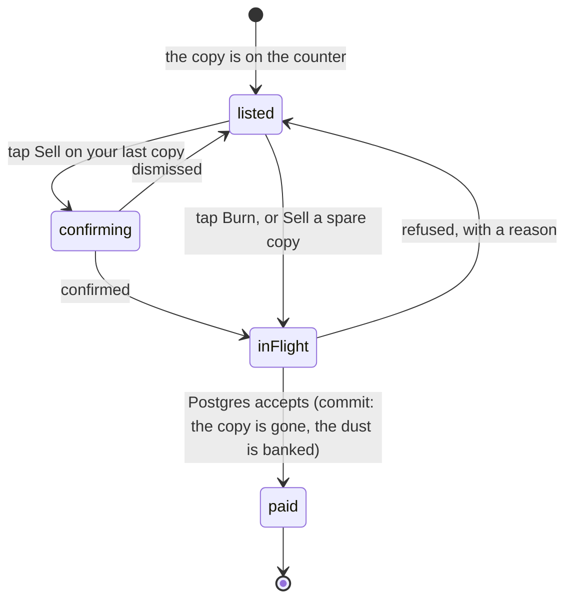

# Milling and selling

## Summary

There are two ways to turn a card you hold into dust, and they are deliberately
different. _Milling_ burns a spare roster copy and pays by the **edition** on it;
_selling_ hands a secret copy over and pays by the **level** on it. Both live as
counters on [the shop](the-shop.md) screen, both are a single tap, and neither
can be undone.

The two ladders are the same ladder scaled. A roster copy pays 100 / 40 / 20 / 10
/ 5 from platinum down to standard. A secret copy pays 300 / 120 / 60 / 30 / 15
from mythic down to common — exactly three times the roster rungs, because the
two rolled ladders have identical odds, so one is the other multiplied rather
than a second set of judgement calls. The vocabularies never mix; see
[the card](../foundations/the-card.md).

One number sits outside both ladders. A roster copy whose finish the server did
not decide pays a flat 5 however rare it claims to be.

## The simple case

You are on the Shop screen with two spare cards you do not want. Under "Burn a
spare" there is a list, rarest first, each row naming the player, the finish on
that copy, and a button reading "Burn +40". You tap it. The row disappears, a
toast says "+40 dust", and the number in the header goes up by forty.

Under "Sell a secret" the same shape: the card's name, its level beside it in
that level's colour, and "Sell +120". If that copy is the only one you hold, the
row says "last copy" and the tap asks first — "Sell your only Gary The Grill for
120? It leaves your vault." — because it genuinely does.

Both lists are sorted by payout, biggest at the top, so the most valuable thing
you could part with is the thing under your thumb.

## The interaction, event by event

### Arrive

Both counters read one list: what you hold that could go. It is the same list
[the Trading Post](../trading/the-trading-post.md) composes offers from, which is
why a card already staked on a pending offer or already up for sale never appears
as burnable in the first place.

The burnable list is roster copies beyond the first of a card. The sellable list
is every secret copy you hold, including ones you own exactly one of — a secret
has no last-copy rule, and that is the feature rather than an omission. Nothing
public rides on you holding a secret, so there is no count to protect.

Today's own pull is filtered out of both lists before they are drawn, which is
the same rule the server enforces on the call.

Each row prints its own payout on the button before anything is tapped. The
number the button shows is the number the ledger will file, because the two
ladders are the same table on both sides of the wire — a disagreement would be a
sheet promising one payout while the record files another.

### Leave without acting

Nothing is recorded. Opening the Shop, reading the ladder and leaving writes
nothing. Nothing is reserved and no card is marked.

### The tap that starts something

The tap is the whole commitment. There is no basket, no review step and no undo.
For a secret you hold only one copy of there is a confirm in front of it; for
everything else the tap is the confirm.

What is decided at that instant, and decided in Postgres rather than on the
phone:

- **Whether it is allowed at all.** Is it yours, is it a spare, is it today's
  pull, is it staked on a pending offer or up for sale, is dust even switched on.
  Every one of those is a question about a count or a state that two taps can
  race, so it is answered under a lock on your player row rather than in the
  button that was drawn a minute ago.
- **What it pays.** The edition or the level on that copy, run through the
  ladder. Not the finish the phone believes; the finish on the row.

### While it runs

The button reads "…" and every other button in that section is disabled until
the call answers. There is no optimistic removal: the row stays until the server
says the copy is gone, because a row that vanished and came back would read as
the app having lost a card.

Nothing else on the screen moves. The balance is not predicted.

### It settles

On success: the copy is deleted, the movement is filed, the balance answers with
its new value and the header updates without a second request. A toast names the
amount. The list is asked for again, and so is the vault's own count of what you
hold — a card you milled your gold copy of now advertises the best finish you
have left, which may be lower than it was a moment ago.

The public "packed by" count for that card does not move, and cannot: the spare
rule guarantees a copy survives, so your claim on the card survives with it.

On refusal, nothing at all is touched and the reason is a sentence:

| What happened                              | What it says                                  |
| ------------------------------------------ | --------------------------------------------- |
| It is your only copy of a roster card      | "That is your only copy"                      |
| It is a roster copy you pulled today       | "Today's card — it can be burned tomorrow"    |
| It is a secret you pulled today            | "Today's pull — it can be sold tomorrow"      |
| It is staked on a pending offer, or listed | "That one is on an open offer or up for sale" |
| Dust is switched off                       | The screen never offers the counter at all    |

## Why an unsettled finish pays the floor rather than being refused

A roster copy carries not only a finish but a note of who decided it. Copies
pulled since finishes moved server-side say "server"; older ones, and anything a
commissioner handed over, do not. Those pay a flat 5 whatever the badge on them
says, and the Shop prints the rule under the ladder: "Cards from before finishes
were settled server-side pay a flat 5, whatever they say on them."

The floor is deliberate, and refusing would be worse. Those copies are real cards
somebody really pulled, and there are a lot of them — an entire fleet from before
the change. Refusing to mill them would punish people for having played early and
would strand cards nobody can do anything with. Paying the floor achieves the
only thing that actually matters: it makes forging a platinum pointless, because
a finish the server did not roll is worth five whatever it claims.

It is also repairable rather than permanent. Paying 50 to reroll that copy's
finish replaces it with one Postgres rolled, and from then on it mills at its
real rate. The Shop's list of rerollable cards puts unsettled copies first for
exactly that reason. See [the shop](the-shop.md).

> Technical note: the same rule errs the same way on both sides. Any provenance
> other than the literal "server" is treated as untrusted, so a value nobody has
> taught the app about under-promises rather than over-promises. A level the
> ladder does not recognise lands on the common rung rather than raising an
> error, and a finish it does not recognise lands on the floor — a payout is the
> wrong place to throw.

## Modifiers

| Modifier                                                          | At arrival                                                                                                                                                                                                                                                     | Changed during                                                                                                 |
| ----------------------------------------------------------------- | -------------------------------------------------------------------------------------------------------------------------------------------------------------------------------------------------------------------------------------------------------------- | -------------------------------------------------------------------------------------------------------------- |
| Who you are (guest · member · account · commissioner)             | Members only. A guest holds secrets and no roster copies, has no balance, and never reaches this screen with a counter on it. An account holder is a member here. A commissioner mills and sells as themselves; the admin console has no shortcut into either. | Claiming a player brings a guest's secrets onto their name, and those copies become sellable from that moment. |
| The event's state (before the combine · running · finished)       | No effect on either payout. What a copy is worth comes from the finish rolled onto it, never from the tier the player earned — a platinum DNF pays 100 and a base champion pays 5.                                                                             | A tier changing mid-combine changes how the card looks and nothing about what it is worth.                     |
| Dust switched on or off                                           | Off, neither counter is on the screen and neither call would be accepted. On, both appear with their ladders printed.                                                                                                                                          | Flipping it off mid-session leaves your spares held and unspendable; the balance you had is kept.              |
| The device (phone · desktop · reduced motion · presentation mode) | Rows are a name, a colour word and a button, sized for a thumb. Nothing about either list is animated.                                                                                                                                                         | No effect.                                                                                                     |

## Cancel and interrupt

| Event                                       | Before the tap                                                                                                                   | After the tap                                                                                                                                                                                             |
| ------------------------------------------- | -------------------------------------------------------------------------------------------------------------------------------- | --------------------------------------------------------------------------------------------------------------------------------------------------------------------------------------------------------- |
| Back, or closing a sheet                    | Nothing to cancel. The confirm on a last secret copy is a real cancel: dismiss it and nothing is sent.                           | Nothing to undo. The copy is gone and the dust is banked.                                                                                                                                                 |
| Navigating away inside the app              | No effect.                                                                                                                       | The call has already left; the answer lands in the cache and the balance is correct wherever you go.                                                                                                      |
| Reload                                      | No effect.                                                                                                                       | The copy is gone and the balance is what the server says. The screen is rebuilt from that.                                                                                                                |
| Backgrounded                                | No effect.                                                                                                                       | The write completes or fails on its own. The lists and the balance are re-read on the next focus.                                                                                                         |
| Network lost mid-request                    | Nothing was in flight.                                                                                                           | The toast says it could not be done. Whether it landed is settled by the balance on the next look — a mill is keyed to the copy it consumed, so it cannot be paid twice however many times it is retried. |
| The request fails or times out              | Not applicable.                                                                                                                  | "Could not burn that one" or "Could not sell that one". Nothing partial: either the copy is deleted and the dust is filed, or neither.                                                                    |
| The token expires or is cleared             | The counters stop being drawn, because no balance can be asked for.                                                              | The write already carried a valid token or was refused outright. Nothing half-finished survives the expiry.                                                                                               |
| Changed by someone else                     | Somebody accepting a trade that takes your second copy away makes a listed row stale; the tap is then refused as your only copy. | A copy that left by another route between the tap and the answer is refused rather than double-spent.                                                                                                     |
| A second tab or device                      | Both show the same lists.                                                                                                        | The other tab's list is stale until its next focus, and a tap on a milled copy is refused with a reason rather than paying twice.                                                                         |
| Reduced motion or presentation mode changes | No effect.                                                                                                                       | No effect.                                                                                                                                                                                                |

## Interactions with other systems

**Who you have to be.** A member. Both calls take the participant from the
verified token and prove the copy belongs to it under a lock; there is no
participant parameter to spoof. See
[identity and sessions](../foundations/identity-and-sessions.md).

**Realtime.** None. Neither counter subscribes to anything, and milling or
selling broadcasts nothing to anybody. Nobody else in the league is told that you
milled a card.

**Offline and reconnection.** Neither works offline. The lists render from cache;
the buttons need the server.

**Optimistic updates and rollback.** Nothing is optimistic. The row stays until
the server confirms it is gone, and the balance is taken from the response rather
than predicted, so there is nothing to roll back.

**The card economy.** These two counters are the economy's only faucets. Every
other movement of dust is a transfer or a purchase, so the total in the league
rises only when somebody mills or sells. That is why both have a spare rule and a
freshness rule around them: the sequence pull, sell, pull would otherwise print
dust for as long as somebody kept tapping.

**Motion and sound.** No animation and no chime. A toast, and a number that
moves.

**Notifications and badges.** None. Nothing on the navigation bar reflects a mill
or a sale.

**Sharing.** Neither is shared or exported. A mill leaves no public trace at all.

**The second device.** Both lists are facts about the member, so both phones show
the same thing and both update on focus. A copy milled on one is simply absent
from the other's next read.

**Accessibility.** Every payout is on the button as text — "Burn +40", "Sell
+120" — and every level and finish is a word beside the name as well as a colour.
"last copy" is text, not an icon. See
[accessibility](../cross-cutting/accessibility.md).

## Edge cases

- **Selling your only copy of a secret.** Allowed, with a confirm. The card
  leaves your vault entirely, and if the copy sold was the one your collection
  counted as "owned", the best of your duplicates is promoted into its place so
  no count is left describing a card you no longer hold.
- **Milling your best copy.** The card's advertised finish falls to the best of
  what is left. This is one of only two places in the app where that number goes
  down.
- **Today's card.** Not a spare yet, in either counter. For a roster copy that is
  a product rule and a good one — a card pulled an hour ago is not a spare.
  Tomorrow it mills like any other.
- **Today's secret pull.** A security rule rather than a product one. That row is
  your spent daily slot, so removing it would hand the slot back and let the day
  be farmed. See [the daily secret](../cards/the-daily-secret.md).
- **A copy on an open offer.** Refused. Milling it would silently shrink an offer
  the other side has already read and is about to accept.
- **A copy up for sale.** Refused for the same reason. Take it off the market
  first; see [the marketplace](the-marketplace.md).
- **A finish or a level nobody recognises.** Pays the floor rung rather than
  failing. An archived value from before something was retired still sells.
- **Two taps on the same copy.** The second is refused, not paid. The copy is
  already gone, and there is a second rule underneath that says a given copy can
  only ever be paid for once.
- **A bought copy's provenance.** Buying a card from another member does not
  launder its finish: a hand-asserted platinum still mills for five in its new
  owner's hands.

## Open questions and verification

- The claim that both lists exclude today's pull before they are drawn was read
  from the list the Trading Post shares; the two rules agree in the source but
  have not been watched together on a day when a fresh pull was the only spare.
- Whether a member can tell, from the row alone, that a copy is unsettled: the
  word "unsettled" appears in the reroll list but not in the burn list, so the
  only signal there is a payout of 5 on a badge that says something rarer. Worth
  a design look rather than a fix.
- The promotion of a duplicate when the owning copy is sold was read from the
  database tests and not observed in the vault.
- Assumption: nothing outside the Shop screen offers a mill or a sale. Nothing in
  the source does at this commit.

Verified against willyoubemyhero commit `b46f330`.
