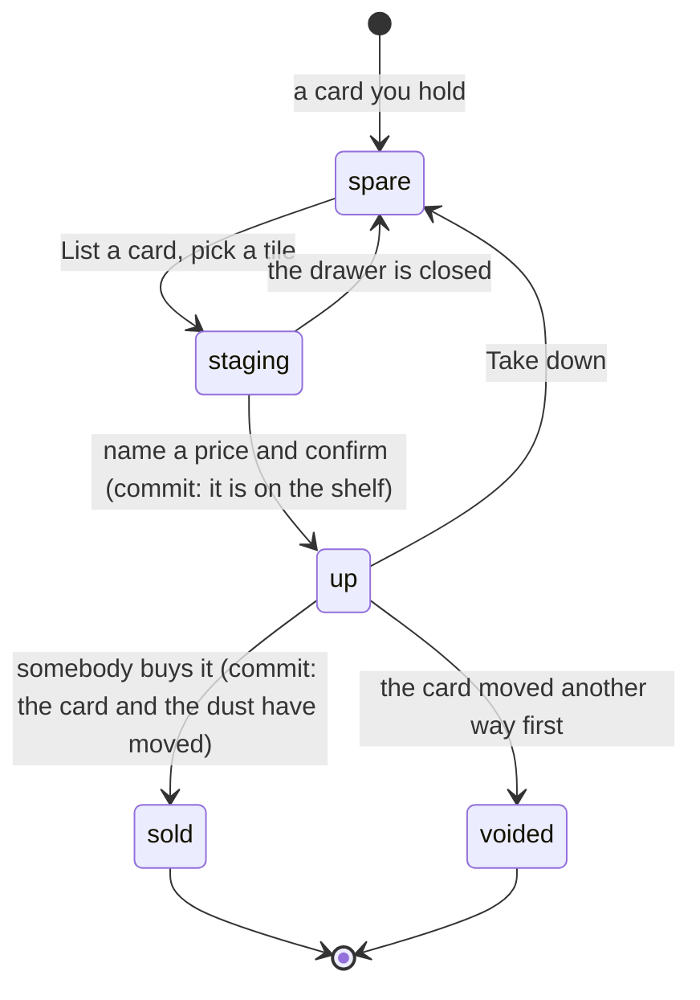

# The marketplace

## Summary

The marketplace is the one place in the app where one member sells a card to
another for a price they set themselves. It is the top half of
[the shop](the-shop.md) screen, and it is deliberately the first thing on it:
what another member will pay for your spare is a more interesting question than
what the house pays, and the mill is the floor underneath it rather than the
headline.

Two sections. **The market** is a grid of tiles other people have put up, newest
first, with the seller's name and a price on each. **Your stall** is a list of
rows: what you have up, with a "Take down" button, and under it a strip of what
settled lately.

A price is any whole number from 1 to 9999, and one member may have at most 20
listings up at a time. A sale is quiet — it writes nothing to the public trade
feed — so your stall is the only place you will ever learn that your card sold.

## The simple case

You have two copies of the same player and you want dust for one. Under Your
stall you tap "List a card". A drawer opens with a grid of your spares. You tap
one; a price box appears, already filled in with what the house would pay, and a
line under it saying "The house would pay 40." You change it to 60 and tap "List
for 60". The drawer closes, a toast says "Up for 60 dust", and the card appears
in your stall.

Somebody else, on their own phone, sees that tile in the market with your name
under it and a button reading "Buy · 60". They tap it. The card moves to them,
sixty dust moves to you, and nothing anywhere announces it. The next time you
open the Shop, your stall shows the listing under "Lately", marked Sold, with
their name beside it.

## The interaction, event by event

### Arrive

The market is asked for only while dust is on and only for a claimed player. Your
stall is asked for regardless of the switch, which is the point: cards left on
the shelf when the economy is turned off must still be reachable.

Your own listings are not in the market grid; they are in your stall, where the
price, the status and the way to take it down all are. You cannot buy your own
listing, and a tile with a dead button on it would be noise on the one screen
that has to stay scannable standing in a garden.

A tile for a secret card you do not hold is drawn face down: its level, which is
what prices it, and nothing else — no name, no art. A wider rule than
[the Trading Post](../trading/the-trading-post.md)'s, deliberately, because every unowned secret in the league could be on the
shelf at once and a browse that named them would be exactly the catalogue the app
withholds. See [the card](../foundations/the-card.md). A tile you cannot afford
says the price instead of offering a button — "120 dust", disabled — because
being told the number you cannot meet is more use than a toast that says no.

### Leave without acting

Nothing is recorded. Browsing the shelf, opening the listing drawer, staging a
card and closing the drawer all write nothing. Nothing is reserved by staging.

### The tap that starts something

There are three first writes on this screen, and they belong to different people.

**Listing.** Confirming the price puts the card on the shelf. Listing costs
nothing, so there is no debit to lose — a repeat of the same tap finds the card
already up and says so rather than shelving it twice. A last copy of a secret
asks first.

**Taking it down.** One tap, and the only operation in the whole feature that
still works with dust switched off.

**Buying.** One tap on a tile. Each buy tap mints an id of its own and holds it
until that tap resolves, because a lost response on a purchase is the failure
that would hurt most here — and the listing's own status cannot stand in for it,
since a retry finds the listing already sold, to you. What is decided at that
instant is decided in Postgres, under a lock on both people at once: is it still
on the shelf, does the seller still hold a spare of it, can the buyer afford it.

### While it runs

The button reads "…" and the rest of that row is disabled. Nothing is optimistic:
the tile stays until the answer says the card moved, the balance does not move
until the answer carries the new number.

### It settles

A completed sale moves three things in one go. The card is re-parented to the
buyer, carrying its finish and the note of who decided that finish untouched, so
buying cannot launder a forged platinum into a real one. The dust moves from
buyer to seller. The listing goes to Sold with the buyer's name on it. There is
no house cut: a sale writes a debit and a credit that sum to zero, so the
marketplace moves dust and creates none — which is what keeps the economy's only
faucets the mill and the secret sale.

The buyer's screen refreshes everything a card arriving touches: their spares,
their vault counts, the public "packed by" count for that card, their secret
shelf and, if the card finished a set, the trophy shelf. The seller's phone is
poked with a content-free message meaning only "something of yours moved", and
goes back for its stall, its balance and the shelf. A listing whose card has
since moved another way — traded, milled, sold to the house — is marked
**Expired** on the next attempt to buy it, and the buyer is told "That card had
already moved"; nobody hunts these down when a card moves, because the settle
path is where it is caught.

Refusals are sentences on both sides:

| Buying                         | Listing                                          |
| ------------------------------ | ------------------------------------------------ |
| "Somebody got there first"     | "You would have none left"                       |
| "That card had already moved"  | "Today's pull is not a spare yet"                |
| "Not enough dust for that one" | "Take it off the market first"                   |
| "That one's yours"             | "That one is already up"                         |
| "Dust is switched off"         | "Your stall is full — take something down first" |
|                                | "That price is out of range"                     |

## Why the floor of 1 is load-bearing

A price below 1 is not refused because a cheap card is a product problem. It is
refused because a price of nought would break a sale halfway through.

Dust movements are recorded one row per movement, and a separate rule refuses a
movement of zero — a row that says nothing and still has to be summed. A
zero-price sale would reach that rule _after_ the card had already changed hands
and fail there, inside a transaction that had already moved somebody's card. So
the floor is checked three times on the way in — the price box, the handler and
the shelf's own rule — each of them saying no before anything moves. That a
zero-price listing is a gift with a Buy button on it is the second and much less
interesting reason.

The ceiling is the ordinary product half: the dearest thing the house sells is
150, so 9999 is far past any honest ask and still refuses a fat-fingered 50000
rather than banking it. Between the two ends nothing is enforced. The price box
starts at what the house would pay, and that number is a hint and never a rule —
undercutting the mill is a perfectly legitimate thing to do for a card you would
rather see in somebody's collection than burn. The hint exists so nobody shelves
a platinum for three by accident, which is the one mistake a free-text price
field invites.

> Technical note: a price is immutable for the life of a listing. Re-pricing is
> take it down and list it again. That is what lets a buyer trust the number on
> the tile they tapped — the buy call carries no expected price, because the
> price cannot move while the listing is up.

## Why the cap is 20

Twenty active listings each is not an economic rule and does nothing to the
supply of anything. It is about the screen. There are thirteen people in this
league and the market has no pagination: it is one grid, newest first, scrolled
with a thumb. One member shelving four hundred cards makes that screen useless
for everybody else, and that is the only shape of denial-of-service a marketplace
this size has. Twenty is enough that nobody honest ever meets it and few enough
that nobody can bury the shelf, and the refusal says so plainly — "Your stall is
full — take something down first" — rather than pretending the card was
unlistable.

## Modifiers

| Modifier                                                          | At arrival                                                                                                                                                                                                                                                | Changed during                                                                                                                                                                   |
| ----------------------------------------------------------------- | --------------------------------------------------------------------------------------------------------------------------------------------------------------------------------------------------------------------------------------------------------- | -------------------------------------------------------------------------------------------------------------------------------------------------------------------------------- |
| Who you are (guest · member · account · commissioner)             | Members only, on both sides. A guest has no balance to pay with and no roster copies to sell, and is offered the claim instead. An account holder is a member here. The commissioner buys and sells as themselves; nothing about a listing is privileged. | Claiming a player turns the explanation into the real screen on the next read, and a guest's secrets become listable from that moment.                                           |
| The event's state (before the combine · running · finished)       | No effect. A listing carries the event it was made at as flavour only, and a sale can happen out of season.                                                                                                                                               | A tier changing mid-combine changes the face on a tile and nothing about its price.                                                                                              |
| Dust switched on or off                                           | Off: no market, no listing flow, and your stall drawn alone if anything is on it. On: the full screen.                                                                                                                                                    | Flipping it off mid-visit shuts the market and the listing drawer but deliberately leaves Take down working, so nobody's cards are stranded on a shelf they can no longer reach. |
| The device (phone · desktop · reduced motion · presentation mode) | The market is a two-column tile grid on a phone and wider on a desktop, because you are buying a picture. Your stall is rows, because there you already know what you own and the numbers are the point.                                                  | No effect.                                                                                                                                                                       |

## Cancel and interrupt

| Event                                       | Before the first write                                                                                                   | After it                                                                                                                                                                                                                    |
| ------------------------------------------- | ------------------------------------------------------------------------------------------------------------------------ | --------------------------------------------------------------------------------------------------------------------------------------------------------------------------------------------------------------------------- |
| Back, or closing a sheet                    | Closing the listing drawer abandons the staged card and the typed price. Nothing was reserved.                           | Nothing to undo on a sale. A listing can be taken down; a completed purchase cannot.                                                                                                                                        |
| Navigating away inside the app              | No effect.                                                                                                               | The call has left and its answer lands in the cache.                                                                                                                                                                        |
| Reload                                      | No effect. The staged card and price are lost; nothing else is.                                                          | The world is rebuilt from the server: the shelf, the stall and the balance.                                                                                                                                                 |
| Backgrounded                                | No effect. The shelf and the stall are re-read on the next focus.                                                        | The write completes or fails on its own. A sale that happened while the phone was in a pocket shows up in the stall on the next focus.                                                                                      |
| Network lost mid-request                    | Nothing was in flight.                                                                                                   | Buying holds its tap id rather than rotating it, so a retry is answered with the sale it already made rather than a second one. Listing needs no id: the card itself is the key, and a retry says "That one is already up". |
| The request fails or times out              | Not applicable.                                                                                                          | A toast. Nothing partial: the dust and the card move in one transaction or neither does.                                                                                                                                    |
| The token expires or is cleared             | The screen falls back to the claim explanation on the next read. Listings already up stay up.                            | The write carried a valid token or was refused. A stall you can no longer see is not a stall that stopped existing.                                                                                                         |
| Changed by someone else                     | Somebody buying the tile you were looking at, or a seller taking it down: the tap is refused and the shelf is refreshed. | A second buyer on the same listing loses cleanly with "Somebody got there first". Exactly one of two simultaneous buys succeeds.                                                                                            |
| A second tab or device                      | Both show the same shelf and stall.                                                                                      | The other is stale until its next focus or poke. A tap on a sold tile is refused, never double-charged.                                                                                                                     |
| Reduced motion or presentation mode changes | No effect.                                                                                                               | No effect. Nothing here animates.                                                                                                                                                                                           |

## Interactions with other systems

**Who you have to be.** A member, on both sides. Every handler takes the
participant from the verified token; unlike the Trading Post there is not even a
counterparty to name, because a buyer names a listing and the seller is read off
it. See [identity and sessions](../foundations/identity-and-sessions.md).

**Realtime.** The shelf has no subscription — a published table would have to be
readable by anybody for a browser to subscribe to it, and this one names cards
people hold. A listing somebody else puts up reaches you on your next focus,
which for thirteen people in a garden is soon enough. A sale you are party to
arrives on the same content-free per-member poke the Trading Post uses; it
carries no payload at all, which is the entire privacy guarantee.

**Offline and reconnection.** The shelf renders from cache and nothing on it can
be bought, listed or taken down.

**Optimistic updates and rollback.** Nothing is optimistic. The balance is taken
from the response rather than predicted, and the tile stays until the server says
the card moved.

**The card economy.** The marketplace is the economy's only transfer, and it
creates no dust and destroys none. The obvious worry — list a platinum for 1, the
buyer mills it for 100 — nets the league exactly the 100 the seller could have
had by milling it themselves. The dust moved; none was printed. See [dust](dust.md).

**Motion and sound.** None. Tiles, a drawer, and toasts.

**Notifications and badges.** None. The Shop tab never carries a dot, and a sale
raises no badge — the stall's "Lately" strip is the whole notification.

**Sharing.** Nothing here is shared or exported, and a sale reaches no public
record — the deliberate difference from a trade, which does; see
[the trade feed](../trading/the-trade-feed.md).

**The second device.** The shelf and the stall are facts about the member, so
both phones agree at their own pace.

**Accessibility.** Every price is on its button as text, every level and finish
is a word beside a colour, a face-down tile is labelled as one, and refusals are
sentences. See [accessibility](../cross-cutting/accessibility.md).

## Edge cases

- **A roster card always leaves you one.** Both copies of a pair cannot be
  listed; the second is refused as "You would have none left". Pending trade
  offers count as commitments too, so staking your second copy and then shelving
  the first is refused for the same reason.
- **A secret may be your only one**, listed with a confirm exactly as it is sold
  to the house. Today's pull is the exception: refused, because that row is your
  spent daily slot and a sale would hand it back.
- **A card staked on a pending offer may still be listed.** Deliberate. One copy
  can already sit on several offers at once, and a listing promises rather than
  destroys. Whichever settles first wins and the other fails its own check.
- **A listed card is spoken for.** It cannot be milled, sold to the house or
  rerolled while it is up. Take it down first.
- **Buying a card you already hold.** Arrives as a spare, worth selling like any
  other. Buying the card that finishes a set mints the trophy, filed as a card
  changing hands between two members rather than as a pull.
- **Cancelled versus expired.** Two different words on purpose. "Pulled" is you
  taking it down; "Expired" is the card having moved first. A listing whose card
  is deleted outright goes with it rather than leaving a blank tile.
- **Your own tile.** Never on the shelf, and refused if tapped by hand.

## Open questions and verification

- The claim that a listing somebody else puts up reaches you only on focus, not
  live, was read from the absence of a subscription. Whether that feels slow with
  people standing next to each other has not been watched.
- Whether a seller notices the "Lately" strip at all is the open design question
  in this feature: it is the only signal a sale ever produces, and it is below
  the fold on a phone.
- Whether the 20-listing cap is ever reached in a thirteen-person league is
  untested and probably unreachable in practice.
- Assumption: no public surface names a marketplace sale. The trade feed, the
  vault and the card back were checked at this commit.

Verified against willyoubemyhero commit `b46f330`.
