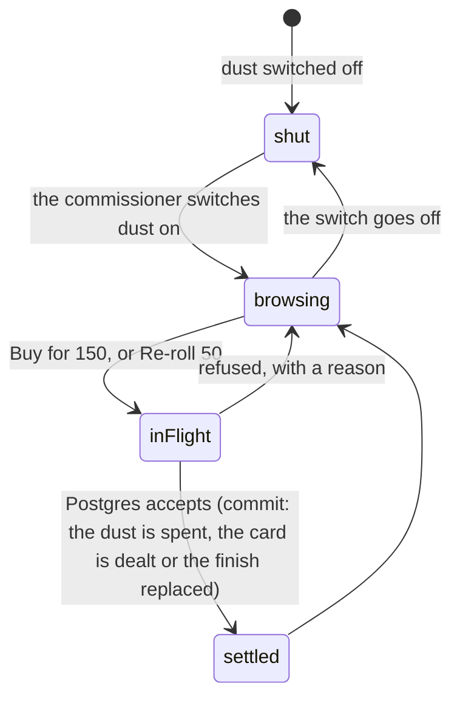

# The shop

## Summary

The Shop is the dust economy's own screen. It appears in the bottom bar only
while the commissioner has dust switched on, which is what reflows the bar from
five columns to six — see
[navigation and screens](../foundations/navigation-and-screens.md). Everything
that moves a balance lives here and nowhere else.

The screen is in two halves, and the order is the argument. The marketplace comes
first, because what another member will pay for your spare is the more
interesting question. The house comes second: a bonus secret pull for 150, the
two counters that turn a spare into dust, a reroll of a copy's finish for 50, and
a table of what everything pays. The house is the floor under the market rather
than the headline.

Two prices are the whole of what the house sells. **A bonus secret pull costs
150.** **A reroll costs 50, and it can go down.**

## The simple case

You tap Shop. A header reads "Economy · Dust" and a line under it says "You have
140."

Below that is the market: a grid of tiles other people have put up, each with a
price on it. Below that, four boxes from the house.

**Bonus secret pull.** "One extra pull, right now. It does not touch tomorrow's
free one." A single button: "Buy for 150". If you cannot afford it the button is
dead and a line under it says how far off you are — "10 more to go".

**Burn a spare** and **Sell a secret** are the two counters described in
[milling and selling](milling-and-selling.md).

**Settle a finish.** "Roll a card's finish again for 50. Any card you hold,
including your only one — and it can go down." A list of every roster copy you
hold, unsettled ones first, each with a "Re-roll 50" button.

**Where dust comes from.** Two columns of five rungs each, the mill ladder beside
the secret ladder, so the two are read together.

## The interaction, event by event

### Arrive

The screen asks four things: the active event (is dust on), your balance, your
spares, and the marketplace. The last two are asked for only once there is a
claimed player to ask about, and the marketplace only while dust is on.

Three arrivals are possible and each is a different screen:

- **Dust off.** "The commissioner has not switched dust on yet. Nothing to spend
  and nothing to earn until it is." with a link back to the vault. The tab is
  gone but the URL still answers, deliberately — a 404 on a screen that worked
  yesterday reads as a broken app rather than a switch somebody flipped. If you
  have cards still on the market shelf, your stall is drawn here and nothing
  else, so you can take them back down.
- **Dust on, no claimed player.** "Dust is banked against your name rather than
  this phone, so it needs a claimed player," with a link to claim.
- **Dust on, a member.** The full screen.

The prices are constants the app already holds, so "Buy for 150" is printed
before anything is asked of the server. No response on this screen carries a
total of any kind: not how big the secret set is, not what anybody else holds.

### Leave without acting

Nothing is recorded. Reading the ladder, opening the market and leaving writes
nothing.

### The tap that starts something

Four buttons can spend. Buying a bonus pull, rerolling a finish, and — on the
market half — listing and buying, which are described in
[the marketplace](the-marketplace.md).

Each spending tap mints an id of its own and holds it until that tap resolves. A
repeat of the same id is answered with what it already bought rather than a
second one; a fresh tap mints a fresh id, so buying two pulls in a row still
works. This is the app's answer to the one failure that would hurt most here — a
lost response on a purchase.

The reroll's list includes every copy you hold, not just spares, because a card
you own exactly one of is the one most worth settling.

### While it runs

The button reads "…". The other buttons in that section are disabled. Nothing is
predicted: the balance does not move until the answer carries the new number.

### It settles

**A bonus pull** answers with the pull itself and the new balance. The toast says
"Pull bought — check your secrets"; the card is in the vault's secret shelf, and
if it finished a set, the trophy is minted for it there and then. It is a real
pull in every way except that it does not consume tomorrow's free one — the free
daily slot is untouched and still available. See
[the daily secret](../cards/the-daily-secret.md).

**A reroll** answers with both ends and the toast names both: "Gold → Standard".
Saying only the new one would read as a win every time. The copy's finish is
replaced, the card's advertised finish is recomputed from what you now hold, and
the copy is marked as server-decided from then on.

Refusals are sentences: "Not enough dust yet — a pull is 150", "Nothing left in
the pool right now", "Not enough dust — a re-roll is 50", "That one is on an open
offer or up for sale".

## A reroll can go down

This is the part of the shop worth stating plainly, because it is the one place
in the app where the usual rule is deliberately reversed.

Everywhere else, **best wins**: pulling a worse finish of a card you already hold
is a duplicate rather than a downgrade, and the value only ever moves up the
ladder. A reroll is not that. It replaces the finish with whatever it rolls, at
the ordinary odds — 0.5 / 3.5 / 8 / 18 / 70 per cent — and seven rolls in ten
come back standard. Reroll a platinum and you will very probably lose it.

A best-of would make this a risk-free ratchet: fifty dust with no downside, the
whole league converging on platinum, and the ladder ceasing to mean anything.
The gamble is the product. The screen says so before the tap — "and it can go
down" — and the toast says so after it, by naming the finish you gave up as well
as the one you got.

There is one honest reason to take the gamble that is not a gamble at all. A copy
whose finish the server never decided mills for a flat 5 whatever it says on it.
Rerolling it costs 50 and hands back a finish that pays its real rate — worth,
on average, rather more than the floor. That is why unsettled copies lead the
list, and why the section is called "Settle a finish" rather than "Gamble".

## Modifiers

| Modifier | At arrival | Changed during |
| --- | --- | --- |
| Who you are (guest · member · account · commissioner) | Members only for everything that spends. A guest reaching the URL is told dust is banked against a name and offered the claim. An account holder is a member here. The commissioner shops as themselves; the switch is on the admin console, not on this screen. | Claiming a player mid-session turns the explanation into the real screen on the next read. |
| The event's state (before the combine · running · finished) | No effect. Nothing the shop sells depends on the combine, and prices do not move with it. | No effect. |
| Dust switched on or off | Decides whether the tab exists and which of the three arrivals you get. Off, the screen still answers on a bookmark and explains itself, and your stall is the one thing still drawn. | Flipping it off mid-visit leaves the screen you are on stale, and every button on it answers "not yet" rather than spending. Flipping it on grows the tab and fills the screen in on the next read. |
| The device (phone · desktop · reduced motion · presentation mode) | Rows and a two-column price table, laid out for a phone; the market's tile grid widens on a desktop. | No effect. |

## Cancel and interrupt

| Event | Before the tap | After the tap |
| --- | --- | --- |
| Back, or closing a sheet | Nothing to cancel. The listing drawer is a real sheet and closing it abandons the staged card and price. | Nothing to undo. A purchase and a reroll are both single, final movements. |
| Navigating away inside the app | No effect. | The call has left; its answer lands in the cache. The balance is correct on whatever screen you land on. |
| Reload | No effect. Prices are constants and are drawn immediately. | The world is rebuilt from the server: the balance, the spares and the market. |
| Backgrounded | No effect. | The write completes or fails on its own. Everything on this screen is re-read on the next focus. |
| Network lost mid-request | Nothing was in flight. | "Could not buy that just now". The tap's id is held rather than rotated, so retrying the same tap is answered with the pull or the roll it already paid for rather than charging twice. |
| The request fails or times out | Not applicable. | A toast, and nothing partial. A purchase files its debit before it deals the card, so a failure takes the debit back with it. |
| The token expires or is cleared | The screen falls back to the claim explanation on the next read. | The write either carried a valid token or was refused outright. |
| Changed by someone else | Somebody buying a listing you were about to buy makes the tile stale; the tap is refused as "Somebody got there first" and the shelf is refreshed. | The purchase already landed. A concurrent buy of the same listing loses cleanly rather than double-charging. |
| A second tab or device | Both show the same prices and the same balance. | The other tab is stale until its next focus. A second reroll from it is a second, genuine gamble at 50 — that is the feature, not a replay. |
| Reduced motion or presentation mode changes | No effect. | No effect. Nothing here animates. |

## Interactions with other systems

**Who you have to be.** A member for every button. Each handler takes the
participant from the verified token; there is no participant parameter on any of
them. The commissioner's switch is the only dust call behind an admin token, and
it is not on this screen. See
[identity and sessions](../foundations/identity-and-sessions.md).

**Realtime.** The house half subscribes to nothing. The market half joins your
own content-free poke so that a seller hears their card sold; see
[the marketplace](the-marketplace.md). Nothing about a purchase is broadcast to
the league.

**Offline and reconnection.** The screen renders from cache and nothing on it can
be spent. Every button needs the server.

**Optimistic updates and rollback.** Nothing is optimistic. Each answer carries
the new balance and the screen writes it in rather than refetching, which is what
keeps a stale number from appearing behind a ceremony.

**The card economy.** The shop holds both drains. Nothing here creates dust; the
two faucets are on the same screen, one section down. A bought pull is a real
pull and can complete a set, mint a trophy, and arrive as a duplicate worth
selling. See [milling and selling](milling-and-selling.md).

**Motion and sound.** None on this screen. A bought secret is revealed in the
vault rather than here, so the ceremony belongs to
[the daily secret](../cards/the-daily-secret.md) rather than to the shop.

**Notifications and badges.** The Shop tab carries no dot, ever. Nothing about
dust is a notification.

**Sharing.** Nothing on this screen is shareable and no price appears in an
export.

**The second device.** Prices and balance are the same on both. A purchase made
on one is visible on the other at its next focus.

**Accessibility.** Every price is on its button as text, every refusal is a
sentence, and the two ladders are a labelled list of words and numbers rather
than a chart. Levels and finishes are named as well as coloured. The last-copy
confirm is a real dialog rather than a hold-to-confirm gesture.

## Edge cases

- **A bookmark after the switch goes off.** The screen answers and says why. This
  is deliberate; so is drawing your stall there, because taking a card back down
  is the one dust operation that still works with the economy off.
- **An empty secret pool.** "Nothing left in the pool right now" and no charge.
  The catalogue is checked before any dust moves.
- **Buying two pulls in a row.** Legitimate and supported. Each tap mints its own
  id; only a repeat of the same tap is deduplicated.
- **Rerolling the same card twice.** Also legitimate, and charged twice. Paying
  50 twice for two gambles on one copy is the feature, and it is the one movement
  in the economy deliberately left repayable.
- **Rerolling a card on an open offer or up for sale.** Refused, and for a
  sharper reason than milling one: a reroll deletes nothing, so the other side
  would simply receive a different finish than the one the offer showed them.
- **A reroll that lands on the finish you already had.** Possible, and charged.
  The toast reads "Gold → Gold".
- **The bonus pull and the free one on the same day.** Independent. Buying does
  not spend the free slot and the free pull cannot be doubled by it.
- **The balance still loading.** The Buy button is dead and the "N more to go"
  line is absent rather than showing a wrong number.
- **Nothing to reroll.** "No cards yet." rather than an empty list.

## Open questions and verification

- Whether the market half or the house half is what a player actually reaches for
  first was a design decision recorded in the source; the ordering has not been
  watched with real players.
- The bonus pull is described as "about one a week for somebody playing daily",
  which is the rate 150 was tuned to. That has not been measured against a real
  season.
- Whether a reroll that lands on the same finish reads as a bug to a player has
  not been checked. The toast names both ends, so it says what happened.
- Assumption: no screen other than this one spends dust. Nothing in the source
  does at this commit.

Verified against willyoubemyhero commit `b46f330`.
