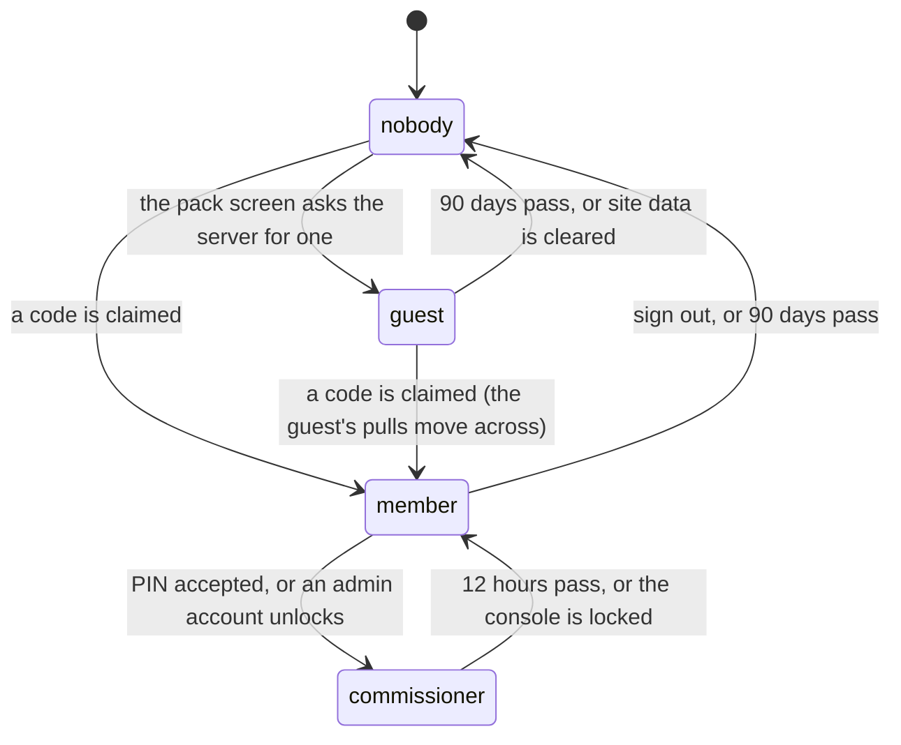

# Identity and sessions

## Summary

There is no login in the ordinary sense. What the app knows about you is decided
entirely by what your browser is holding: up to three signed tokens, each with a
different lifetime and a different set of things it unlocks. This document owns
those facts. Every other document says which of them a screen requires and links
here rather than restating them.

The four identities are *guest*, *member*, *account holder* and *commissioner*.
They are not a ladder. A guest and a member are alternatives; an account is
durability layered on either; the commissioner is a separate key to a separate
door, and one person routinely holds two at once.

## The simple case

You open the app for the first time. You are nobody, and almost everything works
anyway: the vault, the board, the League screens, and a pack.

The moment you go to open a pack, the app quietly asks the server for an
anonymous identity, and the server mints one and signs it. You are now a *guest*.
Your pack, your daily secret and your streak are attached to that identity, and
they stay attached for 90 days.

Later, somebody hands you a slip of paper with a six-character code on it. You
type it into [the claim screen](../accounts/claiming-your-player.md), and the
app trades it for a *member* token. You are now a person on the roster: you can
trade, vote on superlatives, use the marketplace and hold roster cards on your
name. Everything you pulled as a guest comes with you.

If you also sign up with an email and password, the collection stops belonging to
the handset and starts belonging to you. Sign in on a new phone and it is there.

## The interaction, event by event

The unit here is the life of an identity on one device.

An account sits alongside all of this rather than inside it: signing in does not
change which token guards a write, it changes whether the collection survives the
device.

### Arrive

On every screen, before anything is drawn, the app reads what the browser holds.
Three keys, three independent answers: a member token, a guest token, an admin
token. Each is checked for shape and for expiry, and a token that fails either is
discarded on the spot.

The first paint always renders as nobody. The identity arrives a beat later.

> Technical note: the server has no access to the browser's storage, so a screen
> that read the token during render would hand the browser a different first
> paint than the one it is hydrating. The member token is the exception that
> proves the rule — it is read through a subscription rather than an effect,
> because the old effect left a claimed member looking anonymous for exactly one
> render, and the trading post's signed-out gate fired in that window and bounced
> them to the sign-in screen.

Whichever tokens exist are attached to every server call the app makes, as
separate headers. The screen does not choose; middleware attaches whatever the
device holds, and the handler decides what to do with it.

### Leave without acting

Nothing is recorded. Reading a screen never touches an identity, never extends a
token, and never tells anyone you were there. Tokens expire on wall-clock time
from the moment they were issued; using the app does not renew them.

### The tap that starts something

Three different taps acquire an identity, and they behave differently.

**Becoming a guest** is not really a tap. Arriving at the pack screen is enough:
the app asks the server for an anonymous session, and the server mints a fresh
identifier and signs it. The request takes no input at all, and that is the
entire security design — a handler that signed whatever identifier it was handed
would let anybody mint a token for somebody else's guest and spend their daily
pull. If the device already holds a valid guest token the server returns the
existing identity and nothing is stored, so two tabs or a retry cannot orphan
yesterday's identity along with the secrets attached to it.

**Claiming a player** is a code typed on
[the claim screen](../accounts/claiming-your-player.md). Ten attempts per player
per ten minutes; a correct code clears the counter.

**Unlocking the console** is a PIN typed on [the admin screen](../admin/getting-in.md),
or nothing at all if you are signed in to an account that is on the admin list.
Ten attempts per event per ten minutes, and the account door stays open through a
lockout.

### While it runs

All three are a single request with a spinner. Nothing is optimistic: the app
does not act as though you are a member until the server has said so and handed
back a signed token.

A wrong code and a player with no code issued produce exactly the same answer, so
the screen cannot be used to work out who has been given a code.

### It settles

A successful claim or unlock stores the token and, for a member, the player's
name so the nav can greet you without another round trip. Every screen that cares
redraws at once.

A member claim also does housekeeping that nobody sees: anything the device
pulled as a guest — secrets, packs, and the streak milestones those packs already
paid out — is moved onto the participant. The guest identity is taken from the
verified guest token and never from the request, because otherwise claiming your
own player would be a way to harvest somebody else's cards. If that move fails,
the claim still stands; the cards are reconciled later rather than the whole
claim being thrown away.

Roster cards do not move in that step. They were never stored server-side for a
guest, so the device uploads them itself once it holds a member token. See
[keeping your cards](../accounts/keeping-your-cards.md).

## Modifiers

| Modifier | At arrival | Changed during |
| --- | --- | --- |
| Who you are (guest · member · account · commissioner) | This is the axis itself. A member token always beats a guest token on the same device, so somebody who played as a guest and then claimed never ends up with their history split across two identities. | Claiming mid-session upgrades every screen at once. Signing out clears the member token but leaves the guest token, so you drop back to being nobody in particular rather than to nothing. |
| The event's state | No effect on identity. An admin token is bound to one event and stops working when a different event is active. | A member or guest token is not event-bound and survives a new combine. |
| Dust switched on or off | No effect. | No effect. |
| The device (phone · desktop · reduced motion · presentation mode) | Identity is per-browser, not per-person. A second browser on the same phone is a different guest. | No effect. |

Changing identity mid-session is common in this app rather than exceptional — it
is a party, phones get handed around — and every screen is expected to cope with
a token appearing or vanishing under it.

## Cancel and interrupt

| Event | Before the token is issued | After it is stored |
| --- | --- | --- |
| Back, or closing a sheet | The claim or PIN screen closes and nothing is stored. Attempts already made still count against the limiter. | No effect; the token is already on the device. |
| Navigating away inside the app | Same: nothing is stored, the attempt count stands. | The token travels with you; every screen reads the same one. |
| Reload | Nothing is stored. | Tokens survive; they live in the browser's storage, not in memory. |
| Backgrounded | An in-flight request may fail and need retrying. | No effect. Expiry is wall-clock, so time passes while the app is closed. |
| Network lost mid-request | No token is issued, and the attempt may or may not have been counted — the limiter is incremented before the code is compared. | No effect. |
| The request fails or times out | The screen shows the failure and you try again. A limiter that itself errors fails open rather than locking the party out of its own console. | No effect. |
| The token expires or is cleared | Not applicable. | The screen quietly loses an ability it had a moment ago. A member token is re-checked hourly, an admin token every minute, so an expiry shows up without a reload. |
| Changed by someone else | The commissioner rotating a code invalidates the paper slip but leaves existing member tokens working until they expire. | Same. A rotated code is about the next claim, not this session. |
| A second tab or device | Two tabs can each ask for a guest session; the server hands both the same identity. | A token stored in one tab is picked up by the others. A second device shares nothing unless an account links them. |
| Reduced motion or presentation mode changes | No effect. | No effect. |

After an expiry the app does not log you out of anything, because there was
nothing to log out of. Buttons stop being drawn, gated screens start showing
their gate, and a breadcrumb recording that this device *was* a member is left
behind deliberately — a member's secret cards live on their name rather than on
the phone, and somebody arriving on a new handset to an empty vault needs to be
told where their collection went, by which time the token that would have proved
they had one is gone.

## Interactions with other systems

**Who you have to be.** Every write in this app runs with full database
privileges and bypasses row-level security entirely. The guard on the first line
of the handler is the only thing between a request and the database. There are
four of them: one that demands a commissioner for a named event, one that demands
a member, one that accepts either a member or a guest, and one that personalises
a read if a member happens to be present. A screen's buttons follow from which
guard its writes sit behind.

**Realtime.** Identity is not broadcast. Nothing tells other players that you
claimed, signed in or unlocked the console.

**Offline and reconnection.** Reading a token works offline; acquiring one does
not. A device that already holds a member token behaves as a member with the
radio off, right up until it needs the server.

**Optimistic updates and rollback.** None. No identity is assumed before the
server grants it.

**The card economy.** A guest can pull, streak and hold secrets, but can never be
granted a roster card, because a roster card must belong to a person on the
roster. That single constraint is why the streak milestones pay secrets rather
than roster cards: it keeps one ladder for everybody instead of two.

**Motion and sound.** No interaction.

**Notifications and badges.** The trade badge only means anything to a member; a
guest has no offers to be told about.

**Sharing.** No token is ever put in a URL. A shared link carries no identity,
and the person opening it is whoever their own browser says they are.

**The second device.** Tokens are per-browser. An account is the only thing that
follows a person between devices, and it does so by re-establishing the same
member identity on the new one rather than by copying anything.

**Accessibility.** The gates are ordinary screens with ordinary forms; a gated
screen states what it needs rather than simply hiding its contents.

## Edge cases

- **A guest who clears site data** becomes a new guest with a fresh daily pull.
  Nothing server-side can tell that apart from a genuinely new phone, and this is
  accepted rather than defended against.
- **Two tokens of the same shape.** A guest token and a member token are both
  four parts. What tells them apart is a one-letter prefix that is *inside* the
  signed payload, so a signature can never be transplanted from one scheme to the
  other. The admin token is three parts and cannot be confused with either.
- **A code claimed twice.** Codes stay valid after the first claim on purpose —
  people get new phones and clear browsers, and re-issuing a code for that is
  worse than the alternative in a group of thirteen. Every claim is counted and
  the commissioner can rotate any code.
- **Rotating a code** resets its claim record but does not revoke tokens already
  issued from it; those keep working until they expire.
- **An admin token for a different event.** It verifies but does not match, so
  every guarded write refuses. The console reads as locked.
- **A collector.** A signed-in account that is not a combine athlete: tradeable
  and reachable, but never issued a paper code, and never claimable.
- **The commissioner's account door and the PIN door** are independent. A lockout
  on the PIN does not close the account door, which is deliberate: the
  commissioner locked out of their own party by a limiter is a worse evening than
  ten extra guesses.

## Open questions and verification

- The hourly member-token expiry check and the per-minute admin check were read
  from the subscription code; that a screen visibly changes at the moment of
  expiry, without a reload, has not been watched.
- Whether a guest token surviving alongside a member token ever produces a
  visible difference has not been confirmed by hand. The rule says member wins
  everywhere, and no screen was found that reads the guest token directly, but a
  device holding both is the normal state after a claim and deserves a pass.
- The behavior when the device clock is wrong — tokens are validated against
  local time on the client and server time on the server — was not investigated.
  A phone hours ahead would consider a valid token expired.
- Assumption: the four guards are the complete set. This was checked by reading
  every mutating handler at this commit, but a new handler that forgets its guard
  would not fail any test.

Verified against willyoubemyhero commit `b46f330`.
