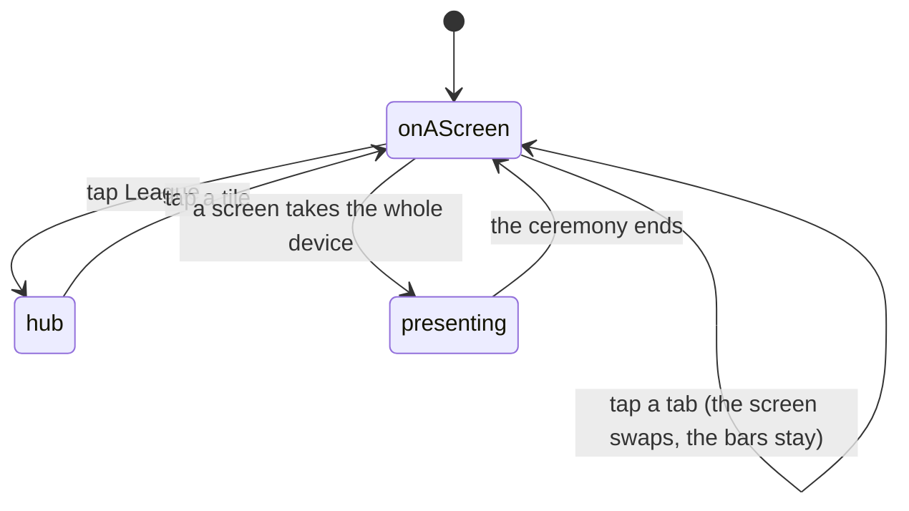

# Navigation and screens

## Summary

The app is a shell with a bar at the top, a bar at the bottom, and one screen
between them. The bottom bar is the whole navigation for the half of the year
that is about cards; everything about the combine lives one tap further, behind
a hub. This document owns the shape of that: which screens the bar reaches, which
it does not, what a tab lights up for, and what survives moving between screens.

## The simple case

At the bottom of every screen is a row of tabs. Five of them, or six when the
commissioner has switched dust on:

**Vault · Pack · Trade · (Shop) · Board · League**

The first three are the everyday app: your collection, today's pack, and offers
waiting for you. Board is the combine leaderboard. League is a hub — a page of
five tiles that is the only way in to Live, Order, Draft, Awards and Analytics.

At the top is a centred wordmark that is also a link home, and an account button
on the right that opens a menu: sign in, claim a player, the admin console.

Tapping a tab replaces the screen under the bars. The bars stay.

## Why the bar holds what it holds

The combine is a week a year and the collection is every other day of it, so the
first slots belong to the vault, the pack and the trading post. The board keeps a
tab because a card's whole claim to a tier is a time on it. The rest of the
combine sits one tap away behind the hub, and the admin console lives in the
account menu where a PIN-gated screen belongs.

The Shop tab appears only while dust is switched on, and that is a deliberate
trade worth naming: the bar reflows from five columns to six when the switch
flips. A tab that is present but dead for most of the year is the worse of the
two, and the switch is a once-a-season action rather than something a player sees
move under their thumb. Shop sits after Trade because dust is card-economy
business; putting it past League would file it with the combine.

## Which tab lights

The longest whole-segment prefix wins. The card screens are nested under one
path, so a naive prefix test would light two tabs at once — the pack screen sits
under the vault's path. Longest-match settles it: the pack screen lights Pack,
a player's card lights Vault.

Whole segments only, so a future path that merely starts with the same letters
never lights a tab on the strength of a prefix that stops mid-word.

## The League hub

Five tiles: Live (race-day timing), Order (running order), Draft (pick
selection), Awards (league superlatives) and Analytics (stats and the recap
archive).

These five are the *only* way into those screens from inside the app. A tile
quietly dropped from the hub strands a whole screen at a URL nobody can reach —
which is the one failure a hub is worst at showing you.

The recap archive has no tile of its own. It already lives on the Analytics
screen, and a second door to one room reads as two rooms.

## The interaction, event by event

### Arrive

The shell mounts once and stays. The bottom bar asks three questions of its own
on every screen — is a trade offer waiting, is a secret waiting, is dust on — and
each is answered from a cache the screen you are on has usually already filled,
so the bar costs no extra round trip on most pages.

The root path is not a screen. It redirects to the vault. It exists because "/"
is the link people actually paste, and it is what a link preview is built from.

### Leave without acting

Nothing is recorded. There is no analytics event for opening a screen.

### The tap that starts something

Tapping a tab is a client-side navigation. Nothing is written, nothing is
confirmed, and there is no unsaved-changes prompt anywhere in this app — no
screen holds a draft that a navigation could lose, with the single exception of a
pack mid-reveal, which persists its own position and resumes exactly where it
was.

### While it runs

The new screen mounts and asks for what it needs. Data already in the cache
renders immediately; the rest arrives after. Any realtime channel the old screen
held is not closed immediately — a route change unmounts the old page before
mounting the new one, so the subscriber count dips to zero for a tick, and
closing the socket there would cost a reconnect and a window where changes land
unseen.

### It settles

The new screen is up, the tab is lit, the bars are unchanged.

## Presentation mode

A screen playing something cinematic — a pack ceremony, a trophy — raises a flag,
and both bars fade to nothing and become inert. They are faded and disabled
rather than unmounted, because unmounting the header reflows every page under it
and the flag flips mid-ceremony.

Fading *out* is part of the ceremony taking the screen; coming back is not. The
bars become reachable again the instant the flag clears, because a 300ms fade-in
would leave the nav tappable and focusable while it was still invisible.

## Modifiers

| Modifier | At arrival | Changed during |
| --- | --- | --- |
| Who you are (guest · member · account · commissioner) | The tabs are the same for everybody. The account menu changes: sign in or sign out, claim a player, and an admin entry. Gated screens are reachable and state their gate rather than being hidden. | Signing in or claiming redraws the account menu in place. |
| The event's state | No effect on the bar. The League tiles all exist whether or not a combine is running; each screen says what it has. | No effect. |
| Dust switched on or off | Decides whether the Shop tab exists — five columns or six. | The bar reflows live if the switch is flipped while somebody is looking at it. |
| The device (phone · desktop · reduced motion · presentation mode) | The bar is designed for a thumb and is the same on desktop. Presentation mode fades and disables both bars. | Reduced motion removes the fade; the bars still become inert. |

## Cancel and interrupt

| Event | Before navigating | While the new screen loads |
| --- | --- | --- |
| Back, or closing a sheet | Returns to the previous screen. No prompt, because nothing is ever unsaved. | Back during a load lands on the previous screen; the abandoned request is discarded. |
| Navigating away inside the app | This is the interaction. | Tapping a second tab supersedes the first. |
| Reload | The current URL is what comes back. | Same. |
| Backgrounded | No effect. | The load resumes on return. |
| Network lost mid-request | Navigation still works — it is client-side. | The screen shows its own error or empty state. |
| The request fails or times out | No effect on navigation. | Each screen reports its own failure; the shell does not. |
| The token expires or is cleared | The account menu changes and gated screens start showing their gate. | Same. |
| Changed by someone else | A trade arriving lights a dot on the Trade tab wherever you are. | Same. |
| A second tab or device | Independent. Each browser tab has its own navigation. | Same. |
| Reduced motion or presentation mode changes | A ceremony starting fades the bars out under you. | Same. |

## Interactions with other systems

**Who you have to be.** Nothing in the bar is gated. Gated screens are reachable
and explain themselves; the admin console is in the account menu rather than the
bar because it is PIN-gated.

**Realtime.** The bar holds the app's realtime subscription for trade nudges,
because it is the one component mounted on every screen.

**Offline and reconnection.** Navigation is entirely client-side and works
offline. What breaks is what each screen needs.

**Optimistic updates and rollback.** None.

**The card economy.** The dust switch is the only thing that changes the bar's
shape.

**Motion and sound.** Presentation mode is the shell's only animation.

**Notifications and badges.** Two independent dots on two different tabs: a trade
offer waiting on Trade, a secret waiting on Pack. Each names its own thing for a
screen reader rather than sharing a generic "something is waiting". See
[notifications and badges](../cross-cutting/notifications-and-badges.md).

**Sharing.** Every screen has its own link preview text. The root path's preview
is the vault's, because that is the link people paste.

**The second device.** Nothing about navigation is synchronised.

**Accessibility.** The badge dot itself is hidden from assistive technology; the
wording on the tab carries the whole message. Under presentation mode the bars
are made genuinely inert rather than merely invisible, so a thumb or a tab key
cannot reach chrome that has been dimmed to nothing.

## Edge cases

- **A screen with no tile.** Reachable only by URL. The hub's contents are tested
  precisely because dropping a tile strands a screen silently.
- **The dust switch flipping while somebody is mid-tap.** The bar reflows from
  five columns to six under their thumb. This is accepted as the cost of not
  carrying a dead tab all year.
- **The root path.** Never a destination, always a redirect, but it carries its
  own link-preview text because it is the URL people share.
- **The TV board and a recap.** Both are screens without a tab and without a
  tile: one is opened deliberately on a big screen, the other is a link to an
  archived combine.
- **A pack mid-reveal.** The only screen in the app where leaving loses a
  position — and it does not, because the position is written as it goes.

## Open questions and verification

- That the bar costs no extra round trip on pages that already hold the event was
  read from the shared query keys, not measured.
- The reflow when the dust switch flips was read from the tab list and has not
  been watched live.
- Whether the realtime grace period is visible to a user — a change landing
  during a fast route change — has not been tested.
- Assumption: no screen in the app holds unsaved input across a navigation. Every
  form was checked at this commit; a future one would need a prompt this app has
  no pattern for.

Verified against willyoubemyhero commit `b46f330`.
