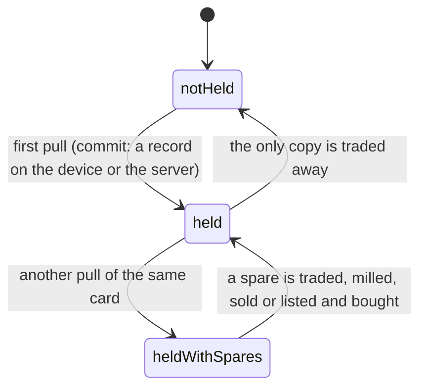

# The collection

## Summary

Your collection is every card you hold. It lives in two places at once — an
IndexedDB database on the device, and rows in Postgres for anyone the server can
name — and which of the two is authoritative depends on what kind of card it is
and who you are. This document owns what "owning a card" means, what a _copy_ and
a _spare_ are, and where the truth lives.

The short version: **secrets are the server's, roster cards are the device's**,
and claiming a player or signing in is what reconciles the two.

## The simple case

You open a pack and three roster cards come out. They are written to this
device's card database immediately, with the date, a count, and the finish each
copy wears. The vault shows them from that moment on, with or without a
connection.

The fourth slot is a secret, and that one is written to Postgres against your
identity, not to the phone. It follows you to a new handset; the roster cards do
not, until you claim a player or sign in.

Pull a card you already hold and you get a _copy_. The count goes up. If the new
copy wears a better finish, the card starts showing the better one; if it wears a
worse one, nothing visible changes. Either way you now hold a _spare_, which is
the thing trading, the marketplace and the mill all operate on.

## Where a collection lives

| What                                        | Stored on the device                   | Stored on the server                            |
| ------------------------------------------- | -------------------------------------- | ----------------------------------------------- |
| Roster cards you hold                       | Yes — the card database, keyed by card | Only for a member, in card rows                 |
| Which finish each copy wears                | Yes, best-of                           | Yes, derived best-of across copies              |
| Secret cards you hold                       | No                                     | Yes, against your member or guest identity      |
| The level of a secret copy                  | No                                     | Yes                                             |
| Today's pack and how far through it you are | Yes                                    | The fact that you opened a pack, for the streak |
| Whether today's secret has been turned over | A flag only                            | Which secret it is                              |
| Starred cards                               | Yes                                    | No                                              |
| Vault shelf order                           | Yes                                    | No                                              |

The split is deliberate rather than incidental. A guest cannot be granted a
roster card at all — a roster card must belong to a person on the roster — so for
a guest the device _is_ the collection. A secret can belong to a guest, so it is
kept where a new phone can find it.

> Technical note: the pack's day is the device's local date and the daily
> secret's day comes from Postgres. Nothing is at stake in which pack a phone is
> dealt, so there is nothing worth a round trip; a secret is a thing you own, so
> its day is the server's to decide.

## The interaction, event by event

### Arrive

Opening any screen that shows cards reads the device's card database and, if the
server can name you, your rows from Postgres. The two are merged: the device
knows what it pulled, the server knows what it granted, and the merge takes the
best of both.

A browser that refuses IndexedDB — private mode, a full quota — reads as an empty
collection rather than an error. The screen works; it just shows nothing held.

### Leave without acting

Nothing is recorded. Browsing the vault writes nothing.

### The tap that starts something

Anything that changes what you hold: tearing a pack, accepting a trade, buying
from the shop or the marketplace, milling a spare. Each is described in its own
document. What they share is the moment of commitment — the point at which the
card is yours or is not yours any more, and after which an interrupt cannot undo
it.

### While it runs

Local writes are effectively instantaneous and cannot fail visibly. Server writes
show their progress: a disabled button, a spinner, a toast on failure.

### It settles

A new card appears in the vault, or a spare's count drops. Where the change came
from a server call, the screen's cached view is refreshed rather than guessed at,
so the count on screen is the count the server holds.

## The merge

Three moments reconcile the two halves.

**Claiming a player.** The server moves everything the guest identity holds —
secrets, the record of packs opened, and any streak milestones those packs
already paid — onto the participant. Roster cards cannot move that way because
they were never on the server for a guest, so the device uploads its own once it
holds a member token.

**Signing in.** The account is linked to the member identity, and from then on
the collection is reachable from any device that signs in.

**Best wins, everywhere.** When a card exists on both sides with different
finishes, the better finish is kept. The device applies that rule and so does
Postgres, using the same ladder, so the two cannot disagree about which copy you
own.

See [keeping your cards](../accounts/keeping-your-cards.md) for what the user
actually sees during these.

## Modifiers

| Modifier                                                          | At arrival                                                                                                                                                                                       | Changed during                                                            |
| ----------------------------------------------------------------- | ------------------------------------------------------------------------------------------------------------------------------------------------------------------------------------------------ | ------------------------------------------------------------------------- |
| Who you are (guest · member · account · commissioner)             | A guest's collection is the device's. A member's is the device's plus the server's. An account holder's follows them between devices. The commissioner's own collection is an ordinary member's. | Claiming merges the two halves in place, without the user doing anything. |
| The event's state                                                 | A card is held against an event's roster. A card held against a previous combine does not resolve on the current one.                                                                            | No effect.                                                                |
| Dust switched on or off                                           | Decides whether spares can be turned into anything.                                                                                                                                              | Flipping it off leaves spares held and unspendable.                       |
| The device (phone · desktop · reduced motion · presentation mode) | A blocked or full storage quota reads as an empty collection.                                                                                                                                    | No effect.                                                                |

## Cancel and interrupt

| Event                                       | Before the card is committed                                                                                                                   | After                                                            |
| ------------------------------------------- | ---------------------------------------------------------------------------------------------------------------------------------------------- | ---------------------------------------------------------------- |
| Back, or closing a sheet                    | The card is not yours. A pack half-revealed keeps its place and can be resumed.                                                                | The card is yours. Nothing about leaving a screen gives it back. |
| Navigating away inside the app              | Same.                                                                                                                                          | Same.                                                            |
| Reload                                      | A pack resumes exactly where it was, including which card the stand was on.                                                                    | No effect.                                                       |
| Backgrounded                                | No effect; the pack's position is written as it goes.                                                                                          | No effect.                                                       |
| Network lost mid-request                    | A local write lands anyway. A server write may not, and the screen says so.                                                                    | A committed card stays committed.                                |
| The request fails or times out              | The card is not granted and the screen reports it.                                                                                             | No effect.                                                       |
| The token expires or is cleared             | The server half of the collection stops resolving; the device half still renders.                                                              | Same. Nothing is deleted.                                        |
| Changed by someone else                     | A trade completing elsewhere can remove a card between the screen loading and the action landing; the server refuses and the screen refreshes. | The vault redraws without it.                                    |
| A second tab or device                      | Two tabs share the device's database. A second device shares only the server's half.                                                           | Same.                                                            |
| Reduced motion or presentation mode changes | No effect.                                                                                                                                     | No effect.                                                       |

## Interactions with other systems

**Who you have to be.** A guest holds secrets on the server and roster cards on
the phone. A member holds both on the server. Nobody holds a roster card without
being a person on the roster.

**Realtime.** Grants and completed trades arrive over the event and nudge
channels; the vault refreshes rather than being told item by item.

**Offline and reconnection.** The device half is fully available offline. The
server half is whatever was last fetched.

**Optimistic updates and rollback.** Local writes are not optimistic; they are
simply local. Server writes are confirmed before the screen commits to them.

**The card economy.** The collection is what the economy operates on. A spare is
the unit: only spares can be milled, sold, listed or given away without losing
the card.

**Motion and sound.** None at this level.

**Notifications and badges.** A completed set raises a trophy; see
[collection trophies](../cards/collection-trophies.md).

**Sharing.** A collection is not shareable as a whole. Individual cards are.

**The second device.** The one place the two-halves design is visible to a user:
a guest who picks up a second phone finds their secrets and not their roster
cards.

**Accessibility.** Counts and finishes are text, not colour alone.

## Edge cases

- **A phone that changes hands mid-party.** Packs are per-person, and the pack
  record carries who it was dealt to, so whoever picks the handset up next does
  not resume the previous person's pack.
- **A blocked database.** Everything renders; nothing is held. Pulls made in that
  session are lost on reload. This is the same call the app makes for a blocked
  localStorage: degrade to "works for this page load" rather than fail.
- **A card held against a different combine.** It does not resolve and is
  skipped. It is not deleted, so it returns if that event becomes active again.
- **A record written before a feature existed.** The stored shapes are additive:
  a pack record from before secrets, before per-person packs, or before the
  reveal stand all still load, each missing field falling back to something that
  keeps the user's cards rather than dropping them.
- **A pack from a previous ceremony.** A record with no cursor is recognised as
  pre-stand and treated as finished, rather than resuming into a stand that has
  no cards left to step through.
- **The tier stored on a copy is the tier at the time of the first pull** and is
  never rewritten, while the edition is always the best you have ever held. The
  asymmetry is the point: a tier is a fact about a moment; an edition is a thing
  you own.

## Open questions and verification

- The merge on claim was read from the server functions and the migration; what
  the user sees while it happens — whether the vault visibly gains cards, and how
  long it takes — has not been watched.
- Whether a failed guest-to-member move leaves any visible trace has not been
  confirmed. The claim stands and the failure is swallowed, so the expectation is
  that it is silent, which is worth checking against a real failure.
- The blocked-IndexedDB path has not been exercised on a real phone in private
  mode.
- Assumption: the device's card database is the only client-side store of held
  cards. Starred cards and shelf order live elsewhere, in browser storage, and
  are preferences rather than holdings.

Verified against willyoubemyhero commit `b46f330`.
