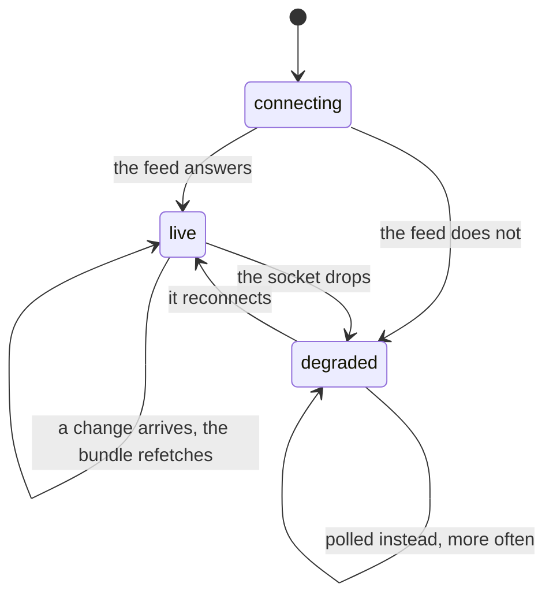

# The event

## Summary

One combine is active at a time, and almost every screen in the app is looking at
the same picture of it: the roster, the runs, the splits, the penalties, the
stations and the draft picks, fetched together as one bundle and kept fresh by a
realtime subscription. This document owns what that bundle is, how current it is,
what happens when part of it fails, and what the event's own settings — chiefly
the dust switch — change about the app.

## The simple case

You open any screen that shows combine data. It asks for the active event, then
for that event's bundle, and draws. From then on the screen is watching: when
anything in the event changes in the database, the screen refetches and redraws,
without a refresh and without you doing anything.

If the connection to that live feed is unhealthy, the screen says so in a banner
and starts asking more often instead. If a piece of the bundle fails to load, the
screen says which piece rather than showing an empty one.

## What the bundle holds

One request returns all of it:

- **The event** — the year, whether it is active, and its settings.
- **Participants** — the roster for this event, in running order, each with the
  person behind them.
- **Stations** — the obstacles, in course order.
- **Runs** — every timed attempt, with a named set of public columns rather than
  everything, because the public read on that table is column-scoped and asking
  for everything would be refused outright.
- **Splits** — segment times per station per run.
- **Penalties** — time added, per run.
- **Draft picks** — the selections made so far.

Each table is fetched independently and a failure on one does not wipe the rest:
the roster and the stations must render even if splits and penalties briefly
fail.

**A failed read reports itself.** A failure coalesces to an empty list, which
reads exactly like "there is nothing here" — so the bundle also carries the names
of the tables it could not read, and screens use it to tell the two apart. Before
that existed, the live screen congratulated the field on being finished when what
had actually happened was that the roster failed to load.

## How fresh it is

One live channel per event, shared by everything on the page. Every screen that
wants the event joins the same one rather than opening its own.

> Technical note: each mount used to open its own channel under a randomised
> name, so the admin console alone held eight sockets for one event and fired
> eight refetches per change. Worse, nothing noticed when a socket died: the
> screens simply froze, with no signal at all.

Three health states, and the difference matters to what the user sees:

- **Connecting** — before the socket has answered. Deliberately *not* treated as
  degraded, because counting it would flash an offline banner on every page load.
- **Live** — changes arrive as they happen. A slow poll runs underneath as a
  backstop, once every fifteen seconds, one timer per event rather than one per
  screen.
- **Degraded** — the live feed is down and polling every four seconds is the only
  thing keeping the screens honest. Screens show a banner saying so.

A route change unmounts the old screen before mounting the new one, so the number
of listeners dips to zero for a moment. The channel is held open through a short
grace period rather than closed and reopened, because a reconnect costs a window
in which changes land unseen.

The bundle is also refetched when the window regains focus — a phone coming out
of a pocket mid-combine gets the current picture before the user has finished
looking at it.

## The event's own settings

**Active.** Exactly one event is active, and it is the one every screen means by
"the event". A card held against a previous combine does not resolve on the
current one.

**The dust switch.** The commissioner turns the dust economy on and off. While it
is off, nothing accrues and every dust operation refuses in the database itself,
so the switch is not merely a matter of hiding buttons — a screen working from a
stale value costs a button that answers "not yet" and can spend nothing. What the
switch visibly changes is whether the Shop tab exists at all, which reflows the
bottom bar from five columns to six.

**Secret cards.** Whether the pack has a fourth slot, and what is in the set.

## The interaction, event by event

### Arrive

Two requests in sequence: which event is active, then that event's bundle. The
active-event answer is shared with the shell, so the bar and the screen can never
disagree about whether dust is on.

### Leave without acting

Nothing is recorded. The channel stays open through the grace period in case you
come straight back.

### The tap that starts something

The event itself is read-only for everyone but the commissioner. Every write that
changes it goes through the [admin screens](../admin/getting-in.md), and every
one of them is guarded by an admin token bound to this event.

### While it runs

A commissioner's write lands in the database, the live channel notices, and every
device watching that event refetches. There is no per-item push: the screen is
told that *something* changed and asks for the picture again.

### It settles

Every screen in the garden shows the new picture within a beat. This is the
mechanism behind a card upgrading its tier mid-combine and behind the board
reordering itself as people finish.

## Modifiers

| Modifier | At arrival | Changed during |
| --- | --- | --- |
| Who you are (guest · member · account · commissioner) | The bundle is public and identical for everyone. Only the commissioner can change it. | Claiming or signing in does not change what the bundle contains. |
| The event's state (before the combine · running · finished) | This axis *is* the bundle's content. Before any official run every card is base and the board is empty; during, both change live; after, everything settles. | Changes arrive live; no screen needs reloading between phases. |
| Dust switched on or off | Read off the event, so it arrives with everything else. | Flipping it reflows the nav and enables or disables every dust screen. |
| The device (phone · desktop · reduced motion · presentation mode) | No effect on the data. | No effect. |

## Cancel and interrupt

| Event | Before a change lands | After |
| --- | --- | --- |
| Back, or closing a sheet | No effect; reading the event writes nothing. | No effect. |
| Navigating away inside the app | The channel is held through a grace period rather than closed. | The new screen shares the same channel and cache. |
| Reload | Both requests are made again from scratch. | Same. |
| Backgrounded | Realtime may drop; the health state goes degraded and a banner appears on return. | Regaining focus refetches the bundle. |
| Network lost mid-request | The bundle fails and the screen shows its error state. | Cached data stays on screen; it simply stops updating. |
| The request fails or times out | A per-table failure is named in the bundle; a whole-request failure surfaces as the screen's error. | Same. |
| The token expires or is cleared | No effect. The bundle needs no token. | A commissioner's writes start refusing, which is what the console shows. |
| Changed by someone else | This is the normal case, not an exception: a live combine changes constantly and every screen is built for it. | The screen refetches and redraws. |
| A second tab or device | Each browser holds its own channel; every device sees the same changes. | Same. |
| Reduced motion or presentation mode changes | No effect. | No effect. |

## Interactions with other systems

**Who you have to be.** Nobody, to read. A commissioner for this event, to write.

**Realtime.** This document is where realtime lives. See
[realtime and staleness](../cross-cutting/realtime-and-staleness.md) for what
each screen does with it.

**Offline and reconnection.** The last-fetched bundle stays on screen. Reconnecting
moves the health state back to live and refetches.

**Optimistic updates and rollback.** The commissioner's screens are optimistic in
places; the bundle itself is not. It is always what the server last said.

**The card economy.** The dust switch lives on the event, and the tiers every card
wears are computed from the bundle.

**Motion and sound.** None.

**Notifications and badges.** Trade nudges travel on a different channel from the
event's; see [notifications and badges](../cross-cutting/notifications-and-badges.md).

**Sharing.** An archived event has its own public URL. See
[the recap](../combine/the-recap.md).

**The second device.** Every device watching the same event sees the same thing
within a beat of each other.

**Accessibility.** The degraded banner is text, not an icon.

## Edge cases

- **No active event.** Every screen that needs one shows an empty state rather
  than an error; there is nothing to fetch.
- **A partial bundle.** The screens that care say which table failed. The ones
  that do not, render what they have.
- **A brand-new event with an empty roster.** Distinguished from a failed read
  and from a finished field, because those three used to look identical and the
  live screen treated all of them as "everyone is done".
- **Two events in the database.** Only the active one, most recent year first, is
  ever chosen.
- **A stale dust switch.** Costs a button that answers "not yet"; it can never
  spend anything, because the refusal is in the database.
- **The public read is column-scoped.** Asking for every column of the runs table
  is refused outright rather than returning less, which is why the bundle names
  its columns.

## Open questions and verification

- The three health states and their banners were read from the channel registry;
  watching a real socket drop and recover on a phone in a garden with poor signal
  is the most valuable verification item in this document.
- Whether the fifteen-second backstop poll is noticeable — a screen updating a
  beat late rather than not at all — has not been observed.
- The grace period on route changes was read from the registry and not measured.
- Assumption: exactly one event is active at any time. Nothing enforces this in
  the schema; the query simply takes the most recent active one.

Verified against willyoubemyhero commit `b46f330`.
