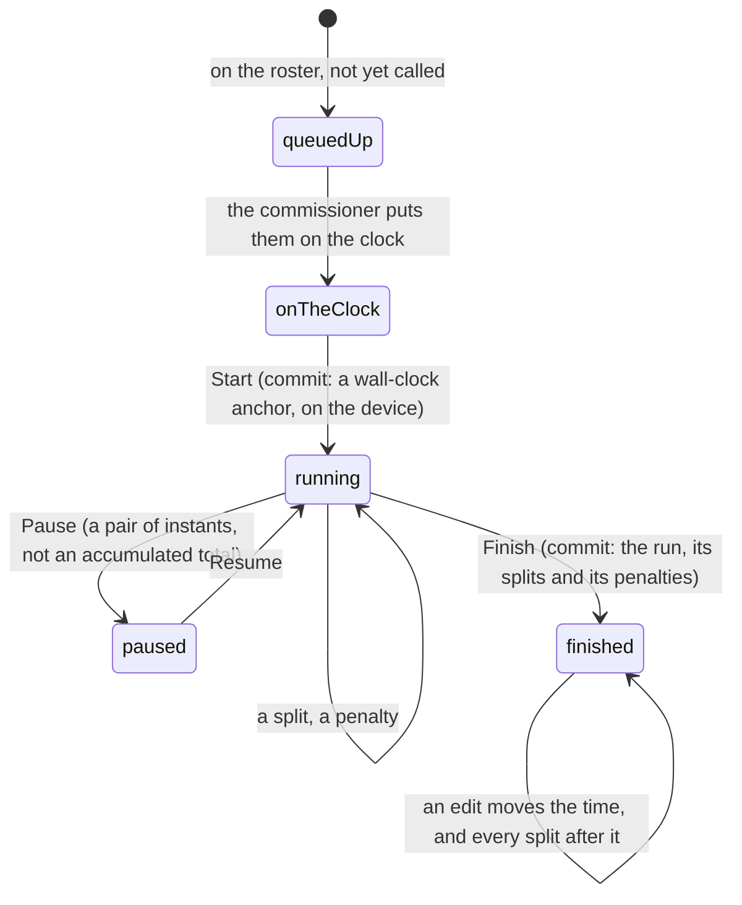

# Time and the clock

## Summary

A card's whole claim to a tier is a time on the board, so this app is careful
about time in a way it is not careful about much else. Every duration in it is
milliseconds, from the timing console to the database to the card back, and it is
turned into something human only at the edge. This document owns that: the units,
the format, what makes a run _official_, how splits and penalties compose, and
the difference between the clock the crowd watches and the clock that counts.

## The simple case

An athlete steps up. The commissioner puts them on the clock and taps start. The
crowd screens begin counting up from that moment. At each station the
commissioner taps a split; at the end they tap finish, and the run is saved with
its splits, its penalties and a total.

The board shows that total as `1:41.32` — minutes, seconds, hundredths — or as
`41.32` when it is under a minute. A run with no time shows an em dash.

## Two clocks, and only one of them counts

**The crowd's clock** starts when the commissioner puts somebody _on the clock_,
which usually happens a beat before they tap start. It is unofficial by
construction and labelled that way on screen. It exists so the big screen counts
up from something real rather than from whenever the browser happened to load.

**The official clock** is measured by the timing console and written with the
run. It is the only one that decides a tier or a place on the board.

The two disagree slightly, always in the same direction — the crowd's clock reads
a little ahead — and that is expected rather than a fault.

> Technical note: a phone whose clock runs behind the server's would render a
> negative elapsed time, so the crowd's clock floors at zero. It is the honest
> answer, and it is visible: a timer that sits at `00.00` for a second before
> moving is a device with a clock skew, not a stalled run.

## What makes a run official

A run is official when it is marked so and carries a time. Only official runs
count for a tier, and only the fastest official run per athlete is considered.

Anybody out of contention — scratched, disqualified, did not play, absent — is
out of contention for _everything_, not just their own tier: they cannot hold the
champion slot, a station crown or the penalty box. See
[the card](the-card.md#what-a-tier-is).

Places are computed by counting everybody strictly faster and adding one, so a
dead heat shares the place. An earlier version split ties on sort order, which
handed one of two identical clocks the champion tier and the other a podium,
while both card backs read "Rank 1".

## Splits and penalties

A **split** is the segment time at one station. The clock is cumulative, so
editing one split moves every split after it — a correction at station two is not
a correction to station two alone.

A **penalty** is time added to a run, with a reason. The athlete who has taken
the most penalty time across the whole event wears the penalty-box tier.

On a card back and on a player's page, each station shows the holder's split, how
far it is from the field's median at that station, their place there, and how
many people have a split there at all. Being fastest at a station is what earns
the station-king tier.

## The format

| Duration           | Shown as  |
| ------------------ | --------- |
| Under a minute     | `41.32`   |
| A minute or more   | `1:41.32` |
| Negative (a delta) | `-3.10`   |
| Missing            | `—`       |

Hundredths, never thousandths, and always two digits of each.

> Technical note: the format is computed with integer arithmetic all the way
> down. Deriving hundredths from a floating-point remainder printed 101,320 ms as
> `1:41.31`, because the remainder lands a hair under — which reads to a
> commissioner as "my edit did not save", immediately after they typed 1:41.32.

## League days

Two different things in this app are counted in days, and they take their day
from two different places.

**A pack's day** is the device's local date. A pack has no identity behind it and
no constraint to enforce, so there is nothing worth a round trip.

**The daily secret's day** comes from the database, because a secret is a thing
you own and the server decides whether you have had today's.

**A streak** is the run of consecutive league days you opened a pack on. It is
not stored anywhere; it is a walk over the records of packs opened, which is why
it survives the guest-to-member claim for free — the records move, and the walk
simply finds more of them.

## The interaction, event by event

The clock's own interaction belongs to [running the clock](../admin/running-the-clock.md).
What this document owns is what happens to the _numbers_ through those phases.

### Arrive

Every screen reads times as milliseconds from the bundle and formats them where
they are drawn. Nothing is stored formatted, and nothing is parsed back from a
formatted string except where the commissioner types a correction.

### Leave without acting

Nothing is recorded. Watching a clock does not touch it.

### The tap that starts something

Starting a run anchors it to a wall-clock instant and persists that anchor
immediately. An earlier version anchored on a monotonic browser timer that
restarts at zero on every page load, so a phone that reloaded mid-run read
`00.00` — and then recorded that as the official time.

### While it runs

The run's state is written to the device as it goes: the start, each split, each
penalty, each pause. A pause is stored as a pair of instants rather than an
accumulated total, so a pause survives the page that opened it.

Wall-clock time is not monotonic: a clock step during a run would skew it. That
is accepted, because a reload on a phone in a garden is common and used to
corrupt the run every single time, while a clock step during a forty-second run
is rare.

### It settles

The run is saved with its total, splits and penalties. Cards recompute, the board
reorders, and every device watching the event redraws.

## Modifiers

| Modifier                                                          | At arrival                                                                                                                         | Changed during                                   |
| ----------------------------------------------------------------- | ---------------------------------------------------------------------------------------------------------------------------------- | ------------------------------------------------ |
| Who you are (guest · member · account · commissioner)             | Times are public and identical for everyone. Only the commissioner can write one.                                                  | No effect.                                       |
| The event's state                                                 | Before any official run, no times exist and every card is base.                                                                    | Times arrive live and change tiers as they land. |
| Dust switched on or off                                           | No effect.                                                                                                                         | No effect.                                       |
| The device (phone · desktop · reduced motion · presentation mode) | A device with a skewed clock shows the crowd's clock wrong; the official time is unaffected because it is measured by the console. | No effect.                                       |

## Cancel and interrupt

| Event                                       | Mid-run, on the console                                                                                            | After the run is saved                        |
| ------------------------------------------- | ------------------------------------------------------------------------------------------------------------------ | --------------------------------------------- |
| Back, or closing a sheet                    | The run is on the device and resumes.                                                                              | No effect.                                    |
| Navigating away inside the app              | Same — the run's state is persisted as it goes.                                                                    | No effect.                                    |
| Reload                                      | The run resumes from its stored wall-clock anchor, which is exactly the failure the anchor was changed to prevent. | No effect.                                    |
| Backgrounded                                | The clock keeps its anchor; elapsed time is recomputed from it rather than accumulated by a timer.                 | No effect.                                    |
| Network lost mid-request                    | The run continues locally. Saving is what needs the network.                                                       | A saved run is saved.                         |
| The request fails or times out              | The console reports it and the run is still on the device to retry.                                                | No effect.                                    |
| The token expires or is cleared             | An expired admin token makes the save refuse; the run stays on the device.                                         | No effect.                                    |
| Changed by someone else                     | Two consoles timing the same athlete is not defended against; see edge cases.                                      | An edit by another commissioner arrives live. |
| A second tab or device                      | The run lives on the device that started it. A second device cannot resume it.                                     | Both see the saved run.                       |
| Reduced motion or presentation mode changes | No effect on timing.                                                                                               | No effect.                                    |

## Interactions with other systems

**Who you have to be.** Reading is public; every write is behind an admin token
bound to this event.

**Realtime.** A saved or edited run reaches every device over the event channel.

**Offline and reconnection.** Timing works offline; saving does not. The run is
held on the device until it can be saved.

**Optimistic updates and rollback.** The console shows local state as truth while
timing, and reconciles on save.

**The card economy.** Times decide tiers, and tiers decide how a card looks — but
never what a copy of it is worth, which is the edition's business.

**Motion and sound.** The big timer and the finish celebration are driven by
these numbers; see [motion and sound](../cross-cutting/motion-and-sound.md).

**Notifications and badges.** None.

**Sharing.** A result card exported as an image carries the formatted time.

**The second device.** The crowd's clock is computed independently on each
device from the same stored instant, so two phones agree to within their own
clock skew.

**Accessibility.** Times are text. The big timer is large by design rather than
by accessibility setting.

## Edge cases

- **A device with a skewed clock** shows the crowd's clock wrong and floors at
  zero rather than going negative. The official time is measured elsewhere and is
  unaffected.
- **A clock step during a run** skews the official time. Accepted, deliberately,
  against the far more common failure it replaced.
- **Editing one split** moves every split after it, because the clock is
  cumulative. See [editing a result](../admin/editing-a-result.md).
- **A time under a minute** drops the minutes entirely rather than showing `0:`.
- **A tie** shares the place, and both athletes get the same tier.
- **An archived event** may contain participation statuses the live app never
  writes. They are treated as out of contention.
- **Two commissioners timing at once** is not prevented. The run lives on the
  device that started it, and the last save wins.

## Open questions and verification

- That a reload mid-run resumes correctly is the single most safety-critical
  claim in this document, and it has been read from the stored shape rather than
  performed. It should be checked on a real phone before a real combine.
- The visible gap between the crowd's clock and the official time — "a beat" —
  has not been measured.
- Whether a device with a deliberately wrong clock shows anything else odd
  besides a floored timer has not been explored.
- Assumption: the timing console is the only writer of official times. The edit
  screen writes them too, and whether the two can disagree about a run in flight
  was not investigated.

Verified against willyoubemyhero commit `b46f330`.
