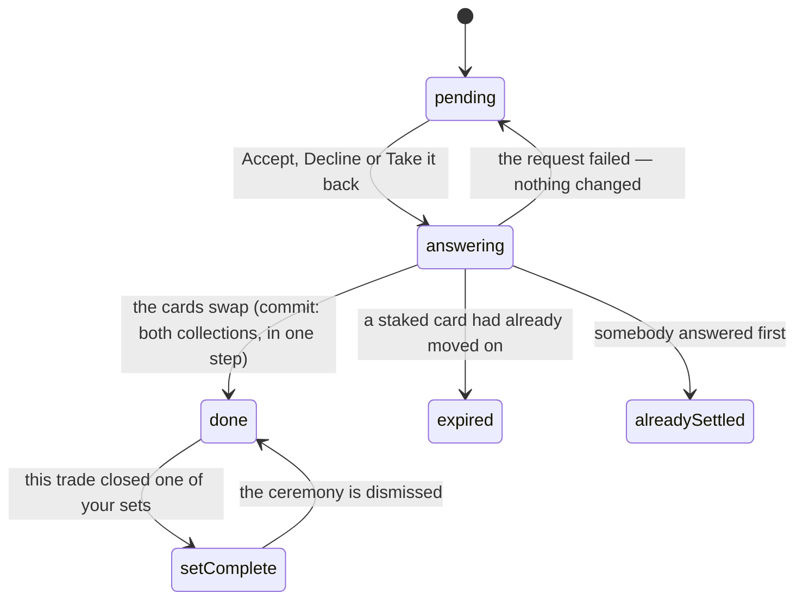

# Answering an offer

## Summary

An offer sits on the table until somebody answers it. There are three answers,
and which ones you are shown depends on which end of it you are: the person it
was sent to can **Accept** or **Decline**, and the person who sent it can **Take
it back**. All three are final in the same sense — an offer never returns to
pending — and only one of them moves any cards.

Accepting is the only place in the app where two people's collections change at
once. It happens in one step: every card on the table moves or none of them does,
and what the two of you agreed to is re-checked against the world as it stands at
that instant rather than as it stood when the offer was written.

## The simple case

An offer is waiting under "Waiting on you" on
[the Trading Post](the-trading-post.md). It is the loudest thing on the screen:
a ringed panel headed "Bob Blitz → You", a one-line summary — "1 card for 2
cards" — and then the cards themselves, your side on the left under "You give"
and theirs on the right under "You get", with arrows between.

You press Accept. The two buttons dim for a moment. Then a toast says "Trade
done", a small burst of confetti goes off, and the offer drops out of the inbox
and reappears in the receipts strip marked Done. Your vault has their cards in
it, without a reload.

Press Decline instead and it is over in the same beat: a toast reading
"Declined", the offer marked Declined in the strip, and their phone nudged so they
find out. Nothing else happens — no message, no reason, no second chance.

## The interaction, event by event

### Arrive

The offer draws from your side of the table outward. Whichever end you are, your
own cards are on the left and theirs on the right, so "You give" always means
what it says.

Their side is concealed the same way the compose panel conceals it: art you have
never pulled is drawn face-down against the event's universal card back, with the
name and — for a secret — the level of that exact copy still readable. A finish
on a roster copy is printed under it, but only when it is worth printing: seventy
per cent of copies are standard and a chip saying so on all of them is noise.

Above the tiles is the same one-line summary the public record uses. It is above
rather than below because on a phone, in a garden, it is usually the only part
anybody reads.

A settled offer keeps the same shape at a smaller size, with a status chip
instead of buttons: **Done**, **Declined**, **Pulled** or **Expired**.

### Leave without acting

Nothing is recorded. An offer you looked at and walked away from is exactly as
pending as it was, and neither side is told you read it.

The only trace is the dot on the Trade tab going out on this device, which
happened when the list drew rather than when you decided anything.

### The tap that starts something

Any of the three buttons. All three are guarded on two things at once — that you
are the right person for that button, and that the offer is still pending — so
they cannot be raced into doing something twice.

**Accept** is the one that moves cards. What is settled at that instant:

- **Every staked card is re-checked**, on both sides, against the collections as
  they are now. So is the rule that each side still has something on it, and the
  rule that nobody ends up with none of a card.
- **If any of that fails, the offer is marked Expired** rather than left pending.
  It has to be: an offer that failed once will fail every time, and leaving it
  open would put the same dead button in front of the same person forever.
- **The copies themselves move.** Not a card, not a count — the actual copy, with
  the finish that was rolled on it.

**Decline** and **Take it back** move nothing at all. They are the same action
from the two ends: one guarded write that sets the offer's status and stamps the
time.

### While it runs

The buttons on that offer dim. Nothing else on the screen is disabled, and
nothing is shown as done before it is.

Underneath, the swap is taken in one piece. Two people answering at the same
instant — Alice accepting Bob's offer while Bob accepts Alice's — queue behind
each other rather than colliding, and two offers racing for the same spare
produce exactly one winner. The loser's offer is marked Expired; there is no
half-completed swap to be had.

> Technical note: both collections are always taken in the same order, whoever
> pressed first, precisely so that mirror-image case queues instead of jamming.

### It settles

Four endings, and each has its own sentence:

- **It worked.** "Trade done", and a burst of confetti at about two-thirds the
  strength a good pack pull earns. If the trade completed one of your secret
  sets, that replaces the toast entirely with the full set-complete ceremony —
  and if it completed two, they play one after the other rather than one of them
  being silently dropped.
- **A card had moved on.** "One of those cards has already moved on." The offer
  is now Expired.
- **Somebody answered first.** "That offer was already settled." Nothing changed.
- **It failed outright.** The server's own sentence as an error toast. Accepting
  an offer that was never aimed at you lands here, because holding the offer's id
  proves nothing.

Then the screen re-reads everything: your offers, both spares lists, the feed,
and your collection. What the other person sees arrives on their phone through
the completed-trades table, which is published live, plus a nudge of their own.

## Modifiers

| Modifier | At arrival | Changed during |
| --- | --- | --- |
| Who you are (guest · member · account · commissioner) | Decides which buttons exist. The recipient sees Accept and Decline; the proposer sees Take it back; a settled offer shows no buttons to anybody. A guest never gets this far. | A member token expiring mid-visit replaces the whole screen with its gate, buttons and all. |
| The event's state (before the combine · running · finished) | No effect on answering. An offer outlives the combine it was made during — it is stamped with the event as flavour, not as a condition. | A card's tier changing under you redraws the tile. The copy is the copy; a champion's card arriving as a base card and turning into a champion an hour later is the same object. |
| Dust switched on or off | No effect. Nothing here is priced. | No effect. |
| The device (phone · desktop · reduced motion · presentation mode) | One offer at a time, full width, swiped. Buttons are thumb-sized and side by side. | Reduced motion drops the confetti and shortens the set-complete ceremony to its result. |

## Cancel and interrupt

| Event | Before the answer | After it |
| --- | --- | --- |
| Back, or closing a sheet | Nothing to cancel; the offer is untouched and still pending. | Nothing to undo. A trade cannot be reversed except by trading back. |
| Navigating away inside the app | Same. | The refresh may land on a screen you have left; the caches are updated anyway, so the vault you arrive at is the vault after the trade. |
| Reload | The offer is still waiting. | The offer comes back settled. This is the safe way to find out what happened. |
| Backgrounded | No effect. Returning refetches the inbox, which is how a locked phone catches up on an offer that was answered elsewhere. | The swap continues on the server whether or not the phone is watching. |
| Network lost mid-request | Nothing in flight. | The most important row in this table: the swap is atomic, so it either happened entirely or not at all — but the phone may not learn which. The screen shows a failure; reload and look at the offer's status before pressing anything again. |
| The request fails or times out | Not applicable. | A toast, and the offer is refetched. A failure that never reached the database leaves the offer pending and answerable. |
| The token expires or is cleared | The gate replaces the screen. | The write already carried a valid token; the refresh afterwards may not, and the screen falls back to its gate with the trade nonetheless done. |
| Changed by someone else | The other person can take the offer back while you are looking at it; the inbox refetches on a nudge or on window focus and it simply goes. Pressing Accept on one that has already gone says "already settled". | A trade landing elsewhere refreshes this screen, including the spares strips and the collection counts of people who were not involved. |
| A second tab or device | Both show the offer. | The first to answer wins; the second gets "already settled" rather than an error. |
| Reduced motion or presentation mode changes | No effect. | A set closing takes the screen after the trade is already committed, so an interrupt cannot cost you the cards — only the ceremony. |

## Interactions with other systems

**Who you have to be.** A member, and the right one. The participant id comes
from the verified token, never from the request, so the three buttons are guarded
by who you are rather than by which offer id you hold. Accepting an offer aimed
at somebody else is not a soft refusal with a friendly toast — it is treated as
somebody hand-posting another person's offer id, and there is no friendly outcome
to draw.

**Realtime.** The completed-trades table is the one trading table published live,
and an insert into it is the app's only live signal that anything traded at all.
It is what updates the other party's vault, the feed on every phone, and the
public pull counts of people who had nothing to do with it. A decline or a
cancellation carries no such row, so the other side finds out through a
contentless nudge and the receipts strip.

**Offline and reconnection.** Answering needs the network. The offer renders from
cache and every button fails plainly without a connection.

**Optimistic updates and rollback.** None. No card is shown as moved until the
server says it moved, which is why there is nothing to roll back when it does not.

**The card economy.** This is where a copy changes hands. A roster copy keeps its
finish — the actual copy moves, rather than a person-level "best" being copied
across — and the giver's best finish can *fall*, which is the one place in the app
where that number moves downwards. Trade away your only platinum and standard is
the honest answer. What never moves is the public count of how many people packed
a card: the giver keeps a copy by construction, so the number cannot be shifted by
a trade. See [the collection](../foundations/the-collection.md).

**Motion and sound.** Confetti for an ordinary trade. A set closing gets the
whole ceremony, including the number of cards in the set counting up — the one
screen in the app allowed to print how big a set is, because by then it is the
prize rather than the spoiler. See
[collection trophies](../cards/collection-trophies.md).

**Notifications and badges.** Answering clears the offer out of the inbox, and
the dot with it. The other side's dot lights instead: they are nudged whichever
way you answered.

**Sharing.** Nothing about answering is shareable. What becomes public is one
line in [the feed](the-trade-feed.md), and only for an accept.

**The second device.** Both devices show the offer, and the first tap wins. The
losing device is told the offer was already settled rather than shown an error.

**Accessibility.** Accept and Decline are ordinary buttons with plain labels, and
they dim rather than disappearing while the answer is in flight. The status chip
on a settled offer is text. The set-complete ceremony announces itself as a
dialog and reads its own heading; the number counts up in a live region.

## Edge cases

- **A secret you already own.** It arrives as a spare, exactly as a second pull
  of the same card would. You do not end up owning it twice.
- **The giver's last copy of a secret.** They own none of it afterwards, which is
  what trading it away means. If they had other copies, one of them quietly takes
  over as the owned one — the best level first, and the oldest of those, so the
  date the vault prints for that card stays true.
- **Two copies of one secret in one offer.** They resolve in a fixed order: the
  first becomes the receiver's owned copy, the second a spare.
- **A card that arrived today.** A traded card has no pull date attached to it —
  it was not that person's pull for that day, and a date riding along would
  collide with whatever they actually pulled and abort the whole trade.
- **The other person's ceremony.** A two-way swap can complete a set on both
  sides at once. Yours plays here; theirs plays on their own phone, wherever they
  happen to be in the app, and never on yours.
- **Other offers staking the same card.** Left standing on purpose. Trading away
  one of three copies does not invalidate an offer staking another, and an offer
  that really is dead fails cleanly the moment somebody presses Accept on it.
- **An offer whose other half was deleted.** If a commissioner removes a player
  from the roster, every pending offer staking that player's cards quietly loses
  those items. Accepting such an offer does not turn a swap into a gift: an offer
  with an empty side is refused and marked Expired.
- **Expired and Declined are different words.** Declined is a person saying no.
  Expired is nobody saying anything — the cards moved first.
- **A double tap.** The second press is answered softly, with "already settled",
  rather than trading twice or throwing.
- **An offer for an event that has finished.** Still answerable. Trades outlive
  their combine.

## Open questions and verification

- The set-complete ceremony on this screen is mounted without the flag that fades
  the navigation bars out, unlike the same ceremony on the pack screen and the
  one that plays when a set closes while you are somewhere else. That would leave
  the bars live under a full-screen moment. It looks like an oversight rather
  than a decision, and it has not been watched on a phone.
- Whether the two queued ceremonies after a double set-completion really play in
  sequence was read from the queue and its key, not observed.
- The atomicity claim — that a swap either happens entirely or not at all — is
  proved against real Postgres in the database tests, including two accepts
  racing over one spare. It has not been provoked by hand with two phones.
- Assumption: the failure toast for "not your offer" reads as a generic error
  rather than as something a normal user could hit. The path is unreachable from
  the interface, so no wording was written for it.

Verified against willyoubemyhero commit `b46f330`.
