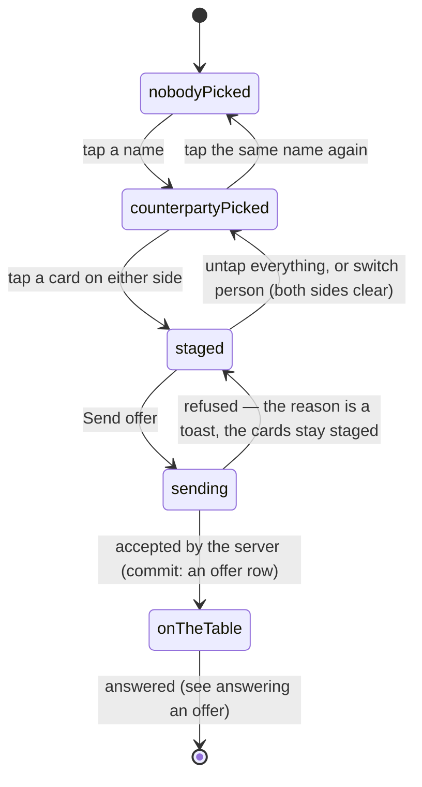

# Making an offer

## Summary

An offer is a proposal: these cards of mine for those cards of yours. You pick
one person, put between one and four of your cards on your side of the table,
between one and four of theirs on the other, and send it. Nothing moves and
nothing is reserved — the cards stay in both collections, fully usable, until
somebody presses Accept.

The one rule the whole feature hangs off is that only a _spare_ can be staked. A
roster card needs a second copy behind it, so you always keep one of everybody.
A secret needs no such thing: any copy you hold is yours to give, including your
last one.

## The simple case

You are on [the Trading Post](the-trading-post.md), under "Make an offer". A row
of names sits at the top of the panel; you tap one and it lights up with a dot
beside it.

Two strips of cards open. The top one is headed "You give (0/4)" and holds your
spares. The bottom is headed with their name and holds theirs. Tap a card in
either strip and it lifts into a ring; the counter in the heading goes up. Tap it
again and it drops out.

Both strips lead with secrets, rarest copy first, because that is what anybody
opening this panel is scrolling for. Roster cards follow, one tile per _copy_ —
your gold Alice and your standard Alice are two separate tiles, because which one
you hand over is a choice and the finish travels with the card.

Once there is at least one card on each side, Send offer wakes up. Press it, and
a moment later a toast says the offer went to them, both strips empty, and the
offer appears in "Out there" with a Take it back button under it.

## The interaction, event by event

### Arrive

The compose panel is closed until you name somebody. The row of people is
everyone the league can actually reach who is not you: a player who has claimed
their paper code, or anybody who has signed into an account. An account counts
because it follows a person between phones, which makes it at least as good a
proof that somebody is on the other end as a slip of paper.

Somebody who is on the roster but has never claimed and never signed in is not
offered, and the database refuses an offer to them for the same reason: it would
sit pending forever with nobody able to decline it.

Picking a name fetches that person's spares. What comes back is narrower than
their collection, on purpose — it is what they have spare and nothing else — but
it is the one place in the app where you are told anything about somebody else's
cards. You cannot compose an offer blind.

Their strip is redacted in one direction: any card you have never pulled yourself
is drawn face-down against the event's universal card back, captioned "not yours
yet". The name and, for a secret, the level of that copy stay readable — you
cannot judge an offer otherwise — but browsing somebody's spares is not a way to
see art you have not earned. Your own strip is never concealed.

Underneath your strip, if you have any, is a greyed row headed "Can't be traded",
with the reason under each card: **only copy** for a roster card you hold just
one of, and **today's pull** for a secret that arrived in today's pack. They are
shown rather than quietly omitted, because a card that simply vanishes from the
picker reads as the app having lost it, and this is the single most common
complaint the picker gets. That row is your business only: what a counterparty
cannot trade is never listed.

### Leave without acting

Nothing is recorded and nothing is held. Staged cards live in the screen and
nowhere else; leaving, switching tabs, or reloading drops them.

Switching to a different person also drops them, deliberately: half of what you
had staked was their cards, and those mean nothing against somebody else.

### The tap that starts something

**Send offer** is the write. What is decided at that instant:

- **The proposer is whoever holds the token**, whatever the phone claims. The
  only id the request carries is the other person's, and even that is re-checked
  against who actually owns the cards named.
- **Each side must be one to four cards.** The screen stops you at four with a
  toast and greys the Send button below one; the database enforces the same
  numbers again, because the screen's copy is a courtesy and the database's is
  the rule.
- **Every card must be a spare its own side still holds** — checked for both
  sides, not just yours. The same test runs again when the offer is accepted.
- **Across the whole offer, nobody empties a card out.** Staking two of your
  three Alices is fine; staking both of your two is not, and gets its own
  sentence: you have to keep a copy of every card you trade.

### While it runs

The Send button dims. The rest of the screen stays live — an offer arriving in
your inbox while you are composing still lands and still draws.

The offer is written as one thing: the offer and everything on the table go in
together or not at all, so there is no state in which somebody has an offer with
an empty table.

### It settles

A toast names the person the offer went to, both strips clear, and the offer
appears under "Out there" with the summary line "1 card for 2 cards" — or with
the secrets named — and one button, Take it back.

The other side is nudged at the same time. The nudge carries nothing at all: it
means "something of yours moved, go and ask properly", and their phone then asks
through the same guarded door it always uses. If that nudge fails, the offer still
stands — it is capped at two seconds and its failure is swallowed, because a
trade must never fail because the live channel did.

On a refusal the server's own sentence is the toast, and the cards stay staged so
you can fix it and send again.

## Modifiers

| Modifier                                                          | At arrival                                                                                                                                                                                                                                                                                           | Changed during                                                                                                                                                    |
| ----------------------------------------------------------------- | ---------------------------------------------------------------------------------------------------------------------------------------------------------------------------------------------------------------------------------------------------------------------------------------------------- | ----------------------------------------------------------------------------------------------------------------------------------------------------------------- |
| Who you are (guest · member · account · commissioner)             | A member composes. A guest never reaches this panel — see [the Trading Post](the-trading-post.md#arrive). An account holder who has named themselves is a member for every purpose here, including being offered to. A commissioner is whatever else they are; the console grants no trading powers. | A member token expiring mid-compose leaves the staged cards on screen and fails the send. Claiming a player mid-visit opens the panel with your own spares in it. |
| The event's state (before the combine · running · finished)       | Decides what exists to stake. Outside an active combine both strips are empty for everybody, so nothing can be composed at all.                                                                                                                                                                      | A card's tier changing under you redraws its tile; the copy staked is still the copy staked.                                                                      |
| Dust switched on or off                                           | No effect. A trade is cards for cards and never touches a balance.                                                                                                                                                                                                                                   | No effect.                                                                                                                                                        |
| The device (phone · desktop · reduced motion · presentation mode) | Both strips scroll sideways under a thumb; tiles are small and close together, and the finish under each one is the only way to tell two copies of a card apart.                                                                                                                                     | No effect on composing. Presentation mode is never raised by this panel.                                                                                          |

## Cancel and interrupt

| Event                                       | Before Send                                                                                                                                                                                                                                   | After Send                                                                                                                                                            |
| ------------------------------------------- | --------------------------------------------------------------------------------------------------------------------------------------------------------------------------------------------------------------------------------------------- | --------------------------------------------------------------------------------------------------------------------------------------------------------------------- |
| Back, or closing a sheet                    | Everything staged is lost. No warning, because nothing was held.                                                                                                                                                                              | The offer is already on the table. Taking it back is a separate, deliberate act.                                                                                      |
| Navigating away inside the app              | Same. Staged cards do not survive a tab change.                                                                                                                                                                                               | Same. The offer stands and the other person can answer it.                                                                                                            |
| Reload                                      | Everything staged is lost, including the person you had picked.                                                                                                                                                                               | The offer comes back in "Out there", because it lives on the server.                                                                                                  |
| Backgrounded                                | The staged selection survives a lock screen as long as the page is not discarded.                                                                                                                                                             | No effect. The offer is written.                                                                                                                                      |
| Network lost mid-request                    | Nothing to lose; the picker itself was drawn from data already fetched.                                                                                                                                                                       | The offer may have landed. The screen shows a failure and the refetch afterwards is what says whether it did — check "Out there" before sending it twice.             |
| The request fails or times out              | Not applicable.                                                                                                                                                                                                                               | A toast with the server's own wording — "you have to keep a copy of every card you trade", "that player has not claimed their card yet". Staged cards are left alone. |
| The token expires or is cleared             | The panel is replaced by the gate; staged cards go with it.                                                                                                                                                                                   | The offer already exists and is unaffected. Answering it later needs a token again.                                                                                   |
| Changed by someone else                     | A card you were about to stake can be traded, milled or sold out from under you. The strips refresh on window focus and on any completed trade, so the tile usually disappears; if you are quick enough to send anyway, the offer is refused. | Nothing invalidates a pending offer at the moment the world moves. It is re-checked when somebody presses Accept, and fails then.                                     |
| A second tab or device                      | Each has its own staged selection; they share nothing.                                                                                                                                                                                        | Both show the offer in "Out there".                                                                                                                                   |
| Reduced motion or presentation mode changes | No effect.                                                                                                                                                                                                                                    | No effect.                                                                                                                                                            |

## Interactions with other systems

**Who you have to be.** A member, with the participant id taken from the verified
token rather than from anything the phone sent. The counterparty's id is the one
id a request legitimately carries, and naming somebody else buys nothing: the
database re-derives who owns what from it.

**Realtime.** Composing is not broadcast. The counterparty learns about the
finished offer through a contentless nudge on a topic only the server can name;
their inbox then refetches through the ordinary guarded door. Pending offers are
never published, because publishing them would make every card in them readable
by anyone.

**Offline and reconnection.** The picker draws from what was already fetched, so
you can stage cards with the radio off. Sending needs the network and fails
plainly without it.

**Optimistic updates and rollback.** None. The offer appears in "Out there" when
the server has written it, not before.

**The card economy.** Staking a card does not lock it, but it does protect it:
while an offer naming a copy is pending, that copy cannot be milled, sold or
re-rolled — destroying it would silently shrink an offer somebody has already
read and is about to accept. Listing it on
[the marketplace](../dust/the-marketplace.md) _is_ allowed, because a listing
only promises. Whichever settles first wins, and the other fails cleanly.

**Motion and sound.** None while composing. A staged tile lifts into a ring and
that is all.

**Notifications and badges.** Sending lights the dot on the other person's Trade
tab. Nothing lights on yours.

**Sharing.** An offer has no link and cannot be shared. The only public trace of
a trade is [the feed](the-trade-feed.md), and only once it completes.

**The second device.** A staged selection is per-tab and per-device. A sent offer
is per-person and appears on all of them.

**Accessibility.** Each tile is a toggle button reporting whether it is staged, so
a screen reader announces the change on the control that was operated. A blocked
card is marked disabled with its reason as text beside it rather than removed
from the page. The counters in the two headings — "You give (2/4)" — are how the
limit is announced before it is hit.

## Edge cases

- **Your last mythic.** Any secret copy is tradeable, so a single-copy secret is
  offered like any other. The tile carries a warning marker reading "last copy",
  which is the only thing standing between somebody and giving away the only one
  they have. It is a marker, not a confirmation dialog: visible, not in the way.
- **Today's secret.** The copy that came out of today's pack cannot be staked
  until tomorrow. It is that day's slot, and trading it away would hand its owner
  a second pull. The same rule refuses it in the database.
- **Two copies of the same card in one offer.** Allowed, and it is why an item
  names a copy rather than a card. What is refused is staking every copy you
  hold.
- **Staking the same copy twice.** Impossible: the tile is a toggle, and the
  database refuses a duplicate item as well.
- **A collector.** Somebody with an account who is not a combine athlete can be
  traded with as soon as they have named themselves, even though they will never
  be issued a paper code.
- **Nobody reachable.** With no other claimed or signed-in player, the panel says
  so instead of showing an empty row.
- **A card that moved between the strip drawing and the send.** The offer is
  refused with the server's sentence rather than silently sending a stale
  proposal.
- **A retired secret.** A card whose catalogue entry has been removed still
  trades; it just has nothing left to name it, and shows as "Secret card".
- **Several offers on one copy.** Nothing stops the same spare being staked on
  three pending offers at once. The first accept wins and the others fail when
  they are answered.

## Open questions and verification

- Whether the counterparty's spares refresh quickly enough in practice to keep
  somebody from staging a card that has just moved was read from the cache
  settings — thirty seconds, plus a refresh on window focus and on any completed
  trade — and not measured at a party.
- The concealment rule was read from the response and the tile; that a
  never-pulled secret really renders face-down with its level still readable has
  not been watched on a phone.
- The blocked row lists roster cards you hold one of and secrets pulled today. No
  other reason a card can be untradeable was found at this commit, but the list is
  built from two explicit cases rather than from the inverse of the rules, so a
  third rule added later would go unlabelled.
- Assumption: sending an offer to somebody who has just been removed from the
  roster fails with the "has not claimed" sentence rather than something stranger.
  This was not tested.

Verified against willyoubemyhero commit `b46f330`.
